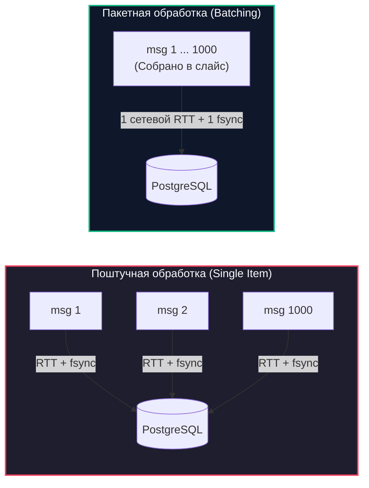
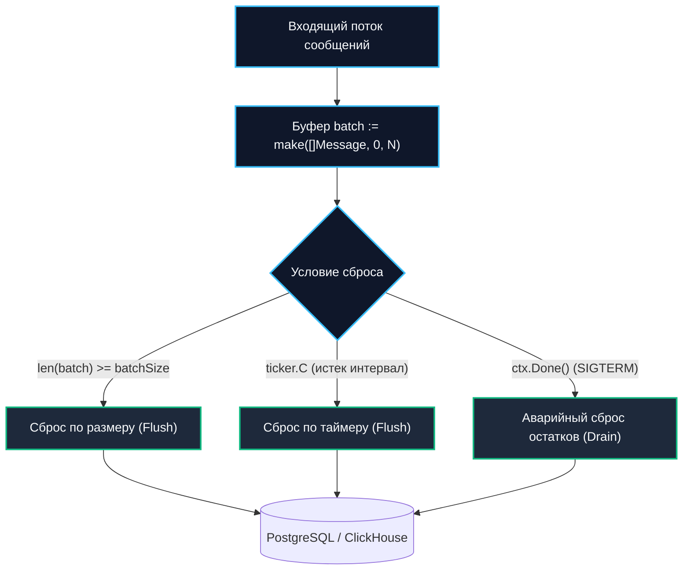
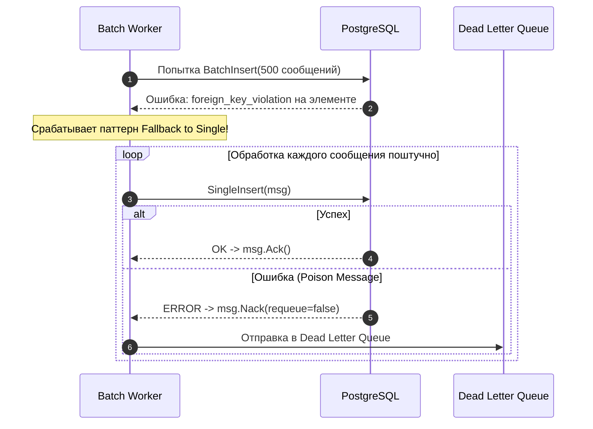

# Batch processing сообщений

> *«Если вы хотите разорить свою базу данных, отправляйте в нее по одному запросу на каждое входящее событие. Если вы хотите, чтобы система работала быстро и тихо — группируйте данные в пачки.»*

## Закон амортизации в распределенных системах

В предыдущей статье [[3. Параллелизм обработки сообщений]] мы научились безопасно ускорять работу консьюмера с помощью пула воркеров. Однако параллелизм бессилен, если каждая отдельная итерация рабочего цикла упирается в синхронный дисковый или сетевой ввод-вывод (I/O).

Представьте, что сервис вычитывает 1000 сообщений:
- Если выполнять одиночный `INSERT INTO tbl VALUES ($1)` на каждое сообщение, ваше приложение совершит **1000 сетевых раунд-трипов (Round-Trip Time, RTT)** до СУБД.
- База данных (например, PostgreSQL) будет вынуждена открыть **1000 транзакций**, сгенерировать 1000 записей в журнале предзаписи (WAL) и инициировать **1000 синхронных сбросов на физический диск (`fsync`)**.

В высоконагруженных распределенных системах процессор почти никогда не бывает узким горлышком. Настоящие враги пропускной способности — **сетевые задержки и дисковый ввод-вывод**.

Решением этой проблемы является **пакетная обработка (Batch Processing)**:
$$\text{INSERT INTO tbl VALUES } (\$1), (\$2), \dots, (\$1000)$$

Объединяя данные в пачки, мы радикально **амортизируем** стоимость системных вызовов, сетевых пакетов TCP и дисковых транзакций: один сетевой RTT и один дисковый `fsync` обслуживают сразу тысячу бизнес-событий.



---

## Под капотом: Слайсы, Escape Analysis и GC

Для Go-разработчика пакетная обработка сообщений на базовом уровне сводится к накоплению элементов в срезе (`slice`). Но именно здесь кроется классическая ловушка для производительности.

Когда вы вызываете функцию `append(batch, msg)` (или наивно пишете `append(msg, batch)`), рантайм Go проверяет, достаточно ли текущей емкости (`cap`) внутреннего массива. Если емкость исчерпана, рантайм совершает дорогую операцию:
1. Выделяет в куче (Heap) новый непрерывный массив удвоенного размера.
2. Копирует в него все ранее накопленные элементы старого массива.
3. Добавляет новый элемент, а старый массив бросает на растерзание сборщику мусора (GC).

> [!info] Под капотом: Механическое сочувствие к памяти
> В цикле консьюмера постоянный `append` с превышением емкости порождает миллионы временных объектов в куче. Сборщик мусора (GC) тратит такты процессора на трассировку указателей и очистку памяти (GC Pause & Mark Phase).
> 
> **Золотое правило Mechanical Sympathy в Go:**
> 1. Если вам известен целевой размер батча (например, 1000 элементов), **всегда инициализируйте слайс с предвыделенной емкостью**:
>    ```go
>    batch := make([]Message, 0, 1000)
>    ```
> 2. После успешной отправки батча в базу данных очищайте срез конструкцией:
>    ```go
>    batch = batch[:0]
>    ```
> Срез `batch[:0]` обнуляет только длину (`len = 0`), сохраняя базовую емкость (`cap = 1000`). Выделенный в куче массив **не уничтожается и переиспользуется на следующей итерации**. Нагрузка на аллокатор и сборщик мусора падает до абсолютного нуля! Для обобщенного кода используйте идиому `make([]T, 0, cap)`.

---

## Идиоматичный Batch Collector на Go

В реальных приложениях отправка батча не может полагаться только на количество элементов. Что, если ночью поток заказов упал до 2 сообщений в минуту? Если ждать накопления 1000 записей, клиент получит свой чек лишь к утру!

Поэтому надежный батч-процессор всегда реализует **два независимых триггера**:
1. **Триггер по размеру (Size-based):** Накопили $N$ сообщений — немедленно сбрасываем пачку в БД.
2. **Триггер по времени (Time-based / Ticker):** Прошло $T$ миллисекунд — сбрасываем накопленные остатки, даже если в батче всего 5 элементов, предотвращая нарушение SLA.



```go
package batching

import (
	"context"
	"fmt"
	"time"
)

type Message struct {
	ID   string
	Data []byte
	Ack  func() error
	Nack func(requeue bool) error
}

type BatchProcessor struct {
	batchSize     int
	flushInterval time.Duration
	process       func(ctx context.Context, batch []Message) error
}

func (p *BatchProcessor) Run(ctx context.Context, ch <-chan Message) error {
	// Предвыделяем слайс с фиксированной емкостью
	batch := make([]Message, 0, p.batchSize)

	// Инициализируем переиспользуемый тикер
	ticker := time.NewTicker(p.flushInterval)
	defer ticker.Stop()

	for {
		select {
		case <-ctx.Done():
			// При получении сигнала SIGTERM сбрасываем остатки частично заполненного батча!
			if len(batch) > 0 {
				if err := p.process(ctx, batch); err != nil {
					return fmt.Errorf("flush on shutdown failed: %w", err)
				}
			}
			return nil

		case msg, ok := <-ch:
			if !ok {
				if len(batch) > 0 {
					_ = p.process(ctx, batch)
				}
				return nil
			}

			batch = append(batch, msg)

			// 1. Триггер по размеру
			if len(batch) >= p.batchSize {
				if err := p.process(ctx, batch); err != nil {
					return fmt.Errorf("process batch by size: %w", err)
				}
				// Сброс длины с сохранением емкости (zero allocations!)
				batch = batch[:0]
				// Сбрасываем тикер, чтобы не слать пустой батч сразу после сброса по размеру
				ticker.Reset(p.flushInterval)
			}

		case <-ticker.C:
			// 2. Триггер по времени
			if len(batch) > 0 {
				if err := p.process(ctx, batch); err != nil {
					return fmt.Errorf("process batch by ticker: %w", err)
				}
				batch = batch[:0]
			}
		}
	}
}
```

> [!warning] Ловушка / Gotcha: `time.After` внутри `select`
> Никогда не используйте вызов `time.After(interval)` внутри циклического `select` для ожидания батча!
> 
> Функция `time.After` на каждой итерации цикла создает новый канал и регистрирует новый таймер в рантайме Go. Если сообщения приходят быстро, на каждой итерации будет аллоцироваться таймер, который **не может быть собран сборщиком мусора до истечения своего полного интервала** (даже если сработала другая ветка `select`). Это классический скрытый источник утечки памяти в Go.  
> **Всегда используйте `time.Ticker` и вызывайте `ticker.Reset()` при досрочном сбросе.**

---

## Брокеры и нативный Batching

Разные брокеры сообщений подходят к батчингу принципиально по-разному. Механика очередей в [[5. Prefetch и QoS]] (RabbitMQ) кардинально отличается от модели лога в [[3. Producer и consumer]] (Kafka).

### Kafka: Батч — это базовая единица
В Apache Kafka батч является фундаментальным атомом хранения и передачи данных:
- На стороне продюсера параметры `batch.size` и `linger.ms` группируют сообщения в сжатые бинарные сегменты прямо в памяти драйвера.
- Сетевой запрос вычитки (Fetch Request) возвращает из сокета сразу целый готовый срез сообщений `*kafka.ConsumerMessage`.
- Консьюмер не парсит сообщения поштучно из сети — они уже лежат в общем сетевом буфере.
- После пакетной вставки в базу данных консьюмер вызывает метод `CommitOffsets`, фиксируя смещение последнего обработанного сообщения всей пачки одним вызовом.

### RabbitMQ: Батчинга нет, есть Prefetch
В брокере RabbitMQ классической концепции пакетной передачи нет: брокер оперирует единичными сообщениями.

Если вы выставите параметр `qos.PrefetchCount = 1000`, RabbitMQ не соберет для вас батч. Он просто непрерывным потоком «выплюнет» в открытый TCP-сокет 1000 отдельных AMQP-фреймов. На стороне Go-воркера вам придется собирать эти сообщения в срез вручную с помощью канала `ch <-chan Message`, как показано в коде `BatchProcessor`.

---

## Ловушки батчинг-обработки

### 1. Проблема Poison Message в батче

Это один из самых каверзных вопросов на технических собеседованиях уровня Lead/Principal.

Представьте: вы собрали идеальный батч из 500 сообщений и выполнили пакетный запрос `INSERT ... VALUES (...), ...`:
```sql
INSERT INTO tbl VALUES (...), (...), ...
```
На 499-м элементе база данных возвращает фатальную ошибку нарушения целостности — `foreign_key_violation` или `unique_violation`. Вся реляционная транзакция откатывается!

Если консьюмер просто вернет ошибку брокеру (`Nack` всего батча с возвратом в очередь), при следующей вычитке те же 499 абсолютно валидных сообщений будут бесконечно падать из-за одного единственного поврежденного сообщения (**Poison Message**), намертво парализуя работу всей очереди!



> [!tip] Собеседование: Паттерн Batch Fallback to Single
> **Вопрос:** Как корректно обработать сбой базы данных при пакетной вставке, если ошибка вызвана одним битым сообщением внутри пачки?
> 
> **Ответ:** 
> Применяется паттерн **Batch Fallback to Single (Откат батча к поштучной обработке)**.
> 1. Если пакетный `INSERT` падает с ошибкой бизнес-ограничений (constraint violation), мы не повторяем весь батч целиком.
> 2. Мы перехватываем ошибку и в цикле начинаем вставлять каждое сообщение из батча **по отдельности** в изолированных коротких транзакциях (или используем `INSERT ON CONFLICT IGNORE`).
> 3. 499 валидных сообщений успешно сохраняются в БД и получают подтверждение `msg.Ack()`.
> 4. Одно битое сообщение изолируется, логируется и перенаправляется в [[8. Dead Letter Queue]] или [[6. Handling poison messages|обрабатывается отдельным механизмом]]. Очередь не блокируется!

```go
func (p *BatchProcessor) processWithFallback(ctx context.Context, batch []Message) error {
	// 1. Быстрый путь: вставка всей пачки целиком
	err := p.db.BatchInsert(ctx, batch)
	if err == nil {
		for _, msg := range batch {
			_ = msg.Ack()
		}
		return nil
	}

	// 2. Медленный путь: Fallback к поштучной изоляции
	p.logger.Warn("Батч упал, переключаемся на поштучную обработку", "err", err)
	for _, msg := range batch {
		if singleErr := p.db.SingleInsert(ctx, msg); singleErr != nil {
			// Найдено отравленное сообщение (Poison Message)
			p.logger.Error("Обнаружено Poison Message, отправка в DLQ", 
				"id", msg.ID, "err", singleErr)
			_ = msg.Nack(false) // В DLQ без повторной постановки в очередь
		} else {
			_ = msg.Ack()
		}
	}

	return nil
}
```

---

### 2. Идемпотентность и дубликаты в батчах

Если в батч попадает дубликат сообщения, стандартный `UNIQUE CONSTRAINT` (разобранный в [[4. Idempotent handlers]]) обрушит всю транзакцию.

В современных СУБД для батчей используют выражения:
- **`ON CONFLICT DO NOTHING`** (пропустить дубликат без ошибки).
- **`ON CONFLICT DO UPDATE`** (UPSERT: обновить состояние полей).

Это позволяет базе данных атомарно поглощать дубликаты внутри пачки, не прерывая общую вставку.

---

### 3. Проблема Backpressure

Если база данных начинает тормозить, а брокер продолжает агрессивно наполнять канал `ch <-chan Message`, наивная конкатенация `append(batch, msg)` вызовет разрастание среза далеко за пределы `batchSize`, что приведет к исчерпанию оперативной памяти. 

Емкость буферизованного канала `ch` и ограничение предвыборки брокера (Prefetch) служат естественными предохранителями, останавливающими консьюмер при переполнении.

---

## Итог

1. **Батчинг амортизирует накладные расходы:** Он сокращает количество сетевых RTT и тяжелых дисковых операций `fsync` в десятки и сотни раз.
2. **Нулевые аллокации в Go:** Всегда предвыделяйте слайс `make([]T, 0, cap)` и сбрасывайте его через `batch = batch[:0]`, сохраняя базовый массив в памяти.
3. **Двойной триггер (Size + Time):** Размер батча спасает под высокой нагрузкой, а `time.Ticker` защищает от нарушения SLA задержки при слабом потоке сообщений.
4. **Защита от Poison Message:** Упавший батч обязан распадаться на одиночные операции (**Batch Fallback to Single**), изолируя поврежденные сообщения в Dead Letter Queue.
5. При реализации **Graceful Shutdown** консьюмер обязан принудительно сбросить (flush) неполный остаток батча перед выходом.

Батчинг решил проблему производительности диска и сети. Но что делать, если среди потока сообщений приходят системно поврежденные полезные нагрузки, вызывающие панику или зависание? В следующей лекции мы детально разберем: [[6. Handling poison messages]].