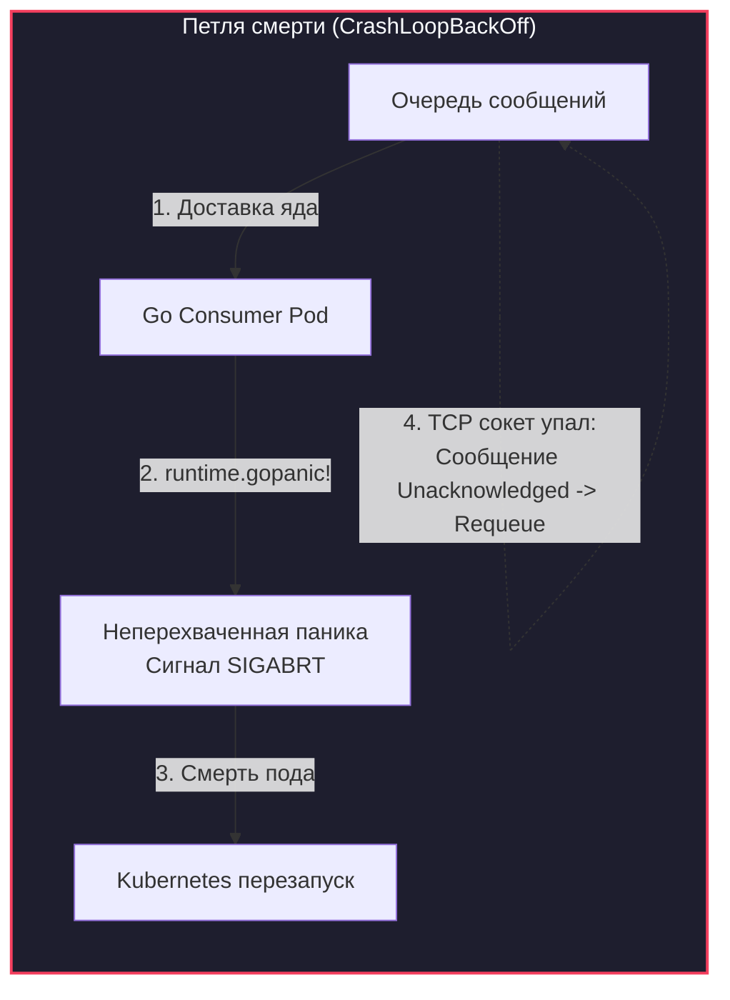
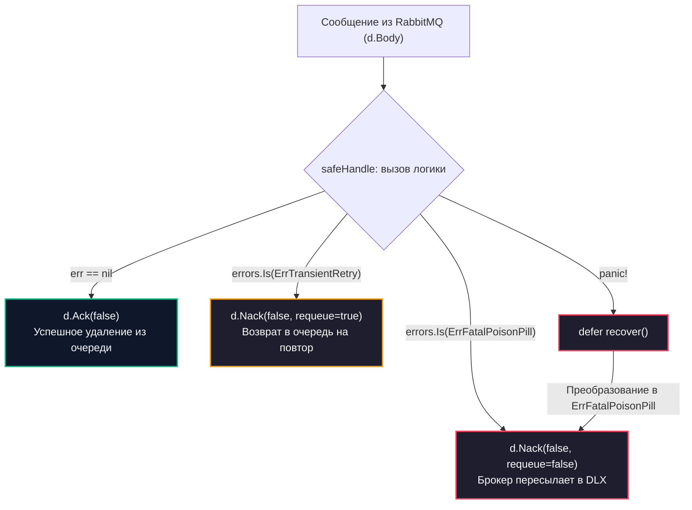
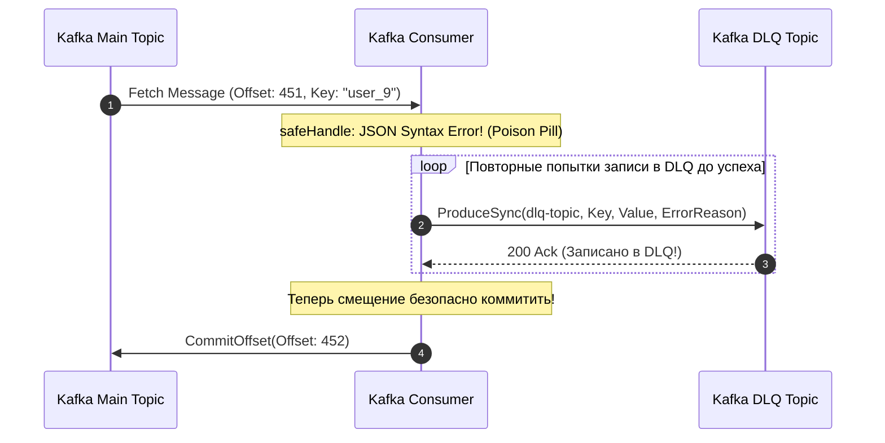

# Handling poison messages

> *«В реальных распределенных системах самое опасное сообщение — не то, которое потерялось, а то, которое пришло, успешно прочиталось и убило весь ваш сервис ровно через одну миллисекунду.»*

## Анатомия катастрофы в рантайме

В теоретическом разделе мы познакомились с концепцией очередей недоставленных писем в статье [[8. Dead Letter Queue]]. Мы выяснили, что «ядовитое сообщение» (**Poison Message / Poison Pill**) — это вполне легитимный с точки зрения сетевого протокола брокера бинарный пакет, полезная нагрузка которого вызывает фатальный сбой или неконтролируемое падение бизнес-логики консьюмера.

Однако теория часто выглядит слишком стерильно: в учебниках предполагается, что `json.Unmarshal` просто вернет ошибку, а приложение аккуратно пойдет дальше.

В реальности ядовитое сообщение может содержать:
- Непредвиденный формат данных, вызывающий разыменование `nil`-указателя или выход за границы слайса (`panic`).
- Рекурсивную структуру, загоняющую парсер в бесконечный цикл с пожиранием 100% CPU.
- Символы, ломающие сериализацию в базе данных или вызывающие фатальный взаимный отказ внешних систем.

Если консьюмер не умеет изолировать яд и наивно возвращает сообщение обратно в очередь (через `Nack` с флагом `requeue=true` или по сетевому таймауту), система мгновенно проваливается в **бесконечную петлю смерти (Infinite Retry Loop)**.



> [!info] Под капотом: Mechanical Sympathy петли смерти
> Что физически происходит с операционной системой и сервером, когда Poison Message начинает бесконечно рикошетить между брокером и консьюмером со скоростью 10 000 раз в секунду?
> 
> 1. **Сетевой шторм (Network I/O):** Сетевой стек ядра Linux (Ring 0) непрерывно бомбардируется аппаратными прерываниями (Hard IRQ / SoftIRQ) от сетевой карты. Ядро тратит процессорные циклы на перекладывание одних и тех же байтов в буферы сокетов TCP.
> 2. **GC Pressure (Коллапс сборщика мусора):** Рантайм Go на каждую попытку вычитки аллоцирует структуры сетевой доставки `amqp.Delivery` (или аналогичные структуры Kafka) в куче (Heap), поскольку они передаются через Go-каналы (`chan`). Сборщик мусора (GC) вынужден запускаться непрерывно, отнимая до 50–70% всего доступного времени процессора — в метриках Prometheus наблюдается резкий спайк параметра `go_gc_duration_seconds`.
> 3. **Голодание процессоров (Starvation):** Системные потоки ОС (`m`), закрепленные за логическими процессорами рантайма (`p`), оказываются на 100% заблокированы перемалыванием одного-единственного ядовитого пакета. Все остальные — абсолютно валидные сообщения в очереди — встают колом (**Head-of-Line Blocking**).

В этой главе мы разработаем бронебойный каркас обработчика, защищающий Go-сервис от любых токсичных полезных нагрузок.

---

## Самый страшный яд: Неперехваченная паника

В языках со стандартной обработкой исключений (Java, Python, C#) неперехваченный `Exception` обычно локализуется фреймворком на уровне текущего треда. В языке Go ключевое слово `panic` — это не обычное исключение, это **сигнал крушения всей программы**.

Если внутри обработчика сообщения происходит разыменование нулевого указателя:
```go
// Паника при отсутствии поля в теле сообщения
orderID := payload.Customer.Profile.ID 
```
встроенная системная функция рантайма `runtime.gopanic` начинает аварийную раскрутку стека вызовов (Stack Unwinding). Если на вершине стека текущей горутины нет функции `recover`, рантайм вызывает `runtime.crash`, который посылает текущему процессу операционной системы терминальный сигнал **`SIGABRT`**.

Процесс моментально падает. Если он запущен в Kubernetes, Kubelet фиксирует аварийное завершение и пытается перезапустить контейнер. Тем временем брокер сообщений (RabbitMQ / NATS) видит внезапный разрыв TCP-сокета, снимает с сообщения статус `Unacknowledged` и возвращает его в самое начало очереди. Поднявшийся контейнер снова вычитывает то же самое сообщение, снова падает в `SIGABRT` — и вся система уходит в бесконечный **`CrashLoopBackOff`**, блокируя работу целого направления бизнеса.

---

### Правило №1: Изолируйте обработчик через `defer recover`

Любая конкурентная горутина-воркер, обрабатывающая невалидированные данные из внешнего сетевого сокета, **в обязательном порядке должна быть изолирована через отложенный вызов `defer recover`**!

Паника должна быть аккуратно перехвачена, стек вызовов зафиксирован для телеметрии, а сообщение признано безнадежным ядом и отправлено в изолятор.

```go
package consumer

import (
	"context"
	"fmt"
	"log/slog"
	"runtime/debug"
)

type Worker struct {
	logger *slog.Logger
}

// Безопасная оболочка (Panic Boundary) для вызова бизнес-логики
func (w *Worker) safeHandle(ctx context.Context, msg []byte) (err error) {
	// Спасаем процесс операционной системы от крушения
	defer func() {
		if r := recover(); r != nil {
			// Извлекаем полный Stack Trace для последующего анализа в Sentry
			stackTrace := string(debug.Stack())
			w.logger.Error("КРИТИЧЕСКАЯ ПАНИКА в обработчике сообщения!",
				"panic", r,
				"stack", stackTrace,
			)

			// Преобразуем неперехваченную панику в типизированную ошибку яда
			err = fmt.Errorf("%w: panic recovered: %v", ErrFatalPoisonPill, r)
		}
	}()

	// Выполнение реальной доменной логики
	return w.businessLogic(ctx, msg)
}
```

---

## Правило №2: Строгая классификация ошибок

Чтобы воркер мог принять однозначное решение — отправлять сообщение на повторную попытку (см. [[9. Retry стратегии и exponential backoff]]) или немедленно сбрасывать в изолятор Dead Letter Queue, весь слой бизнес-логики обязан возвращать **строго типизированные маркерные ошибки (Sentinel Errors)**.

В современном Go (начиная с Go 1.13+) для этого используется цепочка оборачивания ошибок через глагол `%w` и проверка через `errors.Is`.

```go
package consumer

import (
	"context"
	"encoding/json"
	"errors"
	"fmt"
)

// Sentinel-ошибки классификации сбоев
var (
	// ErrFatalPoisonPill — сообщение структурно или логически ядовито (ретрай бессмысленен)
	ErrFatalPoisonPill = errors.New("fatal poison message")

	// ErrTransientRetry — временный инфраструктурный сбой (нужно повторить с backoff)
	ErrTransientRetry = errors.New("transient error, retry needed")
)

type OrderPayload struct {
	ID     string  `json:"id"`
	Amount float64 `json:"amount"`
}

func (p *OrderPayload) Validate() error {
	if p.ID == "" || p.Amount <= 0 {
		return errors.New("order_id is empty or amount is non-positive")
	}
	return nil
}

func (w *Worker) businessLogic(ctx context.Context, data []byte) error {
	var payload OrderPayload

	// 1. Синтаксическая ошибка JSON — это 100% неисправимый яд
	if err := json.Unmarshal(data, &payload); err != nil {
		return fmt.Errorf("%w: syntax error in json payload: %v", ErrFatalPoisonPill, err)
	}

	// 2. Бизнес-валидация инвариантов
	if err := payload.Validate(); err != nil {
		return fmt.Errorf("%w: domain validation rejected: %v", ErrFatalPoisonPill, err)
	}

	// 3. Взаимодействие с внешними зависимостями (СУБД)
	err := w.saveOrder(ctx, payload)
	if err != nil {
		// Сетевой таймаут или deadlock в БД — это временная проблема!
		return fmt.Errorf("%w: database transaction failed: %v", ErrTransientRetry, err)
	}

	return nil
}

func (w *Worker) saveOrder(ctx context.Context, p OrderPayload) error {
	// Имитация записи в БД
	return nil
}
```

---

## Практика для RabbitMQ: Nack и DLX

В брокере RabbitMQ изоляция ядовитых сообщений реализуется наиболее элегантно благодаря встроенной подсистеме **Dead Letter Exchange (DLX)**.

Если при объявлении очереди был корректно настроен аргумент `x-dead-letter-exchange`, консьюмеру достаточно отправить брокеру отрицательное подтверждение `Nack` с флагом `requeue=false`.

```go
package consumer

import (
	"context"
	"errors"

	amqp "github.com/rabbitmq/amqp091-go"
)

func (w *Worker) ConsumeRabbit(deliveries <-chan amqp.Delivery) {
	for d := range deliveries {
		err := w.safeHandle(context.Background(), d.Body)

		if err == nil {
			// Успешная обработка: подтверждаем удаление
			_ = d.Ack(false)
			continue
		}

		if errors.Is(err, ErrFatalPoisonPill) {
			// ФАТАЛЬНЫЙ ЯД (Poison Message):
			// requeue=false приказывает RabbitMQ немедленно удалить сообщение из очереди.
			// Поскольку настроен DLX, брокер автоматически перенаправит яд в Dead Letter Queue!
			w.logger.Warn("Ядовитое сообщение изолировано в DLQ", "err", err)
			_ = d.Nack(false, false)
		} else {
			// ВРЕМЕННАЯ ОШИБКА (Transient Error):
			// requeue=true возвращает сообщение в очередь для повторной попытки.
			// В продакшене здесь применяется пауза (Backoff) или маршрутизация в Retry-очередь.
			w.logger.Info("Временный сбой, возвращаем сообщение в очередь", "err", err)
			_ = d.Nack(false, true)
		}
	}
}
```



---

## Практика для Kafka: Ручное управление DLQ

В отличие от RabbitMQ, распределенный журнал Apache Kafka **не имеет встроенного механизма Dead Letter Exchange**. Смещение (offset) в партиции Kafka монотонно растет, и брокер не умеет выборочно «выбрасывать» отдельные записи.

Если консьюмер обнаруживает ядовитое сообщение в Kafka, он обязан **самостоятельно выступить в роли продюсера**, отправить испорченное сообщение в выделенный `dlq-topic` и только после этого зафиксировать смещение!



> [!warning] Ловушка / Gotcha: Порядок коммита при записи в DLQ
> Что произойдет, если сообщение оказалось ядовитым, воркер решает отправить его в `dlq-topic`, вызывает метод `producer.Produce()`, но кластер Kafka в этот момент временно недоступен на запись (например, идут перевыборы лидера контроллера KRaft)?
> 
> Если вы в этой ситуации проигнорируете ошибку и выполните коммит оффсета в основном топике, **ядовитое сообщение будет безвозвратно утеряно для аудита и ручного разбора!**
> 
> **Железное правило:** При ручном управлении DLQ смещение исходного сообщения коммитится **строго после того, как получен положительный `Ack` от топика-изолятора (`dlq-topic`)**. Если запись в DLQ падает, консьюмер обязан заблокироваться и повторять попытку записи с экспоненциальным бэкоффом.

```go
package consumer

import (
	"context"
	"errors"
	"time"
)

type KafkaMessage struct {
	Key   []byte
	Value []byte
	Topic string
}

type KafkaDLQWorker struct {
	producer KafkaSyncProducer
	consumer KafkaConsumerClient
}

func (w *KafkaDLQWorker) ProcessKafkaMessage(ctx context.Context, msg KafkaMessage) {
	err := w.safeHandle(ctx, msg.Value)

	if err == nil {
		// Успешно: фиксируем смещение в основном топике
		w.consumer.Commit(msg)
		return
	}

	if errors.Is(err, ErrFatalPoisonPill) {
		// Блокирующий цикл гарантированной доставки яда в DLQ
		for {
			dlqErr := w.producer.ProduceSync(ctx, "dlq-topic", msg.Key, msg.Value, err.Error())
			if dlqErr == nil {
				// Яд успешно изолирован в DLQ!
				// ТЕПЕРЬ мы имеем полное право сдвинуть оффсет в основной очереди
				w.consumer.Commit(msg)
				return
			}

			// Если записать в DLQ не удалось, ждем и повторяем: данные терять нельзя
			time.Sleep(2 * time.Second)
		}
	} else {
		// Обработка временных сбоев (например, отправка в retry-топик)
		w.handleTransient(ctx, msg)
	}
}

func (w *KafkaDLQWorker) safeHandle(ctx context.Context, val []byte) error {
	return nil
}

func (w *KafkaDLQWorker) handleTransient(ctx context.Context, msg KafkaMessage) {}
```

> [!tip] Собеседование
> **Вопрос:** Мы используем Protobuf в Kafka. Продюсер выкатил обновление схемы (добавил новое поле), а консьюмеры еще не успели обновиться. Консьюмер не может распарсить сообщение и падает с ошибкой десериализации. Если мы классифицируем эту ошибку как Poison Message, мы мгновенно сольем в DLQ миллионы валидных клиентских транзакций! Как отличить реальный яд от рассинхронизации схем (Schema Evolution)?
> 
> **Ответ:** 
> Для предотвращения этой катастрофы применяется **Schema Registry (Confluent / Apicurio)**:
> 1. В заголовок каждого сообщения внедряется идентификатор зарегистрированной версии схемы (`Schema ID`).
> 2. Если консьюмер встречает неизвестный ему `Schema ID`, он **не имеет права объявлять сообщение ядовитым**.
> 3. Данная ситуация классифицируется как **инфраструктурная пауза (Transient Lag)**: консьюмер приостанавливает вычитку текущей партиции (метод `Pause()`), генерирует алерт в мониторинг и ждет, пока пайплайн CI/CD не раскатает обновленную версию сервиса, знающую новую схему данных. Никакие данные в DLQ не сбрасываются.

---

## Итог

1. **Паники недопустимы в рантайме:** Неперехваченная паника в горутине-обработчике убивает весь процесс ОС (`SIGABRT`), вызывая бесконечный `CrashLoopBackOff`. Оборачивание в `defer recover` — непреложный закон.
2. **Маркерная типизация ошибок:** Четко разделяйте детерминированный яд (`ErrFatalPoisonPill`) и временные инфраструктурные затыки (`ErrTransientRetry`).
3. **RabbitMQ:** Использует нативный `d.Nack(false, false)` для сброса яда в настроенный Dead Letter Exchange.
4. **Kafka:** Требует ручной отправки в `dlq-topic`. Оффсет исходного сообщения коммитится **строго после подтверждения записи в DLQ**.
5. **Schema Registry** защищает от ложной квалификации обновленных сообщений как ядовитых при эволюции контрактов.

Мы надежно защитили систему от отравления и паник. Но как на практике доказать, что наш асинхронный код корректно обрабатывает гонки, таймауты и сбои? В следующей лекции мы погрузимся в практики верификации: [[7. Тестирование async систем]].