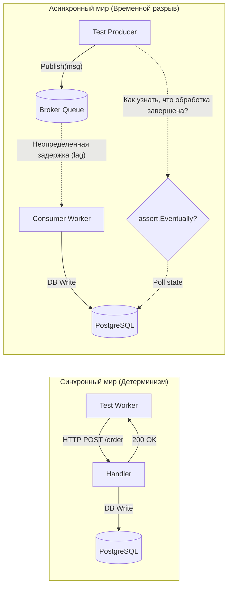
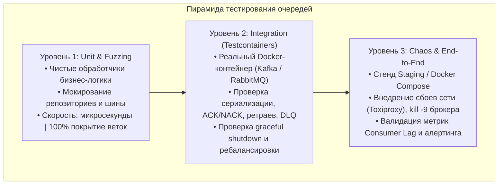
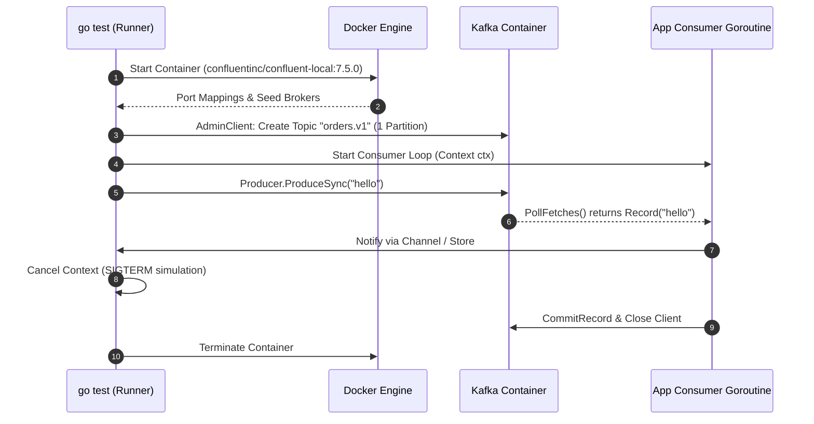

> [!NOTE]
> **Связи:** Эта статья продолжает практический блок и опирается на фундаментальные концепции: [[1. Обзор раздела. Асинхронность как основа масштабирования]], [[4. Модели доставки. At most once, at least once, exactly once]], [[9. Retry стратегии и exponential backoff]], [[10. Idempotency в message processing]], [[8. Dead Letter Queue]]. Также задействованы паттерны реализации: [[1. Работа с очередями в Go]], [[2. Консьюмеры и graceful shutdown]], [[4. Idempotent handlers]], [[6. Handling poison messages]].

Тестирование синхронного веб-сервиса — занятие линейное и психологически комфортное: отправил HTTP-запрос, дождался ответа в той же нити исполнения, проверил статус и тело ответа. Процедура детерминирована, время подчинено вашему контрольному таймеру.

Но как только в архитектуру входит брокер сообщений, детерминизм испаряется. Вы отправляете сообщение в шину, а реакция на него размазана во времени, распределена по узлам кластера и скрыта за буферами сокетов и сетевыми задержками. Когда именно консьюмер прочитает пакет? Что произойдет, если в момент коммита смещения упадет сеть? Не возникнет ли гонка за общую запись в базу при параллельной вычитке соседних партиций?

В этой лекции мы разберем инженерную методологию тестирования асинхронных систем в Go: от мгновенных изолированных unit-тестов с моками и фаззингом до полномасштабных интеграционных стендов на базе Testcontainers, проверкой утечек горутин и анализом поведения подсиcompiler-санитайзера `-race`.

---

## Почему тестировать асинхронный код сложно

Главный источник боли инженера при тестировании очередей — **рассинхронизация во времени и пространстве (Temporal and Spatial Decoupling)**. Продюсер и консьюмер не знают друг о друге, они общаются через разделяемый лог или память брокера.



Типичные проблемы, делающие асинхронные тесты нестабильными (flaky):
1. **Flaky-таймауты:** Использование наивных `time.Sleep(100 * time.Millisecond)` в надежде, что консьюмер успеет. На машине разработчика тест проходит за 20 мс, а на перегруженном раннере CI процессор переключает квант планировщика на соседний контейнер — и тест падает по таймауту.
2. **Утечки фоновых горутин (Goroutine Leaks):** Консьюмер запущен в фоне, тест завершил утверждения и вышел, а горутина продолжает долбиться в закрытые каналы или сокеты, загрязняя контекст следующих тестов пакета.
3. **Неконтролируемое состояние брокера:** Предыдущий упавший тест оставил в тестовой очереди недочитанные сообщения (unacknowledged messages), которые внезапно перехватываются консьюмером из следующего теста.
4. **Гонки данных при агрегации:** Попытка проверить результат обработки пачки сообщений через общую переменную в тесте без применения примитивов синхронизации (`sync/atomic` или `sync.Mutex`).

> [!important]
> **Золотое правило тестирования:** Разделяйте транспорт и логику обработки. Транспорт (протоколы AMQP, Kafka wire protocol, NATS conn, управление ACK/NACK и коммитами) тестируется интеграционно. Бизнес-логика обработчика обязана быть чистой функцией или структурой, принимающей доменный контекст и сообщение, и тестироваться изолированно на микросекундных скоростях.

---

## Три уровня тестирования асинхронных систем

Для надежного тестирования выстраивается пирамида испытаний, где каждый уровень решает строго свою задачу.



1. **Unit-тесты:** Проверяют инварианты логики, ветвление при ошибках, идемпотентность и расчет backoff без запуска сетевого стека. Занимают доли секунды на весь проект.
2. **Интеграционные тесты:** Запускают изолированный брокер через `testcontainers-go`, проверяют совместимость сетевых протоколов, настройки сериализации JSON/Protobuf/Avro, поведение при заполнении буферов и реакцию на сигналы завершения.
3. **Chaos / E2E тесты:** Проверяют систему на устойчивость к разделению сети (network partition), внезапной потере кворума и корректность восстановления смещений.

---

## Unit-тестирование обработчиков сообщений

Чтобы сделать обработчик легко тестируемым, избавьте его от прямой зависимости от конкретной клиентской библиотеки (`*amqp.Channel` или `*kgo.Client`). Бизнес-сервис должен зависеть исключительно от доменных интерфейсов.

Рассмотрим обработчик платежей:

```go
package service

import (
	"context"
	"errors"
	"fmt"
)

// PaymentMessage представляет входящее событие из очереди
type PaymentMessage struct {
	EventID string  `json:"event_id"`
	UserID  string  `json:"user_id"`
	Amount  float64 `json:"amount"`
}

// OrderRepository — интерфейс хранилища, легко подменяемый моком
type OrderRepository interface {
	UpdateBalance(ctx context.Context, userID string, delta float64) error
	RecordEvent(ctx context.Context, eventID string) error
	HasEvent(ctx context.Context, eventID string) (bool, error)
}

type PaymentHandler struct {
	repo OrderRepository
}

func NewPaymentHandler(repo OrderRepository) *PaymentHandler {
	return &PaymentHandler{repo: repo}
}

func (h *PaymentHandler) HandlePayment(ctx context.Context, msg PaymentMessage) error {
	if msg.EventID == "" {
		return errors.New("missing event_id")
	}
	if msg.Amount <= 0 {
		return fmt.Errorf("invalid payment amount: %.2f", msg.Amount)
	}

	// Проверка идемпотентности
	alreadyProcessed, err := h.repo.HasEvent(ctx, msg.EventID)
	if err != nil {
		return fmt.Errorf("idempotency check failed: %w", err)
	}
	if alreadyProcessed {
		// Повторное сообщение — подтверждаем без выполнения побочных эффектов
		return nil
	}

	// Списание и фиксация события
	if err := h.repo.UpdateBalance(ctx, msg.UserID, -msg.Amount); err != nil {
		return fmt.Errorf("balance update failed: %w", err)
	}
	if err := h.repo.RecordEvent(ctx, msg.EventID); err != nil {
		return fmt.Errorf("record event failed: %w", err)
	}

	return nil
}
```

Табличный unit-тест покрывает все краевые случаи за миллисекунды, используя самописный `mock` или сгенерированный через `mockgen`:

```go
package service_test

import (
	"context"
	"errors"
	"strings"
	"sync"
	"testing"

	"github.com/stretchr/testify/assert"
	"github.com/stretchr/testify/require"
)

type mockOrderRepo struct {
	mu           sync.Mutex
	events       map[string]bool
	balances     map[string]float64
	updateErr    error
	hasEventErr  error
}

func newMockOrderRepo() *mockOrderRepo {
	return &mockOrderRepo{
		events:   make(map[string]bool),
		balances: make(map[string]float64),
	}
}

func (m *mockOrderRepo) UpdateBalance(ctx context.Context, userID string, delta float64) error {
	m.mu.Lock()
	defer m.mu.Unlock()
	if m.updateErr != nil {
		return m.updateErr
	}
	m.balances[userID] += delta
	return nil
}

func (m *mockOrderRepo) RecordEvent(ctx context.Context, eventID string) error {
	m.mu.Lock()
	defer m.mu.Unlock()
	m.events[eventID] = true
	return nil
}

func (m *mockOrderRepo) HasEvent(ctx context.Context, eventID string) (bool, error) {
	m.mu.Lock()
	defer m.mu.Unlock()
	if m.hasEventErr != nil {
		return false, m.hasEventErr
	}
	return m.events[eventID], nil
}

func TestPaymentHandler_Table(t *testing.T) {
	t.Parallel()

	tests := []struct {
		name        string
		msg         PaymentMessage
		setupMock   func(m *mockOrderRepo)
		wantErr     string
		checkExpect func(t *testing.T, m *mockOrderRepo)
	}{
		{
			name: "Success: New payment processed",
			msg:  PaymentMessage{EventID: "evt-1", UserID: "usr-100", Amount: 50.0},
			setupMock: func(m *mockOrderRepo) {
				m.balances["usr-100"] = 200.0
			},
			wantErr: "",
			checkExpect: func(t *testing.T, m *mockOrderRepo) {
				assert.Equal(t, 150.0, m.balances["usr-100"])
				assert.True(t, m.events["evt-1"])
			},
		},
		{
			name:      "Error: Zero or negative amount",
			msg:       PaymentMessage{EventID: "evt-2", UserID: "usr-100", Amount: -10.0},
			setupMock: func(m *mockOrderRepo) {},
			wantErr:   "invalid payment amount",
		},
		{
			name: "Error: Database update balance failure",
			msg:  PaymentMessage{EventID: "evt-3", UserID: "usr-100", Amount: 30.0},
			setupMock: func(m *mockOrderRepo) {
				m.updateErr = errors.New("connection reset by peer")
			},
			wantErr: "balance update failed",
		},
	}

	for _, tt := range tests {
		tt := tt
		t.Run(tt.name, func(t *testing.T) {
			t.Parallel()
			mockRepo := newMockOrderRepo()
			tt.setupMock(mockRepo)

			h := NewPaymentHandler(mockRepo)
			err := h.HandlePayment(context.Background(), tt.msg)

			if tt.wantErr != "" {
				require.Error(t, err)
				assert.Contains(t, err.Error(), tt.wantErr)
			} else {
				require.NoError(t, err)
				if tt.checkExpect != nil {
					tt.checkExpect(t, mockRepo)
				}
			}
		})
	}
}
```

---

## Тестирование идемпотентности обработчика

Согласно правилам [[10. Idempotency в message processing]], обработчик обязан выдавать одинаковый бизнес-результат при повторном получении дубликата. Тестирование идемпотентности делится на два обязательных сценария:

1. **Последовательный дубликат:** Первое сообщение обработано успешно, следом приходит копия того же сообщения. Тест проверяет, что баланс не изменился повторно, а хранилище вызывалось безопасным образом.
2. **Конкурентный дубликат (Race condition):** Брокер (например, RabbitMQ при `redeliver` или Kafka при параллельной перебалансировке) доставил копии одного и того же `EventID` сразу двум параллельным горутинам-консьюмерам.

```go
func TestPaymentHandler_Idempotency_Concurrent(t *testing.T) {
	mockRepo := newMockOrderRepo()
	mockRepo.balances["usr-vip"] = 1000.0

	h := NewPaymentHandler(mockRepo)
	msg := PaymentMessage{
		EventID: "tx-duplicate-999",
		UserID:  "usr-vip",
		Amount:  100.0,
	}

	const goroutines = 10
	var wg sync.WaitGroup
	wg.Add(goroutines)

	// Запускаем 10 параллельных горутин с абсолютно одинаковым сообщением
	for i := 0; i < goroutines; i++ {
		go func() {
			defer wg.Done()
			_ = h.HandlePayment(context.Background(), msg)
		}()
	}

	wg.Wait()

	// Инвариант: списание 100.0 должно произойти строго 1 раз! Баланс обязан стать 900.0, а не 0.0
	assert.Equal(t, 900.0, mockRepo.balances["usr-vip"], "Баланс должен быть списан ровно один раз")
	assert.True(t, mockRepo.events["tx-duplicate-999"])
}
```

Для надежного отлова скрытых гонок и утечек всегда проверяйте тесты с детектором утечек горутин `uber-go/goleak`:

```go
import "go.uber.org/goleak"

func TestMain(m *testing.M) {
	// Проверяет, что после завершения пакета тестов в рантайме не осталось забытых горутин
	goleak.VerifyTestMain(m)
}
```

А в локальных тестах отдельных функций можно вызывать прямо внутри теста:
```go
func TestHandlerLifecycle(t *testing.T) {
	defer goleak.VerifyNone(t)
	// Тело теста с запуском и остановкой воркеров
}
```

---

## Тестирование ретраев и exponential backoff

При временных инфраструктурных сбоях публикация или обработка должны повторяться по правилам [[9. Retry стратегии и exponential backoff]], а при исчерпании попыток — перенаправляться в Dead Letter Queue ([[8. Dead Letter Queue]]).

Для проверки логики ретраев создается мок брокера с программируемым количеством сбоев:

```go
package service_test

import (
	"context"
	"errors"
	"sync"
	"sync/atomic"
	"testing"
	"time"

	"github.com/stretchr/testify/assert"
	"github.com/stretchr/testify/require"
)

type mockBroker struct {
	mu           sync.Mutex
	attempts     int
	failuresLeft int
}

func (m *mockBroker) Publish(ctx context.Context, topic string, payload []byte) error {
	m.mu.Lock()
	defer m.mu.Unlock()
	m.attempts++
	if m.failuresLeft > 0 {
		m.failuresLeft--
		return errors.New("network io timeout")
	}
	return nil
}

type mockDLQ struct {
	mu       sync.Mutex
	messages [][]byte
}

func (d *mockDLQ) SendToDLQ(ctx context.Context, payload []byte, reason error) error {
	d.mu.Lock()
	defer d.mu.Unlock()
	d.messages = append(d.messages, payload)
	return nil
}

type RetryConfig struct {
	MaxRetries int
	BaseDelay  time.Duration
}

type RetryPublisher struct {
	broker *mockBroker
	dlq    *mockDLQ
	cfg    RetryConfig
}

func (p *RetryPublisher) PublishWithRetry(ctx context.Context, topic string, payload []byte) error {
	delay := p.cfg.BaseDelay
	for attempt := 0; attempt <= p.cfg.MaxRetries; attempt++ {
		err := p.broker.Publish(ctx, topic, payload)
		if err == nil {
			return nil
		}
		if attempt == p.cfg.MaxRetries {
			// Попытки исчерпаны — отправляем в DLQ
			_ = p.dlq.SendToDLQ(ctx, payload, err)
			return fmt.Errorf("retries exhausted: %w", err)
		}
		select {
		case <-ctx.Done():
			return ctx.Err()
		case <-time.After(delay):
			delay *= 2 // exponential backoff
		}
	}
	return nil
}

func TestRetryPublisher_SuccessAfterRetries(t *testing.T) {
	broker := &mockBroker{failuresLeft: 2} // Первые 2 вызова упадут, 3-й успешен
	dlq := &mockDLQ{}
	pub := &RetryPublisher{
		broker: broker,
		dlq:    dlq,
		cfg:    RetryConfig{MaxRetries: 3, BaseDelay: 2 * time.Millisecond},
	}

	err := pub.PublishWithRetry(context.Background(), "orders", []byte(`{"id": 10}`))
	require.NoError(t, err)

	broker.mu.Lock()
	assert.Equal(t, 3, broker.attempts, "Ожидалось ровно 3 попытки (2 сбоя + 1 успех)")
	broker.mu.Unlock()

	dlq.mu.Lock()
	assert.Empty(t, dlq.messages, "DLQ не должна содержать сообщений при успехе")
	dlq.mu.Unlock()
}

func TestRetryPublisher_ExhaustedToDLQ(t *testing.T) {
	broker := &mockBroker{failuresLeft: 10} // Все попытки завершатся сбоем
	dlq := &mockDLQ{}
	pub := &RetryPublisher{
		broker: broker,
		dlq:    dlq,
		cfg:    RetryConfig{MaxRetries: 3, BaseDelay: 2 * time.Millisecond},
	}

	err := pub.PublishWithRetry(context.Background(), "orders", []byte(`{"id": 99}`))
	require.Error(t, err)

	broker.mu.Lock()
	// 1 исходная попытка + 3 ретрая = 4 вызова
	assert.Equal(t, 4, broker.attempts)
	broker.mu.Unlock()

	dlq.mu.Lock()
	require.Len(t, dlq.messages, 1, "Сообщение обязано поступить в DLQ")
	assert.JSONEq(t, `{"id": 99}`, string(dlq.messages[0]))
	dlq.mu.Unlock()
}
```

> [!warning] Ловушка / Gotcha: Смертоносный `time.Sleep`
> Никогда не используйте фиксированный `time.Sleep` для ожидания асинхронного события в тестах! Если вы напишете `time.Sleep(200 * time.Millisecond)`, тест замедлится на 200 мс, даже если событие наступило через 2 мс. При 1000 тестах ваш билд будет идти 3 минуты вместо 2 секунд.
>
> Вместо этого всегда используйте функцию поллинга условий `assert.Eventually` или `require.Eventually` из библиотеки `testify`:
> ```go
> assert.Eventually(t, func() bool {
>     return atomic.LoadInt64(&processedCount) == 100
> }, 2*time.Second, 10*time.Millisecond, "Ожидалась обработка 100 сообщений")
> ```
> `assert.Eventually` проверяет условие каждые 10 мс и выходит мгновенно, как только предикат возвращает `true`.

---

## Интеграционное тестирование с реальным брокером

Ни один мок не воспроизведет реальное поведение партиций Kafka, семантику RabbitMQ dead-letter exchange, сброс сокетов по таймауту heartbeat или ребалансировку Consumer Group. Для таких проверок используются официальные модули **Testcontainers for Go**.



Интеграционные тесты обычно выделяются в отдельный набор с помощью build-тегов:
`//go:build integration`  
Благодаря этому обычный запуск `go test ./...` отрабатывает мгновенно, а тяжелые тесты с Docker запускаются только при передаче флага:  
`go test -tags=integration -v ./...`

### Подготовка контейнера Kafka

Ниже представлен полноценный боевой интеграционный тест взаимодействия продюсера и консьюмера с использованием современной библиотеки `twmb/franz-go` и модуля `testcontainers-go/modules/kafka`:

```go
//go:build integration
// +build integration

package integration_test

import (
	"context"
	"testing"
	"time"

	"github.com/stretchr/testify/require"
	"github.com/testcontainers/testcontainers-go"
	tckafka "github.com/testcontainers/testcontainers-go/modules/kafka"
	"github.com/twmb/franz-go/pkg/kgo"
)

func TestKafkaProduceConsume(t *testing.T) {
	ctx, cancel := context.WithTimeout(context.Background(), 2*time.Minute)
	defer cancel()

	// 1. Поднимаем легковесный одиночный контейнер Kafka в Docker
	kafkaContainer, err := tckafka.RunContainer(ctx,
		tckafka.WithClusterID("test-cluster"),
		testcontainers.WithImage("confluentinc/confluent-local:7.5.0"),
	)
	require.NoError(t, err)
	defer func() {
		_ = kafkaContainer.Terminate(context.Background())
	}()

	// 2. Извлекаем реальные хост и порт, выставленные наружу Docker-демоном
	brokers, err := kafkaContainer.Brokers(ctx)
	require.NoError(t, err)
	require.NotEmpty(t, brokers)

	topicName := "test-topic"

	// 3. Создаем топик через Kafka Admin API
	adminCl, err := kgo.NewClient(kgo.SeedBrokers(brokers...))
	require.NoError(t, err)
	defer adminCl.Close()

	_, err = adminCl.CreateTopics(ctx, &kgo.CreateTopicsRequest{
		Topics: []kgo.CreateTopicsRequestTopic{{
			Topic:             topicName,
			NumPartitions:     1,
			ReplicationFactor: 1,
		}},
	})
	require.NoError(t, err)

	// 4. Инициализируем продюсер и отправляем контрольное сообщение
	produceCl, err := kgo.NewClient(
		kgo.SeedBrokers(brokers...),
		kgo.DefaultProduceTopic(topicName),
	)
	require.NoError(t, err)

	record := &kgo.Record{Value: []byte("hello-async-world")}
	results := produceCl.ProduceSync(ctx, record)
	require.NoError(t, results.FirstErr())
	produceCl.Close()

	// 5. Запускаем консьюмер и проверяем получение
	consumeCl, err := kgo.NewClient(
		kgo.SeedBrokers(brokers...),
		kgo.ConsumeTopics(topicName),
		kgo.ConsumerGroup("test-group"),
	)
	require.NoError(t, err)
	defer consumeCl.Close()

	pollCtx, pollCancel := context.WithTimeout(ctx, 15*time.Second)
	defer pollCancel()

	var received []string
	for {
		fetches := consumeCl.PollFetches(pollCtx)
		if fetches.IsClientClosed() || pollCtx.Err() != nil {
			break
		}
		fetches.EachRecord(func(r *kgo.Record) {
			received = append(received, string(r.Value))
		})
		if len(received) >= 1 {
			break
		}
	}

	require.Equal(t, []string{"hello-async-world"}, received)
}
```

Аналогичным образом модуль `testcontainers/modules/rabbitmq` позволяет поднять изолированный RabbitMQ с преднастроенными очередями и плагинами управления (Management UI) за пару строк кода.

### Проверка graceful shutdown

В соответствии с принципами [[2. Консьюмеры и graceful shutdown]], при получении сигнала завершения консьюмер обязан:
1. Прекратить чтение новых сообщений из брокера.
2. Завершить обработку тех сообщений, которые уже находятся в локальных буферах горутин.
3. Зафиксировать (ACK/Commit) их смещения в брокере.
4. Корректно закрыть сетевое соединение.

Проверка graceful shutdown строится на моделировании отмены контекста:

```go
func TestGracefulShutdown(t *testing.T) {
	ctx, cancel := context.WithCancel(context.Background())
	defer cancel()

	client, err := kgo.NewClient(kgo.SeedBrokers(brokers...), kgo.ConsumeTopics("shutdown-topic"))
	require.NoError(t, err)
	defer client.Close()

	processed := make(chan string, 100)
	consumerDone := make(chan struct{})

	// Фоновый цикл вычитки
	go func() {
		defer close(consumerDone)
		for {
			fetches := client.PollFetches(ctx)
			if fetches.IsClientClosed() || ctx.Err() != nil {
				// Контекст отменен — выходим из цикла вычитки
				break
			}
			fetches.EachRecord(func(r *kgo.Record) {
				processed <- string(r.Value)
			})
		}
	}()

	// Ждем, пока консьюмер гарантированно начнет работу и обработает хотя бы одно сообщение
	require.Eventually(t, func() bool {
		return len(processed) > 0
	}, 5*time.Second, 50*time.Millisecond)

	// Имитируем приход сигнала SIGTERM в микросервис
	cancel()

	// Убеждаемся, что горутина консьюмера штатно завершилась без зависания
	select {
	case <-consumerDone:
		// Успешный выход
	case <-time.After(3 * time.Second):
		t.Fatal("Consumer failed to shutdown gracefully within 3 seconds")
	}
}
```

---

## Тестирование конкурентной обработки

Когда консьюмер распределяет входящие сообщения между пулом рабочих горутин (Worker Pool из лекции [[3. Параллелизм обработки сообщений]]), высок риск нарушить строгий порядок или получить гонку за разделяемое состояние.

При тестировании конкурентного консьюмера применяются:
1. **Счетчики на базе `sync/atomic`:** Никаких `count++` без мьютекса или атомиков, иначе тест упадет под детектором гонок.
2. **Флаг `-race`:** Команда `go test -race ./...` обязана выполняться на каждом шаге CI-пайплайна. Инструментация рантайма Go отслеживает все несинхронизированные чтения и записи в память размером в 8 байт.

```go
func TestConcurrentProcessing_OrderAndRaces(t *testing.T) {
	const totalMessages = 500
	var processedCount int64

	var mu sync.Mutex
	orderPerKey := make(map[string][]int)

	// Симулируем конкурентный воркер-пул
	jobs := make(chan struct {
		key string
		seq int
	}, totalMessages)

	var wg sync.WaitGroup
	const workers = 8
	for w := 0; w < workers; w++ {
		wg.Add(1)
		go func() {
			defer wg.Done()
			for j := range jobs {
				// Имитируем работу
				atomic.AddInt64(&processedCount, 1)

				mu.Lock()
				orderPerKey[j.key] = append(orderPerKey[j.key], j.seq)
				mu.muUnlock := func() { mu.Unlock() }
				mu.muUnlock()
			}
		}()
	}

	// Отправляем сообщения с тремя разными ключами
	for i := 0; i < totalMessages; i++ {
		key := fmt.Sprintf("partition-%d", i%3)
		jobs <- struct {
			key string
			seq int
		}{key: key, seq: i}
	}
	close(jobs)
	wg.Wait()

	assert.Equal(t, int64(totalMessages), atomic.LoadInt64(&processedCount))
}
```

---

## Тестирование с фаззингом

Начиная с Go 1.18, компилятор включает нативный фаззинг (Fuzzing). В асинхронных системах брокер доставляет не структуры Go, а сырые байты (`[]byte`), полученные из сети.

Если в продюсер внедрили несовместимую схему, хакер прислал некорректный JSON, или сжатие Snappy повредило пару байт в заголовке, обработчик обязан аккуратно вернуть ошибку, а не упасть в панику с завершением всего процесса.

```go
func FuzzPaymentMessageHandler(f *testing.F) {
	// Добавляем начальный корпус валидных семян (Seed Corpus)
	f.Add([]byte(`{"event_id":"evt-1","user_id":"u-10","amount":100.5}`))
	f.Add([]byte(`{"event_id":"","user_id":"","amount":0}`))
	f.Add([]byte(`{}`))
	f.Add([]byte(`null`))

	repo := newMockOrderRepo()
	handler := NewPaymentHandler(repo)

	f.Fuzz(func(t *testing.T, data []byte) {
		var msg PaymentMessage
		// 1. Проверяем парсинг — он не должен вызывать панику
		if err := json.Unmarshal(data, &msg); err != nil {
			// Невалидный JSON — штатная ситуация, игнорируем
			return
		}

		// 2. Проверяем доменную валидацию — любые крайние значения float64 (NaN, +Inf, -Inf, Overflow)
		// не должны ломать внутренние инварианты
		_ = handler.HandlePayment(context.Background(), msg)
	})
}
```

Запуск фаззера в CI на короткий интервал:
```bash
go test -fuzz=FuzzPaymentMessageHandler -fuzztime=30s ./service/...
```
Фаззер молниеносно находит краевые случаи, о которых разработчик даже не подозревал: невалидные UTF-8 последовательности в строках, отрицательный баланс, NaN в числах с плавающей точкой и переполнение стека рекурсивными структурами.

---

> [!info] Под капотом: Mechanical Sympathy виртуального времени и планировщика
> Почему `time.Sleep` настолько токсичен для тестов?
> 
> Когда горутина вызывает `time.Sleep(d)`, планировщик рантайма Go переводит ее состояние из `_Grunning` в `_Gwaiting` и регистрирует таймер в четырехлучевой куче таймеров текущего процессора `P` (`runtime.timer`). После этого поток операционной системы `M` отдает свой квант времени другим задачам ОС.
> 
> На загруженной CI-машине (где Docker делит 2 vCPU между 8 параллельными сборками) планировщик ядра Linux может не возвращать квант времени вашему процессу в течение сотен миллисекунд после истечения таймера. В результате фиксированный sleep приводит к ложным сбоям по таймауту.
> 
> Начиная с **Go 1.24**, в стандартную библиотеку добавлен экспериментальный пакет `testing/synctest`. Он создает изолированный «пузырь виртуального времени» (Virtual Time Bubble). Все горутины внутри пузыря управляются симулированными часами: вызов `time.Sleep(10 * time.Hour)` выполняется за 1 наносекунду процессора, так как рантайм мгновенно перематывает виртуальные часы вперед, как только все горутины пузыря заблокировались!
> 
> ```go
> // Пример с Go 1.24+ (GOEXPERIMENT=synctest)
> func TestAsyncWithVirtualTime(t *testing.T) {
>     synctest.Run(func() {
>         ch := make(chan string)
>         go func() {
>             time.Sleep(5 * time.Second) // Перематывается мгновенно!
>             ch <- "ack"
>         }()
>         
>         res := <-ch
>         assert.Equal(t, "ack", res)
>     })
> }
> ```
> Это делает асинхронные тесты быстрее в тысячи раз и гарантирует 100% детерминизм.

---

## Инструменты и лучшие практики

Сведем воедино проверенный практикой стек тестирования распределенных брокеров сообщений в Go:

| Инструмент | Назначение | Когда применять |
|---|---|---|
| **testify** (`assert`, `require`) | Лаконичные утверждения и функция опроса `assert.Eventually` | В 100% unit- и integration-тестов |
| **testcontainers-go** | Подъем реальных контейнеров Kafka, RabbitMQ, Redis, PostgreSQL | В тестах с флагом `//go:build integration` |
| **go.uber.org/goleak** | Детектор забытых фоновых горутин консьюмеров | В `TestMain` всех пакетов с конкурентным кодом |
| **mockgen / gomock** | Генерация строгих моков для интерфейсов публикации и БД | В изолированных unit-тестах бизнес-логики |
| **go test -race** | Детектор состояний гонки (ThreadSanitizer) | Обязательно на каждом коммите в CI |
| **Go Native Fuzzing** | Фаззинг десериализации пакетов и валидаторов сообщений | При тестировании входных контрактов очередей |

---

> [!tip] Собеседование: Как проверить гарантию Exactly-Once в Kafka?
> **Вопрос:** Вам поручили протестировать сервис, который заявляет обработку сообщений из Kafka со строгой гарантией Exactly-Once. Какие тесты вы напишете?
> 
> **Ответ:** Заявление об Exactly-Once обработке (E2E Exactly-Once) всегда опирается на три независимых уровня, каждый из которых требует своего теста:
> 
> 1. **Изоляция и идемпотентность консьюмера (Unit-тест):**
>    - Проверяем реакцию на дубликаты. Отправляем одно и то же сообщение дважды (последовательно и конкурентно в 10 горутинах).
>    - Проверяем, что изменения в базе применились ровно один раз благодаря уникальным ключам дедупликации (idempotency key).
> 2. **Транзакционный продюсер и изоляция чтения (Integration-тест с Testcontainers):**
>    - Если сервис выполняет цепочку «consume $\to$ process $\to$ produce в выходной топик», продюсер обязан быть транзакционным (`transactional.id`), а downstream-консьюмер настроен с `isolation.level = read_committed`.
>    - Имитируем сбой (панику или context cancel) в середине транзакции до вызова `CommitTransaction()`. Убеждаемся, что downstream-консьюмер с `read_committed` **не видит** абортированных сообщений.
> 3. **Атомарность фиксации смещения и сайд-эффекта (Fault Injection тест):**
>    - Имитируем падение приложения (`t.Fail` / завершение горутины) ровно в интервале между успешной записью в БД и коммитом смещения в Kafka.
>    - После перезапуска консьюмер неизбежно получит это сообщение повторно (At-Least-Once на уровне брокера), но благодаря первому пункту (проверке по idempotency key в транзакции БД) оно будет распознано как дубликат и пропущено без повторного списания денег.

---

## Заключение и следующие шаги

Тестирование асинхронных систем перестает быть «лотереей таймаутов», когда вы разделяете архитектуру на независимые слои:
- **Бизнес-логика** живет в чистых обработчиках и тестируется за микросекунды табличными тестами с моками интерфейсов `OrderRepository` и генерацией данных фаззером.
- **Инфраструктурные контракты** (сериализация, заголовки, ретраи, dead-lettering и graceful shutdown) проверяются через `testcontainers-go` на реальном брокере.
- **Конкурентность** контролируется флагом `-race` и детектором утечек `goleak.VerifyNone(t)`.

Однако даже идеально протестированная система в боевом продакшене сталкивается с непредвиденным: сетевые всплески, деградация дисков брокера и отставание консьюмеров. В следующей лекции — [[8. Observability очередей]] — мы разберем, как сделать работу распределенной асинхронной системы прозрачной с помощью метрик Prometheus, распределенной трассировки OpenTelemetry и структурированных логов.