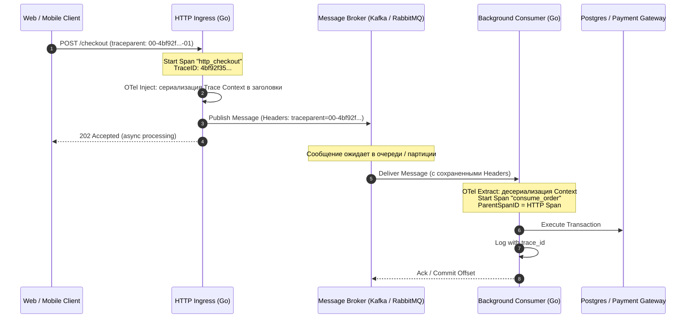
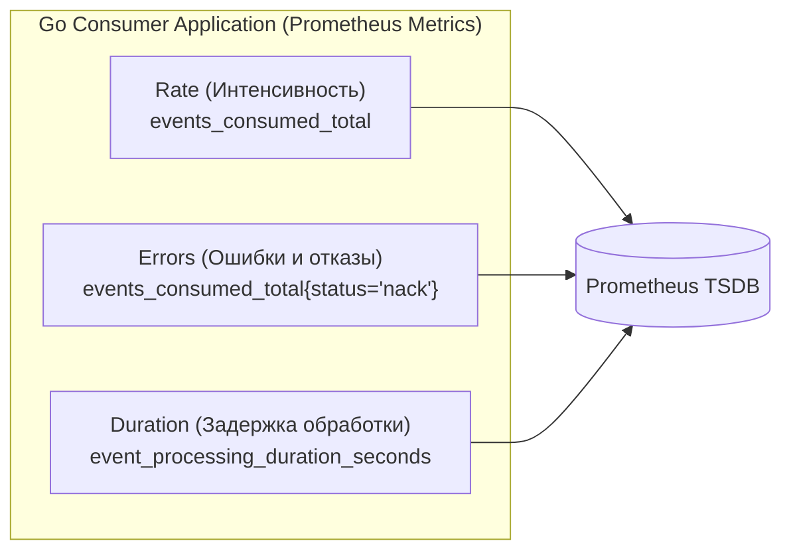

> [!NOTE]
> **Связи:** Эта статья завершает цикл практической надежности консьюмеров и опирается на материалы: [[1. Работа с очередями в Go]], [[2. Консьюмеры и graceful shutdown]], [[4. Idempotent handlers]], [[6. Handling poison messages]] и [[7. Тестирование async систем]]. В ней закладывается базис для следующей лекции: [[9. Мониторинг lag и throughput]].

В классической синхронной веб-архитектуре отследить путь пользовательского запроса относительно просто: запрос поступил в API Gateway, ушел в `net/http` хэндлер, сделал пару RPC-вызовов по gRPC и вернул ответ. Если что-то сломалось, разработчик открывает логгер, фильтрует записи по единому `request_id` и видит связный стек вызовов.

Но в Event-Driven архитектурах (EDA) эта причинно-следственная связь грубо разрывается брокером сообщений. Отправитель (Publisher) формирует событие, отправляет его в брокер по принципу Fire-and-Forget и немедленно отвечает пользователю HTTP-статусом 202 Accepted. Консьюмер на другом конце мира может вычитать этот пакет через пару миллисекунд, а может через двое суток — если сообщение отлежалось в DLQ после сетевого шторма.

Если пользователь нажал кнопку оформления заказа, а через 15 минут горутина консьюмера в глубинах биллингового сервиса упала с ошибкой, как понять, **какой конкретно** HTTP-запрос запустил эту цепочку катастрофических событий?

Ответом служит **Observability (Наблюдаемость)**. В асинхронных системах на Go она опирается на три фундаментальных кита:
1. **Distributed Tracing (Распределенная трассировка):** Сквозной контекст через заголовки брокера.
2. **Application Metrics (Метрики приложения):** RED-паттерн и гистограммы Prometheus.
3. **Structured Contextual Logging (Структурированное контекстное логирование):** Сквозная привязка `log/slog` к идентификаторам трассировки.

---

## 1. Распределенная трассировка (Distributed Tracing)

Единственный способ не потерять нить выполнения между изолированными процессами — передавать **Trace Context** через шину данных. Общепринятым мировым стандартом стал **OpenTelemetry (OTel)** и спецификация W3C Trace Context.

### Механика работы (Propagation)

Тело сообщения (Payload — будь то JSON, Protobuf или Avro) предназначено для доменной логики. Смешивать транспортные метаданные с бизнес-полями — грубое нарушение принципа разделения ответственности (Separation of Concerns).

Поэтому метаданные трассировки (`TraceID`, `SpanID`) всегда упаковываются в **Заголовки (Headers)** транспортного протокола:
- В **RabbitMQ** это таблица атрибутов `amqp.Table` внутри структуры публикации.
- В **Apache Kafka** это массив ключ-значение `Headers` внутри структуры `Record`.
- В **NATS** это стандартные заголовки `nats.Header`.



> [!info] Под капотом: W3C Trace Context
> В заголовки брокера внедряется стандартизированный бинарный или текстовый ключ `traceparent`.
> Его канонический формат выглядит следующим образом:
> ```text
> 00-4bf92f3577b34da6a3ce929d0e0e4736-00f067aa0ba902b7-01
> │  │                                │                │
> │  └─ 16-байтный TraceID (128 бит)  └─ 8-байт SpanID └─ Флаги сэмплирования (01 = sampled)
> └─ Версия стандарта W3C (00)
> ```
> Размер заголовка составляет всего 55 байт. Он не создает заметной нагрузки на сетевой стек ядра Linux и память брокера (например, BEAM-процессы Erlang VM в RabbitMQ). Зато он превращает россыпь разрозненных логов в упорядоченное дерево графа вызовов.

---

### Идиоматичный Go: Inject и Extract

Клиентская библиотека RabbitMQ `amqp091-go` не имеет встроенной поддержки OpenTelemetry (в отличие от `net/http`, где OTel поставляется с готовыми middleware). Чтобы подружить OTel с брокером, мы реализуем стандартный интерфейс `propagation.TextMapCarrier`.

#### 1. Реализация TextMapCarrier для RabbitMQ

```go
package tracing

import (
	amqp "github.com/rabbitmq/amqp091-go"
	"go.opentelemetry.io/otel/propagation"
)

// AMQPHeadersCarrier адаптирует amqp.Table к интерфейсу TextMapCarrier
type AMQPHeadersCarrier amqp.Table

// Get извлекает значение строкового заголовка
func (c AMQPHeadersCarrier) Get(key string) string {
	val, ok := c[key]
	if !ok {
		return ""
	}
	strVal, ok := val.(string)
	if !ok {
		return ""
	}
	return strVal
}

// Set сохраняет заголовок в amqp.Table
func (c AMQPHeadersCarrier) Set(key string, value string) {
	c[key] = value
}

// Keys возвращает список всех ключей заголовков
func (c AMQPHeadersCarrier) Keys() []string {
	keys := make([]string, 0, len(c))
	for k := range c {
		keys = append(keys, k)
	}
	return keys
}
```

#### 2. Инъекция контекста на стороне Publisher

```go
package producer

import (
	"context"
	"fmt"

	amqp "github.com/rabbitmq/amqp091-go"
	"go.opentelemetry.io/otel"
	"go.opentelemetry.io/otel/trace"
)

type EventPublisher struct {
	channel *amqp.Channel
	tracer  trace.Tracer
}

func NewEventPublisher(ch *amqp.Channel, tracer trace.Tracer) *EventPublisher {
	return &EventPublisher{channel: ch, tracer: tracer}
}

func (p *EventPublisher) PublishOrderCreated(ctx context.Context, orderID string, body []byte) error {
	// Создаем дочерний Span операции отправки в брокер
	ctx, span := p.tracer.Start(ctx, "orders.publish",
		trace.WithSpanKind(trace.SpanKindProducer),
	)
	defer span.End()

	headers := make(amqp.Table)

	// Внедряем W3C Trace Context (traceparent) в таблицу заголовков
	propagator := otel.GetTextMapPropagator()
	propagator.Inject(ctx, AMQPHeadersCarrier(headers))

	// Добавляем бизнес-идентификатор для быстрой фильтрации в Wireshark / Management UI
	headers["MessageID"] = fmt.Sprintf("msg-%s", orderID)

	msg := amqp.Publishing{
		DeliveryMode: amqp.Persistent,
		ContentType:  "application/json",
		Headers:      headers,
		Body:         body,
	}

	err := p.channel.PublishWithContext(ctx,
		"orders.exchange", // exchange
		"order.created",   // routing key
		false,             // mandatory
		false,             // immediate
		msg,
	)
	if err != nil {
		span.RecordError(err)
		return fmt.Errorf("failed to publish message: %w", err)
	}

	return nil
}
```

#### 3. Извлечение контекста на стороне Consumer

```go
package consumer

import (
	"context"
	"log/slog"

	amqp "github.com/rabbitmq/amqp091-go"
	"go.opentelemetry.io/otel"
	"go.opentelemetry.io/otel/trace"
)

type OrderConsumer struct {
	tracer trace.Tracer
	logger *slog.Logger
}

func (c *OrderConsumer) HandleDelivery(d amqp.Delivery) {
	// 1. Извлекаем родительский контекст трассировки из Headers брокера
	propagator := otel.GetTextMapPropagator()
	parentCtx := propagator.Extract(context.Background(), AMQPHeadersCarrier(d.Headers))

	// 2. Стартуем новый локальный Span, который в OTel UI будет дочерним к Producer Span
	ctx, span := c.tracer.Start(parentCtx, "orders.consume",
		trace.WithSpanKind(trace.SpanKindConsumer),
	)
	defer span.End()

	// 3. Выполняем доменную бизнес-логику
	if err := c.processOrder(ctx, d.Body); err != nil {
		span.RecordError(err)
		c.logger.ErrorContext(ctx, "failed to process message",
			slog.String("error", err.Error()),
			slog.Uint64("delivery_tag", d.DeliveryTag),
		)
		_ = d.Nack(false, false) // Отправляем в DLQ без зацикливания
		return
	}

	_ = d.Ack(false)
}

func (c *OrderConsumer) processOrder(ctx context.Context, payload []byte) error {
	// Вся цепочка downstream-вызовов (SQL, Redis, HTTP) наследует ctx с TraceID!
	return nil
}
```

> [!warning] Ловушка / Gotcha: Жизненный цикл `context.Context`
> Распространенная ошибка при асинхронной публикации: передача родительского контекста `ctx` из HTTP-обработчика в фоновую горутину:
> 
> ```go
> func handleHTTP(w http.ResponseWriter, r *http.Request) {
>     go func() {
>         // ОШИБКА: r.Context() будет отменен, как только завершится HTTP-обработчик!
>         _ = publisher.Publish(r.Context(), data) 
>     }()
>     w.WriteHeader(http.StatusAccepted)
> }
> ```
> Как только HTTP-сервер отдает клиенту заголовки ответа, рантайт `net/http` вызывает `cancel()` для контекста запроса. Фоновая горутина получает ошибку `context canceled` при попытке записать данные в сокет брокера.
> 
> **Каноническое решение (Go 1.21+):**
> Используйте `context.WithoutCancel(ctx)`. Функция `context.WithoutCancel` создает новый контекст, который отвязан от каналов отмены родителя и дедлайнов, но **полностью сохраняет все значения** (`Value`), включая скрытый `TraceID`, атрибуты OTel и метаданные пользователя!

---

## 2. Метрики (Prometheus) уровня приложения

Брокер сообщений экспортирует собственные системные метрики (очереди, соединения, память — их мы разберем в лекции [[9. Мониторинг lag и throughput]]). Однако брокер ничего не знает о том, *что именно* делает ваш Go-воркер: сколько миллисекунд занимает обработка, где застряли транзакции, и почему растет число отказов.

Приложение обязано предоставлять собственные метрики по **RED-паттерну (Rate, Errors, Duration)**:



Рекомендуемый набор метрик клиента очередей:

```go
package metrics

import (
	"github.com/prometheus/client_golang/prometheus"
	"github.com/prometheus/client_golang/prometheus/promauto"
)

var (
	// EventsPublishedTotal считает интенсивность исходящего потока
	EventsPublishedTotal = promauto.NewCounterVec(
		prometheus.CounterOpts{
			Name: "events_published_total",
			Help: "Общее количество опубликованных сообщений в брокер",
		},
		[]string{"topic", "status"}, // status: success / error
	)

	// EventsConsumedTotal считает интенсивность вычитки и распределение исходов
	EventsConsumedTotal = promauto.NewCounterVec(
		prometheus.CounterOpts{
			Name: "events_consumed_total",
			Help: "Общее количество вычитанных сообщений из очереди",
		},
		[]string{"topic", "consumer_group", "status"}, // status: ack, nack, dlq
	)

	// EventProcessingDuration измеряет задержку выполнения бизнес-логики консьюмера
	EventProcessingDuration = promauto.NewHistogramVec(
		prometheus.HistogramOpts{
			Name:    "event_processing_duration_seconds",
			Help:    "Время обработки одного сообщения консьюмером в секундах",
			Buckets: []float64{0.005, 0.01, 0.025, 0.05, 0.1, 0.25, 0.5, 1.0, 2.5, 5.0, 10.0},
		},
		[]string{"topic", "consumer_group"},
	)
)
```

Пример использования в консьюмере:
```go
start := time.Now()
err := handler.Process(ctx, msg)
duration := time.Since(start).Seconds()

EventProcessingDuration.WithLabelValues("orders", "billing-group").Observe(duration)

if err != nil {
    EventsConsumedTotal.WithLabelValues("orders", "billing-group", "nack").Inc()
} else {
    EventsConsumedTotal.WithLabelValues("orders", "billing-group", "ack").Inc()
}
```

> [!tip] Собеседование: Ловушка High Cardinality
> **Вопрос:** Мы добавили в метрику `events_consumed_total` лейбл `user_id`, чтобы в Grafana отслеживать активность конкретных клиентов. Через час сервер Prometheus упал с Out Of Memory (OOM). Что произошло и как это исправить?
> 
> **Ответ:** Произошел взрыв размерности — **High Cardinality**.
> В архитектуре Prometheus TSDB (Time Series Database) каждая уникальная комбинация значений лейблов порождает совершенно независимый временной ряд (Time Series). Если в системе 1 миллион пользователей, метрика порождает:
> $$\text{Topics} \times \text{Groups} \times \text{Statuses} \times 1\,000\,000 \approx \text{Миллионы временных рядов в RAM!}$$
> 
> На каждый ряд Prometheus аллоцирует структуры в памяти (Head Chunks, инвертированные индексы). Это мгновенно съедает оперативную память.
> 
> **Правило:** Лейблы метрик Prometheus обязаны иметь конечное и малое множество значений (Bounded Cardinality): имена очередей, консьюмер-групп, HTTP/RPC методы, статус `success/error`. Любые высококардинальные идентификаторы (`user_id`, `order_id`, `TraceID`, `MessageID`) категорически запрещено передавать в метрики — их место **исключительно в структурированных логах** и спанах OpenTelemetry!

---

## 3. Контекстное логирование (Structured Logging)

Трассировка показывает *где* в цепочке сервисов возник затор или сбой. Метрики показывают *как часто* он происходит. Но только структурированные логи объясняют, *почему* это произошло (какие данные передавались, какая ветка алгоритма сработала, какие переменные привели к ошибке).

Начиная с **Go 1.21**, стандартная библиотека включает пакет структурированного логирования `log/slog`. В распределенных брокерах идиоматичный подход — писать логи строго в формате JSON и автоматически насыщать каждую строчку идентификаторами `trace_id` и `span_id`.

Когда централизованный сборщик логов (Grafana Loki, Elasticsearch, ClickHouse, Datadog) парсит JSON, он индексирует поле `trace_id`. В результате в дашборде Jaeger или Grafana Tempo можно нажать на упавший Span и в один клик увидеть все ассоциированные с ним строки логов.

```mermaid
flowchart LR
    classDef process  fill:#1e293b,stroke:#38bdf8,stroke-width:1px,color:#f8fafc
    classDef success  fill:#064e3b,stroke:#34d399,stroke-width:1px,color:#f8fafc
    classDef error    fill:#7f1d1d,stroke:#f87171,stroke-width:1px,color:#f8fafc
    classDef warning  fill:#78350f,stroke:#fbbf24,stroke-width:1px,color:#f8fafc
    classDef entry    fill:#1e3a5f,stroke:#38bdf8,stroke-width:2px,color:#f8fafc
    classDef aux      fill:#334155,stroke:#64748b,stroke-width:1px,color:#f8fafc
    classDef system   fill:#312e81,stroke:#a78bfa,stroke-width:1px,color:#f8fafc
    classDef data     fill:#132d29,stroke:#2dd4bf,stroke-width:1px,color:#f8fafc
    classDef network  fill:#881337,stroke:#fb7185,stroke-width:1px,color:#f8fafc
    classDef accent   fill:#1e1b4b,stroke:#818cf8,stroke-width:1px,color:#f8fafc
    subgraph "Go Runtime Context"
        Ctx["context.Context<br>SpanContext(TraceID, SpanID)"]
    end
    Ctx --> Handler["slog.Handler (Custom / Middleware)"]
    Handler -->|"Format JSON"| Out["JSON Log Stream"]
    Out -->|"Field trace_id"| Loki["Grafana Loki / ClickHouse"]
    Loki <-->|"Correlate 1:1"| Tempo["Grafana Tempo / Jaeger Tracing"]
```



### Идиоматичный Slog-адаптер для трассировки

Мы создаем декоратор для `slog.Handler`, который прозрачно извлекает OTel Trace Context из `context.Context` без ручного добавления полей в каждом логе:

```go
package logging

import (
	"context"
	"log/slog"
	"os"

	"go.opentelemetry.io/otel/trace"
)

// TraceContextHandler автоматически внедряет trace_id и span_id в каждую запись лога
type TraceContextHandler struct {
	slog.Handler
}

func NewTraceJSONHandler() *TraceContextHandler {
	baseHandler := slog.NewJSONHandler(os.Stdout, &slog.HandlerOptions{
		Level: slog.LevelInfo,
	})
	return &TraceContextHandler{Handler: baseHandler}
}

func (h *TraceContextHandler) Handle(ctx context.Context, r slog.Record) error {
	if ctx != nil {
		span := trace.SpanFromContext(ctx)
		spanCtx := span.SpanContext()
		if spanCtx.IsValid() {
			r.AddAttrs(
				slog.String("trace_id", spanCtx.TraceID().String()),
				slog.String("span_id", spanCtx.SpanID().String()),
			)
		}
	}
	return h.Handler.Handle(ctx, r)
}
```

Использование в консьюмере:

```go
func init() {
	handler := NewTraceJSONHandler()
	slog.SetDefault(slog.New(handler))
}

func ProcessMessage(ctx context.Context, msg []byte) {
	// В логе автоматически появятся "trace_id" и "span_id" из переданного ctx!
	slog.InfoContext(ctx, "starting message processing",
		slog.Int("payload_bytes", len(msg)),
	)

	if err := doDB(ctx); err != nil {
		slog.ErrorContext(ctx, "database update failed",
			slog.String("error", err.Error()),
		)
	}
}
```

Вывод лога в формате JSON:
```json
{
  "time": "2026-09-15T11:45:00.123456789Z",
  "level": "ERROR",
  "msg": "database update failed",
  "error": "connection refused",
  "trace_id": "4bf92f3577b34da6a3ce929d0e0e4736",
  "span_id": "00f067aa0ba902b7"
}
```

---

## Итог

1. **Трассировка — кровеносная система EDA:** Без OpenTelemetry и проброса заголовка `traceparent` через заголовки сообщений расследование инцидентов превращается в гадание на кофейной гуще.
2. **Propagators:** Используйте реализацию интерфейса `propagation.TextMapCarrier` для прозрачного преобразования OTel-контекста в `amqp.Table` или Kafka-заголовки `Headers`.
3. **Контекст без отмены:** Переходя от синхронного HTTP к фоновым очередям, применяйте `context.WithoutCancel(ctx)`, чтобы сохранить значения трассировки и не получить ошибку `context canceled` при закрытии HTTP-ответа.
4. **Метрики RED:** Контролируйте `events_published_total{topic="orders"}`, частоту подтверждений `events_consumed_total`, количество `Nack` и гистограммы длительности `event_processing_duration_seconds`.
5. **Остерегайтесь High Cardinality:** Никогда не добавляйте `user_id` или `MessageID` в лейблы метрик Prometheus.
6. **Структурированный лог:** Пакет `log/slog` в связке с кастомным обработчиком контекста автоматически связывает JSON-логи с трейсами через атрибуты `trace_id` и `span_id`.

Мы научились наблюдать за системой «изнутри» процесса на Go. Но что происходит с брокером «снаружи»? Если воркеры работают без сбоев, но сообщения накапливаются в брокере быстрее, чем консьюмеры успевают их читать, система рискует исчерпать дисковое пространство. Об инфраструктурном мониторинге, лаге консьюмер-групп и пропускной способности мы подробно поговорим в следующей статье: [[9. Мониторинг lag и throughput]].