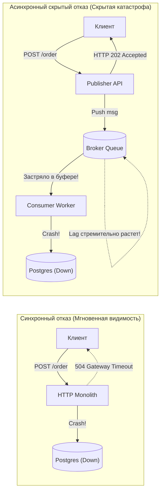
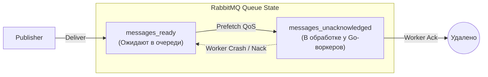
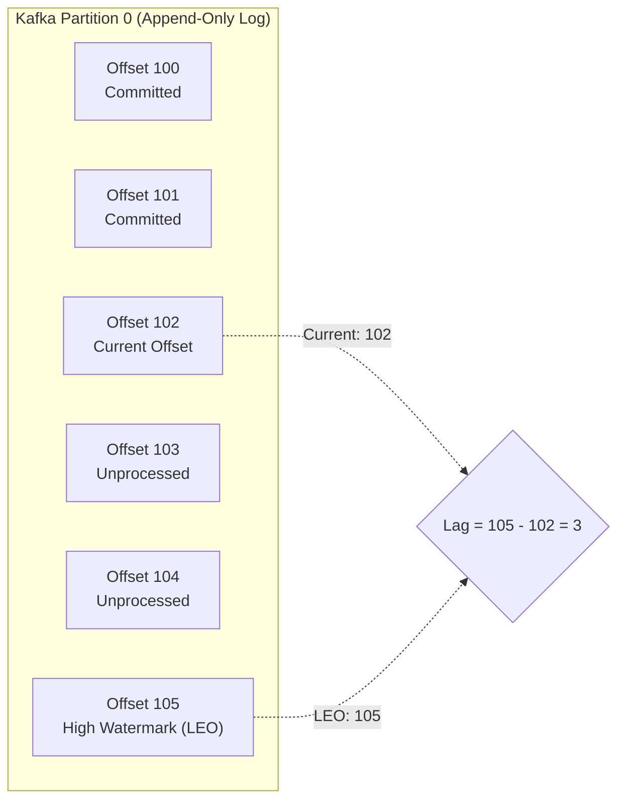
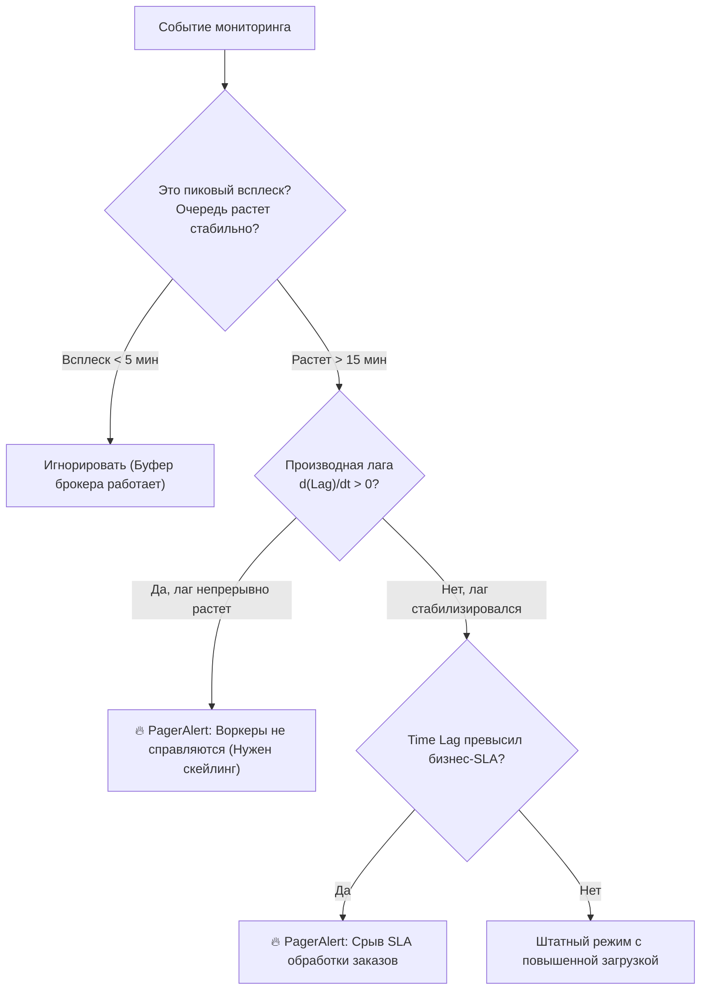

> [!NOTE]
> **Связи:** Эта статья завершает детальный разбор метрик надежности и опирается на материалы: [[1. Работа с очередями в Go]], [[3. Параллелизм обработки сообщений]], [[5. Batch processing сообщений]] и [[8. Observability очередей]]. Она подводит нас к финальному обобщению: [[10. Итоги раздела. Асинхронная архитектура]].

В предыдущих лекциях мы спроектировали отказоустойчивые консьюмеры, научились укрощать ядовитые сообщения, переживать ребалансировки и корректно изолировать сбои. Но в распределенных системах действует непреложный закон: **система, за которой вы не наблюдаете в реальном времени, уже сломана — просто вы пока не получили уведомление от разгневанного пользователя**.

Асинхронные архитектуры коварны тем, что они маскируют внутренние катастрофы. В традиционном синхронном HTTP-монолите отказ базы данных виден мгновенно: клиенты получают `504 Gateway Timeout`, графики ошибок заливаются красным, дежурный инженер получает пейджер-алерт.

В асинхронной системе с брокером сообщений база данных может лежать полчаса: HTTP API продолжает бодро отвечать клиентам `HTTP 202 Accepted`, продюсеры складывают сообщения в шину, а инфраструктура молча накапливает гигабайты технического долга в виде распухающих очередей.

Главные пульсометры здоровья распределенного асинхронного конвейера — это **Lag (Отставание)** и **Throughput (Пропускная способность)**. В этой лекции мы разберем их физическую природу, особенности в RabbitMQ и Kafka, ловушки подсчета и инженерные практики Prometheus-инструментации в Go.

---

## Лететь вслепую — плохая идея

Представьте приборную панель самолета в густом тумане. Синхронный HTTP — это полет по визуальным ориентирам: если перед вами гора (база данных не отвечает), вы сразу это видите. Асинхронный брокер — это полет исключительно по приборам. Если датчики высоты и скорости отключены, самолет летит в землю с прежней крейсерской скоростью.



Если консьюмеры не успевают разбирать поток, последствия развиваются по нарастающей:
1. **Исчерпание RAM брокера:** В RabbitMQ сообщения вытесняются из памяти на диск (Page out), вызывая резкое падение пропускной способности из-за дискового I/O.
2. **Переполнение диска:** В Kafka сегменты лога заполняют дисковый массив, брокер падает с `Disk Full` и останавливает кластер.
3. **Нарушение SLA бизнеса:** Клиенты оплатили заказ, но чек и активация подписки приходят через 4 часа вместо 2 секунд.

---

## Анатомия Lag (Отставания)

**Lag** — это объем работы, который уже отправлен продюсерами в систему, но еще не завершен консьюмерами.
Если Throughput — это скорость, с которой насос откачивает воду из трюма, то Lag — это текущий уровень воды в трюме корабля.

Однако то, *как именно* измеряется и вычисляется Lag, радикально зависит от архитектуры брокера.

---

### Smart Broker (RabbitMQ)

В брокере RabbitMQ концепция очереди реализована на уровне самого ядра (Erlang Actor Model). Брокер сам следит за каждым отдельным сообщением и выставляет наружу две ключевые метрики для каждой очереди:

1. `messages_ready`: количество сообщений, которые находятся в оперативной памяти или на диске и готовы к немедленной выдаче любому свободному консьюмеру. Это **чистый Lag очереди**.
2. `messages_unacknowledged`: сообщения, которые брокер уже передал консьюмерам по TCP, но консьюмеры еще не вернули `Ack` (или `Nack`).



> [!info] Под капотом: RabbitMQ Unacknowledged и голодание воркеров
> Всплеск метрики `messages_unacknowledged` при околонулевом значении `messages_ready` — классический симптом «паралича консьюмеров».
> 
> Это означает, что воркер-пул в Go (из лекции [[3. Параллелизм обработки сообщений]]) вычитал из сокета сообщения в пределах лимита `prefetch_count`, но все рабочие горутины зависли:
> - Исчерпался пул соединений с базой данных `database/sql` (`SetMaxOpenConns`).
> - Внешний платежный шлюз перестал отвечать, а контекст `ctx` был создан без таймаута (`context.Background()`).
> - Произошла взаимная блокировка (Deadlock) на общем мьютексе в Go.
> 
> Сообщения висят в состоянии `messages_unacknowledged`, новые сообщения не принимаются воркером из-за исчерпания prefetch, а брокер считает консьюмер живым, поскольку TCP-соединение не разорвано.

---

### Dumb Broker (Kafka)

В архитектуре Apache Kafka брокер глух и нем относительно состояния консьюмеров. У Kafka нет очередей; есть упорядоченный append-only лог на диске (партиция), а состояние консьюмера определяется единственным числом — смещением (**Offset**).

Для любой консьюмер-группы **Consumer Lag** в партиции вычисляется строго математически:

$$\text{Consumer Lag} = \text{High Watermark (LEO)} - \text{Committed Offset}$$

где:
- **Log End Offset (LEO / High Watermark):** Смещение последнего подтвержденного сообщения, записанного продюсерами в партицию.
- **Committed Offset:** Смещение последнего сообщения, успешно обработанного и зафиксированного группой консьюмеров в системном топике `__consumer_offsets`.



Если в топике 12 партиций, суммарный лаг консьюмер-группы равен сумме лагов по каждой из 12 партиций:

$$\text{Total Group Lag} = \sum_{p=0}^{N-1} \left(\text{HighWatermark}_p - \text{CurrentOffset}_p\right)$$

---

### Главная ловушка: Message Count vs Time Lag

> [!warning] Ловушка / Gotcha: Абсолютное количество vs Реальное время задержки
> Классическая ловушка начинающего SRE или бэкенд-инженера — настраивать критические алерты на статическое количество сообщений в очереди (например: `Alert if Lag > 1000 messages` или `RabbitMQ Queue Length > 5000`).
> 
> Почему такой алерт приводит либо к ложным тревогам, либо к пропуску аварий?
> 
> Сравним два сервиса в одной компании:
> 1. **Сервис Clickstream / Метрики:** Обрабатывает легковесные события кликов со скоростью **10 000 сообщений в секунду**. Для него лаг в 5 000 сообщений — это всего 500 миллисекунд работы воркеров. Очередь растает быстрее, чем инженер разблокирует экран ноутбука. Ставить здесь алерт на 5000 — бессмысленный шум.
> 2. **Сервис Генерации PDF / Видео-транскодинга:** Тяжелая операция, где один документ обрабатывается на CPU в течение **15 секунд**. Лаг в 5 000 сообщений означает, что пул из 10 воркеров будет разгребать завал:
>    $$\frac{5000 \times 15\,\text{сек}}{10\,\text{воркеров}} = 7500\,\text{сек} \approx 2\,\text{часа } 5\,\text{минут!}$$
>    Пользователь, нажавший кнопку генерации отчета прямо сейчас, получит результат через два часа. Бизнес парализован, хотя размер очереди формально тот же самый!
> 
> **Настоящая метрика, определяющая бизнес-SLA — это Time Lag (Consumer Lead Time / Queue Latency):**
> $$\text{Time Lag} = \text{Time}_{\text{consume}} - \text{timestamp}_{\text{produce}}$$
> Это реальное физическое время задержки между моментом, когда продюсер создал событие (записав в него `timestamp`), и моментом, когда консьюмер извлек его из брокера для обработки.

---

## Throughput (Пропускная способность)

**Throughput** характеризует производительность системы во времени. В асинхронных конвейерах его измеряют в двух плоскостях:

1. **MPS / RPS (Messages / Records Per Second):** Скорость в сообщениях в секунду. Критична для CPU и памяти: каждое сообщение требует десериализации JSON/Protobuf, аллокаций в куче Go и вызовов сборщика мусора GC.
2. **Bytes Per Second (Bandwidth / Throughput в МБ/с):** Скорость в байтах в секунду. Критична для дисков и сети: если сообщения весят по 2 МБ, вы упретесь в 1 Gbps канал сетевой карты (NIC) задолго до того, как утилизируете 20% CPU.

В стабильной распределенной системе в долгосрочной перспективе обязан соблюдаться фундаментальный баланс пропускной способности:

$$\mathbb{E}[\text{Consumer Throughput}] \ge \mathbb{E}[\text{Producer Throughput}]$$

Если продюсеры стабильно пишут 5 000 сообщений в секунду, а консьюмеры способны разбирать только 4 500, система накапливает 500 сообщений в секунду (30 000 в минуту, 1.8 миллиона в час). Рано или поздно наступит исчерпание ресурсов.

---

## Практика в Go: Prometheus Instrumentation

Чтобы не раздувать бизнес-код обработчиков служебной логикой снятия метрик, в Go применяется идиоматичный паттерн **Middleware / Decorator**. Для сбора метрик используется официальный пакет `prometheus/client_golang`.

Ниже представлен production-ready декоратор обработчика сообщений, фиксирующий Throughput, Latency выполнения и Time Lag сообщения из его заголовка:

```go
package consumer

import (
	"context"
	"errors"
	"time"

	"github.com/prometheus/client_golang/prometheus"
	"github.com/prometheus/client_golang/prometheus/promauto"
)

var (
	// messagesProcessed считает количество обработанных сообщений (Throughput)
	messagesProcessed = promauto.NewCounterVec(
		prometheus.CounterOpts{
			Name: "queue_messages_processed_total",
			Help: "Общее количество обработанных сообщений из очереди",
		},
		[]string{"topic", "status"}, // status: success, error_transient, error_fatal
	)

	// processingDuration измеряет время выполнения чистой логики обработчика
	processingDuration = promauto.NewHistogramVec(
		prometheus.HistogramOpts{
			Name:    "queue_message_processing_duration_seconds",
			Help:    "Длительность обработки сообщения консьюмером в секундах",
			Buckets: []float64{0.002, 0.005, 0.01, 0.025, 0.05, 0.1, 0.25, 0.5, 1.0, 2.5, 5.0},
		},
		[]string{"topic"},
	)

	// messageTimeLagSeconds измеряет задержку между отправкой сообщения продюсером и его чтением
	messageTimeLagSeconds = promauto.NewHistogramVec(
		prometheus.HistogramOpts{
			Name:    "queue_message_time_lag_seconds",
			Help:    "Время нахождения сообщения в очереди (Time Lag) в секундах",
			Buckets: []float64{0.01, 0.05, 0.1, 0.5, 1.0, 5.0, 15.0, 30.0, 60.0, 300.0, 900.0},
		},
		[]string{"topic"},
	)
)

// Message представляет абстрактное входящее сообщение с метаданными
type Message struct {
	Payload   []byte
	Timestamp time.Time // Время создания продюсером
}

type MessageHandler func(ctx context.Context, msg Message) error

// InstrumentHandler оборачивает доменный обработчик метриками Prometheus
func InstrumentHandler(topic string, next MessageHandler) MessageHandler {
	return func(ctx context.Context, msg Message) error {
		// 1. Фиксируем Time Lag (насколько сообщение устарело к моменту начала обработки)
		if !msg.Timestamp.IsZero() {
			timeLag := time.Since(msg.Timestamp).Seconds()
			if timeLag >= 0 {
				messageTimeLagSeconds.WithLabelValues(topic).Observe(timeLag)
			}
		}

		// 2. Замеряем чистую длительность работы воркера
		start := time.Now()
		err := next(ctx, msg)
		elapsed := time.Since(start).Seconds()
		processingDuration.WithLabelValues(topic).Observe(elapsed)

		// 3. Классифицируем результат для подсчета пропускной способности (Throughput)
		status := "success"
		if err != nil {
			var nonRetryable *NonRetryableError
			if errors.As(err, &nonRetryable) {
				status = "error_fatal"
			} else {
				status = "error_transient"
			}
		}

		messagesProcessed.WithLabelValues(topic, status).Inc()
		return err
	}
}

type NonRetryableError struct {
	Err error
}

func (e *NonRetryableError) Error() string {
	return e.Err.Error()
}
```

> [!tip] Собеседование: Диагностика падения Throughput
> **Вопрос:** Вы наблюдаете на дашборде Grafana, что метрика Throughput консьюмеров (`rate(queue_messages_processed_total[5m])`) внезапно упала ровно в 3 раза. При этом процент ошибок равен 0 (все уходят со `status="success"`), а Lag в Kafka равен нулю. Что произошло в архитектуре?
> 
> **Ответ:** С консьюмерами все в полном порядке. 
> Показатель `Lag = 0` свидетельствует о том, что консьюмеры мгновенно вычитывают все, что поступает в топик. Падение Throughput при нулевом лаге и отсутствии ошибок однозначно указывает на то, что **упала интенсивность входящего потока от продюсеров**.
> 
> Возможные причины:
> 1. Ночной спад пользовательского трафика (суточная сезонность).
> 2. Авария на стороне Ingress / API Gateway (отвалился балансировщик Nginx или Cloudflare, запросы не доходят до продюсеров).
> 3. Баг в коде продюсера (зависание фонового батчинга перед отправкой в брокер).
> 
> *Главный вывод:* В асинхронных системах метрики консьюмера невозможно интерпретировать изолированно — они всегда анализируются в связке **«Продюсер $\to$ Брокер $\to$ Консьюмер»**.

---

## Alerting: Что должно будить инженера ночью?

Грамотный алертинг строится по принципу минимального шума (Alert Fatigue Prevention). Если алерт сработал ночью, он обязан требовать немедленного инженерного вмешательства, а не констатировать факт временного скачка нагрузки.



### ❌ Плохие алерты (Антипаттерны)
- `RabbitMQ Queue Length > 5000`: Очереди создаются именно для того, чтобы сглаживать кратковременные всплески. Если за 10 секунд прилетело 6000 сообщений, а через минуту их разобрали — будить человека преступно.
- `Consumer CPU > 80%`: Высокая загрузка CPU при обработке данных — признак эффективного использования оплаченного кремния. Беспокоиться нужно, когда CPU загружен на 5%, а очередь при этом стоит.

### ✅ Хорошие алерты (Production Standard на PromQL)

1. **Time Lag превышает бизнес-SLA (Critical Pager):**
   ```promql
   # Срабатывает, если 95-й перцентиль времени ожидания в очереди превышает 5 минут
   histogram_quantile(0.95, sum(rate(queue_message_time_lag_seconds_bucket[5m])) by (le, topic)) > 300
   ```

2. **Положительная производная лага (Lag Derivative Alert):**
   Очередь не просто велика — она монотонно растет на протяжении 15 минут, а значит, система движется к исчерпанию дискового хранилища:
   ```promql
   # Скорость роста очереди в сообщениях за секунду (производная больше нуля 15 минут подряд)
   deriv(kafka_consumergroup_lag{topic="orders"}[15m]) > 0
     and
   kafka_consumergroup_lag{topic="orders"} > 1000
   ```

3. **Всплеск процента транзиентных ошибок (Error Budget Alert):**
   ```promql
   # Доля ошибок превышает 5% от общего объема обработки
   sum(rate(queue_messages_processed_total{status=~"error_.*"}[5m]))
     /
   sum(rate(queue_messages_processed_total[5m])) > 0.05
   ```

---

## Mechanical Sympathy: Оптимизация Throughput

Если вы зафиксировали на графиках, что консьюмер уперся в потолок по Throughput (лаг растет, скорость вычитки застыла на 200 сообщений/сек), а системный мониторинг показывает, что CPU загружен на 15%, а сетевой интерфейс пустует — узкое место кроется в **системных блокировках и дисковом I/O базы данных**.

Классическая ошибка — выполнять отдельный сетевой запрос в PostgreSQL на каждый входящий пакет:
```sql
-- Худший враг Throughput: 1000 сообщений = 1000 сетевых RTT и 1000 fsync на диске СУБД
UPDATE user_balances SET balance = balance - 10 WHERE user_id = $1;
```

Каждый сетевой RTT занимает от 0.5 до 2 миллисекунд. В один поток консьюмер физически не сможет выполнить больше $\frac{1000\,\text{мс}}{1\,\text{мс}} = 1000$ операций в секунду.

Для преодоления барьера I/O применяются две техники:
1. **Параллелизм горутин (Воркер-пул):** Разнесение независимых партиций по параллельным нитям (лекция [[3. Параллелизм обработки сообщений]]).
2. **Батчинг (Групповая обработка):** Накопление пачки сообщений и отправка одного пакетного запроса на запись через `UNNEST` или `COPY` (подробно разобранный в лекции [[5. Batch processing сообщений]]). Это поднимает Throughput с 500 до 50 000 сообщений в секунду на том же самом железе за счет амортизации накладных расходов планировщика и дискового контроллера.

---

## Итог раздела

Эта лекция подводит логическую черту под практическим циклом разработки асинхронных консьюмеров. Мы прошли фундаментальный путь:
1. Разобрали базовые паттерны работы с очередями в Go ([[1. Работа с очередями в Go]]).
2. Реализовали безупречный Graceful Shutdown с сохранением данных ([[2. Консьюмеры и graceful shutdown]]).
3. Масштабировали производительность через параллельные пулы горутин ([[3. Параллелизм обработки сообщений]]).
4. Гарантировали математическую корректность с помощью идемпотентных хэндлеров ([[4. Idempotent handlers]]).
5. Ускорили пропускную способность в десятки раз благодаря батчингу ([[5. Batch processing сообщений]]).
6. Защитили рантайм от отравления ядовитыми пакетами ([[6. Handling poison messages]]).
7. Покрыли код пирамидой unit-, fuzz- и интеграционных тестов с Docker ([[7. Тестирование async систем]]).
8. Сделали архитектуру прозрачной через OTel Tracing и `log/slog` ([[8. Observability очередей]]).
9. Научились мониторить Throughput, Lag и Time Lag с помощью Prometheus.

Теперь у вас есть полный арсенал инструментов для создания отказоустойчивых распределенных бэкендов мирового уровня.

В финальной статье раздела — [[10. Итоги раздела. Асинхронная архитектура]] — мы сведем воедино все архитектурные паттерны, зафиксируем ключевые законы распределенных систем и подготовимся к покорению новых инженерных вершин.