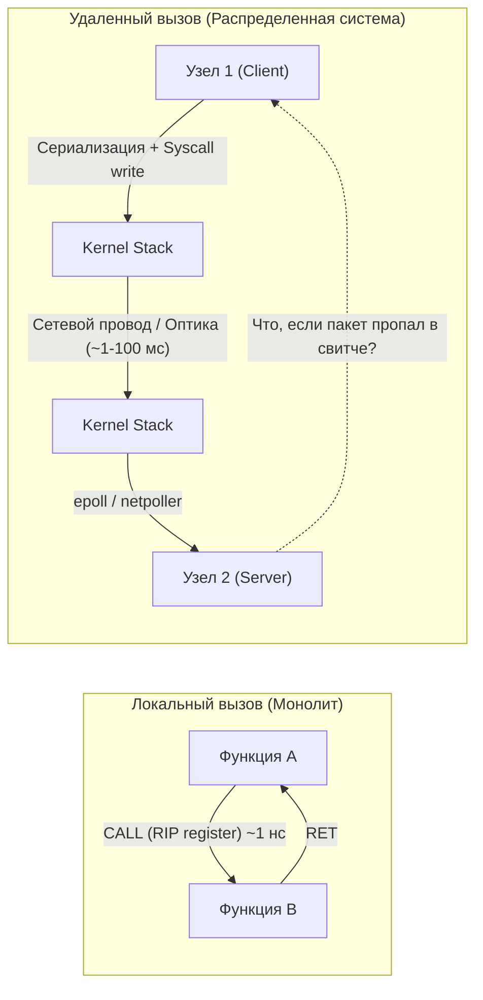
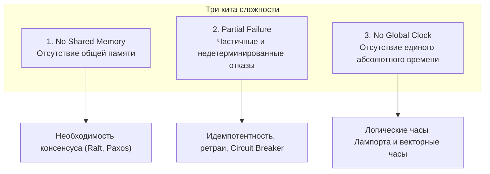
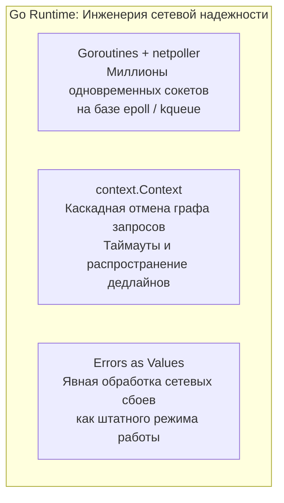

> [!NOTE]
> **Связи:** Эта статья открывает фундаментальный 14-й раздел нашей энциклопедии, посвященный проектированию распределенных систем на Go. Она логически продолжает материалы об асинхронности и брокерах из раздела 13 и закладывает основу для всего подраздела: [[2. Проблемы распределенных систем]], [[3. Latency и network fallacies]], [[4. Partial failure]], [[5. Time и clock drift]], [[6. Consistency vs availability]], [[7. CAP теорема на практике]] и [[8. PACELC]].

Вы научились выжимать абсолютный максимум из одного физического сервера. Вы понимаете, как устроен трехцветный сборщик мусора Go, как минимизировать аллокации в куче с помощью Escape Analysis, почему `sync.Mutex` переходит в режим starvation и как выравнивать структуры в памяти, чтобы избежать False Sharing в кэш-линиях процессора. На одной машине ваш сервис работает как швейцарские часы.

Но бизнес неизбежно растет. Трафик удваивается каждые полгода, объемы данных измеряются терабайтами, а требования SLA по доступности не терпят даже минутной перезагрузки сервера на плановое обновление ядра. Рано или поздно вы упираетесь в непреодолимый физический потолок: предел пропускной способности шины PCIe, максимальный объем оперативной памяти на материнской плате или предел теплопакета многоядерного процессора.

Единственный путь продолжения роста — **горизонтальное масштабирование (Scale-Out)**: запустить сервис на десятках, сотнях и тысячах независимых серверов, объединенных локальной или глобальной сетью.

Добро пожаловать в мир распределенных систем. Здесь привычные правила ньютоновской физики однопроцессорного компьютера перестают действовать, а интуиция, наработанная на локальном коде, становится злейшим врагом инженера.

---

## Иллюзия локального вызова

Фундаментальная ошибка, с которой начинается череда ночных аварий при переходе к микросервисной архитектуре — это подсознательная попытка воспринимать удаленный сетевой вызов (RPC/REST/gRPC) точно так же, как обычный вызов функции в памяти.

В монолите, когда функция `A` вызывает функцию `B`, физика процесса абсолютно прозрачна и детерминирована:
1. Процессор помещает аргументы в регистры или в стек вызова текущего потока.
2. Машинная инструкция `CALL` атомарно сохраняет адрес возврата и меняет указатель инструкций `RIP` (Instruction Pointer), передавая управление по адресу функции `B`.
3. Функция выполняется в наносекундном масштабе. Если случается неустранимая ошибка (например, паника или `SIGSEGV`), операционная система завершает весь процесс целиком (Fail-Stop).

Состояние локальной системы бинарно: **она либо работает целиком, либо не работает вовсе**.



В коде на Go эти два действия могут выглядеть обманчиво похоже:

```go
// Локальный вызов в памяти: детерминирован, дешев, атомарен
res := Calculate(x)

// Распределенный сетевой вызов: стохастичен, дорог, может зависнуть навсегда
res, err := client.Calculate(ctx, x)
```

Но за этой скромной сигнатурой `res, err := client.Calculate(ctx, x)` скрывается настоящая бездна физической и алгоритмической сложности.

> [!info] Под капотом: Физика сетевого вызова
> Когда горутина вызывает метод `client.Calculate()`, процессор больше не может просто изменить регистр `RIP`. Вместо этого запускается многоуровневый каскад преобразований материи:
> 1. **Сериализация:** Структура данных Go (уже лежащая в ультрабыстрых кэшах L1/L2 процессора) должна быть сериализована в байтовый срез (Protobuf, JSON). Это требует аллокаций в куче, работы сборщика мусора и сотен тактов CPU.
> 2. **Системный вызов (Syscall):** Go-рантайм инициирует системный вызов `write` в файловый дескриптор сокета. Происходит дорогостоящий переход из User Space в Kernel Space с инвалидацией предсказателя ветвлений.
> 3. **Сетевой стек ядра Linux:** Ядро оборачивает буфер в структуры `sk_buff`, добавляет заголовки TCP (расчет контрольной суммы, учет окна перегрузки Congestion Window), инкапсулирует в IP-пакет и формирует Ethernet-кадр.
> 4. **Кольцевой буфер и DMA:** Сетевой драйвер помещает дескриптор в TX Ring Buffer сетевой карты (NIC). Контроллер сетевой карты через Direct Memory Access (DMA) вычитывает байты из оперативной памяти напрямую по шине PCIe.
> 5. **Физическая среда:** Фотоны света в оптоволокне или электроны в медной витой паре летят через десятки промежуточных коммутаторов, стоечных роутеров и магистральных каналов провайдеров.
> 6. **Обратный путь:** На целевом сервере сетевая карта генерирует аппаратное прерывание (IRQ), ядро обрабатывает пакет в softirq, драйвер помещает данные в буфер сокета, `netpoller` будит заблокированную горутину через `epoll`, и начинается десериализация.

Разница во времени между переходом по указателю и сетевым вызовом составляет **миллионы раз**:
- Локальное чтение из L1-кэша CPU: $\approx 1$ наносекунда.
- Сетевой пакет внутри одной стойки дата-центра: $\approx 0.5$ миллисекунды ($500\,000$ наносекунд).
- Пакет между дата-центрами через океан (Франкфурт — Нью-Йорк): $\approx 80$ миллисекунд ($80\,000\,000$ наносекунд).

Если приравнять 1 такт процессора (0.3 нс) к 1 секунде человеческой жизни, то вызов функции в памяти займет 3 секунды, а сетевой запрос в соседний дата-центр — **около 8 лет**.

---

## Три кита сложности распределенных систем

Покидая уютный мир `localhost`, мы безвозвратно теряем три фундаментальные гарантии, на которых зиждется классическое программирование.



### 1. Отсутствие общего состояния (No Shared Memory)

На одном компьютере все ядра процессора и все горутины видят единое адресное пространство оперативной памяти. Аппаратный протокол когерентности кэшей (MESI/MOESI) на уровне шины CPU гарантирует, что если одно ядро изменило байт в памяти, другие ядра увидят актуальное значение. Вы можете защитить переменную мьютексом `sync.Mutex` или применить неделимую атомарную инструкцию `atomic.AddInt64`.

В распределенной системе физической общей памяти не существует. У каждого сервера — свой изолированный процессор и своя оперативная память.

Единственный способ согласовать общее состояние между двумя узлами — передать сообщение по ненадежной сети. Если сервер А говорит серверу Б: *«Я установил баланс пользователя в 100 рублей»*, сообщение может задержаться, потеряться или продублироваться. Возникает проблема распределенного консенсуса, которая требует сложных математических протоколов вроде Raft и Paxos.

---

### 2. Частичный отказ (Partial Failure)

В локальной программе мир черно-белый: если сервер сгорел или память повреждена, процесс падает целиком (Fail-Stop). Но распределенная система состоит из сотен компонентов:
- Сервер А работает безупречно.
- Сервер Б завис в долгой паузе сборки мусора (Stop-The-World GC) на 5 секунд.
- Сетевой свитч между ними перегрелся и теряет 30% входящих пакетов.
- Дисковый массив на сервере В начал медленно деградировать, увеличивая время fsync с 1 мс до 4 секунд.

Система не мертва и не жива — она находится в состоянии **частичного отказа (Partial Failure)**.

> [!warning] Ловушка / Gotcha: Проблема двух генералов и три исхода сетевого вызова
> Представьте, что ваш сервис делает сетевой вызов к платежному шлюзу для списания денег:
> ```go
> err := paymentClient.Charge(ctx, orderID, amount)
> ```
> И внезапно сетевой вызов завершается с ошибкой: `context deadline exceeded (Timeout)`.
> 
> Что произошло на самом деле? В распределенной системе любой вызов имеет не два исхода (Success / Error), а **три**:
> 1. **Запрос не дошел до сервера:** Сетевой кабель оборвался до того, как пакет покинул дата-центр. Деньги не списаны. (Нужно повторить запрос).
> 2. **Запрос дошел, выполнился, но потерялся ответ:** Сервер успешно списал деньги, но на обратном пути отвалился роутер. Если вы наивно повторите вызов, вы спишете деньги с клиента второй раз!
> 3. **Запрос встал в очередь на сервере:** Сервер перегружен и обработает этот платеж через 20 секунд после того, как клиент уже сдался по таймауту.
> 
> Клиент **принципиально не способен** различить эти три ситуации, находясь на своем конце провода. Единственное спасение — проектировать все операции идемпотентными (Idempotent APIs).

---

### 3. Отсутствие единого времени (No Global Clock)

В монолите системные часы компьютера служат надежным арбитром: если событие `A` произошло с таймстемпом `T1`, а событие `B` — с таймстемпом `T2`, и `T1 < T2`, то событие `A` гарантированно предшествовало событию `B`.

В распределенной системе кварцевые резонаторы на материнских платах разных серверов тикают с разной частотой из-за перепадов температуры и физического старения кремния. Это явление называется **дрейфом часов (Clock Drift)**.

Даже протокол NTP (Network Time Protocol) не способен устранить рассинхронизацию полностью: в реальных облачных дата-центрах погрешность между серверами постоянно плавает в диапазоне от 1 до 50 миллисекунд.

Если клиент отправляет запрос «Удалить файл» на сервер 1 в 12:00:00.005, а через секунду отправляет запрос «Обновить файл» на сервер 2, часы сервера 2 могут отставать на 20 мс и зафиксировать время 11:59:59.990. При наивной сортировке по времени база данных решит, что удаление произошло *после* обновления, и сотрет свежие данные!

Полагаться на астрономическое физическое время для упорядочивания распределенных транзакций смертельно опасно. Именно поэтому распределенные алгоритмы опираются на **логическое время (Logical Clocks)**: часы Лампорта (Lamport Timestamps) и векторные часы (Vector Clocks).

---

## Почему Go — язык для распределенных систем?

Не случайно подавляющее большинство критической инфраструктуры современного облачного мира написано на Go: Kubernetes, Docker, etcd, Terraform, Consul, CockroachDB, Prometheus, Vitess, Grafana Mimir.

Go создавался в Google (Роб Пайк, Кен Томпсон, Роберт Гризмер) как прямой ответ на вызовы построения крупномасштабных распределенных сетевых сервисов. Язык несет в своем ДНК механизмы, идеально приспособленные для борьбы с хаосом сети.



1. **Модель сетевого ввода-вывода (Goroutines + netpoller):**
   В классических языках (C++ до появления корутин, Java эпохи тредов) каждый сетевой клиент требовал отдельного системного потока ОС. Поток ОС аллоцирует от 1 до 8 МБ стека, а переключение контекста в ядре сжигает тысячи тактов процессора. Сервер упирался в потолок при 10 000 соединений (проблема C10K).
   
   В Go горутина весит всего $\approx 2$ КБ. Когда горутина вызывает `conn.Read()`, рантайм делает неблокирующий системный вызов. Если в сокете нет данных, рантайт переводит горутину в состояние ожидания и отвязывает ее от потока ОС `M`. Фоновый поток `netpoller` ядра Go отслеживает готовность файловых дескрипторов через системный селектор ядра (`epoll` в Linux, `kqueue` в macOS, `IOCP` в Windows). Когда байты прибывают в сетевой буфер, `netpoller` моментально возвращает горутину в очередь исполнения любого свободного процессора `P`. Один узел на Go может легко удерживать миллион открытых сетевых соединений.

2. **Стандартный пакет `context.Context`:**
   В распределенной системе пользовательский клик порождает дерево из десятков RPC-запросов к зависимым сервисам. Если пользователь закрыл вкладку браузера, продолжать вычисления — преступная трата ресурсов. Пакет `context` встроен в самое сердце стандартной библиотеки Go: он обеспечивает древовидное распространение сигналов отмены (`ctx.Done()`) и жестких дедлайнов по всей цепочке микросервисов.

3. **Ошибки как значения (Errors as Values):**
   В распределенной среде сетевой сбой, таймаут, отказ кворума или разрыв TCP-сессии — это не экстраординарные аварии (Exceptions), а абсолютно нормальные, ежесекундные события. Концепция `error` как полноправного значения первого класса заставляет Go-разработчика явно обдумывать и обрабатывать каждую потенциальную точку отказа.

---

> [!tip] Собеседование: Надежность TCP vs Надежность RPC
> **Вопрос:** Протокол TCP гарантирует надежную доставку данных без потерь и дубликатов. Зачем нам городить сложные механизмы подтверждений (Application-level ACKs) и ретраев на уровне RPC-клиентов и брокеров?
> 
> **Ответ:** TCP гарантирует доставку потока байт **только между сетевыми стеками ядер двух операционных систем**.
> Он ничего не знает о том, что происходит с приложением выше сокета:
> 1. Ядро ОС на сервере может успешно принять TCP-пакет, записать его в сокетный буфер и отправить TCP ACK клиенту.
> 2. Через 50 микросекунд (до того, как приложение успело вычитать данные из сокета через `conn.Read()`) сервер теряет питание или процесс убивает Linux OOM Killer.
> 3. Клиент убежден, что сообщение доставлено (ведь на уровне TCP пришел ACK), однако для бизнеса данные бесследно утеряны.
> 
> Гарантия доставки в распределенных системах может быть подтверждена только на уровне прикладного протокола: сервер обязан вычитать сообщение, применить бизнес-логику, записать результат в энергонезависимое хранилище (`fsync`) и лишь затем отправить прикладной ответ (RPC Response / Application ACK).

---

## Что нас ждет дальше?

Архитектура распределенных систем — это высшая математика компромиссов. Мы осознанно отказываемся от кристальной простоты монолита и строгих ACID-транзакций локальных реляционных баз данных ради глобальной доступности, неограниченного масштабирования и живучести системы при физическом уничтожении целых дата-центров.

В этом разделе мы пройдем тернистый путь от теоретических основ и сетевых иллюзий до боевой реализации консенсуса, распределенных транзакций, Service Mesh и паттернов устойчивости на Go.

В следующей лекции мы снимем розовые очки и препарируем фундаментальные пороки распределенного мира: [[2. Проблемы распределенных систем]].