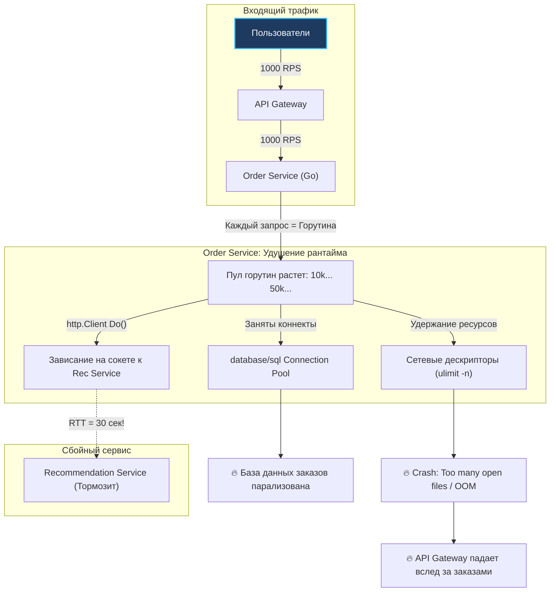
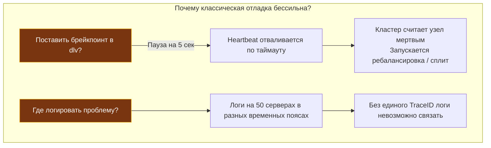
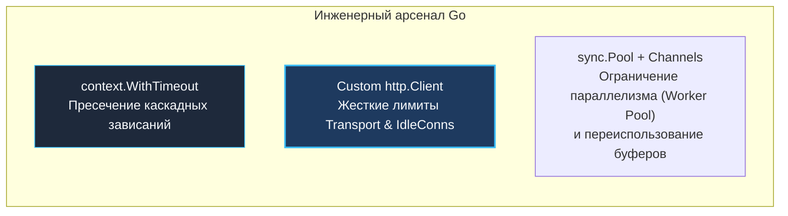

> [!NOTE]
> **Связи:** Эта статья продолжает вводный блок и опирается на принципы из [[1. Обзор раздела. Почему распределенные системы сложны]]. Мы систематизируем ключевые болезни микросервисной архитектуры и готовимся к детальному разбору заблуждений о сети в [[3. Latency и network fallacies]], а также анализу частичных отказов в [[4. Partial failure]].

В прошлой лекции мы выяснили, что сетевой вызов — это не просто медленный переход по указателю, а стохастическая физическая операция передачи квантов электромагнитного поля по проводам. Сеть капризна, задержки непредсказуемы, а удаленный узел в любой момент может оказаться мертвым или заблокированным.

Теперь посмотрим правде в глаза: что происходит с архитектурой программного обеспечения, когда мы бережно распиливаем уютный монолит на десятки микросервисов?

На бумаге и на слайдах архитекторов все выглядит заманчиво: независимые релизы, гибкий стек, изоляция доменов. Но в реальности инженер сталкивается с букетом системных патологий: каскадными авариями, потерей ACID-транзакционности, призрачными багами, которые воспроизводятся только при 10 000 RPS, и феноменом расщепления сознания кластера (`Split-Brain`).

Разберем четыре главные архитектурные проблемы распределенных систем и научимся противостоять им средствами Go.

---

## 1. Отсутствие глобального состояния и транзакционности

В монолите разработчик избалован роскошью реляционной базы данных. Если нужно списать баланс клиента за покупку смартфона и одновременно уменьшить остаток товара на складе, мы открываем локальную транзакцию:

```sql
BEGIN TRANSACTION;
UPDATE accounts SET balance = balance - 50000 WHERE user_id = 42;
UPDATE inventory SET count = count - 1 WHERE item_id = 101;
COMMIT;
```

Благодаря гарантиям ACID реляционная база данных дает математическую клятву: либо выполнятся обе операции, либо ни одна. Если посреди транзакции вырубится электричество, журнал упреждающей записи WAL (Write-Ahead Log) при перезапуске откатит незавершенные изменения.

В распределенной микросервисной архитектуре складской учет находится в `Order Service` (PostgreSQL), а балансы пользователей — в `Billing Service` (микросервис с Redis или шардированным хранилищем).


**Проблема:** Межсервисные транзакции (BEGIN ... COMMIT) не пересекают границы сокетов и физических машин. Что делать, если заказ в `Order Service` успешно создан, но сетевой вызов к `Billing Service` оборвался по таймауту? 
- Если ничего не делать, склад зарезервирует товар бесплатно.
- Если попытаться откатить заказ локально, мы рискуем: вдруг деньги в биллинге на самом деле успешно списались, а потерялся лишь ответный пакет?

> [!info] Под капотом: Двухфазный коммит и его смерть
> В 1980-х годах эту проблему пытались решать протоколом **двухфазного коммита (2PC — Two-Phase Commit)**. В системе выделялся специальный Координатор Транзакций.
> 1. **Фаза Prepare:** Координатор спрашивает все БД: «Вы готовы закоммитить?». Базы данных блокируют нужные строки (`SELECT ... FOR UPDATE`) и отвечают «Ready».
> 2. **Фаза Commit:** Если все ответили положительно, координатор отправляет команду «Commit».
> 
> На бумаге это работало. В реальности 2PC в высоконагруженных веб-системах умер. Почему?
> Потому что базы данных удерживают **эксклюзивные блокировки строк в оперативной памяти** на все время сетевого раундтрипа координатора! Если координатор упал или между узлами возникла сетевая задержка в 500 мс, все соседние транзакции встают в глухую очередь ожидания блокировок. Пропускная способность СУБД падает до нуля.
> 
> В современном Go-бэкенде вместо 2PC стандартом стали распределенные саги (`Saga`) с компенсирующими транзакциями и парадигма **согласованности в конечном счете (`Eventual Consistency`)**, разобранные в нашем практическом курсе.

---

## 2. Каскадные отказы и исчерпание ресурсов

В монолите ошибка обычно изолирована: если модуль формирования PDF упал с паникой, HTTP-сервер перехватит ее и вернет ошибку `500 Internal Server Error`, а соседние запросы на оформление заказа продолжат выполняться.

В распределенной системе отказ второстепенного, незначительного компонента способен по принципу домино уничтожить весь продуктовый кластер. Это явление называется **каскадным отказом (Cascading Failure)**.

Рассмотрим хрестоматийный сценарий в интернет-магазине:
`API Gateway` $\to$ `Order Service` $\to$ `Recommendation Service`.

Сервис рекомендаций `Recommendation Service` — абсолютно некритичный компонент: если виджет «С этим товаром также покупают» не отобразится на экране, клиент все равно сможет оформить покупку.

Внезапно `Recommendation Service` деградирует: например, сборщик мусора встал в долгую паузу, или база данных рекомендаций уперлась в лимит соединений. Вместо привычных 20 мс сервис начинает отвечать за **30 секунд** (по таймауту сокета).

Что происходит внутри рантайма Go в основном сервисе заказов `Order Service`?



> [!warning] Ловушка / Gotcha: Смертельный дефолтный HTTP-клиент
> Самый распространенный грех начинающих Go-разработчиков — использование стандартного клиента `http.DefaultClient` или функций-оберток `http.Get()`, `http.Post()`:
> 
> ```go
> // КАТАСТРОФА: Запрос зависнет навсегда при сбое сети!
> resp, err := http.Get("http://recommendation-service/api/v1/items")
> ```
> Заглянем в исходники стандартной библиотеки Go (`src/net/http/client.go`):
> ```go
> var DefaultClient = &Client{} // Timeout равен ровно 0 (БЕСКОНЕЧНОСТЬ!)
> ```
> Значение `Timeout: 0` означает, что горутина будет спать в `netpoll`, бесконечно ожидая данных из TCP-сокета. Если удаленный сервер молчит, горутина останется в памяти навсегда.

### Механика катастрофы: как исчерпываются ресурсы ОС

1. Входящий поток заказов стабилен: $1000\text{ RPS}$.
2. За 30 секунд зависания внешнего сервиса `Order Service` создает:
   $$1000\text{ запросов/сек} \times 30\text{ сек} = 30\,000\text{ активных горутин!}$$
3. Сама горутина в Go легковесна ($\approx 2$ КБ), 30 000 горутин займут всего 60 МБ оперативной памяти. Казалось бы, ерунда?
4. **Но каждая зависшая горутина удерживает:**
   - **Файловый дескриптор сокета:** 30 000 открытых TCP-сокетов. Процесс мгновенно упирается в системный лимит ядра операционной системы `ulimit -n` (обычно 1024 по умолчанию или 65535 в контейнере) и падает с системной ошибкой: `accept: too many open files`.
   - **Пул соединений с БД (`database/sql`):** Если транзакция в PostgreSQL была открыта *до* вызова рекомендаций, все 50–100 коннектов пула базы данных оказываются заблокированными зависшими горутинами. Новые заказы не могут даже прочитать данные из локальной БД.
   - **Нагрузка на кучу и память:** Зависшие буферы запросов и ответов удерживаются в куче, не давая Garbage Collector освободить страницы памяти.
5. Сервис `Order Service` погибает под грузом заблокированных дескрипторов. 
6. `API Gateway` больше не может достучаться до `Order Service`, его собственные горутины начинают забивать сокеты — и шторм каскадного отказа валит всю инфраструктуру компании.

---

## 3. Недетерминированность и сложность отладки

В локальном приложении программист находится в детерминированном раю:
- Код компилируется в один бинарник.
- Баг можно воспроизвести локально, запустив отладчик Delve (`dlv`).
- Можно поставить контрольную точку (Breakpoint), заморозить выполнение и исследовать значения регистров процессора и переменных на стеке.

В распределенной системе баг — это часто **эмерджентное свойство (Emergent Property)**. Он не содержится в конкретной строчке кода сервиса А или сервиса Б. Он рождается на стыке сложного стохастического взаимодействия пяти сервисов, рассинхронизации их внутренних очередей, алгоритмов планировщика Go и всплесков сетевой задержки.



Почему традиционные подходы к отладке терпят фиаско:
1. **Невозможность паузы:** Если вы остановите горутину через `dlv` на 3 секунды, фоновый пинг брокера (Kafka heartbeat или Consul healthcheck) сочтет сервис погибшим. Кластер исключит узел из балансировки, разорвет тысячи TCP-сессий, и вы будете отлаживать уже последствия паники кластера, а не исходный дефект.
2. **Нелинейность времени:** Пакет Б может обогнать пакет А в сетевых маршрутизаторах, нарушив предполагаемую очередность обработки бизнес-событий.
3. **Разорванный контекст:** Без автоматического проброса сквозного мета-идентификатора `TraceID` (Correlation ID) через заголовки HTTP/gRPC и `context.Context` расследование ночной аварии превращается в хаотичный поиск по терабайтам разрозненных файлов логов.

---

## 4. Проблема «Глухого телефона» (Отсутствие единого источника истины)

Каждый распределенный узел изолирован в собственной виртуальной машине или контейнере. Он судит о состоянии внешнего мира исключительно по тем скудным пакетам данных, которые долетают до него через сетевой интерфейс.

Если пакеты перестали приходить, узел не способен понять:
- Соседний сервер действительно сгорел?
- Или соседний сервер абсолютно здоров и обрабатывает запросы, но между ними перегрелся коммутатор в стойке?

Эта неопределенность порождает один из самых страшных кошмаров распределенных архитекторов — **Split-Brain (Расщепление сознания)**.

> [!tip] Собеседование: Что такое Split-Brain и как защитить кластер?
> **Вопрос:** Что такое Split-Brain («расщепление сознания» кластера) и к каким катастрофическим последствиям оно приводит?
> 
> **Ответ:** Представьте кластер базы данных из двух узлов (Node 1 и Node 2), работающих в схеме Primary-Secondary. Сервер 1 принимает записи клиентов и реплицирует их на Сервер 2.
> Внезапно магистральный сетевой кабель между серверами перерубает экскаватор (Network Partition).
> - Сервер 1 не видит Сервер 2, но доступен для клиентов зоны А. Он продолжает принимать записи.
> - Сервер 2 теряет связь с Сервером 1, решает, что лидер погиб, и автоматически назначает самого себя новым Primary (Лидером) для клиентов зоны Б.
> 
> В системе образуются **два независимых лидера**, каждый из которых считает себя единственным законным хозяином данных. Пользователи параллельно списывают одни и те же деньги, меняют один и тот же статус заказа в противоположные значения.
> 
> Когда через 2 часа кабель срастят, кластер обнаружит две совершенно разные, конфликтующие истории вселенной, которые математически невозможно объединить без ручного вмешательства и финансовых потерь бизнеса.
> 
> **Защита:** Split-Brain предотвращается требованием **строгого большинства (Кворума)**:
> $$\text{Quorum} = \left\lfloor \frac{N}{2} \right\rfloor + 1$$
> Кластер из нечетного числа узлов (минимум 3 или 5) может выбрать лидера только в той половине, которая содержит большинство живых узлов. Меньшинство узлов обязано заблокировать операции записи.

В микросервисной практике на Go проблема «глухого телефона» регулярно проявляется при наивной реализации локальных кэшей в памяти (`in-memory cache` на базе `sync.Map`). Если сервис каталога запущен в 10 подах Kubernetes, и товар изменил цену, обновление кэша в одном поде оставит 9 остальных со старыми ценами. Разные пользователи, балансируемые случайным образом, будут видеть разные ценники на одной и той же секунде.

---

> [!info] Под капотом: Механическое сочувствие к сетевому стеку Linux — агония TIME_WAIT
> Почему частые исходящие HTTP-соединения убивают производительность бэкенда?
> 
> Если вы создаете новый HTTP-клиент на каждый запрос (вместо переиспользования единого `http.Client` с пулом соединений через `sync.Pool` или глобальный синглтон), процесс закрывает TCP-соединение первым.
> 
> Согласно спецификации TCP (RFC 793), сторона, инициировавшая закрытие сокета, обязана перевести его в состояние `TIME_WAIT` на время $2 \times \text{MSL}$ (Maximum Segment Lifetime, в Linux по умолчанию — 60 секунд). Это необходимо, чтобы блуждающие в сети старые пакеты не повредили новое соединение с тем же кортежем адресов:
> `(Source IP, Source Port, Dest IP, Dest Port)`.
> 
> Диапазон эфемерных портов Linux по умолчанию ограничен:
> `/proc/sys/net/ipv4/ip_local_port_range` (около 28 000 портов).
> 
> Если ваш сервис делает всего 500 запросов в секунду к соседнему микросервису без Keep-Alive, за 60 секунд в системе накопится:
> $$500 \times 60 = 30\,000\text{ сокетов в статусе TIME_WAIT!}$$
> 
> Эфемерные порты полностью исчерпываются. Рантайм Go падает с системной ошибкой ядра Linux:
> `dial tcp: cannot assign requested address`. Сервер физически не может связаться ни с одной внешней системой, хотя CPU загружен на 1%!

---

## Идиоматичный Go против хаоса

Язык Go создавался людьми, которые проектировали крупнейшие распределенные кластеры на планете. В стандартную библиотеку заложены проверенные архитектурные паттерны противодействия хаосу:



### 1. Жесткая настройка HTTP-клиента
Никогда не используйте дефолтный транспорт. Задавайте все уровни таймаутов явно:

```go
package client

import (
	"net"
	"net/http"
	"time"
)

func NewResilientHTTPClient() *http.Client {
	return &http.Client{
		Timeout: 5 * time.Second, // Общий таймаут от начала запроса до вычитки тела
		Transport: &http.Transport{
			Proxy: http.ProxyFromEnvironment,
			DialContext: (&net.Dialer{
				Timeout:   1 * time.Second, // Таймаут установки TCP-соединения
				KeepAlive: 30 * time.Second,
			}).DialContext,
			MaxIdleConns:        100,              // Пул готовых соединений
			MaxIdleConnsPerHost: 20,               // Коннекты к одному хосту
			IdleConnTimeout:     90 * time.Second, // Время жизни простаивающего сокета
			TLSHandshakeTimeout: 1 * time.Second,  // Таймаут TLS-рукопожатия
		},
	}
}
```

### 2. Тотальное распространение `context.Context`
Контекст с дедлайном — главный щит против утечек горутин и каскадных аварий:

```go
func FetchData(ctx context.Context, client *http.Client, url string) ([]byte, error) {
	// Ограничиваем операцию 800 миллисекундами
	reqCtx, cancel := context.WithTimeout(ctx, 800*time.Millisecond)
	defer cancel()

	req, err := http.NewRequestWithContext(reqCtx, http.MethodGet, url, nil)
	if err != nil {
		return nil, err
	}

	resp, err := client.Do(req)
	if err != nil {
		// Если время вышло, netpoll прервет сокет, не давая зависнуть горутине
		return nil, err
	}
	defer resp.Body.Close()

	return io.ReadAll(resp.Body)
}
```

---

## Итог

Переход к распределенным системам требует фундаментальной ломки психологического майндсета инженера:
1. **Отказ от парадигмы успеха:** Мы больше не пишем код в предположении «сетевой вызов выполнится штатно». Мы проектируем архитектуру вокруг стратегий локализации сбоев: таймаутов, автоматических выключателей (Circuit Breaker), очередей повторов (Retry) и деградации функционала (Graceful Degradation).
2. **Размазанное состояние:** Не существует единого глобального времени и мгновенных транзакций. Мир живет по законам согласованности в конечном счете.
3. **Ресурсы конечны:** Зависший удаленный сервис мгновенно высасывает сокетные дескрипторы и память вызывающего сервиса. Изолируйте вызовы через явные таймауты и ограниченные пулы соединений.

Корни всех этих проблем кроются в фундаментальных законах физики и иллюзиях, которыми люди наделяют компьютерные сети. В следующей лекции мы детально разберем знаменитые заблуждения распределенных вычислений: [[3. Latency и network fallacies]].