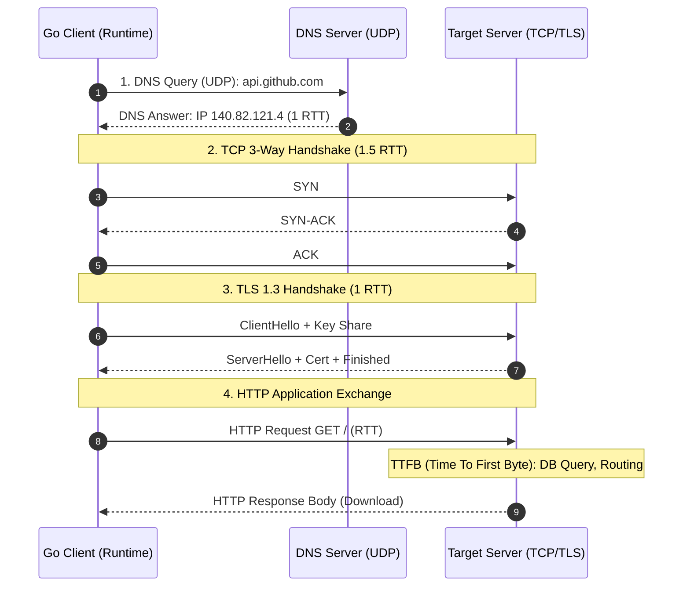
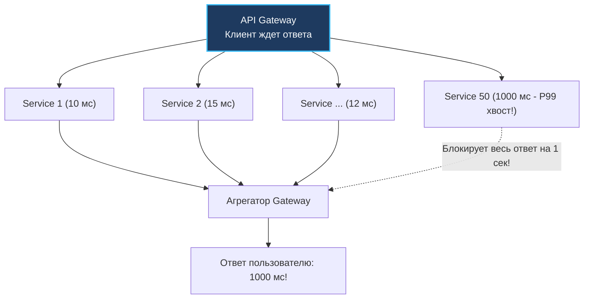
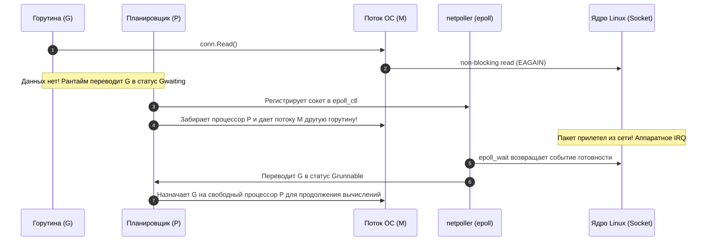

> [!NOTE]
> **Связи:** Эта статья продолжает вводный модуль и опирается на [[1. Обзор раздела. Почему распределенные системы сложны]] и [[2. Проблемы распределенных систем]]. Мы разбираем анатомию сетевых задержек и готовимся к изучению сценариев аварий в [[4. Partial failure]] и проблемы физического времени в [[5. Time и clock drift]].

В предыдущих лекциях мы выяснили, что распределенная система отбирает у нас надежность вызова и единое состояние. Но корень большинства этих проблем кроется в глубоко укоренившихся заблуждениях разработчиков о том, как устроена сеть.

В 1994 году Питер Дойч (L. Peter Deutsch) и другие ведущие инженеры Sun Microsystems сформулировали знаменитые **«8 заблуждений о распределенных вычислениях» (The 8 Fallacies of Distributed Computing)**. За прошедшие три десятилетия частоты процессоров и пропускная способность сетей выросли в тысячи раз, однако эти восемь заблуждений продолжают методично разрушать архитектуры современных микросервисов.

Давайте разберем их через призму фундаментальной физики и реалий разработки высоконагруженных сервисов на Go, уделив особое внимание главному скрытому врагу производительности — **задержке (Latency)**.

---

## 8 заблуждений о сети (The Network Fallacies)

Когда программист пишет код на ноутбуке, он подсознательно опирается на привычные аксиомы локальной машины. Проектировщик распределенных систем обязан исходить из прямо противоположного постулата: **каждое из следующих восьми утверждений — опасная иллюзия**.


1. **Сеть надежна:** Коммутаторы перегреваются, оптические магистрали перерубают экскаваторы, BGP-маршруты падают из-за человеческих ошибок конфигурации, а системный демон `OOM Killer` в ядре Linux принудительно убивает соседние поды в Kubernetes, мгновенно разрывая тысячи TCP-соединений.
2. **Задержка равна нулю:** Любое сетевое взаимодействие занимает конечное, физически ощутимое время, ограниченное скоростью распространения электромагнитных волн в среде и буферами сетевых маршрутизаторов.
3. **Пропускная способность бесконечна:** Даже современный 10-гигабитный или 100-гигабитный сетевой интерфейс в дата-центре можно мгновенно перегрузить неудачным запросом `SELECT * FROM users`, когда база попытается выгрузить миллион нефильтрованных строк в память вашего Go-сервиса.
4. **Сеть безопасна:** Если трафик идет между двумя вашими сервисами внутри одного закрытого облачного контура (VPC), он все равно уязвим к перехвату скомпрометированным соседним контейнером. Отсюда индустриальный стандарт взаимной аутентификации и шифрования `mTLS`.
5. **Топология не меняется:** В динамическом облаке поды Kubernetes непрерывно поднимаются, умирают и мигрируют на другие физические ноды. IP-адреса эфемерны. Хардкодить адреса бессмысленно — необходим Service Discovery.
6. **Есть один администратор:** За ваш микросервис `Service A` отвечает одна продуктовая команда, за инфраструктурную базу данных — команда DBA, а за сетевые шлюзы и DNS — облачный провайдер AWS/GCP со своими скрытыми политиками квотирования.
7. **Стоимость транспортировки равна нулю:** Сериализация структур Go в JSON/Protobuf, компрессия gzip/snappy и оплата счетов облачного провайдера за междатацентровый Egress-трафик — это огромные затраты тактов CPU и реальные бюджеты компании.
8. **Сеть однородна:** На пути вашего сетевого пакета встречаются Linux-серверы с разными версиями ядра, аппаратные балансировщики F5, проприетарные роутеры Cisco, мобильные сети 4G/5G с диким джиттером и корпоративные прокси-серверы.

Сфокусируемся на заблуждении №2 — **задержке**, так как именно она оказывает самое разрушительное влияние на бэкенд.

---

## Анатомия задержки (Latency)

**Задержка (Latency)** — это фундаментальное время, необходимое пакету данных для преодоления расстояния от источника до пункта назначения.

> [!info] Под капотом: Физика и скорость света
> Скорость света в идеальном вакууме составляет $c \approx 300\,000\text{ км/с}$.
> Однако в стеклянной сердцевине оптоволоконного кабеля показатель преломления кварцевого стекла $n \approx 1.47$. В результате фотоны света в оптике распространяются со скоростью около $200\,000\text{ км/с}$ (примерно $5\text{ микросекунд}$ на 1 километр).
> 
> Расстояние между Лондоном и Нью-Йорком по дуге большого круга составляет около $5600\text{ км}$.
> Вычислим теоретический физический предел времени прохождения сигнала туда и обратно (RTT — Round Trip Time):
> `(5600 * 2) / 200 = 56 миллисекунд`.
> 
> Это абсолютный предел специальной теории относительности Эйнштейна. Никакие компиляторы, никакие оптимизации планировщика Go и никакие тюнинги GC не способны заставить пакет обогнать скорость света. В реальности из-за непрямой прокладки трансатлантических кабелей по дну океана и очередей в буферах магистральных роутеров реальный сетевой пинг составляет 70–90 мс.

---

### Из чего состоит сетевой запрос?

Когда разработчик пишет лаконичную строчку:
```go
resp, err := http.Get("https://api.github.com/")
```
на физическом и транспортном уровнях разворачивается многоактовая драма сетевых рукопожатий задолго до того, как удаленный сервер получит хотя бы один байт полезного тела запроса:



1. **DNS Lookup:** Разрешение доменного имени в IP-адрес через UDP/TCP.
2. **TCP Handshake:** Классическое трехстороннее рукопожатие SYN, SYN-ACK, ACK ($1.5\text{ RTT}$).
3. **TLS Handshake:** Обмен криптографическими ключами и валидация сертификатов в протоколе TLS 1.3 (еще $1\text{ RTT}$; в устаревшем TLS 1.2 требовалось $2\text{ RTT}$).
4. **TTFB (Time To First Byte):** Физическое время полета HTTP-запроса к серверу плюс время, которое сервер тратит на обработку в приложении и дисковые операции до генерации первого байта ответа.
5. **Download Body:** Вычитка полезной нагрузки из сокета с учетом скользящего окна TCP (Flow Control / Congestion Window).

Если пинг (RTT) до удаленного сервера составляет всего 50 мс, то первичное установление защищенного HTTPS-соединения отнимет `~150-200 мс` драгоценного времени **до того**, как сервер начнет выполнять полезную работу!

---

> [!warning] Ловушка / Gotcha: Истощение портов и Latency
> Если сервис при каждом исходящем вызове создает новый экземпляр `http.Client` или использует криво сконфигурированный `Transport`, он вынужден оплачивать колоссальную цену за `TCP/TLS Handshake` на каждом сетевом вызове.
> 
> Но это лишь верхушка айсберга. Когда сокет закрывается со стороны клиента, ядро Linux переводит его в статус `TIME_WAIT` (по умолчанию на 60 секунд), блокируя повторное использование кортежа адресов.
> 
> При нагрузке всего в 500 RPS пул эфемерных портов Linux (обычно 28 000 адресов) исчерпывается за 50 секунд. Системный вызов `Dial` завершается системной ошибкой ядра:
> `dial tcp: address already in use`.
> Сервис перестает отправлять запросы и зависает, увлекая за собой зависимые подсистемы.

---

### Механическая симпатия: Connection Pooling в Go

Чтобы свести оверхед рукопожатий к нулю, необходимо повторно использовать уже открытые, «горячие» TCP-сокеты (HTTP Keep-Alive). В Go эту задачу берет на себя структура `http.Transport`.

Ниже представлен эталонный, оптимизированный клиент для высоконагруженных межсервисных взаимодействий:

```go
package client

import (
	"net"
	"net/http"
	"time"
)

func NewOptimizedClient() *http.Client {
	transport := &http.Transport{
		Proxy: http.ProxyFromEnvironment,
		DialContext: (&net.Dialer{
			Timeout:   2 * time.Second,  // Таймаут установки сырого TCP сокета
			KeepAlive: 30 * time.Second, // Период отправки TCP Keep-Alive зондов
		}).DialContext,

		// Максимальное суммарное число простаивающих (idle) соединений в пуле
		MaxIdleConns: 200,

		// КРИТИЧЕСКИ ВАЖНО: По умолчанию в http.DefaultTransport здесь стоит 2!
		// Если вы шлете 200 RPS к одному сервису, 198 соединений будут ежесекундно
		// разрываться и открываться заново с полным циклом TLS Handshake!
		MaxIdleConnsPerHost: 100,

		// Сколько времени сокет ждет следующего запроса до физического закрытия
		IdleConnTimeout: 90 * time.Second,

		// Таймаут на завершение шифрования TLS
		TLSHandshakeTimeout: 2 * time.Second,

		ExpectContinueTimeout: 1 * time.Second,
		ForceAttemptHTTP2:     true,
	}

	return &http.Client{
		Transport: transport,
		// Глобальный таймаут: покрывает DNS, Handshake, отправку и чтение Response Body!
		Timeout: 5 * time.Second,
	}
}
```

Когда горутина отправляет запрос через такой оптимизированный `http.Client`, она берет готовый сокет из пула структуры `Transport`. Никакого `TCP/TLS Handshake` не происходит: соединение уже установлено, ключи согласованы. Задержка запроса падает до физического минимума: `RTT + TTFB`.

---

## Проблема длинного хвоста (Tail Latency)

В распределенных системах метрика среднего времени ответа (Average / Mean) категорически запрещена к использованию в качестве индикатора здоровья сервиса.

> [!tip] Собеседование: Почему среднее арифметическое (Mean Latency) обманывает инженеров?
> **Вопрос:** Метрика на дашборде показывает, что среднее время ответа (Average Latency) сервиса составляет прекрасные 50 мс. Однако пользователи службы поддержки массово жалуются на невыносимые лаги. Где ошибка?
> 
> **Ответ:** Среднее арифметическое — опасная статистическая фикция в сетях. Сетевые задержки подчиняются не нормальному гауссовскому колоколу, а распределениям с **тяжелым, длинным хвостом (Long Tail Distribution)**.
> 
> Представьте выборку из 100 запросов:
> - 90 запросов выполнились мгновенно — за 10 мс.
> - 10 запросов наткнулись на ретраи, ребалансировку или паузу Stop-The-World в рантайме и длились по 410 мс.
> 
> Рассчитаем среднее значение:
> `(90*10 + 10*410) / 100 = 50 мс`.
> 
> График гордо рисует зеленую линию в 50 мс, но при этом **10% ваших живых пользователей терпят полусекундные тормоза**!
> 
> Поэтому SLA и SLO в индустрии всегда фиксируются по **Перцентилям (Percentiles)**:
> - **P50 (Медиана):** Время, быстрее которого выполняется ровно половина всех запросов.
> - **P95:** 95% запросов выполняются быстрее этого порога.
> - **P99:** 99% запросов быстрее этого времени. P99 вскрывает поведение системы на пиках нагрузки и при сборке мусора.

---

### Почему Tail Latency убивает микросервисы?

В монолите один HTTP-запрос обрабатывался одним процессом. В микросервисной архитектуре запрос к Frontend или API Gateway превращается в веерный опрос (Fan-Out) десятков бэкенд-сервисов: каталога, корзины, профиля, рекомендаций, рекламы, цен и остатков на складе.

Представим систему, где у каждого отдельного микросервиса `P99 latency = 1 секунда`. Казалось бы, 99% запросов работают быстро, и лишь 1 из 100 подтормаживает. Отличный показатель?

Давайте посчитаем математическую вероятность.
Если для отрисовки главной страницы мобильного приложения шлюз параллельно опрашивает $N = 50$ микросервисов, вероятность того, что страница загрузится без единой задержки (все 50 сервисов уложатся в свои 99%), равна:

$$P(\text{Все быстрые}) = 0.99^{50} \approx 0.605$$

Вывод обескураживает:
`0.99 ^ 50 = 0.60`.

Это означает, что **около 40% всех загрузок страницы будут тормозить на 1 секунду**! Чем больше микросервисов в архитектуре, тем неизбежнее хотя бы один из них попадет в свой медленный хвост из-за дискового сброса fsync, переполнения очереди сокета или сетевого джиттера.



---

## Как Go справляется с ожиданием? (netpoll)

Когда тысячи горутин одновременно делают сетевые запросы и ждут ответа (Latency), встает вопрос о системных ресурсах: не сжигает ли ожидание драгоценное процессорное время?

В этом заключается ключевое технологическое преимущество языка Go.

Когда горутина выполняет чтение из сетевого соединения `conn.Read()`, а буфер сокета в ядре операционной системы пуст, рантайм Go (подсистема `network poller` / `netpoll`) выполняет элегантную рокировку:



1. **Неблокирующий сокет:** Все сетевые файловые дескрипторы в Go изначально открываются в режиме `O_NONBLOCK`.
2. **Парковка горутины:** Если системный вызов возвращает ошибку `EAGAIN` (данные не готовы), горутина переводится из состояния `_Grunning` в статус ожидания `Gwaiting`.
3. **Регистрация в селекторе ядра:** Рантайм Go регистрирует файловый дескриптор в системном мультиплексоре (`epoll` в Linux, `kqueue` в macOS).
4. **Поток ОС освобождается:** Системный тред операционной системы `M` не засыпает в ядре! Планировщик `P` мгновенно берет следующую готовую к выполнению горутину из локальной очереди `runq` и продолжает молотить полезные вычисления.
5. **Пробуждение через сетевой поллер:** Когда сетевой пакет долетает до сервера, контроллер генерирует прерывание, системный `netpoller` получает уведомление от `epoll_wait`, переводит ожидающую горутину в статус `Grunnable`, и она мгновенно возобновляет работу.

Именно благодаря этой архитектуре Go-сервис может удерживать $100\,000$ одновременно ожидающих сетевых запросов, потребляя около 0% процессорного времени и расходуя минимум оперативной памяти только на легкие стеки горутин.

---

## Итог

1. **8 заблуждений Питера Дойча** — фундаментальная карта рисков любого распределенного инженера. Никогда не предполагайте, что сеть стабильна, бесплатна и быстра.
2. **Физический предел скорости света:** Задержка неустранима. Время на установку защищенного HTTPS-соединения (`~150-200 мс`) часто на порядок превышает время передачи самого тела сообщения.
3. **Connection Pooling:** Всегда конфигурируйте `http.Transport` с адекватным значением `MaxIdleConnsPerHost`, чтобы исключить паразитные накладные расходы на рукопожатия и защитить ОС от шторма сокетов в `TIME_WAIT`.
4. **Перцентили против лживых средних:** Оценивайте задержки по `P95` и `P99`.
5. **Проблема Tail Latency:** При веерном опросе микросервисов формула `0.99 ^ 50 = 0.60` гарантирует, что 40% запросов будут тормозить из-за хвоста распределения.
6. **Механика netpoll:** Сетевой поллер Go прозрачно переводит горутины в `Gwaiting` через `epoll`, освобождая потоки `M` и обеспечивая непревзойденную плотность сетевого ввода-вывода.

Задержки замедляют систему, но самое страшное начинается тогда, когда удаленный сервер перестает отвечать вовсе, разрывая распределенную транзакцию на середине пути. 

В следующей лекции мы разберем анатомию частичных отказов: [[4. Partial failure]].