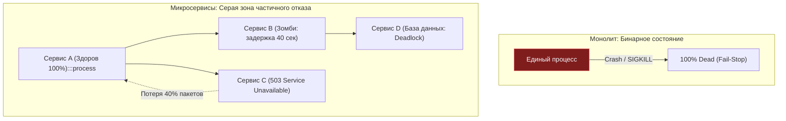
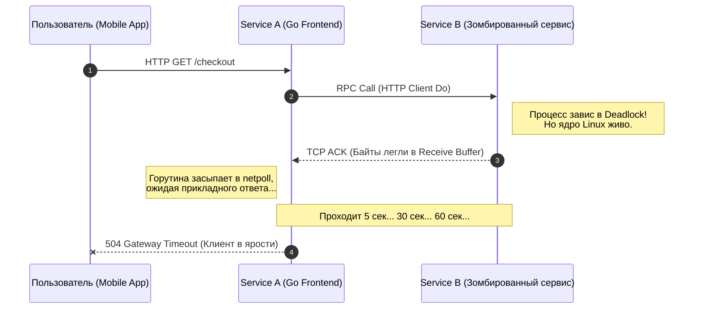
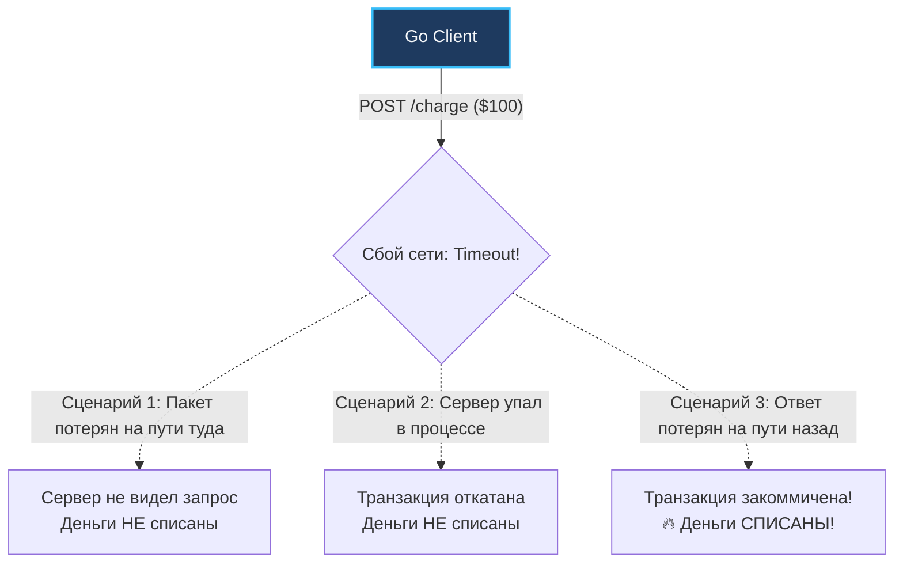

> [!NOTE]
> **Связи:** Эта статья развивает концепции сетевой задержки из [[3. Latency и network fallacies]] и рассматривает поведение систем в условиях неполных сбоев. Она готовит фундамент для разбора физического времени в [[5. Time и clock drift]], компромиссов согласованности в [[6. Consistency vs availability]] и паттернов устойчивости: [[3. Timeout]], [[2. Retry и backoff]] и [[1. Circuit Breaker]].

В предыдущей лекции [[3. Latency и network fallacies]] мы детально препарировали физику сетевых задержек и поняли, почему наивное предположение о мгновенном ответе удаленного сервера разрушительно для бэкенда.

Однако задержка — это лишь прелюдия. Настоящий экзистенциальный кошмар инженера распределенных систем начинается тогда, когда система ломается, но ломается **не до конца**.

Добро пожаловать в концепцию **Частичного отказа (Partial Failure)** — фундаментального, определяющего свойства распределенных архитектур, которое навсегда меняет инженерный майндсет и подход к написанию кода на Go.

---

## Бинарный мир монолита vs Серые зоны микросервисов

Когда вы пишете код внутри монолитного приложения, работающего в рамках одного процесса операционной системы, отказы предельно детерминированы.
- Если функция деления на ноль вызывает панику, и она не перехвачена через `recover()`, процесс падает целиком.
- Если операционная система присылает сигнал `SIGKILL` из-за нехватки памяти, процесс мгновенно прекращает существование.

Это классическое поведение **Fail-Stop** («упал и остановился»). Состояние системы бинарно: вы точно знаете, что приложение либо функционирует на 100%, либо мертво на 100%. Здесь нет полутонов.

В распределенной системе, объединяющей 50 независимых микросервисов, ситуация кардинально меняется:
- Сервис `A` работает безупречно.
- База данных сервиса `B` лежит в руинах под лавиной неоптимальных блокировок.
- Сервис `C` формально жив, но из-за деградации сетевого диска отвечает в 50 раз медленнее обычного.



> [!important]
> Распределенная система **никогда не бывает полностью здоровой и никогда не бывает полностью мертвой**. Она непрерывно находится в состоянии частичной деградации. Задача архитектора — не предотвратить сбой, а построить переборки, которые не позволят локальному тлению перерасти в тотальный пожар.

---

## Медленный сервис хуже мертвого

Самый контринтуитивный парадокс распределенного инжиниринга звучит так: **быстрый, решительный отказ — это благо**.

Если удаленный сервер физически обесточен или процесс упал, ядро операционной системы мгновенно разрывает сетевые соединения. На входящий TCP-пакет сетевой стек Linux мгновенно отправляет флаг `RST` (Reset) или `FIN`:

```text
Client -> [TCP SYN] -> Server
Client <- [TCP RST] <- Server (Порт закрыт, процесс мертв)
```

В этот момент ваш код на Go при попытке вызова `client.Do` или `conn.Read()` мгновенно получает системную ошибку:
`dial tcp: connection refused`.

Горутина не ждет ни секунды! Она сразу освобождает стек, отдает ошибку клиенту или возвращает закэшированный fallback-ответ. Ресурсы вашего сервера остаются в безопасности.

Но что происходит, когда удаленный сервис превращается в «зомби»?
1. Сервер физически включен, операционная система исправна, но рабочий процесс завис в дедлоке (Deadlock) на мьютексе.
2. Ядро Linux послушно принимает входящие TCP-пакеты, отправляет клиенту сетевой `ACK` («я принял байты») и складывает их в сокетный буфер ядра `Receive Buffer`. Но зависшее приложение никогда не вызовет системный вызов `read`, чтобы забрать их!
3. Облачный виртуальный диск (например, AWS EBS) деградировал из-за аварии на дисковом массиве, и системный вызов `fsync` зависает на 45 секунд вместо штатных 2 миллисекунд.
4. Сборщик мусора (GC) в соседнем сервисе на Java ушел в трехминутную паузу Stop-The-World из-за раздутой 64-гигабайтной кучи.

В этот момент ваш Go-сервис отправляет запрос... и замирает в бесконечном ожидании.



---

### Mechanical Sympathy: Как нас обманывает Linux

Если разработчик не задал таймауты явно, он добровольно отдает управление временем жизни своего приложения на откуп сетевому стеку ядра Linux.

Представим, что сетевой кабель между серверами оборвался в момент передачи запроса. Ядро Linux на стороне клиента отправило пакет, но не получило подтверждения `ACK`. Что делает ОС? Она начинает процедуру повторной передачи TCP-пакета (Retransmission) с экспоненциальным бэк-оффом.

За количество попыток в Linux отвечает системный параметр ядра:
```bash
sysctl net.ipv4.tcp_retries2
# По умолчанию в большинстве дистрибутивов: 15
```

Сколько времени займут 15 повторных попыток ядра Linux с удвоением пауз перед тем, как `conn.Read` или `conn.Read()` в рантайме Go наконец-то выбросит ошибку:
`read: connection timed out`?

Официальный ответ RFC 1122 и исходников ядра Linux: **от 13 до 30 МИНУТ**!

Все эти полчаса ваша горутина будет неподвижно висеть в памяти.
При входящем трафике $1000\text{ RPS}$ всего за одну минуту в памяти накопится:
$$1000 \times 60 = 60\,000\text{ заблокированных горутин!}$$

Они заблокируют пул соединений к базе данных (`database/sql`), исчерпают лимит открытых файловых дескрипторов и приведут к неизбежному краху всего процесса по Out Of Memory (OOM). Это и есть классический **каскадный отказ**, механизм которого мы исследовали в лекции [[2. Проблемы распределенных систем]].

---

## Анатомия неизвестности: Проблема двух генералов

Частичный отказ разрушает фундаментальную способность наблюдателя однозначно судить о реальности.

> [!tip] Собеседование: Три исхода сетевого таймаута
> **Вопрос:** Ваш Go-микросервис отправил HTTP POST-запрос в биллинг для списания 100$ со счета клиента. Ровно через 5 секунд `http.Client` вернул ошибку:
> `context deadline exceeded`.
> Списались ли деньги со счета пользователя?
> 
> **Ответ:** Мы **принципиально не знаем**. Это классическое состояние неопределенности Шрёдингера.
> 
> В распределенной системе любой сетевой таймаут порождает три равновероятных сценария:
> 1. **Пакет не дошел до сервера:** Сетевой свитч отбросил пакет по пути *туда*. Запрос не поступил в биллинг, деньги **не списались**. (Нужно повторить запрос).
> 2. **Пакет дошел, но сервер завис:** Биллинг начал транзакцию, но упал по OOM или завис до выполнения `COMMIT`. Деньги **не списались**.
> 3. **Пакет дошел, сервер успешно выполнил списание:** Деньги зафиксированы в БД биллинга. Но в момент отправки ответного HTTP-пакета 200 OK экскаватор перерубил кабель по пути *обратно*. Деньги **успешно списаны**!
> 
> Если клиент в сценарии №3 наивно сделает retry запроса, он **спишет деньги с пользователя второй раз**!



Из этой неразрешимой неопределенности вытекает абсолютный закон распределенного проектирования: **любой мутирующий API обязан поддерживать идемпотентность через ключ дедупликации `Idempotency-Key`**.

Клиент генерирует уникальный UUID операции и передает его в заголовке:
`Idempotency-Key: 7b8c2d1e-4f3a-4e9b-8c1d-2e3f4a5b6c7d`

Если запрос повторяется из-за таймаута, сервер обнаруживает ранее обработанный ключ в таблице дедупликации и возвращает сохраненный результат первого выполнения, не списывая средства повторно.

---

## Как Go защищает нас: `context.Context`

Инженеры Google заложили в Go первоклассный инструмент борьбы с частичными отказами — пакет `context`.

Контекст — это стандартизированный механизм рантайма для контроля времени жизни дерева асинхронных операций и распространения сигналов отмены (Cancellation Signals) по графу вызовов.

```go
package handler

import (
	"context"
	"errors"
	"io"
	"net/http"
	"time"
)

func ProcessOrderHandler(w http.ResponseWriter, r *http.Request) {
	// 1. Создаем дочерний контекст с жестким лимитом выполнения в 2 секунды
	ctx, cancel := context.WithTimeout(r.Context(), 2*time.Second)
	defer cancel() // КРИТИЧЕСКИ ВАЖНО: Освобождаем таймер рантайма при любом выходе!

	// 2. Создаем HTTP-запрос, привязанный к контексту
	req, err := http.NewRequestWithContext(ctx, http.MethodPost, "http://billing-service/charge", nil)
	if err != nil {
		http.Error(w, err.Error(), http.StatusInternalServerError)
		return
	}

	// 3. Выполняем сетевой вызов
	resp, err := http.DefaultClient.Do(req)
	if err != nil {
		if errors.Is(err, context.DeadlineExceeded) {
			// Локализуем частичный отказ: сервер не успел ответить вовремя
			http.Error(w, "Billing service timeout", http.StatusGatewayTimeout)
			return
		}
		http.Error(w, "Network transport error", http.StatusBadGateway)
		return
	}
	defer resp.Body.Close()

	body, _ := io.ReadAll(resp.Body)
	w.WriteHeader(resp.StatusCode)
	w.Write(body)
}
```

---

> [!info] Под капотом: Механика отмены `context.Context`
> Интерфейс `context.Context` описывает четыре базовых метода, главным из которых является:
> ```go
> Done() <-chan struct{}
> ```
> 
> Когда вызывается функция `context.WithTimeout` (или `WithDeadline`), рантайт Go запускает фоновый системный таймер через функцию `time.AfterFunc`. Таймер привязан к куче таймеров текущего процессора `P`.
> 
> Если дедлайн истекает раньше завершения операции:
> 1. Таймер автоматически вызывает внутреннюю функцию `cancel()`.
> 2. Функция `cancel()` захватывает мьютекс и выполняет атомарное закрытие канала: `close(c.done)`.
> 3. Функция рекурсивно обходит всех зарегистрированных детей этого контекста и вызывает `cancel()` для каждого из них.
> 
> Закрытие канала `c.done` — мощнейшая идиома Go: все горутины, заблокированные в конструкции:
> `select { case <-ctx.Done(): ... }`  
> мгновенно выходят из блокировки!
> 
> Внутри стандартного `http.Transport` сетевой поллер Go перехватывает этот сигнал и выполняет принудительное закрытие низкоуровневого дескриптора сокета (`close(fd)`), немедленно прерывая зависший системный вызов ядра и возвращая управление приложению.

---

> [!warning] Ловушка / Gotcha: Утечка таймеров при забытом `defer cancel()`
> Всегда вызывайте `defer cancel()` сразу после создания контекста через `WithTimeout`!
> 
> Даже если ваша операция выполнилась успешно за 5 миллисекунд, контекст, созданный с таймаутом в 30 секунд, продолжит удерживать системный таймер в памяти рантайма до тех пор, пока эти 30 секунд физически не истекут.
> 
> При $1000\text{ RPS}$ забытый вызов `cancel()` породит утечку $30\,000$ таймеров в куче Go, увеличивая нагрузку на планировщик и Garbage Collector. Вызов `cancel()` деактивирует таймер и немедленно удаляет его из дерева рантайма.

---

## Стратегии защиты (Паттерны)

Понимание неизбежности частичных отказов привело к рождению классических паттернов архитектурной устойчивости (Resilience Patterns), которым целиком посвящен подраздел «05. Надежность»:

```mermaid
flowchart LR
    classDef process  fill:#1e293b,stroke:#38bdf8,stroke-width:1px,color:#f8fafc
    classDef success  fill:#064e3b,stroke:#34d399,stroke-width:1px,color:#f8fafc
    classDef error    fill:#7f1d1d,stroke:#f87171,stroke-width:1px,color:#f8fafc
    classDef warning  fill:#78350f,stroke:#fbbf24,stroke-width:1px,color:#f8fafc
    classDef entry    fill:#1e3a5f,stroke:#38bdf8,stroke-width:2px,color:#f8fafc
    classDef aux      fill:#334155,stroke:#64748b,stroke-width:1px,color:#f8fafc
    classDef system   fill:#312e81,stroke:#a78bfa,stroke-width:1px,color:#f8fafc
    classDef data     fill:#132d29,stroke:#2dd4bf,stroke-width:1px,color:#f8fafc
    classDef network  fill:#881337,stroke:#fb7185,stroke-width:1px,color:#f8fafc
    classDef accent   fill:#1e1b4b,stroke:#818cf8,stroke-width:1px,color:#f8fafc
    P1["1. Timeout<br>Жесткий потолок ожидания"]:::process --> P2["2. Exponential Backoff<br>Умные повторы с джиттером"]
    P2 --> P3["3. Circuit Breaker<br>Защитный автомат-выключатель"]
    P3 --> P4["4. Bulkhead<br>Изоляция пулов ресурсов"]
```



1. **[[3. Timeout]] (Дедлайны):** Жесткое ограничение максимального времени ожидания на каждом узле системы с помощью `context.WithTimeout`.
2. **[[2. Retry и backoff]] (Повторные попытки):** Если временный сбой сетевого уровня вернул ошибку, клиент повторяет попытку через экспоненциально увеличивающийся интервал с добавлением случайного шума (Full Jitter), чтобы не устроить шторм запросов на восстанавливающийся сервис.
3. **[[1. Circuit Breaker]] (Автомат защиты):** Если сервис `B` возвращает ошибки 50 раз подряд, автоматический выключатель «размыкает цепь» и в течение следующих 30 секунд мгновенно возвращает локальную ошибку клиентам, даже не пытаясь отправлять сетевые пакеты. Это дает «приболевшему» сервису возможность восстановиться.
4. **Bulkhead (Судовые переборки):** Физическое разделение пулов горутин и соединений. Зависание модуля рекомендаций не должно отнимать горутины у модуля оформления заказа.

---

## Итог

1. **Частичный отказ — фундаментальная реальность:** Распределенная система никогда не находится в кристальном бинарном состоянии монолита.
2. **Опасность зомби-сервисов:** Зависший сервер наносит несоизмеримо больший урон инфраструктуре, чем упавший сервер, провоцируя истощение пулов соединений и каскадные отказы.
3. **Неизвестность при таймауте:** Любой сетевой таймаут имеет три исхода. Мутирующие API обязаны требовать уникальный `Idempotency-Key`.
4. **Context как щит:** Используйте `context.Context` на всех уровнях взаимодействия — от `conn.Read` и `db.QueryContext` до `client.Do`. Всегда вызывайте `defer cancel()`.
5. **Паттерны устойчивости:** Тайм-ауты, Circuit Breakers, ретраи с бэк-оффом и балкхеды превращают хрупкую сеть микросервисов в монолитную, неуязвимую систему.

Мы осознали, как изолировать частичные отказы независимых серверов. Но представьте: авария произошла, и мы пытаемся собрать логи со ста узлов, чтобы восстановить хронологию событий. В монолите мы просто отсортировали бы строки по времени. 

Почему в распределенных системах полагаться на физические часы серверов категорически запрещено — мы выясним в следующей лекции: [[5. Time и clock drift]].