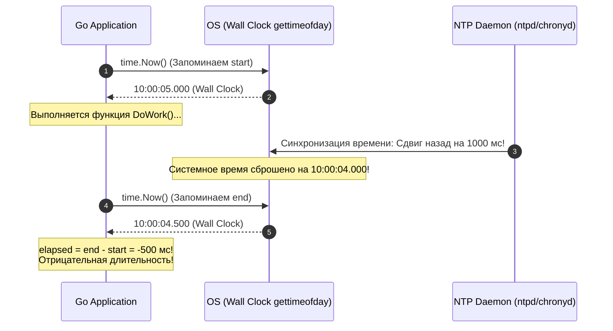
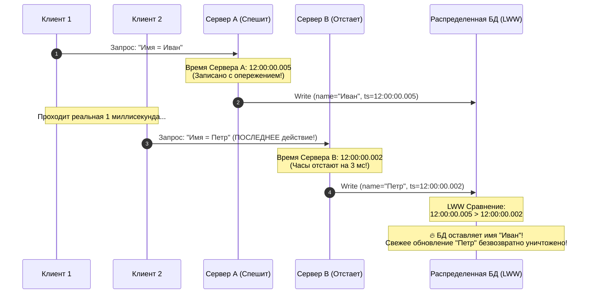
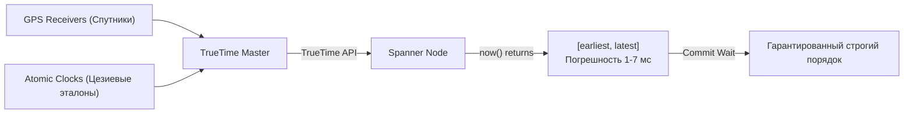

> [!NOTE]
> **Связи:** Эта статья продолжает вводный модуль и опирается на принципы из [[1. Обзор раздела. Почему распределенные системы сложны]], [[2. Проблемы распределенных систем]], [[3. Latency и network fallacies]] и [[4. Partial failure]]. Мы исследуем фундаментальную физику времени и готовимся к компромиссам в [[6. Consistency vs availability]], логическим часам в [[5. Vector clocks]] и распределенным блокировкам в [[7. Distributed locks]].

В предыдущих лекциях мы выяснили, что сеть обрывает соединения, задерживает пакеты и оставляет нас в подвешенном состоянии неизвестности. Но есть еще один компонент классического монолита, который безнадежно ломается при переходе к распределенной архитектуре.

Это **Время**.

Представьте классический разбор инцидента (Post-Mortem) после ночной аварии. Вы открываете централизованную систему сбора логов и пытаетесь восстановить причинно-следственную цепочку событий по таймстемпам:
1. Запрос пришел в `API Gateway` в 12:00:01.000.
2. В 12:00:01.050 `Order Service` создал заказ.
3. В 12:00:01.040 `Billing Service` списал деньги.

Стоп. Сервис `Billing` списал деньги за 10 миллисекунд *до* того, как `Order Service` сформировал заказ?
С точки зрения бизнес-логики и здравого смысла это грубейшее нарушение причинности (Causality). Но именно такую абсурдную картину вы регулярно будете наблюдать в сырых логах.

Добро пожаловать в проблему **дрейфа часов (Clock Drift)**.

---

## Физика времени (Mechanical Sympathy)

Как компьютерный сервер вообще понимает, который сейчас час?

На материнской плате каждого сервера распаян крошечный **кварцевый резонатор (Quartz Oscillator)**. Это кристалл синтетического кварца, который под воздействием пьезоэлектрического эффекта вибрирует с фиксированной эталонной частотой (обычно 32 768 Гц для часов реального времени RTC). Аппаратный счетчик считает количество колебаний и транслирует их в секунды, минуты и часы.

Но реальный физический мир неидеален. Частота колебаний кварцевого кристалла непрерывно плывет под воздействием внешних факторов:
1. **Температура в серверной стойке:** Когда процессор молотит вычисления под 100% нагрузкой, температура кристалла подскакивает с 35°C до 75°C. Термическое расширение кристаллической решетки меняет резонансную частоту: часы начинают либо спешить, либо отставать.
2. **Физическое старение кремния:** С годами структура кристалла деградирует.
3. **Производственные допуски:** Два абсолютно одинаковых сервера из одной партии, стоящие на соседних полках в стойке, тикают с разной скоростью.

Это физическое явление называется **Clock Drift (Дрейф часов)**. Обычный серверный узел в дата-центрах AWS, GCP или собственной серверной гарантированно уплывает от истинного астрономического времени на **несколько миллисекунд или даже секунд каждые сутки**.

---

## Иллюзия синхронизации: NTP

Чтобы серверы окончательно не разбежались в разные эпохи, в операционных системах используется протокол синхронизации сетевого времени — **NTP (Network Time Protocol)**. Фоновый системный демон (`ntpd` или более современный `chronyd`) периодически обращается к серверам точного времени Stratum 1/2, подключенным к атомным эталонам или спутникам GPS.

Казалось бы, проблема решена?
Увы, здесь вступает в силу материал лекции [[3. Latency и network fallacies]]: **сетевые задержки стохастичны и несимметричны**!

Когда демон `chronyd` отправляет UDP-пакет с вопросом: *«Который сейчас час?»*, пакет летит 15 мс до эталонного сервера, а ответный пакет возвращается 45 мс из-за затора в буфере сетевого свитча. Сервер получает ответ: *«Сейчас ровно 12:00:00.000»*, но это время было актуально где-то посередине пути!

Математические алгоритмы фильтрации NTP способны сглаживать статистический шум, но они бессильны победить физику сети. В реальном промышленном дата-центре расхождение часов между соседними серверами даже при идеально работающем NTP постоянно плавает в диапазоне **от 1 до 20 миллисекунд**.

А для современного процессора с тактовой частотой 3.5 ГГц 20 миллисекунд — это **70 000 000 тактов**, за которые ядро успевает выполнить десятки миллионов инструкций!

---

### Сдвиги времени (Time Steps)

Но самое опасное происходит тогда, когда NTP-демон обнаруживает, что часы сервера отстали или убежали вперед на заметную величину (например, после сетевого сбоя или выхода машины из сна).

Что делает демон `ntpd`? Если рассинхронизация превышает определенный порог, он не просто ускоряет ход часов (slewing), а совершает резкий скачок: **принудительно переводит системное время назад (Time Step)**!



> [!warning] Ловушка / Gotcha: Катастрофа с отрицательным временем
> Представьте наивный код бенчмарка или таймаута:
> ```go
> start := time.Now()
> DoWork()
> elapsed := time.Now().Sub(start)
> if elapsed > 5*time.Second { ... }
> ```
> В старых языках и версиях рантаймов (включая Go до версии 1.9) вызов `time.Now()` возвращал астрономическое время настенных часов (Wall Clock).
> 
> Если во время работы `DoWork()` демон NTP скорректировал часы назад, переменная `elapsed` становилась **отрицательным числом** (`-500ms`)!
> 
> Это приводило к разрушительным последствиям: зависанию бесконечных циклов ожидания, поломке планировщиков задач и паникам. В новогоднюю ночь 2017 года из-за високосной секунды (Leap Second) и сдвига времени упали сервисы DNS компании Cloudflare, вызвав глобальный сбой интернета.

---

## Как Go решил эту проблему "под капотом"

Начиная с релиза **Go 1.9**, команда инженеров Google внедрила революционное и элегантное решение проблемы сдвигов времени прямо в стандартную библиотеку.

Операционная система Linux предоставляет два принципиально разных источника времени:
1. **Wall Clock (Настенные часы):** Возвращаются системным вызовом `gettimeofday` или `clock_gettime(CLOCK_REALTIME)`. Это календарное время суток (год, месяц, секунда). Они привязаны к часовым поясам, синхронизируются через NTP и могут совершать прыжки вперед и назад.
2. **Monotonic Clock (Монотонные часы):** Возвращаются системным вызовом `clock_gettime(CLOCK_MONOTONIC)`. Они отсчитывают монотонный прирост тиков таймера процессора с момента загрузки операционной системы. Они **принципиально не могут идти назад**.

> [!info] Под капотом: Архитектура структуры `time.Time` в Go
> Заглянем в исходный код стандартной библиотеки Go ([`src/time/time.go`](file:///home/ut/work/go-textbook/src/time/time.go)):
> 
> ```go
> type Time struct {
>     // wall содержит 1 бит флага монотонности + 33 бита секунд + 30 бит наносекунд
>     wall uint64 
>     // ext содержит монотонное время в наносекундах (CLOCK_MONOTONIC)
>     ext  int64  
>     loc *Location
> }
> ```
> 
> Когда ваш код вызывает функцию `time.Now()`, рантайт Go атомарно считывает **оба счетчика**: настенные часы записываются в поле `wall`, а монотонные наносекунды — в поле `ext`.
> 
> Когда вы вычисляете длительность через `time.Since(start)` или разницу `start.Sub(end)`:
> ```go
> elapsed := time.Since(start)
> ```
> рантайм проверяет флаг: если обе структуры `time.Time` содержат показания монотонных часов, вычисление разницы производится **строго по монотонному полю `ext`**!
> 
> Даже если NTP переведет системные часы операционной системы на 10 лет назад прямо во время выполнения вашей функции, `time.Since(start)` гарантированно вернет абсолютно точное, строго положительное физическое время выполнения операции.

---

## Архитектурные катастрофы из-за времени

Если внутри одного процесса Go монотонные часы спасают нас от локального безумия, то в распределенной сети физическое время серверов превращается в источник тяжелейших аварий.

### 1. Last-Write-Wins (LWW) и тихая потеря данных

Многие распределенные NoSQL-базы данных (Apache Cassandra, ScyllaDB, Riak) по умолчанию используют стратегию разрешения конфликтов **Last-Write-Wins (LWW)**: побеждает запись с самым большим timestamp.

Представим два узла:
- `Сервер А` (часы спешат на 3 миллисекунды).
- `Сервер B` (часы отстают на 3 миллисекунды).



1. В момент времени $T$ Клиент 1 отправляет запрос на `Сервер А`. Тот берет локальное время `12:00:00.005` и отправляет запись в БД.
2. Спустя мгновение Клиент 2 отправляет осознанное обновление на `Сервер B`. Тот ставит свой локальный timestamp `12:00:00.002` (потому что его кварц отстает).
3. База данных сравнивает метки: `12:00:00.005 > 12:00:00.002`.
4. Система делает ошибочный вывод, что действие на `Сервере А` произошло *позже*.
5. В итоге более свежее изменение Клиента 2 **безвозвратно затирается старыми данными**! Бизнес теряет обновления без каких-либо ошибок в логах.

---

### 2. Распределенные блокировки и катастрофа аренды

Представьте распределенную блокировку на базе Redis или etcd с временем жизни (TTL Lease) в 10 секунд:
1. `Сервер А` успешно берет лок на обработку заказа. Он полагает, что у него есть 10 секунд монопольного доступа.
2. В этот момент на `Сервере А` виртуальная машина уходит в кратковременный freeze (гипервизор выделил CPU другому клиенту), либо NTP-клиент резко корректирует время на 8 секунд вперед.
3. `Сервер А` выходит из паузы. По его локальным часам прошло всего 2 секунды, и он считает себя владельцем лока.
4. Но для сервера Redis таймер аренды давно истек! Redis считает `Сервер А` мертвым и выдает блокировку `Серверу B`.
5. Теперь `Сервер А` и `Сервер B` **одновременно пишут в базу данных**, разрушая инварианты данных и списывая остатки товаров в минус (эту проблему мы детально исследуем в лекции [[7. Distributed locks]]).

---

> [!tip] Собеседование: Как упорядочить события без доверия к физическим часам?
> **Вопрос:** Если физическим часам серверов нельзя доверять из-за Clock Drift, как распределенные базы данных и брокеры упорядочивают события?
> 
> **Ответ:** Отказаться от физического времени и использовать **Логическое время (Logical Time)**.
> 
> В распределенных системах критично не то, *во сколько часов и минут* по Гринвичу произошло событие, а **причинно-следственная связь (Causality)**: какое событие послужило причиной, а какое следствием (*happened-before relation*, $\to$).
> 
> Для этого используются алгоритмические счетчики:
> 1. **Часы Лампорта (Lamport Timestamps):** Каждый узел инкрементирует целочисленный счетчик. При отправке сообщения счетчик прикрепляется к пакету. Получатель обновляет свой счетчик как $\max(\text{local}, \text{msg}) + 1$. Это гарантирует частичный порядок.
> 2. **Векторные часы (Vector Clocks):** Массив счетчиков от всех участников кластера, позволяющий математически точно детектировать конкурентные конфликты записей (лекция [[5. Vector clocks]]).

---

## Исключение из правил: Google TrueTime

Существует единственное в мире инженерное исключение, где распределенная база данных смогла безопасно опереться на физическое время для глобальной сериализуемости транзакций (External Consistency) — это **Google Cloud Spanner**.

Инженеры Google осознали, что программно синхронизировать время по сети невозможно. Поэтому они перепроектировали само физическое железо дата-центров.

Каждая серверная зона Google Spanner оснащена специализированными аппаратными стойками **TrueTime**:
- Набором атомных цезиевых часов (Atomic Clocks).
- Приемниками сигналов системы GPS с независимыми антеннами на крышах.



API TrueTime не возвращает обманчивое скалярное значение `time.Now()`. Вместо этого вызов возвращает **доверительный временной интервал**:
`[earliest, latest]`, где разница между границами составляет гарантированные физикой $\approx 1-7\text{ миллисекунд}$.

Если Spanner нужно гарантировать, что транзакция $T_2$ началась строго после транзакции $T_1$, он применяет гениальный паттерн **Commit Wait**: узел $T_1$ просто принудительно засыпает на время максимальной погрешности интервала ($7\text{ мс}$) перед фиксацией транзакции. Когда интервалы перестают физически пересекаться, истинный порядок во вселенной гарантирован.

Однако инфраструктура TrueTime стоит миллионы долларов и доступна только гигантам масштаба Google. Во всех остальных системах мы обязаны писать код исходя из аксиомы: **физические часы врут**.

---

## Итог

1. **Время относительно:** На каждом сервере физические часы тикают со своей скоростью из-за температуры и износа кварцевых кристаллов.
2. **NTP несовершенен:** Из-за асимметрии сетевых задержек сервера имеют неустранимое расхождение в миллисекунды и способны совершать скачки назад.
3. **Победа Go-рантайма:** Структура `time.Time` автоматически совмещает Wall Clock и Monotonic Clock, делая замеры через `time.Since()` абсолютно защищенными от скачков времени ОС.
4. **Опасность LWW:** Использование физических timestamp для разрешения конфликтов в базах данных приводит к молчаливому затиранию актуальных данных.
5. **Логическое время:** В распределенных системах причинность устанавливается логическими часами Лампорта и векторными часами, а не системными часами серверов.

Мы изучили физические ограничения сетей, частичные отказы и релятивность времени. Всё готово к тому, чтобы свести эти законы воедино и познакомиться с главным законом распределенных систем, определяющим выбор между целостностью данных и доступностью сервиса: [[6. Consistency vs availability]].