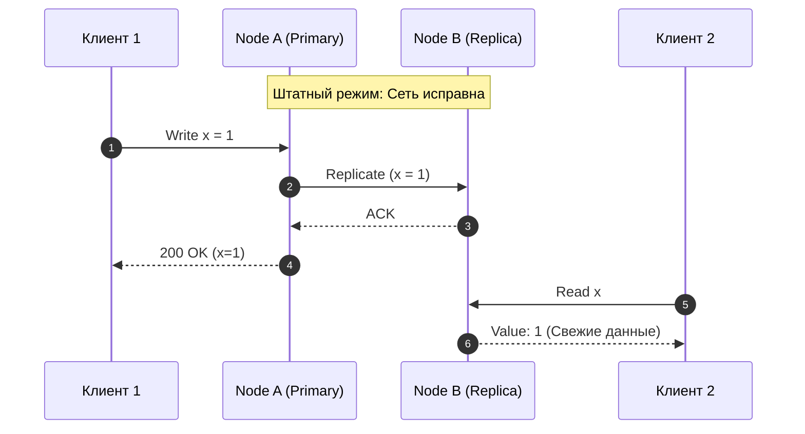
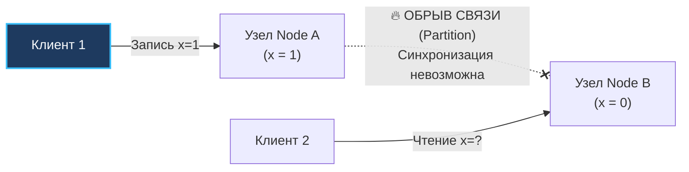

> [!NOTE]
> **Связи:** Эта статья развивает фундаментальные концепции вводного модуля и опирается на [[1. Обзор раздела. Почему распределенные системы сложны]], [[2. Проблемы распределенных систем]], [[3. Latency и network fallacies]], [[4. Partial failure]] и [[5. Time и clock drift]]. Мы подходим к формализации компромиссов распределенного мира и готовимся к изучению [[7. CAP теорема на практике]] и [[8. PACELC]].

В предыдущих лекциях мы шаг за шагом разрушали благостные иллюзии надежности. Мы выяснили, что сеть постоянно теряет и задерживает пакеты ([[3. Latency и network fallacies]]), серверы погружаются в зомбированное состояние частичного отказа ([[4. Partial failure]]), а полагаться на показания физических кварцевых часов для упорядочивания распределенных событий — прямой путь к потере пользовательских данных ([[5. Time и clock drift]]).

Теперь, когда мы осознали, что хаос в распределенной среде неизбежен, перед нами встает главная задача инженера-архитектора: **научиться принимать осознанные компромиссные решения**.

В распределенных системах невозможно спасти всё сразу. Когда в кластере гремит сетевая авария, законы физики заставляют нас выбирать, чем именно мы готовы пожертвовать ради выживания бизнеса.

Этот фундаментальный выбор сводится к вечному противостоянию двух концепций: **Consistency (Согласованность данных)** против **Availability (Доступность сервиса)**.

---

## Анатомия выбора

Представьте, что вы спроектировали распределенный in-memory кэш на Go (высоконагруженный аналог Redis) с репликацией между двумя серверами: `Node A` и `Node B`. Они соединены по локальной сети и непрерывно реплицируют обновления хэш-таблиц.

В штатном режиме, когда оптика цела, коммутаторы не перегреты, а пинг составляет комфортные 0.5 мс, вы наслаждаетесь обоими мирами одновременно:
1. Клиент 1 отправляет команду записи: установить ключ `x = 1` в узел `Node A`.
2. Узел `Node A` мгновенно дублирует пакет по сети на узел `Node B`.
3. Клиент 2 подключается к `Node B`, запрашивает значение ключа `x` и получает актуальную `1`.

Система идеальна: данные согласованы, оба сервера доступны.



Но сеть — среда стохастическая. Внезапно магистральный свитч между стойками уходит в перезагрузку, BGP-маршрут падает, или виртуальный сетевой интерфейс зависает. Наступает **разрыв сети (Network Partition)**.

Узлы `Node A` и `Node B` физически живы, их процессы Go продолжают потреблять CPU и слушать сокеты, клиенты обеих зон могут к ним подключаться. Но узлы **совершенно не видят друг друга**.



В этот момент Клиент 2 отправляет запрос на `Node B`: *«Каково текущее значение ключа x?»*.

Ваш Go-код на `Node B` оказывается на развилке. И физика оставляет ему ровно **два взаимоисключающих варианта поведения**.

---

### Вариант 1: Выбор в пользу Consistency (Согласованности)

Если для вашей предметной области критически недопустимо, чтобы клиент хотя бы раз в жизни прочитал устаревшие данные (например, это баланс банковской карты, учет доступных мест на авиарейс или медицинская карта пациента), `Node B` обязана ответить:

> **«Я не могу подтвердить актуальность данных у лидера. В сети авария. Отказ в обслуживании: HTTP 503 Service Unavailable».**

```text
Consistency (Линеаризуемость) — это железная гарантия того, что любая операция
чтения возвратит значение самой последней завершенной записи, либо завершится явной ошибкой.
Система ведет себя строго так, как если бы все данные находились на одной неделимой машине.
```

**Какова цена этого выбора?**
Вы пожертвовали Доступностью (**Availability**). Узел `Node B` физически исправен, память не повреждена, горутины работают, но с точки зрения пользователя сервис «лежит», потому что отказывается выполнять бизнес-функцию.

---

### Вариант 2: Выбор в пользу Availability (Доступности)

Если ваш сервис — это лента новостей в социальной сети, счетчик лайков, каталог товаров или корзина в интернет-магазине, бизнесу важнее удержать пользователя на сайте, чем показать абсолютно свежую цифру:

> **«Я временно отрезана от лидера, но я не стану выбивать пользователю ошибку 503. Вот последнее значение, которое я успела сохранить до аварии: x=0».**

```text
Availability (Доступность) — это гарантия того, что каждый работающий узел системы
обязан возвратить успешный (не ошибочный) ответ за разумное время,
но БЕЗ каких-либо гарантий того, что этот ответ содержит самые свежие данные.
```

**Какова цена этого выбора?**
Вы осознанно пожертвовали Согласованностью (**Consistency**).
Клиент 1, подключенный к `Node A`, видит обновленное состояние `x=1`.
Клиент 2, подключенный к `Node B`, видит старое состояние `x=0`.

Произошло расщепление картины мира: разные клиенты видят разную реальность. Система вошла в режим **согласованности в конечном счете (Eventual Consistency)**, и вам придется решать проблему слияния конфликтующих записей, когда сетевой кабель наконец починят.

---

> [!tip] Собеседование: Буква C в ACID против буквы C в CAP-теореме
> **Вопрос:** Чем отличается понятие Consistency (Согласованность) в классическом ACID реляционных баз данных от Consistency в распределенных системах и CAP-теореме?
> 
> **Ответ:** Это совершенно разные математические концепции, которые исторически назвали одним словом, породив путаницу у нескольких поколений разработчиков:
> 
> 1. **`C` в ACID (Application Invariant Consistency):**
>    Означает сохранение **бизнес-инвариантов и ограничений целостности данных**. Транзакция переводит базу данных из одного валидного состояния в другое, не нарушая ограничений схемы: внешних ключей (`FOREIGN KEY`), уникальности (`UNIQUE`), проверок (`CHECK`) и триггеров. Если транзакция пытается списать баланс в минус при ограничении `balance >= 0`, СУБД делает откат (Rollback).
> 
> 2. **`C` в распределенных системах (Linearizability / Single-Copy Consistency):**
>    Означает **строгую временную упорядоченность и видимость операций на разных физических серверах**. Если запись завершилась в момент времени $T_1$, то любое последующее чтение на любом узле планеты в момент $T_2 > T_1$ обязано вернуть это новое значение. Это свойство физической репликации и распределенного консенсуса, не имеющее никакого отношения к триггерам или внешним ключам SQL!

---

## Mechanical Sympathy: Физика консенсуса

Спустимся на уровень операционной системы и рантайма Go, чтобы понять, почему этот компромисс невозможно обойти никакими программными трюками.

Как мы синхронизируем общее состояние на одной многоядерной машине? С помощью примитива `sync.Mutex`.
Когда горутина 1 захватывает мьютекс, горутина 2 засыпает. На аппаратном уровне процессор x86-64 выполняет атомарную инструкцию `LOCK CMPXCHG` (Compare-And-Swap), которая на уровне шины памяти блокирует кэш-линию, принуждая ядра синхронизировать L1/L2 кэши. Это занимает **наносекунды**.

В распределенной системе физической шины памяти нет. Аналогом мьютекса становится **сетевой RPC-вызов к распределенному кворуму**:

```go
package cache

import (
	"context"
	"errors"
	"time"
)

type NodeB struct {
	rpcClient RPCClient
	localData map[string]int
}

// ReadX демонстрирует поведение узла, выбравшего строгую Согласованность (Consistency)
func (n *NodeB) ReadX(ctx context.Context) (int, error) {
	// Чтобы гарантировать строгую согласованность, мы ОБЯЗАНЫ подтвердить у Node A,
	// что наше локальное значение не устарело и Node A не приняла новую запись!
	reqCtx, cancel := context.WithTimeout(ctx, 50*time.Millisecond)
	defer cancel()

	freshData, err := n.rpcClient.AskNodeA(reqCtx, "x")
	if err != nil {
		// Сеть разорвана или таймаут истек.
		// Мы обязаны соблюсти гарантию Consistency -> возвращаем ошибку клиенту!
		return 0, errors.New("system unavailable: network partition detected, refusing stale read")
	}

	return freshData, nil
}
```

Что происходит под капотом рантайма Go во время выполнения этого кода?

1. **В штатном режиме:** Вызов `AskNodeA` платит задержкой RTT до соседнего сервера (от 0.5 до 50 миллисекунд). Скорость чтения деградирует в миллион раз по сравнению с локальной оперативной памятью, но консистентность соблюдена.
2. **В момент сетевой аварии:** Вызов `AskNodeA` зависает. Горутина паркуется планировщиком Go в состояние `Gwaiting`, ожидая события от системного селектора ядра через `netpoll`.
3. Если таймаут `context.WithTimeout` не задан — горутины накапливаются в памяти, исчерпывая лимиты сокетов и вызывая каскадное падение.
4. Когда таймаут 50 мс истекает — горутина возвращает клиенту ошибку: **отказ в доступности**.

Законы физики неумолимы: **невозможно мгновенно прочитать актуальный байт с сервера, находящегося за 500 километров от вас, если сетевой провод между вами перерублен**.

---

## Тонкая настройка: Уровни согласованности

В промышленной разработке архитектурный выбор редко бывает черно-белым («абсолютная строгость» или «полная анархия»). Инженеры выстроили богатый спектр промежуточных моделей согласованности:

```mermaid
flowchart LR
    classDef process  fill:#1e293b,stroke:#38bdf8,stroke-width:1px,color:#f8fafc
    classDef success  fill:#064e3b,stroke:#34d399,stroke-width:1px,color:#f8fafc
    classDef error    fill:#7f1d1d,stroke:#f87171,stroke-width:1px,color:#f8fafc
    classDef warning  fill:#78350f,stroke:#fbbf24,stroke-width:1px,color:#f8fafc
    classDef entry    fill:#1e3a5f,stroke:#38bdf8,stroke-width:2px,color:#f8fafc
    classDef aux      fill:#334155,stroke:#64748b,stroke-width:1px,color:#f8fafc
    classDef system   fill:#312e81,stroke:#a78bfa,stroke-width:1px,color:#f8fafc
    classDef data     fill:#132d29,stroke:#2dd4bf,stroke-width:1px,color:#f8fafc
    classDef network  fill:#881337,stroke:#fb7185,stroke-width:1px,color:#f8fafc
    classDef accent   fill:#1e1b4b,stroke:#818cf8,stroke-width:1px,color:#f8fafc
    L1["Linearizability<br>(Строгая / Линеаризуемость):::process"] --> L2["Sequential Consistency<br>(Последовательная)"]
    L2 --> L3["Causal Consistency<br>(Причинно-следственная)"]
    L3 --> L4["Read-Your-Own-Writes<br>(Чтение своих записей)"]
    L4 --> L5["Eventual Consistency<br>(В конечном счете)"]
```



1. **Linearizability (Строгая согласованность):** Кластер ведет себя как единый глобальный процессор. Каждое чтение возвращает самый свежий коммит. Реализуется алгоритмами распределенного консенсуса (Raft, Paxos). Плата — максимальные задержки и потеря доступности при распаде кворума.
2. **Sequential Consistency (Последовательная согласованность):** Все узлы согласны с порядком операций, хотя этот порядок может слегка отставать от физического времени настенных часов.
3. **Causal Consistency (Причинная согласованность):** Операции, связанные причинно-следственной связью (вопрос и ответ в мессенджере), всегда доставляются всем пользователям строго по порядку. Независимые операции могут обгонять друг друга.
4. **Read-Your-Own-Writes:** Пользователь, изменивший свой профиль, гарантированно видит свои собственные изменения при обновлении страницы, даже если остальные пользователи увидят их лишь через минуту.
5. **Eventual Consistency (Согласованность в конечном счете):** Если новые записи прекращаются, спустя некоторое время все реплики приходят к абсолютно идентичному состоянию. Максимальный Throughput, минимальная задержка (читаем мгновенно из локальной памяти), но читатели постоянно видят устаревшие слепки данных.

---

> [!warning] Ловушка / Gotcha: Eventual Consistency и психология бизнеса
> Разработчики любят Eventual Consistency за то, что сервисы отвечают за 2 миллисекунды, выдерживая колоссальный RPS при асинхронном сбросе в брокеры сообщений.
> 
> Однако для продуктового бизнеса и живых пользователей это часто оборачивается шоком:
> - Пользователь пополнил баланс на 5000 рублей через СБП.
> - Браузер редиректит его в личный кабинет.
> - Балансировщик направляет запрос на реплику БД, отстающую от мастера на 3 секунды.
> - Пользователь видит баланс «0 рублей», в панике решает, что его обокрали, и обрывает телефоны технической поддержки.
> 
> При проектировании систем всегда задавайте бизнесу строгий вопрос:
> *«Какое максимальное время отставания данных (Replication Lag / Staleness Window) допустимо для конкретного экрана пользователя в случае сетевого сбоя?»*.

---

## Итог

1. **Дилемма неизбежна:** Согласованность и Доступность находятся в состоянии фундаментального физического противоречия при сбоях сетевой связности.
2. **Выбор Consistency:** Требует обязательного синхронного опроса кворума по сети, блокировок и возврата ошибок клиентам при изоляции узла.
3. **Выбор Availability:** Обеспечивает мгновенные локальные ответы и выживание сервиса, но порождает временное расщепление состояния (Split-Brain) и чтение устаревших данных.
4. **Контекст Go:** Управление дедлайнами через `context.WithTimeout` — базовый инструмент архитектора для явного перевода зависшего вызова в контролируемый отказ доступности.

Это противостояние легло в основу самого знаменитого теоретического фундамента распределенной инженерии — **CAP-теоремы Эрика Брюэра**.

В следующей лекции мы детально разберем, почему «выбрать CA» в распределенной сети физически невозможно, и как гиганты ИТ-индустрии применяют эту теорему на практике: [[7. CAP теорема на практике]].