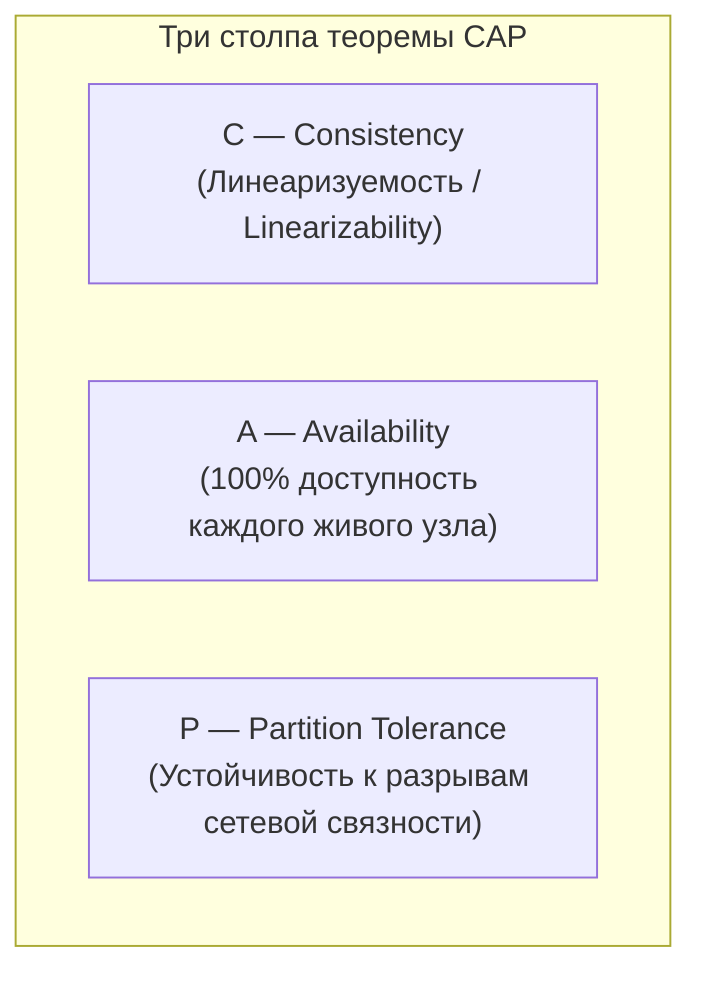
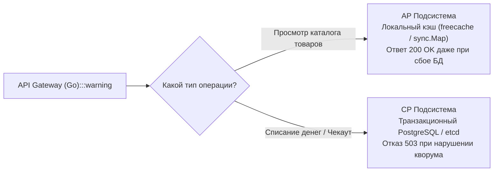

> [!NOTE]
> **Связи:** Эта статья формализует компромиссы надежности, рассмотренные в [[6. Consistency vs availability]], и готовит нас к глубокому анализу компромиссов времени отклика в нормальном режиме: [[8. PACELC]].

В прошлой лекции [[6. Consistency vs availability]] мы препарировали физическую природу непримиримого конфликта между доступностью сервиса и актуальностью его данных при возникновении сетевых сбоев.

В 2000 году на симпозиуме ACM PODC профессор Калифорнийского университета в Беркли Эрик Брюер (Eric Brewer) сформулировал гипотезу, которая спустя два года была математически строго доказана Сетом Гилбертом и Нэнси Линч (Seth Gilbert, Nancy Lynch, MIT). Эта концепция навсегда изменила ландшафт промышленного проектирования баз данных и распределенных бэкендов.

Встречайте **Теорему CAP** (CAP Theorem) — фундаментальный компас System Design и базовую ментальную модель любого архитектора распределенных систем.

---

## Что такое CAP?

Акроним **CAP** объединяет три желаемых качества распределенной системы хранения и обработки данных:



1. **C — Consistency (Согласованность / Линеаризуемость):**
   Каждая завершенная операция чтения возвращает результат самой последней успешной записи во всей системе. Независимо от того, к какому узлу кластера обратился клиент, он видит абсолютно идентичное, неделимое состояние.
2. **A — Availability (Доступность):**
   Каждый работающий (не упавший) узел кластера обязан вернуть клиенту не ошибочный и осмысленный ответ за предсказуемое время. Запрос не должен зависать навсегда или отваливаться по таймауту.
3. **P — Partition Tolerance (Устойчивость к разделению сети):**
   Кластер продолжает функционировать и сохранять свои гарантии даже в условиях, когда сеть между физическими машинами задерживает, дублирует или полностью отбрасывает любое количество пакетов (Network Partition).

Классическая формулировка из университетских методичек гласит: *«Из трех свойств (C, A, P) распределенная система может гарантировать только любые два»*.

Это породило популярную, но **глубоко ошибочную** диаграмму Венна с тремя кругами (CA, CP, AP).

---

## Главный миф: «Выберите любые два»

Многие разработчики на собеседованиях уверенно рисуют треугольник и заявляют: *«Мы строим CA-систему, нам не нужна устойчивость к разделению P»*.

Это фундаментальное непонимание физики распределенных вычислений.

В реальном мире, где серверы соединены сетевыми кабелями, оптоволокном или радиоканалами, отказ сети — это не теоретическая вероятность, а статистическая неизбежность. Вы **не можете «отказаться» от свойства P**. Вы не можете подойти к магистральному оптическому кабелю на дне Атлантического океана и приказать ему: *«Никогда не рвись»*.

> [!important]
> **Истинная формулировка теоремы CAP:**
> Сетевые разделения (**P**) гарантированно произойдут. И в тот момент, когда сеть разорвется, архитектор **обязан выбрать одно из двух**:
> либо **Согласованность (C)** ценой потери доступности,
> либо **Доступность (A)** ценой потери согласованности данных.

Распределенных систем класса **CA не существует в природе**. 
«Система CA» — это ваш локальный сервер PostgreSQL, запущенный на одном физическом ноутбуке без сети. Но как только вы настроили потоковую репликацию на второй узел, вы переступили порог распределенного мира и подчиняетесь закону выбора между **CP** и **AP**.

```mermaid
flowchart TD
    classDef process  fill:#1e293b,stroke:#38bdf8,stroke-width:1px,color:#f8fafc
    classDef success  fill:#064e3b,stroke:#34d399,stroke-width:1px,color:#f8fafc
    classDef error    fill:#7f1d1d,stroke:#f87171,stroke-width:1px,color:#f8fafc
    classDef warning  fill:#78350f,stroke:#fbbf24,stroke-width:1px,color:#f8fafc
    classDef entry    fill:#1e3a5f,stroke:#38bdf8,stroke-width:2px,color:#f8fafc
    classDef aux      fill:#334155,stroke:#64748b,stroke-width:1px,color:#f8fafc
    classDef system   fill:#312e81,stroke:#a78bfa,stroke-width:1px,color:#f8fafc
    classDef data     fill:#132d29,stroke:#2dd4bf,stroke-width:1px,color:#f8fafc
    classDef network  fill:#881337,stroke:#fb7185,stroke-width:1px,color:#f8fafc
    classDef accent   fill:#1e1b4b,stroke:#818cf8,stroke-width:1px,color:#f8fafc
    Normal["Штатный режим: Сеть исправна<br>(Пинг 0.5 мс, потерь нет):::error"] -->|Достижимы одновременно| Happy["И Согласованность (C),<br>и Доступность (A)"]
    Normal -->|🔥 Сетевая авария (Network Partition)| Choice{"Узел изолирован от кластера.<br>Клиент пришел за данными.<br>Что делать?"}
    
    Choice -->|"Приоритет C (CP)"| CP["Отказ в обслуживании!<br>HTTP 503 / Timeout.<br>Данные защищены от Split-Brain"]
    Choice -->|"Приоритет A (AP)"| AP["Отдаем локальный слепок!<br>HTTP 200 OK.<br>Но данные могут быть устаревшими"]
```

---

## CP-системы (Consistency + Partition Tolerance)

Если архитектура выбирает класс **CP**, она ставит абсолютную целостность данных превыше всего. Данные никогда не разойдутся, а состояние никогда не расщепится (`Split-Brain`). Если изолированный узел не может связаться с кворумом кластера, он добровольно отказывается обслуживать запросы на запись или переходит в режим жесткой блокировки.

**Классические представители CP:**
- `etcd` (высоконадежное распределенное хранилище конфигураций на Go, фундамент Kubernetes).
- `Consul` (Service Discovery и KV-хранилище от HashiCorp).
- `Zookeeper` (координатор в распределенных экосистемах Apache).
- `HBase` (распределенная колоночная БД поверх HDFS).
- `MongoDB` (по умолчанию с кворумными настройками `w: "majority"`).
- Реляционные СУБД (PostgreSQL, MySQL) с настроенной **синхронной** репликацией.

---

### Mechanical Sympathy: etcd и потеря кворума

Пакет `etcd` написан на Go и реализует алгоритм распределенного консенсуса **Raft**.
Чтобы любая операция записи (`Put`) была зафиксирована, ее обязано подтвердить **строгое большинство (Кворум)** узлов:

$$\text{Quorum} = \left\lfloor \frac{N}{2} \right\rfloor + 1$$

В классическом кластере из $N = 3$ узлов кворум равен 2.
Представим, что сетевой свитч изолировал один сервер от двух остальных:

```mermaid
flowchart TD
    classDef process  fill:#1e293b,stroke:#38bdf8,stroke-width:1px,color:#f8fafc
    classDef success  fill:#064e3b,stroke:#34d399,stroke-width:1px,color:#f8fafc
    classDef error    fill:#7f1d1d,stroke:#f87171,stroke-width:1px,color:#f8fafc
    classDef warning  fill:#78350f,stroke:#fbbf24,stroke-width:1px,color:#f8fafc
    classDef entry    fill:#1e3a5f,stroke:#38bdf8,stroke-width:2px,color:#f8fafc
    classDef aux      fill:#334155,stroke:#64748b,stroke-width:1px,color:#f8fafc
    classDef system   fill:#312e81,stroke:#a78bfa,stroke-width:1px,color:#f8fafc
    classDef data     fill:#132d29,stroke:#2dd4bf,stroke-width:1px,color:#f8fafc
    classDef network  fill:#881337,stroke:#fb7185,stroke-width:1px,color:#f8fafc
    classDef accent   fill:#1e1b4b,stroke:#818cf8,stroke-width:1px,color:#f8fafc
    subgraph QuorumSide ["Сторона Большинства (2 узла)"]
        N1["Node 1 (Leader):::process"] <--> N2["Node 2 (Follower)"]
        Note1["Кворум 2 из 3 собран!<br>✅ Записи принимаются"]:::process
    end

    subgraph PartitionWall ["🔥 Сетевой барьер (Partition)"]
    end

    subgraph IsolatedSide ["Изолированная сторона (1 узел)"]
        N3["Node 3 (Follower)"]
        Note2["Кворум 1 из 3 потерян!<br>❌ Записи БЛОКИРУЮТСЯ"]:::process
    end

    QuorumSide -.x PartitionWall
    PartitionWall -.x IsolatedSide
```

Если Go-клиент отправит операцию записи на изолированный узел `Node 3`:

```go
package main

import (
	"context"
	"fmt"
	"time"

	clientv3 "go.etcd.io/etcd/client/v3"
)

func WriteToEtcd(cli *clientv3.Client) {
	ctx, cancel := context.WithTimeout(context.Background(), 2*time.Second)
	defer cancel()

	// Если узел отрезан от кворума, операция Put зависнет и вернет context deadline exceeded
	_, err := cli.Put(ctx, "cluster/leader", "node-3")
	if err != nil {
		fmt.Printf("CP Гарантия: запись отклонена из-за потери кворума: %v\n", err)
	}
}
```

Узел `Node 3` не сможет набрать кворум Raft и отклонит запрос по таймауту. Доступность (**Availability**) принесена в жертву, чтобы в кластере не появилось два независимых лидера, перезаписывающих ключи конфигурации.

---

## AP-системы (Availability + Partition Tolerance)

Если система выбирает класс **AP**, ее высший приоритет — гарантировать успешный ответ клиенту здесь и сейчас, даже если узел полностью отрезан от всей остальной вселенной.

**Классические представители AP:**
- `Cassandra` (распределенная БД на основе архитектуры Amazon Dynamo).
- `DynamoDB` (в режиме Eventual Consistency).
- `Riak` и `CouchDB` (мультимастер NoSQL хранилища).
- Реляционные базы данных (PostgreSQL / MySQL) с классической **асинхронной** репликацией.

В AP-системах при разделении сети обе половины кластера продолжат принимать записи от клиентов. Если клиент в Лондоне запишет `name = "A"`, а клиент в Токио одновременно запишет `name = "B"`, оба получат статус 200 OK.

Когда оптоволоконный кабель починят, система попытается слить конфликтующие записи (Eventual Consistency) через алгоритмы Last-Write-Wins (LWW), векторные часы или CRDT (Conflict-free Replicated Data Types).

---

> [!tip] Собеседование: PostgreSQL — это CP или AP система?
> **Вопрос:** К какому классу систем по теореме CAP относится PostgreSQL?
> 
> **Ответ:** Это классический вопрос-ловушка на собеседованиях любого уровня. 
> PostgreSQL (как и большинство современных СУБД) не привязан к одной букве CAP жестко — все зависит от **архитектуры репликации и конфигурационных флагов**:
> 
> 1. **PostgreSQL с асинхронной репликацией (по умолчанию):** Это **AP-система**.
>    Мастер фиксирует транзакцию локально на диск и мгновенно отвечает клиенту 200 OK, не дожидаясь реплики. Если в этот момент сеть рвется, а мастер сгорает, реплика повышается до нового мастера. Недолетевшие по сети транзакции **безвозвратно теряются**. Доступность сохранена, строгая консистентность нарушена.
> 
> 2. **PostgreSQL с синхронной репликацией (`synchronous_commit = on`):** Это **CP-система**.
>    Мастер блокирует ответ клиенту до тех пор, пока хотя бы одна синхронная реплика не запишет WAL-журнал на свой диск. Если сеть между узлами оборвалась, мастер зависает и перестает принимать любые записи. База данных «ложится» (нет доступности), но гарантирует, что ни один байт не потеряется и не рассинхронизируется.

---

## Архитектура: Комбинирование CAP в Go-сервисах

В реальном промышленном проектировании зрелый инженер никогда не строит микросервис целиком как чистый AP или чистый CP. Мы сегментируем бизнес-домены и настраиваем разные гарантии для разных конечных точек:



1. **Каталог товаров, витрина, отзывы (AP-модель):**
   Если основная база данных недоступна из-за сетевого шторма, Go-сервис переключается на чтение из локального in-memory кэша (`sync.Map` или библиотеки `freecache`). Пусть список товаров будет пятиминутной давности — пользователь продолжает серфить сайт.
2. **Оплата, списание баланса, учет билетов (CP-модель):**
   При оформлении заказа продавать одно и то же посадочное место двум пассажирам (Overbooking) категорически запрещено. Здесь мы требуем строгой линеаризуемости. Если сеть до базы данных моргнула — мы возвращаем контролируемую ошибку и просим пользователя повторить попытку позже.

---

### Реализация AP-фолбэка в Go

Идиоматичный подход к реализации AP-поведения в Go опирается на перехват ошибок контекста и отдачу закэшированного слепка данных:

```go
package service

import (
	"context"
	"errors"
	"log/slog"
	"net/http"
	"time"

	"github.com/prometheus/client_golang/prometheus"
	"github.com/prometheus/client_golang/prometheus/promauto"
)

var fallbackCounter = promauto.NewCounter(prometheus.CounterOpts{
	Name: "fallback_responses_total",
	Help: "Количество ответов из аварийного кэша при отказе первичного хранилища",
})

type Product struct {
	ID    string
	Price float64
	Title string
}

type ProductService struct {
	db         DatabaseClient
	localCache LocalCacheClient
	logger     *slog.Logger
}

func (s *ProductService) GetProduct(ctx context.Context, id string) (Product, error) {
	// 1. Устанавливаем жесткий SLA дедлайн на сетевой поход в базу данных
	reqCtx, cancel := context.WithTimeout(ctx, 100*time.Millisecond)
	defer cancel()

	// 2. Пытаемся получить строго актуальные данные (Consistency)
	prod, err := s.db.FetchProduct(reqCtx, id)
	if err == nil {
		// Успех: обновляем локальный кэш свежими данными
		s.localCache.Set(id, prod)
		return prod, nil
	}

	// 3. Анализируем сбой: если это таймаут или сетевой обрыв — включаем AP-деградацию!
	if errors.Is(err, context.DeadlineExceeded) || errors.Is(err, context.Canceled) {
		if cachedProd, found := s.localCache.Get(id); found {
			fallbackCounter.Inc()
			s.logger.WarnContext(ctx, "primary db timeout, serving stale data from local cache",
				slog.String("product_id", id),
			)
			// Возвращаем устаревшие данные: Доступность спасена!
			return cachedProd, nil
		}
	}

	// Данных нет даже в кэше — вынужденный отказ в обслуживании
	return Product{}, err
}
```

---

> [!warning] Ловушка / Gotcha: Деградация способна замаскировать катастрофу
> Если вы внедряете AP-модель с отдачей устаревших данных из кэша, **обязательно экспортируйте метрику** `fallback_responses_total` в Prometheus и настраивайте критический алерт!
> 
> Без метрик вы рискуете оказаться в кошмарной ситуации: база данных упала, сеть разорвана, а сервис продолжает гордо отдавать HTTP 200 OK. Пользователи видят цены полугодовой давности, бизнес терпит миллионные убытки, а дежурные инженеры спят, потому что на графиках HTTP-ошибок (5xx) царит абсолютный штиль.

---

## Итог и эволюция

1. **CAP — это не «выберите 2 из 3»:** В распределенной среде обрыв сети (**P**) неизбежен. Выбор идет строго между **Consistency** и **Availability** в момент аварии.
2. **CP-системы (etcd, Consul):** Выбирают кворум и линеаризуемость, блокируя запросы при сетевой изоляции узлов.
3. **AP-системы (Cassandra, DynamoDB):** Выбирают мгновенную доступность ценой временного расхождения данных.
4. **Гибридный дизайн в Go:** Разделяйте критические финансовые транзакции (CP) и пользовательский контент (AP) с автоматическим фолбэком на локальный кэш.

Однако у теоремы CAP есть один фундаментальный пробел. Она описывает поведение системы **только в момент аварии сети**.

Но что происходит в остальные 99.99% времени, когда сеть полностью исправна? Неужели в мирное время не нужно делать никаких компромиссов?

Нужно! И чтобы описать компромисс между задержкой и согласованностью в штатном режиме, профессор Даниэль Абади создал расширение теоремы CAP, ставшее современным стандартом проектирования: [[8. PACELC]].