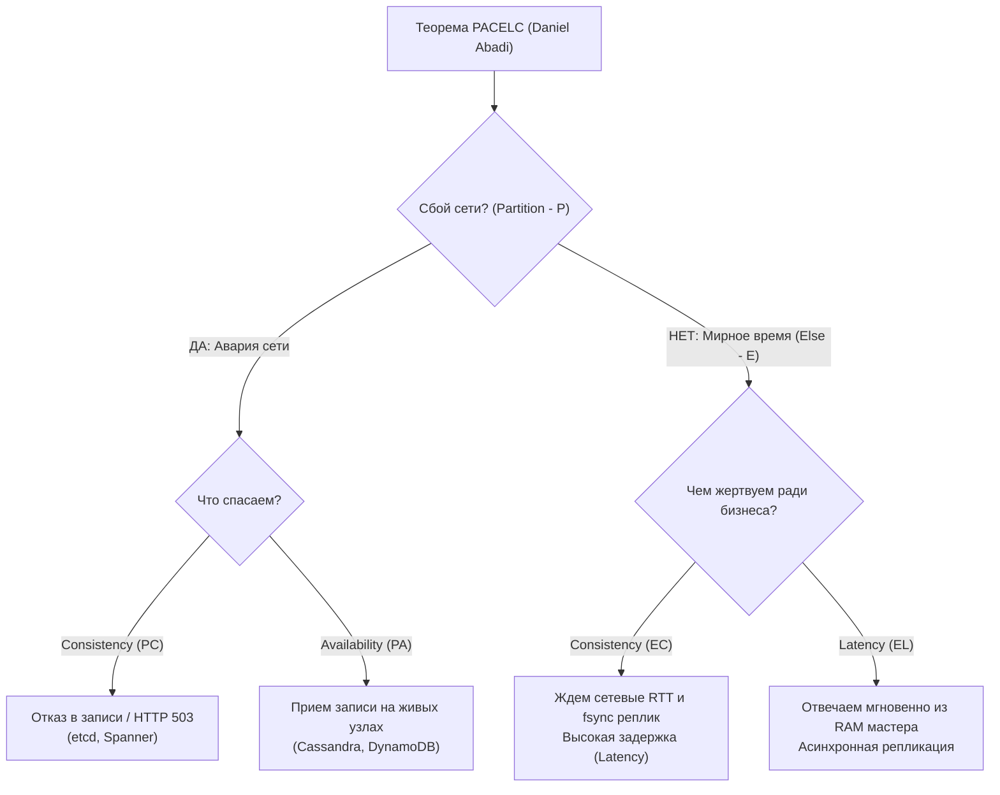
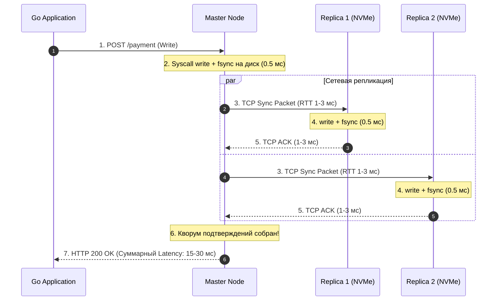
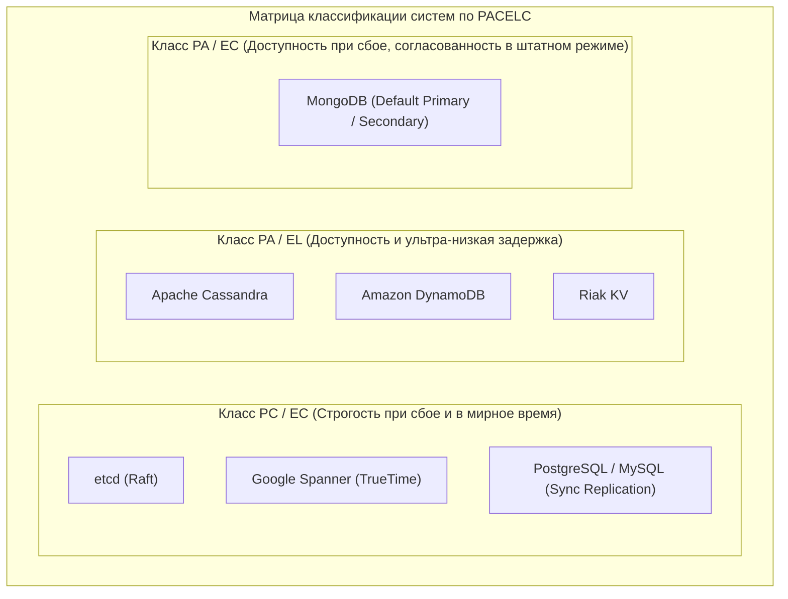

> [!NOTE]
> **Связи:** Эта статья завершает вводный подраздел «01. Основы» раздела 14. Она логически продолжает разбор компромиссов из [[6. Consistency vs availability]] и [[7. CAP теорема на практике]]. Разобранные здесь принципы кворумов станут фундаментом для следующего подраздела «02. Консенсус» и статьи [[4. Quorum]].

В прошлой лекции [[7. CAP теорема на практике]] мы детально разобрали, как ведет себя распределенная система в моменты экстремальных катастроф. Когда магистральный кабель перерублен экскаватором (Network Partition), физика ставит нас перед жестким ультиматумом: либо Согласованность (**C**), либо Доступность (**A**).

Но давайте будем честны с собой. В современных корпоративных дата-центрах и облаках (AWS, Google Cloud, Yandex Cloud) глобальные разрывы сети — это исключительное событие, а не ежедневная рутина. В 99.9% времени сеть полностью исправна: пакеты долетают за доли миллисекунды, оптика цела, коммутаторы работают штатно.

И тут вскрывается главный практический изъян классической теоремы CAP: **она хранит гробовое молчание о том, чем мы жертвуем в мирное время**.

Если в сети нет аварий, означает ли это, что мы можем получить идеальную базу данных, которая одновременно отвечает за 1 миллисекунду и гарантирует строжайшую глобальную линеаризуемость транзакций по всей планете?

Ответ физики — категорическое **нет**.

Чтобы объяснить природу компромисса повседневной работы, в 2010 году профессор Йельского университета Даниэль Абади (Daniel Abadi) сформулировал теорему **PACELC**, ставшую современным индустриальным стандартом описания распределенных хранилищ.

---

## Деконструкция PACELC

Теорема PACELC — это не абстрактное математическое упражнение, а практическая матрица конфигурации любого клиента к базе данных в вашем Go-коде.

Акроним читается как алгоритмическое ветвление:

$$\mathbf{P} \text{ / } \mathbf{A} \text{ or } \mathbf{C} \quad\mathbf{E} \text{LSE}\quad \mathbf{L} \text{ or } \mathbf{C}$$

```text
ЕСЛИ произошел сбой связности сети (Partition — P):
    ЧЕМ мы жертвуем: Доступностью (Availability — A) или Согласованностью (Consistency — C)?
ИНАЧЕ (в штатном, мирном режиме работы — Else — E):
    ЧЕМ мы жертвуем: Задержкой ответа (Latency — L) или Согласованностью (Consistency — C)?
```



Главный фундаментальный инсайт теоремы заключается во второй половине: **$\mathbf{E} \to \mathbf{L} \text{ or } \mathbf{C}$**.
Даже когда в дата-центре царит абсолютный покой, за строгую согласованность данных вы **обязаны расплачиваться временем задержки ответа (Latency)**.

---

## Mechanical Sympathy: Почему Consistency стоит времени?

Спустимся на уровень кремния, дисковых контроллеров и сетевого стека ядра Linux. Почему синхронизация данных физически не может быть бесплатной?

Представим, что ваш Go-микросервис записывает финансовый платеж в распределенный кластер из трех серверов (Master, Replica 1, Replica 2). Go-клиент инициирует сетевой запрос к мастер-узлу.

Если бизнес требует гарантии **Consistency** (строгой согласованности), мастер-узел **не имеет права** вернуть вашему клиенту подтверждение успеха (HTTP 200 OK), пока операция не станет гарантированно доступной на кворуме реплик.



Что происходит на уровне физического железа?
1. Мастер-сервер принимает TCP-пакет, десериализует его в оперативную память.
2. Выполняется системный вызов `write` в журнал упреждающей записи (WAL). Чтобы защититься от обесточивания сервера, вызывается `fsync`. Контроллер NVMe-диска сбрасывает буферы энергонезависимой памяти на флеш-ячейки ($\approx 100-500\text{ мкс}$).
3. Мастер дублирует пакет по сети на Реплику 1 и Реплику 2.
4. Реплики принимают пакет, выполняют системный вызов `write` и собственный `fsync` на свои накопители.
5. Сетевой стек реплик отправляет подтверждение `ACK` обратно мастеру.
6. Мастер собирает кворум подтверждений и лишь затем возвращает ответ в Go-сервис.

Вы ждете физику. Сетевой RTT между серверами внутри одного дата-центра отнимает $0.5-2\text{ мс}$. Если серверы разнесены по разным зонам доступности (Availability Zones) для защиты от катастроф, скорость света в оптоволокне добавляет к каждому RTT еще $2-5\text{ мс}$.

В итоге клиент Go ожидает ответа **15–30 миллисекунд**.

---

> [!info] Под капотом: Асинхронность и Latency (Выбор L)
> Если вы выбираете низкую задержку (**L — Latency**), мастер отвечает клиенту «Успешно» сразу после сохранения в локальный кэш оперативной памяти (шаг 1 или 2).
> 
> Сетевой опрос реплик полностью исключается из критического пути выполнения! Go-клиент получает ответ за ультрабыстрые **1–2 миллисекунды** вместо 25 мс.
> 
> Но вы заплатили за это согласованностью: данные летят на реплики в фоне. Если в следующую миллисекунду стойку мастера физически обесточит аварийный рубильник, клиент уже получил квитанцию об успехе, а транзакция сгорела вместе с оперативной памятью мастера, не успев долететь до дисков реплик (тихая потеря данных — Data Loss).

---

## Классификация систем по PACELC

Теорема PACELC переводит классификацию архитектур из плоского треугольника CAP в полноценное двухмерное пространство инженерных решений:



### 1. Класс PC / EC (Partition: Consistency / Else: Consistency)
Системы бескомпромиссной надежности. Они ставят строгую согласованность превыше всего при любых обстоятельствах:
- При разрыве сети (**PC**): блокируют запись и отказывают в обслуживании, если утерян кворум.
- В мирное время (**EC**): платят высокой задержкой (Latency), дожидаясь подтверждения от кворума реплик и сброса `fsync`.
- *Представители:* `etcd`, `Google Spanner`, реляционные кластеры с синхронной репликацией.

### 2. Класс PA / EL (Partition: Availability / Else: Latency)
Системы экстремальной пропускной способности. Они максимизируют скорость и доступность:
- При разрыве сети (**PA**): продолжают принимать записи на любых изолированных узлах.
- В мирное время (**EL**): отвечают мгновенно, реплицируя данные асинхронно в фоне. Живут по правилам Eventual Consistency.
- *Представители:* `Cassandra`, `Riak`, `DynamoDB`.

### 3. Класс PA / EC (Partition: Availability / Else: Consistency)
Прагматичный гибрид.
- При разрыве сети (**PA**): предпочитает доступность (позволяет вторичным узлам отдавать слегка устаревшие данные на чтение).
- В мирное время (**EC**): все операции записи и чтения по умолчанию синхронизируются через Primary-узел, обеспечивая строгую консистентность ценой задержки.
- *Представители:* дефолтный `MongoDB`.

---

## PACELC на практике в коде Go

Почему понимание PACELC жизненно важно для бэкенд-разработчика?
Потому что в современных распределенных базах данных **вы можете переключать профиль PACELC на уровне отдельных запросов в коде на Go**!

Вам не нужно разворачивать две разные базы данных для разных бизнес-задач. Официальные драйверы баз данных (MongoDB, Cassandra, PostgreSQL) позволяют тонко управлять политиками согласованности через опции записи и чтения (**Write Concern / Read Concern**).

---

> [!warning] Ловушка / Gotcha: Дефолтные настройки драйверов
> Если вы просто открыли сессию и вызвали стандартный метод `.InsertOne()`, вы неявно согласились с дефолтным профилем драйвера.
> 
> Например, во многих старых версиях драйверов дефолтный `Write Concern` подтверждал запись сразу после попадания в сетевой буфер сокета мастера (без ожидания `fsync` и без подтверждения от реплик). При падении ноды данные испарялись.
> 
> Зрелый Senior-инженер на Go всегда осознанно выбирает гарантии записи под конкретный бизнес-сценарий.

---

### Пример: Смещение баланса E (Else) в Go (MongoDB)

Рассмотрим классический микросервис интернет-магазина. У нас есть две совершенно разные операции:
1. **Финансовая транзакция оплаты:** Списание средств требует строгой надежности (**EC** — Consistency).
2. **Логирование кликов и просмотров баннеров:** Требует максимального Throughput и субмиллисекундной задержки (**EL** — Latency).

```go
package main

import (
	"context"
	"time"

	"go.mongodb.org/mongo-driver/mongo"
	"go.mongodb.org/mongo-driver/mongo/options"
	"go.mongodb.org/mongo-driver/mongo/writeconcern"
)

// SaveFinancialTx реализует профиль EC (Consistency in normal time)
func SaveFinancialTx(ctx context.Context, coll *mongo.Collection, doc interface{}) error {
	// 1. WMajority() требует подтверждения от строгого большинства (Кворума) узлов.
	// 2. J(true) принуждает каждую ноду выполнить системный вызов fsync на физический диск!
	// Цена: Задержка возрастает до 20-50 мс, но данные абсолютно защищены от сбоев питания.
	wc := writeconcern.New(
		writeconcern.WMajority(),
		writeconcern.J(true),
		writeconcern.WTimeout(5*time.Second),
	)
	opts := options.InsertOne().SetWriteConcern(wc)

	_, err := coll.InsertOne(ctx, doc, opts)
	return err
}

// SaveClickLog реализует профиль EL (Latency in normal time)
func SaveClickLog(ctx context.Context, coll *mongo.Collection, doc interface{}) error {
	// 1. W(1) требует подтверждения только от ОДНОГО мастер-узла.
	// 2. Журналирование J по умолчанию false — запись подтверждается из оперативной памяти!
	// Цена: Субмиллисекундный отклик (1-2 мс), но риск потери нескольких кликов при крахе мастера.
	wc := writeconcern.New(writeconcern.W(1))
	opts := options.InsertOne().SetWriteConcern(wc)

	_, err := coll.InsertOne(ctx, doc, opts)
	return err
}
```

---

> [!tip] Собеседование: Формула Кворума и связь с PACELC
> **Вопрос:** Что такое формула кворума $R + W > N$ и как она позволяет регулировать баланс между задержкой (Latency) и согласованностью (Consistency)?
> 
> **Ответ:** Кворумная формула — это математический механизм тюнинга между режимами **EC** и **EL**:
> $$R + W > N$$
> где:
> - $N$ — общее число реплик в кластере.
> - $W$ — количество реплик, обязанных подтвердить запись до ответа клиенту.
> - $R$ — количество реплик, опрашиваемых при чтении.
> 
> **Сценарии настройки:**
> 1. **Строгая линеаризуемость (EC):**
>    Мы настраиваем кворум большинства: `W = majority`, то есть `(N/2)+1` серверов по формуле $\left\lfloor \frac{N}{2} \right\rfloor + 1$.
>    При $N = 3$: $W = 2$ и $R = 2$.
>    $$2 + 2 = 4 > 3$$
>    Множество записавших узлов и множество прочитавших узлов **гарантированно пересекаются минимум на одном узле**, содержащем самую свежую версию данных! Плата — задержка ожидания сетевых ответов от `(N/2)+1` узлов.
> 
> 2. **Ультра-быстрая запись (EL):**
>    Мы ставим `W = 1`. Запись завершается мгновенно на первом же сервере. Но тогда для гарантии свежести при чтении придется опрашивать все узлы ($R = N = 3$). Либо при `R = 1` мы соглашаемся на риск чтения устаревших данных (Eventual Consistency).
> 
> Детально механику кворумов мы разберем в лекции [[4. Quorum]].

---

## Итог

1. **CAP описывает катастрофы, PACELC описывает жизнь:** Теорема PACELC расширяет наше понимание распределенных систем, формализуя компромисс штатного режима работы (**Else**).
2. **Плата за согласованность:** В мирное время невозможно получить строгую консистентность даром. За нее всегда приходится платить задержкой (Latency), складывающейся из сетевых RTT до реплик и дисковых `fsync`.
3. **Классификация систем:** Архитектуры делятся на консервативные `PC/EC` (etcd, Spanner) и высокопроизводительные `PA/EL` (Cassandra, DynamoDB).
4. **Гибкость в Go:** Не зашивайте гарантии намертво в выбор СУБД. Используйте Write Concerns и Read Concerns в драйверах Go для тонкой настройки компромисса под каждый конкретный бизнес-процесс.

---

### Подведение итогов подраздела «01. Основы»

Мы завершили фундаментальный вводный подраздел 14-го раздела нашей энциклопедии. Мы прошли грандиозный теоретический и инженерный путь:
1. Разоблачили иллюзию локального вызова функции и осознали физику сетевого стека ([[1. Обзор раздела. Почему распределенные системы сложны]]).
2. Исследовали каскадные аварии, истощение файловых дескрипторов и опасность дефолтных HTTP-клиентов ([[2. Проблемы распределенных систем]]).
3. Изучили 8 заблуждений Питера Дойча, физический предел скорости света и длинные хвосты задержек Tail Latency ([[3. Latency и network fallacies]]).
4. Поняли, почему медленный сервис опаснее мертвого, и вооружились `context.Context` против частичных отказов ([[4. Partial failure]]).
5. Узнали, почему физические кварцевые часы непрерывно врут, как рантайм Go защищает нас монотонным временем и почему Google Spanner использует атомные эталоны TrueTime ([[5. Time и clock drift]]).
6. Разобрали фундаментальный выбор между согласованностью и доступностью ([[6. Consistency vs availability]]).
7. Демистифицировали CAP-теорему Эрика Брюэра и доказали невозможность существования CA-систем в сети ([[7. CAP теорема на практике]]).
8. Систематизировали компромиссы штатного режима работы с помощью теоремы PACELC Даниэля Абади.

Вооружившись этим глубоким теоретическим и физическим фундаментом, мы готовы перейти к сердцу распределенной инженерии — алгоритмам достижения согласия между независимыми узлами в следующем подразделе: **«02. Консенсус»**!