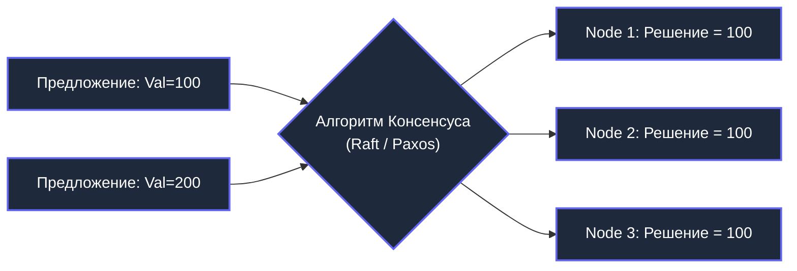
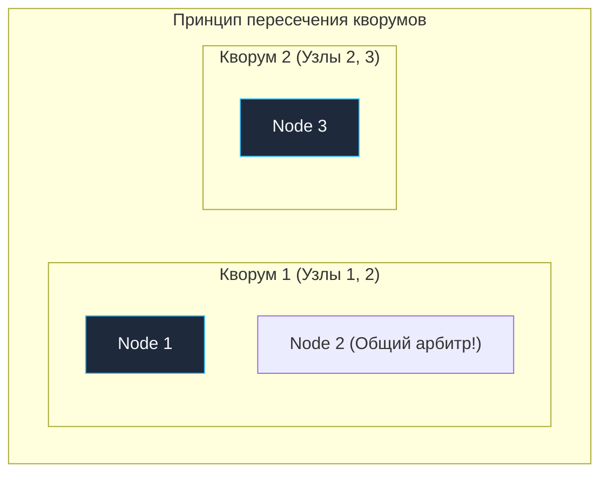

> [!NOTE]
> **Связи:** Эта лекция открывает подраздел «02. Консенсус» 14-го раздела и опирается на фундаментальные выводы из [[8. PACELC]]. Она закладывает базу для детального изучения протокола Raft: [[2. Raft. Основы]], [[3. Raft. Leader election]], [[4. Raft. Log replication]], [[5. Raft. Safety и гарантии]], а также практических паттернов: [[7. Distributed locks]] и [[8. Leader election в системах]].

Вы завершили изучение фундаментальной теории. Теперь вы знаете, что в распределенной среде сеть неизбежно рвется, узлы зависают в состоянии полусмерти, а показания физических часов непрерывно плывут. Теорема PACELC ([[8. PACELC]]) предельно ясно показала: если бизнесу необходима строгая согласованность (**Consistency**), за нее всегда придется платить задержкой ответа (Latency), чтобы узлы успели договориться между собой.

Но как именно они договариваются?

Если в распределенной системе нет ни общего физического процессора, ни разделяемой оперативной памяти, ни абсолютно надежной сети, ни единого источника абсолютного времени — как заставить три, пять или семь серверов в разных дата-центрах прийти к **единому, неделимому и неоспоримому решению**?

Добро пожаловать в тему **Консенсуса (Consensus)**. Это бьющееся сердце любой надежной распределенной системы: от `etcd` в вашем кластере Kubernetes и баз данных CockroachDB до систем оркестрации вроде Temporal и распределенных хранилищ очередей.

---

## Потеря аппаратной магии

Чтобы осознать подлинный масштаб проблемы, вспомним, как элегантно и беззаботно мы решаем задачу согласованности в рамках одного Go-приложения на локальном сервере.

Представьте переменную `balance int64` и две независимые горутины, которые параллельно пытаются ее модифицировать:

```go
package main

import "sync/atomic"

var balance int64

func worker1() {
	atomic.AddInt64(&balance, 100)
}

func worker2() {
	atomic.AddInt64(&balance, -50)
}
```

Мы пишем этот код или защищаем критическую секцию через `sync.Mutex` и спим абсолютно спокойно. Но что в этот момент происходит под капотом на уровне физического кремния?

> [!info] Под капотом: Аппаратный консенсус (MESI)
> Когда компилятор Go видит вызов `atomic.AddInt64`, он транслирует его в атомарную процессорную инструкцию с аппаратным префиксом `LOCK` (например, `LOCK XADD` на архитектуре x86-64).
> 
> Процессор выполняет эту команду через встроенный протокол аппаратной когерентности кэшей (обычно модификации протокола MESI или MOESI). Ядро процессора выставляет сигнал на физической шине памяти (QPI / UPI в Intel или Infinity Fabric в AMD):
> *«Я эксклюзивно захватываю владение этой 64-байтной кэш-линией! Все остальные ядра обязаны инвалидировать свои копии в L1/L2 кэшах!»*.
> 
> Физическая шина материнской платы — это изолированная, сверхбыстрая среда с гарантированной доставкой за доли наносекунды и нулевой вероятностью потери сообщений. Аппаратное железо берет на себя весь груз консенсуса между ядрами процессора.

В распределенной системе **у нас нет материнской платы**.
В ней нет физической шины данных, нет единого контроллера памяти и нет аппаратной инструкции `LOCK`.

Если `Сервер А` и `Сервер Б` пытаются одновременно списать баланс одного и того же клиента, у них нет общей памяти. Единственный способ согласовать свои действия — сформировать TCP-пакет, передать его ядру Linux и выстрелить им в сетевой кабель.

А сеть, как мы уже знаем, способна этот пакет задержать на 20 секунд, сдублировать трижды или бесследно растворить в перегретом коммутаторе.

---

## Проблема Split-Brain (Расщепление мозга)

Главный кошмар любого распределенного инженера — это состояние **`Split-Brain` («расщепление сознания» кластера)**. Оно наступает, когда система теряет способность к согласию и распадается на изолированные сегменты, каждый из которых считает себя единственным законным хозяином кластера и начинает принимать конфликтующие решения.

Рассмотрим классическую задачу: отказоустойчивый планировщик задач (например, сервис отправки биллинговых уведомлений). Чтобы пользователи не получили двойных списаний, в системе должен работать **строго один активный мастер (Лидер)**. Второй сервер (Фолловер) находится в горячем резерве:

```mermaid
flowchart TD
    classDef process  fill:#1e293b,stroke:#38bdf8,stroke-width:1px,color:#f8fafc
    classDef success  fill:#064e3b,stroke:#34d399,stroke-width:1px,color:#f8fafc
    classDef error    fill:#7f1d1d,stroke:#f87171,stroke-width:1px,color:#f8fafc
    classDef warning  fill:#78350f,stroke:#fbbf24,stroke-width:1px,color:#f8fafc
    classDef entry    fill:#1e3a5f,stroke:#38bdf8,stroke-width:2px,color:#f8fafc
    classDef aux      fill:#334155,stroke:#64748b,stroke-width:1px,color:#f8fafc
    classDef system   fill:#312e81,stroke:#a78bfa,stroke-width:1px,color:#f8fafc
    classDef data     fill:#132d29,stroke:#2dd4bf,stroke-width:1px,color:#f8fafc
    classDef network  fill:#881337,stroke:#fb7185,stroke-width:1px,color:#f8fafc
    classDef accent   fill:#1e1b4b,stroke:#818cf8,stroke-width:1px,color:#f8fafc
    subgraph NormalState ["Штатный режим"]
        NodeA1["Узел A (Лидер):::success"] -->|"Heartbeat (OK)"| NodeB1["Узел B (Фолловер)"]
        NodeA1 -->|"Отправляет push"| APNS1[Apple Push Network]
    end

    subgraph PartitionState ["🔥 Авария сети: Split-Brain"]
        NodeA2["Узел A (Считает себя Лидером)"] -.-x|"ОБРЫВ СВЯЗИ"| NodeB2["Узел B (Фолловер)"]
        NodeA2 -->|"Шлет push пользователям"| APNS2[Apple Push Network]
        NodeB2 -->|"Потерял пульс Лидера!<br>Самопровозглашает себя Лидером!"| NodeB2
        NodeB2 -->|"Тоже шлет push пользователям!"| APNS2
    end
```



Что происходит в момент сетевой аварии:
1. Магистральный кабель между стойками обрывается (Network Partition).
2. `Узел B` перестает получать периодические сигналы пульса (heartbeats) от `Узла A`.
3. `Узел B` делает логичный, но фатальный вывод: *«Лидер умер. Я обязан спасти систему, стать новым Лидером и взять управление на себя»*.
4. `Узел A` при этом абсолютно здоров! Он продолжает считать себя единственным Лидером, ведь он ничего не знает о проблемах `Узла B` — для него просто перестал отвечать резервный узел.
5. **Катастрофа:** оба сервера (`Узел A` и `Узел B`) одновременно объявляют себя мастерами и параллельно отправляют миллионы дублирующихся транзакций. Клиенты получают двойные списания, бизнес несет огромные финансовые и репутационные убытки.

Чтобы математически исключить вероятность появления двух лидеров, системе необходим строгий **алгоритм распределенного консенсуса**.

---

## Что такое Консенсус формально?

В компьютерных науках алгоритм консенсуса решает фундаментальную задачу: группа распределенных узлов (часть из которых может в любой момент отказать или выпасть из сети) обязана прийти к единому значению.

Классическое академическое определение требует одновременного выполнения трех обязательных свойств:

1. **Согласованность (Agreement):** Все исправные (честные) узлы кластера обязаны принять **одно и то же** значение. Недопустима ситуация, когда один узел считает лидером сервер 1, а другой — сервер 2.
2. **Валидность (Validity):** Согласованное значение обязано быть предложено одним из узлов-участников. Нельзя схитрить и «договориться» о жестко зашитом числе `0`, чтобы формально удовлетворить первому правилу.
3. **Завершаемость (Termination):** Все исправные узлы в конечном счете приходят к решению за конечное число шагов. Алгоритм не имеет права войти в бесконечный цикл колебаний.



---

> [!tip] Собеседование: Теорема FLP (Fischer, Lynch, Paterson, 1985)
> **Вопрос:** Существует ли идеальный алгоритм консенсуса, который гарантирует 100% результат в любых условиях?
> 
> **Ответ:** Знаменитая теорема FLP (авторы Фишер, Линч и Патерсон, 1985 год) математически доказала фундаментальное ограничение распределенных вычислений:
> 
> > *В полностью асинхронной распределенной сети детерминированный консенсус невозможен даже при наличии всего ОДНОГО потенциально сбойного узла.*
> 
> Физическая причина кроется в том, что в асинхронной сети задержка доставки пакета не ограничена. Наблюдатель **принципиально не способен отличить** навсегда погибший узел от узла, который просто отвечает медленно из-за перегрузки.
> 
> **Как алгоритмы консенсуса (Raft, Paxos) обходят теорему FLP на практике?**
> Они ослабляют предположения об асинхронности:
> 1. Вводят модель **частичной синхронности (Partial Synchrony)** через тайм-ауты (Heartbeat Timeout, Election Timeout).
> 2. Используют **рандомизацию тайм-аутов** (Randomized Backoff), что разрушает детерминированные циклы взаимной блокировки и гарантирует завершение выборов с вероятностью 1.

---

## Основа консенсуса: Кворум (Quorum)

Как гарантировать защиту от `Split-Brain`, если изолированные половины кластера не способны связаться друг с другом?

Ответ дает фундаментальный принцип демократического большинства — **Кворум (Quorum)**.

В распределенных системах кворумом называется строгое большинство узлов:
$$\text{Quorum} = \left\lfloor \frac{N}{2} \right\rfloor + 1$$
где $N$ — общее зарегистрированное количество узлов в кластере.

- В кластере из 3 узлов кворум равен: `(3 / 2) + 1 = 2`.
- В кластере из 5 узлов кворум равен: `(5 / 2) + 1 = 3`.
- В кластере из 7 узлов кворум равен: `(7 / 2) + 1 = 4`.

### Геометрическое свойство кворумов

Главный математический закон гласит: **любые два кворума большинства в одной системе обязаны пересекаться минимум по одному узлу**.

$$\text{Quorum}_1 \cap \text{Quorum}_2 \neq \emptyset$$



Именно этот общий узел (`Node 2` на схеме) выступает неподкупным свидетелем истины. Поскольку по правилам протокола каждый узел имеет право проголосовать только за одного кандидата в рамках одной эпохи (Term), две изолированные половины кластера физически не смогут одновременно набрать большинство голосов!

```go
package consensus

// HasQuorum проверяет, набрано ли строгое большинство голосов
func HasQuorum(totalNodes int, votes int) bool {
	if totalNodes <= 0 {
		return false
	}
	quorumSize := (totalNodes / 2) + 1
	return votes >= quorumSize
}
```

---

> [!warning] Ловушка / Gotcha: Смертельная опасность четного числа узлов
> Распространенная ошибка начинающих девопсов и бэкендеров: *«Мы хотим повысить надежность кластера etcd/Zookeeper, поэтому вместо 3 узлов развернем 4»*.
> 
> Добавление 4-го узла **не увеличивает, а снижает надежность системы!**
> 
> Посчитаем кворум по формуле `(N / 2) + 1`:
> - Для $N = 3$: кворум равен $2$. Кластер переживает падение **1 узла** ($3 - 2 = 1$).
> - Для $N = 4$: кворум равен `(4/2) + 1 = 3`. Кластер по-прежнему переживает падение **только 1 узла** ($4 - 3 = 1$)!
> 
> Но что произойдет, если в 4-узловом кластере сеть разорвет стойку ровно пополам (2 узла против 2)?
> Ни одна из половин не сможет собрать кворум из 3 голосов! **Кластер полностью парализуется и откажет в обслуживании.**
> 
> При $N = 3$ разделение всегда асимметрично: $2$ узла против $1$. Сторона из 2 узлов соберет кворум и продолжит работу.
> **Золотое правило:** Кластеры консенсуса всегда проектируются строго из **нечетного числа серверов (3, 5, 7)**!

---

## Зачем нам Консенсус на практике?

Рядовой бэкенд-инженер на Go редко пишет алгоритм консенсуса с нуля, но архитектура современных облачных систем построена на его фундаменте:

1. **Leader Election (Выборы лидера):** В микросервисной архитектуре мы запускаем 10 реплик одного пода в Kubernetes для отказоустойчивости. Однако фоновые задачи (генерация счетов, начисление зарплат, координатор очередей) обязаны выполняться строго в одном экземпляре. Кластер распределенно выбирает Лидера ([[8. Leader election в системах]]).
2. **Distributed Locks (Распределенные блокировки):** Замена локального `sync.Mutex` в масштабах дата-центра. Гарантирует, что только один сервис во всем облаке может удерживать ресурс или писать в выделенный файл ([[7. Distributed locks]]).
3. **Хранилища конфигураций и Service Discovery:** Системы `etcd` и `Consul` используют консенсус под капотом. Когда вы меняете флаг фичи или мастер базы данных переключается на реплику, консенсус гарантирует, что все сервисы увидят обновленный адрес синхронно и непротиворечиво.

---

## Итог

1. **Консенсус — фундамент распределенной целостности:** Он создает строгую иллюзию единой разделяемой памяти поверх ненадежной сети изолированных серверов.
2. **Защита от Split-Brain:** Математическая гарантия того, что система никогда не разделится на две конфликтующие реальности с независимыми лидерами.
3. **Принцип Кворума `(N/2) + 1`:** Кворумы большинства всегда пересекаются, исключая возможность двойного голосования.
4. **Нечетное число узлов:** Разворачивайте кластеры консенсуса строго по 3, 5 или 7 узлов.

Исторически до 2014 года в теории распределенных систем безраздельно властвовал алгоритм Paxos. Он был математически безупречен, но настолько абстрактен и сложен для практической реализации, что авторы ведущих распределенных баз данных тратили годы на отладку граничных состояний.

В 2014 году исследователи из Стэнфорда Диего Онгаро и Джон Оустерхаут совершили революцию, представив алгоритм **Raft**, созданный с единственной главной целью — быть **понятным и очевидным для инженера**.

В следующей лекции мы детально разберем архитектуру этого шедевра инженерной мысли: [[2. Raft. Основы]].