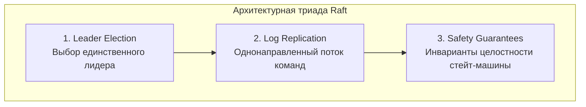
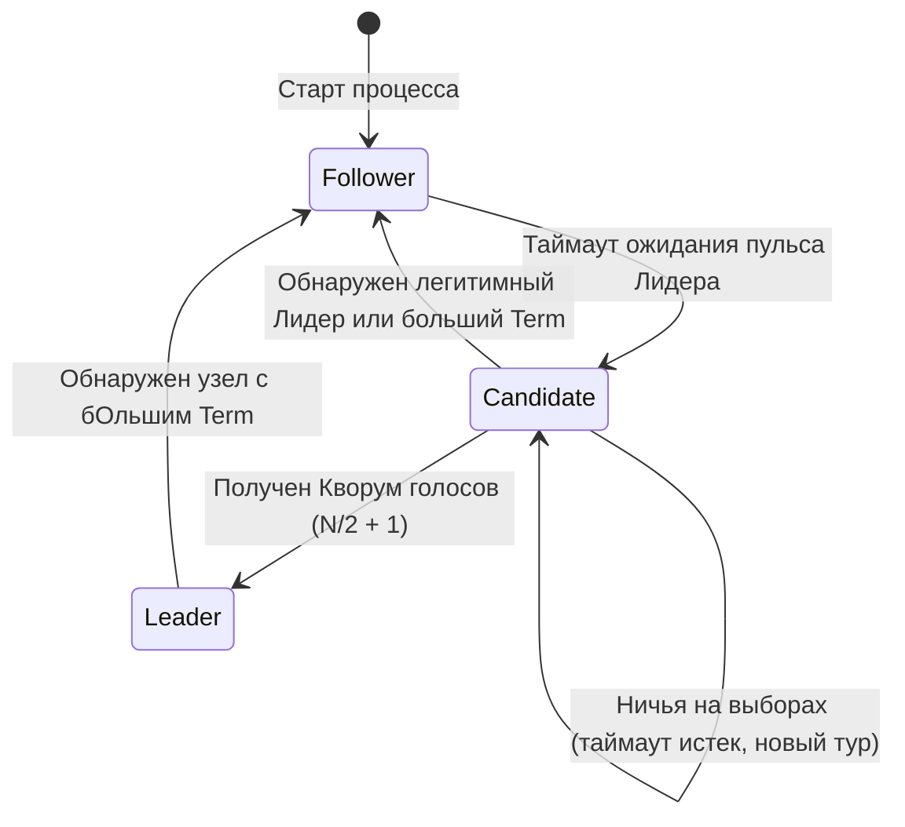
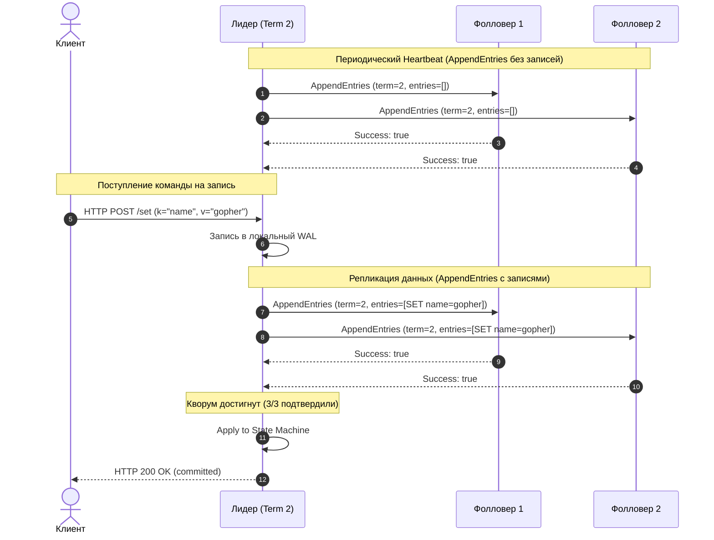

В статье [[1. Зачем нужен consensus]] мы выяснили суровую истину распределенных систем: без математически строгого алгоритма согласования любой распределенный кластер неизбежно развалится на изолированные конфликтующие части (Split-Brain) при первом же кабеле, перекушенном экскаватором, или кратковременном сетевом сбое. 

Долгое время непререкаемым авторитетом в теории распределенных вычислений оставался алгоритм Paxos, предложенный Лесли Лэмпортом в 1989 году (опубликован в 1998 г. в легендарной работе *"The Part-Time Parliament"*). Paxos был математически безупречен, лаконичен и... практически непостижим для рядовых инженеров. 

Создатели Google Chubby (сервиса блокировок на основе Paxos) в знаменитой статье 2007 года констатировали: между строгим математическим описанием алгоритма Paxos и требованиями реальной промышленной отказоустойчивой системы лежит непреодолимая пропасть. Реализация Paxos обрастала сотнями нетривиальных краевых условий. Каждый раз, когда инженеры брались писать код, на свет появлялся новый, закрытый и несовместимый с другими «диалект».

В 2013–2014 годах Диего Онгаро и Джон Оустерхаут из Стэнфордского университета опубликовали революционную работу: *"In Search of an Understandable Consensus Algorithm"*. Их целью было не превзойти Paxos по теоретической пропускной способности, а создать алгоритм, который **человеческий мозг способен понять и безошибочно запрограммировать**.

Так родился **Raft**.

Сегодня Raft — безоговорочный де-факто стандарт в современной облачной инфраструктуре. На нем построены:
* `etcd` — распределенное хранилище метаданных и «мозг» всей платформы Kubernetes;
* `Consul` и `Nomad` от HashiCorp — фундамент service discovery и оркестрации тысяч enterprise-кластеров;
* Распределенные NewSQL-базы данных (CockroachDB, TiDB), где Raft реплицирует диапазоны данных (Range Groups);
* Стриминговые платформы нового поколения (Redpanda), заменившие связку Kafka + ZooKeeper на единый бинарник с собственным движком на Raft.

И самое отрадное для нас: эталонные, наиболее надежные и производительные реализации Raft в мире написаны именно на языке Go (`go.etcd.io/raft` и `hashicorp/raft`).

---

## Декомпозиция сложности

Главная архитектурная инновация Raft заключается не в открытии новых законов физики, а в мудрой декомпозиции. Вместо того чтобы пытаться решить задачу консенсуса единым монолитным математическим уравнением, создатели Raft разделили ее на три независимые и доступные для рассуждения подзадачи:

1. **Leader Election (Выбор лидера):** Кластер обязан в любой момент иметь ровно одного полномочного лидера. Если лидер падает или изолируется, оставшиеся узлы обязаны согласованно и быстро выбрать нового вожака.
2. **Log Replication (Репликация журнала):** Лидер принимает команды записи от клиентов, прикрепляет их к своему журналу (Append-Only Log) и распространяет среди фолловеров так, чтобы каждый узел применил команды в строго одинаковом порядке.
3. **Safety (Безопасность и целостность):** Железная гарантия того, что если какой-либо узел применил запись лога с определенным индексом к своему конечному автомату (State Machine, например базе данных `key-value`), ни один другой узел кластера никогда не применит другую команду на том же самом индексе лога.



В этой статье мы заложим фундамент: разберем жизненный цикл узла, три ключевые роли, концепцию логического времени и сетевые RPC-протоколы.

---

## 1. Роли узлов (Server States)

Raft исповедует парадигму **Сильного Лидера (Strong Leader)**. В нормальном режиме работы все решения принимаются централизованно. Клиенты не могут писать произвольным узлам (как в безлидерных AP-системах вроде Apache Cassandra или Amazon Dynamo, где неизбежно возникают конфликты версий и необходимость согласования по часам или векторным таймстампам). В Raft поток изменений строго однонаправлен: от Лидера к Фолловерам.

В любой момент времени каждый процесс (Go-нода) находится ровно в одном из трех состояний:

* **Фолловер (Follower — Ведомый):** Абсолютно пассивное состояние. Узел не инициирует сетевых запросов самостоятельно; он лишь молча слушает входящие RPC от Лидера или Кандидатов и отвечает на них. Если клиент по ошибке присылает запрос на запись (например, `HTTP POST` или gRPC-вызов) Фолловеру, тот либо возвращает ошибку с адресом действующего Лидера, либо прозрачно проксирует запрос Лидеру.
* **Кандидат (Candidate — Претендент):** Промежуточное кратковременное состояние. Если Фолловер в течение установленного таймаута не получает никаких вестей от Лидера, он заключает, что лидер погиб или изолирован, провозглашает себя Кандидатом, инкрементирует счетчик эпохи и объявляет досрочные выборы.
* **Лидер (Leader — Вожак):** Полномочный правитель кластера. Принимает клиентские операции записи, генерирует записи лога, координирует их репликацию на фолловеры и с периодичностью в десятки миллисекунд отправляет контрольные сигналы пульса (**Heartbeats**), сообщая: «Я жив, выборы начинать запрещено!».



Обратите внимание на симметрию переходов: любой узел — будь то зазнавшийся Кандидат или правящий Лидер — мгновенно и беспрекословно капитулирует и возвращается в роль смиренного Фолловера, как только видит в сети сообщение с номером эпохи выше своего собственного.

> [!info] Под капотом: State Machine в etcd/raft
> В эталонной Go-библиотеке `go.etcd.io/raft` алгоритм реализован по канонам функциональной чистоты — как конечный автомат (State Machine), изолированный от внешнего мира. 
> 
> Сама библиотека **не создает сетевых соединений** (`net.Dial`), не слушает сокеты и **не пишет файлы на диск** (`os.WriteFile`). Она представляет собой детерминированный движок:
> 1. На вход через метод `Step(msg raftpb.Message)` подаются входящие сетевые пакеты или команды пользователя.
> 2. Внутри обновляются структуры в оперативной памяти.
> 3. На выходе через канал `Ready()` библиотека отдает структуру, содержащую:
>    * список сообщений, которые *ваш сетевой транспорт* должен разослать коллегам;
>    * срез записей лога, которые *ваша подсистема хранения* обязана сбросить через `fsync()` в WAL на диске;
>    * зафиксированные записи (committed entries), которые нужно передать вашей бизнес-логике.
> 
> Такая архитектурная развязка делает код etcd эталоном для table-driven тестирования: сложнейшие сетевые разделения, гонки и сбои диска тестируются мгновенно в оперативной памяти без единого реального сетевого сокета!

---

## 2. Эпохи (Terms) — Логическое время Raft

В статье [[5. Time и clock drift]] мы детально разбирали, почему физическим часам серверов (кварцевым генераторам и протоколу NTP) категорически нельзя доверять в задачах упорядочивания распределенных событий. Дрифт таймеров и прыжки времени способны мгновенно разрушить логику транзакций.

Raft элегантно решает эту дилемму, опираясь исключительно на **Логические часы** (вариацию часов Лэмпорта). В терминологии Raft это дискретное время называется **Term** (Эпоха или Срок правления).

```
         ┌─────────────────────────────────────────────────────────────┐
Term 1   │ Лидер A правит, реплицирует лог ... (сбой Лидера A)        │
         └─────────────────────────────────────────────────────────────┘
                                        ▼ (Выборы нового лидера)
         ┌─────────────────────────────────────────────────────────────┐
Term 2   │ Кандидат B избран лидером, правит кластером ...              │
         └─────────────────────────────────────────────────────────────┘
                                        ▼ (Разделение голосов / Split Vote)
         ┌─────────────────────────────────────────────────────────────┐
Term 3   │ Ничья: никто не набрал кворума, выборы провалены            │
         └─────────────────────────────────────────────────────────────┘
                                        ▼ (Новый тур выборов)
         ┌─────────────────────────────────────────────────────────────┐
Term 4   │ Кандидат C избран лидером, нормальная работа                │
         └─────────────────────────────────────────────────────────────┘
```

Каждая эпоха обозначается строго монотонно возрастающим 64-битным беззнаковым целым числом (`uint64`). Каждые выборы начинаются с обязательного инкремента Терма.

Каждый узел обязан непрерывно хранить значение текущей эпохи (`currentTerm`) в энергонезависимой памяти на диске и **прикреплять его к абсолютно каждому сетевому сообщению** (RPC-запросу или ответу).

### Золотые правила Термов в Raft:
1. **Обновление при встрече с будущим:** Если узел получает сетевое сообщение с `term`, который строго больше его локального `currentTerm`, он немедленно перезаписывает свой `currentTerm = msg.Term` и сбрасывает свое состояние до **Фолловера**.
2. **Игнорирование вестей из прошлого:** Если узел получает запрос от узла со старым `term < currentTerm`, этот запрос немедленно отклоняется.
3. **Один лидер на эпоху:** В рамках одного конкретного Терма может быть избран **максимум один Лидер** (или ни одного, если голоса разделились поровну). Два лидера с одинаковым номером эпохи существовать не могут математически, так как для победы требуется строгое большинство голосов.

Это элегантнейшее правило автоматически нейтрализует коварную проблему «зомби-лидеров» при исцелении сетевых разделений.

> [!tip] Собеседование
> **Вопрос:** В кластере из 5 узлов произошел асимметричный обрыв сети (Network Partition). Лидер `A` (Терм 1) и Фолловер `B` оказались в меньшинстве (2 узла). Узлы `C`, `D`, `E` остались в большинстве (3 узла). Что произойдет с кластером, и как поведет себя изолированный лидер `A`?
> 
> **Ответ:** 
> 1. В изолированном сегменте большинства узлы `C`, `D`, `E` перестанут получать Heartbeat от Лидера `A`. У них истечет таймаут выборов.
> 2. Они увеличат свой Терм до 2, и один из них (например, `C`) соберет кворум из 3 голосов (свой + `D` + `E`) и станет легитимным лидером Терма 2. Кластер продолжит обслуживать операции записи и чтения в штатном режиме.
> 3. Старый Лидер `A` все еще наивно полагает, что он правит (в Терме 1). Если клиент пошлет ему запрос на запись, `A` запишет его в свой локальный лог и попытается реплицировать на `B`, `C`, `D`, `E`.
> 4. Но узел `A` может получить подтверждение только от себя и от `B` (2 узла из 5). Поскольку кворум для 5 узлов равен `(5/2) + 1 = 3`, узел `A` **не сможет зафиксировать (commit) ни одной записи** и заблокирует ответ клиенту.
> 5. Когда сетевой кабель починят, новый лидер `C` пришлет узлу `A` сообщение с Термом 2. Лидер `A` сравнит метки времени: `2 > 1`, осознает, что его эпоха безвозвратно ушла, сбросит корону и перейдет в состояние Фолловера. Потери данных и раздвоения состояния не произойдет!

---

## 3. Коммуникация (RPC)

Гениальная простота спецификации Raft видна в ее интерфейсе взаимодействия: для реализации консенсуса, репликации и управления кластером узлам требуется **всего два базовых типа RPC-вызовов** (обычно упакованных в Protobuf и передаваемых поверх gRPC или кастомных TCP-сокетов):

1. **`RequestVote` RPC:**  
   Инициируется исключительно **Кандидатами** во время предвыборной кампании. Кандидат обращается ко всем остальным узлам кластера с аргументами `(candidateId, term, lastLogIndex, lastLogTerm)` и просит отдать за него свой голос.
2. **`AppendEntries` RPC:**  
   Инициируется исключительно действующим **Лидером**. Этот метод выполняет сразу две фундаментальные функции:
   * **Репликация данных:** Передача пачки новых записей лога фолловерам для синхронизации состояния.
   * **Пульс кластера (Heartbeat):** Если новых команд от клиентов нет, Лидер с регулярным интервалом рассылает пустой `AppendEntries` (где срез записей пуст). Получив такой сигнал, Фолловеры убеждаются, что Лидер жив и работоспособен, и перезапускают свои таймеры выборов.



---

## Mechanical Sympathy: Raft Node в рантайме Go

Как концепция математического конечного автомата проецируется на идиоматичные конструкции Go — горутины, каналы и планировщик? 

В промышленном коде управления состоянием узла часто используется паттерн **Actor / Single-Threaded Event Loop**. Вся внутренняя мутация структур ноды выполняется строго внутри **одной управляющей горутины** через цикл с конструкцией `select`. Это избавляет кодовую базу от ада распределенных мьютексов (`sync.Mutex`), защищая код от взаимных блокировок (Deadlocks) и дорогостоящей конкуренции за кэш-линии процессора (Cache Line Bouncing).

Взглянем на скелет управляющего цикла ноды:

```go
package raft

import (
	"context"
	"time"
)

type State int

const (
	Follower State = iota
	Candidate
	Leader
)

type Entry struct {
	Index uint64
	Term  uint64
	Data  []byte
}

type AppendEntriesMsg struct {
	Term     uint64
	LeaderID string
	Entries  []Entry
	RespCh   chan bool
}

type RequestVoteMsg struct {
	Term        uint64
	CandidateID string
	RespCh      chan bool
}

type RaftNode struct {
	state State
	term  uint64
	log   []Entry

	// Каналы для приема входящих RPC-сообщений
	appendEntriesCh chan AppendEntriesMsg
	requestVoteCh   chan RequestVoteMsg

	heartbeatInterval time.Duration
	electionTimeout   time.Duration
}

func (n *RaftNode) Run(ctx context.Context) {
	// Внимание: для предотвращения утечек памяти в долгоживущих циклах
	// создаем таймер явно, а не дергаем time.After() на каждой итерации
	electionTimer := time.NewTimer(n.randomElectionTimeout())
	defer electionTimer.Stop()

	for {
		select {
		case <-ctx.Done():
			return

		// Обработка AppendEntries от Лидера (данные или Heartbeat)
		case msg := <-n.appendEntriesCh:
			n.handleAppendEntries(msg)
			// Сброс таймера выборов при получении валидного пульса
			n.resetTimer(electionTimer, n.randomElectionTimeout())

		// Обработка предвыборных запросов голоса
		case msg := <-n.requestVoteCh:
			n.handleRequestVote(msg)

		// Срабатывание таймера выборов (лидер замолчал)
		case <-electionTimer.C:
			if n.state == Follower || n.state == Candidate {
				// Увеличиваем Терм, голосуем за себя, рассылаем RequestVote
				n.becomeCandidate()
			}
			n.resetTimer(electionTimer, n.randomElectionTimeout())
		}
	}
}

func (n *RaftNode) resetTimer(t *time.Timer, d time.Duration) {
	if !t.Stop() {
		select {
		case <-t.C:
		default:
		}
	}
	t.Reset(d)
}

func (n *RaftNode) randomElectionTimeout() time.Duration {
	// В реальном коде рандомизация предотвращает разделение голосов (Livelock)
	return n.electionTimeout
}

func (n *RaftNode) handleAppendEntries(msg AppendEntriesMsg) {
	// Если входящий Терм больше нашего — признаем нового лидера
	if msg.Term > n.term {
		n.term = msg.Term
		n.state = Follower
	}
	msg.RespCh <- true
}

func (n *RaftNode) handleRequestVote(msg RequestVoteMsg) {
	// Логика проверки актуальности лога и Терма кандидата
	msg.RespCh <- true
}

func (n *RaftNode) becomeCandidate() {
	n.state = Candidate
	n.term++
}
```

> [!tip] Механическое сочувствие: Почему в циклах опасен `time.After`?
> В наивных реализациях часто пишут `case <-time.After(d):`. 
> Помните, что каждый вызов `time.After()` создает новый объект таймера в куче и внутренний канал, который **не освобождается сборщиком мусора до тех пор, пока таймер не истечет**! 
> Если в ваш `appendEntriesCh` сыпятся сотни сообщений в секунду, вызовы `time.After` на каждой итерации переполнят кучу миллионами брошенных объектов таймеров, вызвав колоссальное давление на GC (Garbage Collector thrashing) и внезапные задержки Stop-The-World. Всегда переиспользуйте один экземпляр `time.NewTimer` с корректным сбросом `Reset()`.

---

## 4. Подводные камни и сетевые ловушки

> [!warning] Ловушка / Gotcha: Асимметричный обрыв сети и спам эпохами
> Представьте классическую сетевую коллизию: узел `A` (действующий Лидер) исправно передает сетевые пакеты узлу `B` (Фолловер), но сетевой свитч поврежден так, что обратные ACK-пакеты от `B` к `A` теряются (однонаправленный разрыв). Либо узел `B` вообще полностью изолирован от Лидера `A`, но прекрасно «слышит» остальные узлы `C`, `D`, `E`.
> 
> Что происходит по базовому протоколу Raft?
> 1. Узел `B` перестает получать Heartbeat от `A`. Таймер `B` истекает.
> 2. Узел `B` переходит в состояние Кандидата, увеличивает Терм (`term = 5`) и рассылает `RequestVote`.
> 3. Остальные узлы отклоняют его кандидатуру (ведь у них лог длиннее или они видят живого Лидера `A`), но в заголовке пакета от `B` указан `term = 5`.
> 4. Действующий Лидер `A`, увидев пакет с `term = 5` (в то время как у него был `term = 4`), по правилам Raft **обязан немедленно сложить полномочия и стать Фолловером**!
> 5. Кластер погружается в хаос постоянных перевыборов: `B` не может победить, но каждый раз взвинчивает Терм и сбивает настоящего лидера.
> 
> **Как это решено на практике?**
> В современных реализациях (включая `etcd/raft`) внедрен механизм **PreVote (Предвыборная кампания)**:
> Перед тем как реально инкрементировать свой `currentTerm` и переходить в статус Кандидата, узел рассылает кластеру легковесный пробный запрос: *«Коллеги, у меня пропал пульс. Если бы я объявил выборы, вы бы проголосовали за меня?»*. 
> Если изолированный узел `B` получает отказ от большинства, он **не имеет права повышать Терм** и не нарушает покой действующего кластера.

---

## Итог

1. **Raft** принес в индустрию долгожданную ясность: он декомпозировал мистику распределенного консенсуса на понятные кирпичики — выбор лидера, репликацию лога и сохранение безопасности.
2. Архитектура держится на трех китах:
   * **Сильный Лидер (Strong Leader):** Централизованная точка упорядочивания операций без междоусобных конфликтов.
   * **Логические эпохи (Terms):** Монотонные счетчики времени, защищающие кластер от старых лидеров и рассинхронизации.
   * **Кворум большинства ($N/2 + 1$):** Базовое математическое свойство непересекающихся множеств, исключающее возникновение двух лидеров.
3. Простая система коммуникации всего из двух типов RPC — `RequestVote` и `AppendEntries` — обеспечивает как синхронизацию данных, так и контроль жизнеспособности узлов.

Мы заложили фундаментальный каркас. Но как именно Кандидат собирает голоса? Почему таймауты выборов (`randomElectionTimeout`) обязаны быть псевдослучайными, и что произойдет, если разработчик забудет инициализировать генератор случайных чисел `math/rand`? Об этом — в следующей статье: [[3. Raft. Leader election]].