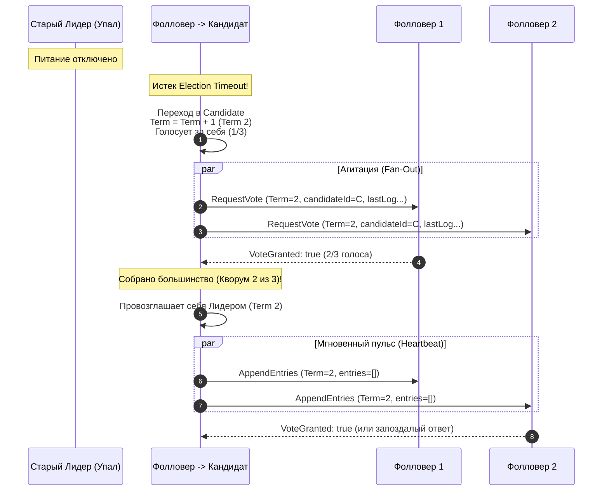
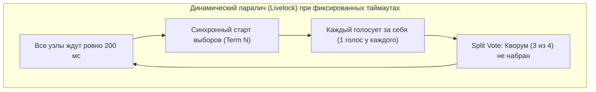
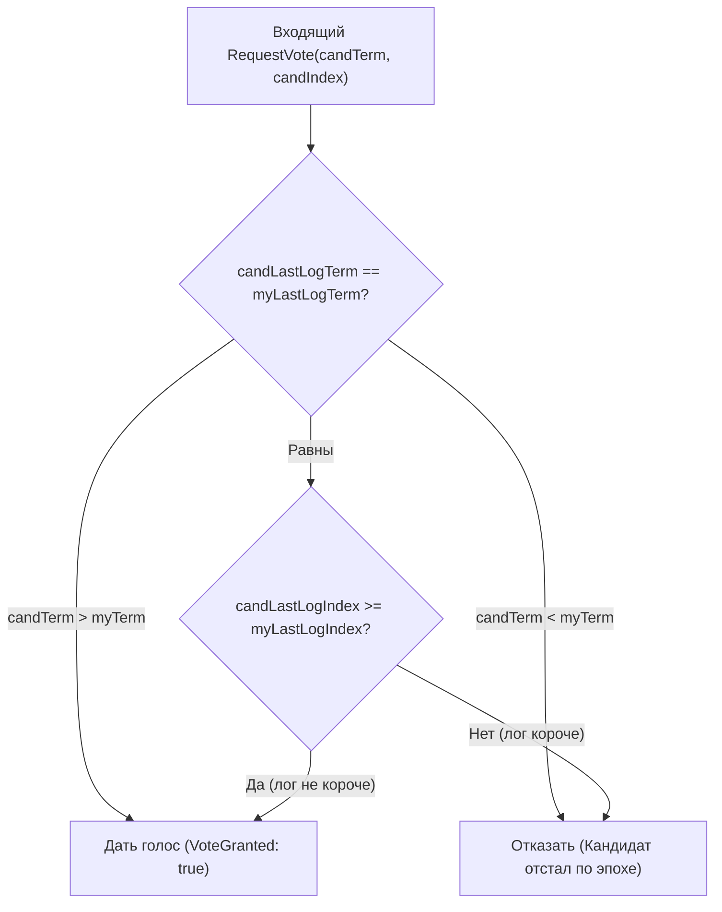

В прошлой статье [[2. Raft. Основы]] мы разобрались с фундаментальным каркасом распределенного консенсуса: познакомились с тремя ролями узлов и увидели, как логическое время (Эпохи или `Term`) защищает распределенную систему от анархии. В нормальном режиме работы кластером безраздельно управляет Сильный Лидер (Strong Leader), а остальные узлы смиренно пребывают в роли Фолловеров, исполняя его команды и регулярно получая контрольные сигналы пульса (`Heartbeat`).

Но распределенные системы живут в суровом физическом мире, где серверы выключаются уборщицами, ядра Linux зависают в kernel panic, а сетевые коммутаторы внезапно делят стойку пополам. Что происходит, когда Лидер внезапно замолкает? 

Как группа равноправных серверов, не имеющих общего диска, разделяемой оперативной памяти или внешнего арбитра, способна за доли секунды договориться и избрать нового единого лидера? Причем сделать это так, чтобы ни при каких условиях не расколоться на два враждующих лагеря?

Выборы в Raft — это шедевр инженерного прагматизма, основанный на таймаутах, теории вероятностей и строгом правиле большинства.

---

## 1. Анатомия выборов: От молчания к власти

Всё начинается с тревожной тишины. 

У каждого Фолловера в кластере непрерывно тикает таймер ожидания — **Election Timeout** (Таймаут выборов). Пока действующий Лидер жив и находится в здравии, он с высокой частотой (обычно каждые 50–100 миллисекунд) рассылает пустые RPC-пакеты `AppendEntries`. Получая очередной Heartbeat, Фолловер убеждается, что центр управления на месте, и обнуляет свой таймер выборов.

Но вот питание стойки Лидера отключилось. Очередной пульс не пришел. Миллисекунды бегут, и таймер одного из Фолловеров доходит до нуля.



В этот момент запускается строгий конечный автомат:
1. **Смена роли:** Фолловер разрывает пассивное ожидание и переходит в статус **Кандидата (Candidate)**.
2. **Новая эпоха:** Кандидат делает `term++`. Это торжественный манифест: *«Предыдущая эпоха завершилась, я открываю выборы Терма $N+1$»*.
3. **Голос за себя:** Кандидат незамедлительно отдает собственный голос самому себе (счетчик голосов `votes = 1`).
4. **Агитация (Broadcast):** Кандидат параллельно рассылает RPC-сообщение `RequestVote` всем остальным узлам кластера, требуя признать его верховную власть.

> [!warning] Ловушка / Gotcha: Правило одного голоса в рамках эпохи
> Фундаментальное ограничение Raft гласит: **Каждый узел имеет право проголосовать максимум за одного кандидата в рамках одного конкретного Терма**.
> 
> Голос отдается по принципу *First-Come, First-Served* (кто первый постучался и удовлетворил критериям актуальности лога, тот и получил мандат). Если чуть позже придет запрос от другого Кандидата с тем же самым Термом, узел непреклонно ответит: `VoteGranted: false`. 
> 
> Поскольку для победы требуется строгое большинство голосов ($\lfloor N/2 \rfloor + 1$), а два большинства в одной группе всегда пересекаются хотя бы по одному узлу (принцип Дирихле), **два разных Кандидата физически не могут одновременно собрать кворум в одном Терме**.

У предвыборной кампании Кандидата есть ровно три возможных финала:
* **Триумф:** Кандидат собирает голоса большинства узлов кластера, немедленно надевает корону Лидера и рассылает по сети подавляющий залп Heartbeat-сообщений, заставляя замолчать всех остальных претендентов.
* **Капитуляция:** Во время ожидания ответов Кандидат получает `AppendEntries` от другого узла, чей `Term` больше или равен его текущему. Это означает, что кто-то другой уже победил на выборах. Кандидат признает поражение и покорно возвращается в статус Фолловера.
* **Ничья (Split Vote):** Голоса избирателей разделились поровну (например, в кластере из 4 узлов два кандидата набрали по 2 голоса). Ни один не набрал кворум (3 голоса). По истечении таймера выборов раунд аннулируется, и начинается новый тур.

---

## 2. Mechanical Sympathy: Таймеры в рантайме Go

Таймаут выборов — сердце отказоустойчивости Raft. Однако неопытный инженер, проектирующий ноду на Go, легко может создать мину замедленного действия прямо в диспетчере событий узла.

Взгляните на типичный антипаттерн, который часто можно встретить в сырых реализациях:

```go
// АНТИПАТТЕРН: Скрытая утечка памяти и деградация GC!
func (n *RaftNode) followerLoop() {
    for {
        select {
        case msg := <-n.rpcCh:
            n.handleRPC(msg)
            // Иллюзия: разработчик думает, что переход на следующую итерацию
            // "отменяет" предыдущий таймаут...
        case <-time.After(300 * time.Millisecond):
            n.becomeCandidate()
            return
        }
    }
}
```

> [!info] Под капотом: Почему `time.After` в цикле — архитектурный яд
> Давайте заглянем внутрь рантайма Go. Функция `time.After(d)` под капотом вызывает `time.NewTimer(d)` и возвращает его внутренний канал. 
> 
> Экземпляр структуры `Timer` выделяется в куче (heap) и регистрируется в четырехричной куче таймеров процессора `P` (quad-heap `p.timers` в рантайме Go). 
> 
> Самое коварное: объект таймера и его канал **не будут утилизированы сборщиком мусора до тех пор, пока таймер честно не дотикает до конца**! 
> 
> Если Лидер шлет Heartbeat каждые 50 миллисекунд, наш цикл `select` просыпается 20 раз в секунду. На каждой итерации вызов `time.After` порождает новый таймер. За 300 миллисекунд в памяти зависает пачка неутилизированных таймеров. В высоконагруженных системах с тысячами запросов в секунду это приводит к лавинообразному замусориванию памяти, деградации планировщика рантайма при обходе очередей процессоров `P` и внезапным спайкам задержек (latency spikes) из-за работы GC.

### Идиоматичный подход (Zero Allocation Timer Pattern)

Чтобы добиться максимальной предсказуемости и нуля мусорных аллокаций, необходимо использовать единственный постоянный `time.Timer`, корректно сбрасывая его состояние:

```go
// ИДИОМАТИЧНЫЙ ПОДХОД: Эффективное переиспользование таймера
func (n *RaftNode) followerLoop() {
    timeout := n.randomElectionTimeout()
    timer := time.NewTimer(timeout)
    // Обязательно останавливаем таймер при завершении функции,
    // чтобы освободить слот в runtime.timers
    defer timer.Stop()

    for {
        select {
        case msg := <-n.rpcCh:
            n.handleRPC(msg)

            // Канонический алгоритм сброса таймера в Go
            if !timer.Stop() {
                // Если таймер уже сработал и тик отправлен в канал C,
                // вычитываем его, чтобы избежать ложного срабатывания
                select {
                case <-timer.C:
                default:
                }
            }
            timer.Reset(n.randomElectionTimeout())

        case <-timer.C:
            // Пульс не пришел вовремя — объявляем выборы!
            n.becomeCandidate()
            return
        }
    }
}
```

---

## 3. Проблема ничьей и магия Рандомизации

Представьте детерминированный мир. Кластер из 4 узлов. Лидер выходит из строя. У всех трех оставшихся серверов таймаут выборов сконфигурирован одинаково: ровно `200ms`.

Что произойдет? Произойдет идеальная инженерная катастрофа:
1. Ровно через 200.000 мс у всех трех серверов одновременно срабатывают таймеры.
2. Все три сервера одновременно переходят в состояние Кандидатов, инкрементируют Терм до 2 и голосуют сами за себя.
3. Каждый рассылает запрос `RequestVote` двум своим соседям.
4. Но соседи уже проголосовали за себя в Терме 2! Они отклоняют чужие запросы (`VoteGranted: false`).
5. Ни один узел не может набрать кворум (для 4 узлов кворум равен 3).
6. Проходит еще 200 мс... и цикл повторяется снова! Терм 3, ничья. Терм 4, ничья.



Кластер попадает в классический **Livelock** (динамический тупик). Сеть гудит от сообщений, CPU загружен на 100%, алгоритм безупречно исполняется, но полезная работа равна нулю.

Диего Онгаро предложил гениальное по своей простоте лекарство: **псевдослучайная рандомизация таймаутов выборов**.

Вместо фиксированного значения таймаут выбирается случайно из диапазона $[T, 2T]$ (обычно от 150 до 300 мс):

$$\text{ElectionTimeout} \in [T, 2T]$$

```
Узел 1: [====== 165 ms ======] -> ПРОСНУЛСЯ! Стал Кандидатом, собрал голоса
Узел 2: [============== 240 ms ==============] -> Еще спит, голосует за Узел 1
Узел 3: [================== 295 ms ==================] -> Еще спит, голосует за Узел 1
```

Благодаря случайному разбросу один из узлов *практически гарантированно* проснется раньше конкурентов (например, через 165 мс, пока остальные планируют спать до 240 мс и 295 мс). Этот узел успеет объявить себя Кандидатом, отправить RPC и получить голоса пока еще спящих Фолловеров до того, как они вообще осознают факт исчезновения Лидера.

---

## 4. Защита от глупца: Election Restriction

Рандомизация спасает от ничьей, но порождает еще более опасную угрозу: **риск потери данных**.

Представьте сценарий: сервер `Node-3` из-за локального сетевого сбоя отключился от кластера на 10 минут. Пока он был изолирован, Лидер и остальные узлы успешно обработали 100 000 финансовых транзакций. Затем сеть восстанавливается. У `Node-3` истекает таймаут выборов. По воле генератора случайных чисел `Node-3` выбирает таймаут 150 мс и просыпается раньше всех!

Неужели этот отставший узел с пустым логом станет новым Лидером и заставит весь кластер стереть 100 000 транзакций?

Raft категорически запрещает подобный сценарий с помощью правила **Election Restriction (Ограничение на избрание)**.

В запросе `RequestVote` Кандидат обязан передать координаты окончания своего журнала:
* `LastLogIndex` — порядковый номер последней записи в своем логе;
* `LastLogTerm` — эпоха, в которой была создана эта последняя запись.

Фолловер, получив запрос на голосование, сопоставляет лог претендента со своим собственным:
1. **Сравнение эпох:** Если `LastLogTerm` Кандидата меньше, чем `LastLogTerm` Фолловера, Кандидат безнадежно отстал от жизни. **Отказ в голосе.**
2. **Сравнение длины:** Если `LastLogTerm` одинаковы, но `LastLogIndex` Кандидата меньше, чем у Фолловера, лог Кандидата короче. **Отказ в голосе.**
3. **Согласие:** Только если лог Кандидата *не менее актуален*, чем собственный лог Фолловера, голос отдается.



> [!tip] Собеседование
> **Вопрос:** Гарантирует ли протокол Raft, что победителем на выборах обязательно станет узел с *самым длинным* логом в кластере?
> 
> **Ответ:** Нет! Это распространенное заблуждение на собеседованиях. Raft гарантирует лишь то, что избранный узел содержит **все зафиксированные (committed) записи**. 
> 
> Упавший узел мог успеть записать несколько незафиксированных записей в хвост своего лога перед крушением (например, его лог имеет длину 15, но закоммичено только 10). Победителем вполне может стать другой узел с длиной лога 12, если за него проголосует большинство кластера. Главное условие — лог победителя должен быть не менее актуален, чем логи сформировавшего его кворума.

---

## 5. Go-реализация: Параллельный сбор голосов

Сетевые вызовы — медленные I/O-операции. Если опрашивать членов кластера последовательно в цикле `for`, общее время выборов превысит любые допустимые таймауты. 

Кандидат обязан опрашивать всех пиров **строго параллельно** с использованием паттерна Fan-Out / Fan-In.

Ниже приведена чистая и безопасная реализация сбора голосов на Go:

```go
package raft

import (
	"sync"
)

type RequestVoteArgs struct {
	Term         uint64
	CandidateID  string
	LastLogIndex uint64
	LastLogTerm  uint64
}

type RequestVoteReply struct {
	Term        uint64
	VoteGranted bool
}

func (n *RaftNode) startElection() {
	n.mu.Lock()
	n.term++
	n.state = Candidate
	n.votedFor = n.id // Голосуем за себя
	savedTerm := n.term
	n.mu.Unlock()

	votes := 1 // Собственный голос уже в кармане
	quorum := (len(n.peers) / 2) + 1

	// ВАЖНО: Буферизованный канал на полный размер кластера!
	// Это защищает горутины от зависания (Goroutine Leak) при досрочном выходе.
	voteCh := make(chan bool, len(n.peers))

	// Fan-Out: запускаем асинхронный опрос всех узлов
	for _, peerID := range n.peers {
		go func(id string) {
			req := RequestVoteArgs{
				Term:         savedTerm,
				CandidateID:  n.id,
				LastLogIndex: n.log.lastIndex(),
				LastLogTerm:  n.log.lastTerm(),
			}

			reply, err := n.rpcClient.SendRequestVote(id, req)
			if err != nil {
				voteCh <- false
				return
			}

			n.mu.Lock()
			defer n.mu.Unlock()

			// Если узел ответил Термом из будущего — немедленно капитулируем
			if reply.Term > n.term {
				n.becomeFollower(reply.Term)
				voteCh <- false
				return
			}

			voteCh <- reply.VoteGranted
		}(peerID)
	}

	// Fan-In: подсчет голосов по мере их поступления
	for i := 0; i < len(n.peers); i++ {
		if <-voteCh {
			votes++
		}

		n.mu.Lock()
		// Проверяем инвариант: пока мы ждали сеть, мы могли перестать быть кандидатом
		// (например, пришел Heartbeat от более авторитетного лидера)
		if n.state != Candidate || n.term != savedTerm {
			n.mu.Unlock()
			return
		}

		// Досрочная победа: кворум собран, не ждем медленных отстающих узлов!
		if votes >= quorum {
			n.becomeLeader()
			n.mu.Unlock()
			return
		}
		n.mu.Unlock()
	}
}
```

> [!info] Под капотом: Буферизация каналов и утечки горутин
> Обратите внимание на строку: `voteCh := make(chan bool, len(n.peers))`. 
> 
> Если сделать этот канал небуферизованным (`make(chan bool)`), и кандидат наберет кворум уже на втором ответе, выполнится `return`. Функция завершится, и канал перестанет вычитываться. 
> 
> Оставшиеся фоновые горутины, когда их сетевые запросы наконец вернутся через пару секунд, попытаются выполнить `voteCh <- reply.VoteGranted` и **намертво заблокируются навсегда**. В Go такие зомби-горутины удерживают свои стеки в памяти и никогда не утилизируются GC. Буфер размером `len(n.peers)` гарантирует неблокирующую запись и чистое завершение всех дочерних горутин.

---

## Итог

1. **Тишина порождает власть:** Выборы в Raft инициируются отсутствием сетевых сигналов пульса от старого Лидера по истечении `Election Timeout`.
2. **Рандомизация уничтожает Livelock:** Выбор случайного времени ожидания в интервале $[T, 2T]$ разбивает симметрию и позволяет одному кандидату успеть собрать большинство голосов без конкуренции.
3. **Election Restriction хранит историю:** Отстающие узлы математически не могут стать лидерами благодаря валидации `LastLogTerm` и `LastLogIndex` кворумом.
4. **Zero-Allocation таймеры в Go:** Использование одиночного `time.Timer` вместо разовых `time.After` внутри циклов предотвращает деградацию рантайма и всплески Stop-the-World пауз сборщика мусора.

Лидер триумфально избран и наделен абсолютной властью. Теперь перед ним встает главная задача: безопасно принимать команды от клиентов и распространять их по кластеру. О том, как устроен журнал репликации и как Лидер восстанавливает согласованность логов у заблудших Фолловеров, мы узнаем в следующей статье: [[4. Raft. Log replication]].