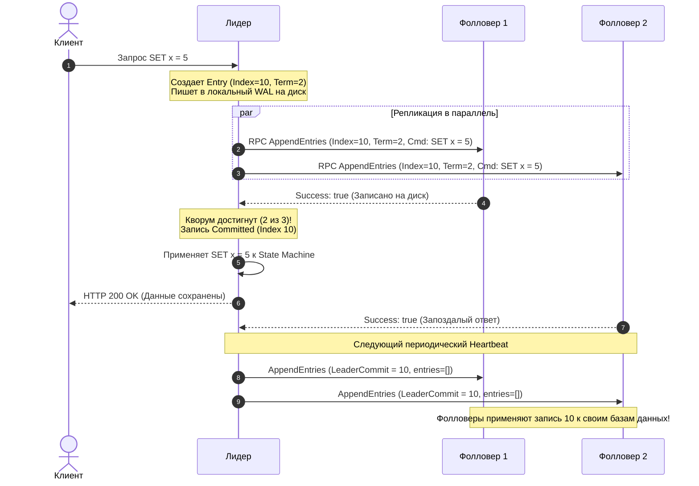
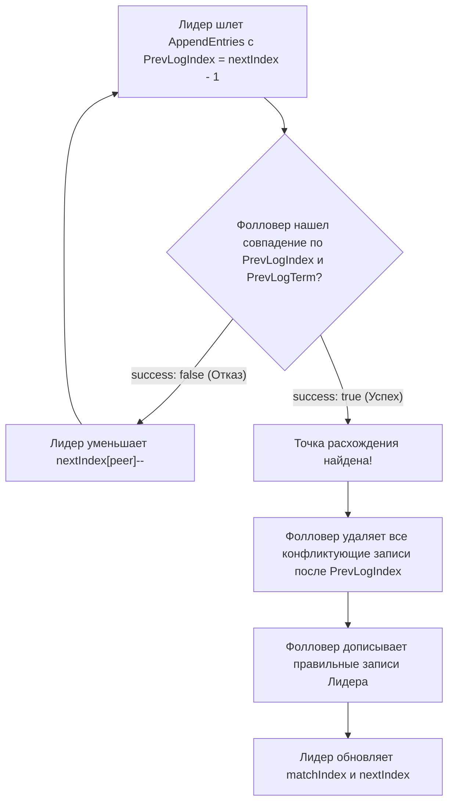

В прошлой статье [[3. Raft. Leader election]] мы разобрались, как группа изолированных серверов через случайные таймауты и строгое правило большинства выбирает единого Лидера. Теперь кластер обрел полномочного правителя.

С этого момента вся власть сосредоточена в одних руках. Главная и непреложная обязанность Лидера — принимать команды от внешних клиентов, гарантированно сохранять их на дисках большинства узлов и реплицировать так, чтобы ни единый байт пользовательских данных не исчез даже при внезапном обесточивании дата-центра.

Этот процесс называется **Репликацией лога (Log Replication)**.

В основе современной отказоустойчивой архитектуры лежит классическая концепция компьютерных наук — **State Machine Replication (SMR, Репликация конечного автомата)**, сформулированная Фредом Шнайдером еще в 1990 году. Принцип поразительно прост и математически безупречен:
> Если два детерминированных конечных автомата (сервера) стартуют из одного и того же начального состояния $S_0$ и применяют абсолютно идентичную последовательность входных команд $[C_1, C_2, \dots, C_n]$ в строго одинаковом порядке, они гарантированно окажутся в абсолютно идентичном конечном состоянии $S_n$.

Лог в Raft — это и есть тот самый священный упорядоченный свиток команд, диктующий эволюцию стейт-машины (базы данных).

---

## Анатомия Журнала (The Log)

Каждый узел в кластере ведет на диске собственный локальный журнал (Append-Only Log). Журнал представляет собой непрерывный массив записей (Log Entries). 

Каждая отдельная запись содержит три обязательных поля:
1. **Index (Индекс):** Монотонно возрастающее 64-битное целое число (`1, 2, 3...`), фиксирующее строгое физическое положение команды в общей очереди.
2. **Term (Эпоха создания):** Логический номер срока правления Лидера, который создал эту запись.
3. **Command (Команда):** Произвольная полезная нагрузка бизнес-логики (например, `SET balance:100 = 500` или SQL-инструкция `INSERT INTO orders ...`).

```
Индекс (Index) :   1       2       3       4       5       6
               ┌───────┬───────┬───────┬───────┬───────┬───────┐
Эпоха (Term)   │   1   │   1   │   1   │   2   │   3   │   3   │
               ├───────┼───────┼───────┼───────┼───────┼───────┤
Команда (Data) │ x <- 3│ y <- 1│ x <- 7│ z <- 9│ x <- 2│ y <- 8│
               └───────┴───────┴───────┴───────┴───────┴───────┘
                                   ▲
                              CommitIndex (Все записи до этой отметки зафиксированы)
```

---

## Идеальный сценарий (Happy Path)

Рассмотрим классический путь выполнения клиентского запроса, когда сеть стабильна и все серверы исправны:

1. **Client Request:** Клиент (например, API-шлюз или микросервис на Go) отправляет запрос на запись (`SET x = 5`) на узел Лидера.
2. **Local Append:** Лидер создает новую запись с текущим `Term` и очередным `Index`, записывает её в свой локальный журнал (WAL). В этот момент запись помечена как **незафиксированная (uncommitted)**.
3. **Fan-Out Replicate:** Лидер параллельно рассылает эту запись всем Фолловерам через RPC `AppendEntries`.
4. **Follower Append:** Фолловеры получают пакет, валидируют его, дописывают запись в свои локальные журналы на диске и возвращают Лидеру ответ `success: true`.
5. **Commit (Кворум):** Как только Лидер получает подтверждения от **строгого большинства** узлов кластера ($\lfloor N/2 \rfloor + 1$, включая себя), запись официально признается **зафиксированной (Committed)**. Лидер продвигает свой внутренний указатель `commitIndex`.
6. **Apply to State Machine:** Лидер передает зафиксированную команду в локальную State Machine (базу данных `bbolt`, LSM-дерево или `in-memory map`). Значение переменной `x` становится равным `5`.
7. **Client Reply:** Лидер возвращает клиенту долгожданный ответ: `HTTP 200 OK` (команда надежно сохранена).
8. **Follower Commit:** В следующем же цикле Heartbeat Лидер сообщает Фолловерам актуальный `LeaderCommit`. Фолловеры видят, что запись зафиксирована, и тоже накатывают ее на свои локальные базы данных.



> [!tip] Собеседование
> **Вопрос:** Если клиент получил успешный ответ `HTTP 200 OK` от Лидера, а через миллисекунду во всем дата-центре вырубилось электричество — могут ли данные пропасть после перезапуска машин?
> 
> **Ответ:** Категорически **нет**. 
> Лидер отправляет подтверждение клиенту **строго после** того, как запись была успешно сброшена на энергонезависимый диск большинством узлов кворума. При последующей загрузке любой новый избранный лидер будет содержать эту запись в своем логе благодаря правилу `Election Restriction`.

---

## Mechanical Sympathy: Цена дискового I/O

Здесь инженер обязан вспомнить о физическом устройстве компьютера и операционной системы. 

Когда программа на Go вызывает стандартный метод `file.Write()`, данные **не попадают на физический диск мгновенно**. Ядро Linux помещает эти байты в системный кэш страниц оперативной памяти — **Page Cache**. Для пользователя функция `Write` завершается за доли микросекунды, но если сервер в следующую секунду потеряет питание, незаписанные грязные страницы (dirty pages) из Page Cache исчезнут бесследно!

Если бы Raft полагался на обычный `file.Write()`, при сбое по питанию кластер восстановился бы с поврежденными или пустыми логами, вызвав фатальный рассинхрон стейт-машин.

> [!info] Под капотом: fsync, fdatasync и WAL
> Чтобы превратить запись в энергонезависимую гарантию, узел обязан принудительно заставить дисковый контроллер сбросить кэш на постоянный носитель (flash-ячейки NVMe или пластины HDD). 
> 
> В Linux для этого служат системные вызовы `fsync` и `fdatasync`:
> ```go
> // Идиоматичный сброс буферов ядра на физический диск в Go
> _, err := file.Write(entryBytes)
> if err != nil {
>     return err
> }
> err = file.Sync() // Под капотом вызывает syscall.Fsync(fd)
> ```
> 
> Системный вызов `fsync` — крайне тяжелая блокирующая операция:
> * Для вращающегося жесткого диска (HDD) `fsync` требует механического движения головки и занимает **5–15 миллисекунд** (предел: ~100–200 IOPS).
> * Для серверного NVMe SSD сброс занимает **30–100 микросекунд** (предел: ~10 000–30 000 IOPS при синхронных одиночных операциях).

Именно поэтому лог консенсуса проектируется как **Write-Ahead Log (WAL)**. В нем нет произвольного доступа: данные всегда пишутся строго последовательно в конец файла (Sequential I/O), что позволяет накопителю задействовать внутренние буферы и DMA на максимальной скорости.

### Групповой коммит (Group Commit / Batching) в Go

Если на каждую операцию записи делать отдельный `file.Sync()`, пропускная способность системы упрется в физический потолок IOPS диска (несколько тысяч транзакций в секунду).

Для масштабирования в современных движках консенсуса (`etcd`, CockroachDB) применяется **батчинг (Batching)**:

```go
// Концептуальный скелет пакетной записи лога в etcd/raft
func (n *RaftNode) walWriterLoop(ctx context.Context, batchQueue <-chan []byte) {
    batch := make([][]byte, 0, 1024)

    for {
        select {
        case <-ctx.Done():
            return
        case entry := <-batchQueue:
            batch = append(batch, entry)

            // Собираем все готовые записи из буфера канала без блокировки
        DrainLoop:
            for len(batch) < cap(batch) {
                select {
                case next := <-batchQueue:
                    batch = append(batch, next)
                default:
                    break DrainLoop
                }
            }

            // Один системный вызов writev на всю пачку записей
            for _, item := range batch {
                n.walFile.Write(item)
            }

            // ЕДИНСТВЕННЫЙ fsync на сотни клиентских запросов!
            _ = n.walFile.Sync()

            // Уведомляем горутины клиентов о завершении дискового I/O
            n.notifyBatchCommitted(len(batch))
            batch = batch[:0]
        }
    }
}
```

Благодаря групповому коммиту один физический вызов `fsync` фиксирует сразу 50–500 транзакций, увеличивая общую производительность кластера на два порядка.

---

## Принуждение к согласию: Разрешение конфликтов

Идеальный мир прекрасен, но в реальности лидеры падают прямо во время рассылки пакетов, а сетевые задержки заставляют сообщения бродить по маршрутизаторам минутами.

В результате в журналах Фолловеров могут образоваться:
* **Дыры:** Фолловер пропустил пачку записей от предыдущего Лидера.
* **Мусорные записи:** Фолловер получил записи от Лидера, который упал до того, как успел собрать кворум и зафиксировать их.

В Raft действует фундаментальный закон: **Лог действующего Лидера — это истина в последней инстанции.** 

Лидер никогда не подстраивается под Фолловеров, не удаляет и не изменяет свои собственные записи. Он принудительно синхронизирует логи ведомых узлов, заменяя любые расхождения точной копией своей истории.

---

## Log Matching Property (Свойство совпадения логов)

Корректность алгоритма держится на строгой математической индукции:
1. Если две записи в разных журналах имеют одинаковый `Index` и одинаковый `Term`, то они содержат **одну и ту же команду**.
2. Если две записи в разных журналах имеют одинаковый `Index` и одинаковый `Term`, то их журналы **абсолютно идентичны во всех предшествующих позициях** (от $1$ до $Index - 1$).

Чтобы подтвердить этот инвариант, в RPC-запросе `AppendEntries` Лидер обязательно передает координаты записи, непосредственно предшествующей новым данным:
* `PrevLogIndex` — индекс предыдущей записи;
* `PrevLogTerm` — эпоха предыдущей записи.

Когда Фолловер получает пакет, он смотрит в свой журнал по индексу `PrevLogIndex`. Если в его логе нет записи на этой позиции, или эпоха этой записи не совпадает с `PrevLogTerm`, Фолловер немедленно отвергает запрос (`success: false`).

---

## Как Лидер "догоняет" Фолловера (в коде Go)

Лидер хранит в оперативной памяти две карты индексов для каждого узла кластера:
* `nextIndex[]`: Индекс следующей записи, которую Лидер планирует отправить конкретному Фолловеру. При вступлении Лидера в должность инициализируется значением `lastLogIndex + 1`.
* `matchIndex[]`: Индекс старшей записи, про которую Лидер достоверно знает, что она реплицирована на данный Фолловер (инициализируется нулем `0`).

Если лог Фолловера рассинхронизирован, алгоритм выполняет поиск точки пересечения:



В коде управляющей горутины Лидера это выглядит следующим образом:

```go
type AppendEntriesArgs struct {
	Term         uint64
	LeaderID     string
	PrevLogIndex uint64
	PrevLogTerm  uint64
	Entries      []LogEntry
	LeaderCommit uint64
}

type AppendEntriesReply struct {
	Term    uint64
	Success bool
}

// replicateToPeer синхронизирует лог с конкретным Фолловером
func (l *Leader) replicateToPeer(peerID string) {
	for {
		l.mu.Lock()
		nextIdx := l.nextIndex[peerID]
		prevIdx := nextIdx - 1

		args := AppendEntriesArgs{
			Term:         l.currentTerm,
			LeaderID:     l.id,
			PrevLogIndex: prevIdx,
			PrevLogTerm:  l.log.TermAt(prevIdx),
			Entries:      l.log.SliceFrom(nextIdx),
			LeaderCommit: l.commitIndex,
		}
		l.mu.Unlock()

		reply, err := l.rpcClient.SendAppendEntries(peerID, args)
		if err != nil {
			return // Сетевая ошибка, повторим по таймеру Heartbeat
		}

		l.mu.Lock()
		if reply.Term > l.currentTerm {
			l.becomeFollower(reply.Term)
			l.mu.Unlock()
			return
		}

		if reply.Success {
			// Успешно: продвигаем указатели репликации
			l.nextIndex[peerID] = nextIdx + uint64(len(args.Entries))
			l.matchIndex[peerID] = prevIdx + uint64(len(args.Entries))
			l.checkQuorumAndCommit()
			l.mu.Unlock()
			return
		} else {
			// Отказ: делаем шаг назад в прошлое, ища точку согласования
			if l.nextIndex[peerID] > 1 {
				l.nextIndex[peerID]--
			}
			l.mu.Unlock()
		}
	}
}
```

> [!warning] Ловушка / Gotcha: Пошаговый откат — это смерть производительности
> Наивная реализация с декрементом `nextIndex--` на каждый отказ прекрасно работает в академических тестах на 10 записей. 
> 
> Но представьте сервер, который выпал из кластера на 3 дня и отстал на 2 000 000 транзакций. Если Лидер будет шагать назад по единице (`2000000 -> 1999999 -> 1999998`), потребуется **два миллиона сетевых раундтрипов** только для того, чтобы нащупать точку расхождения!
> 
> В боевых реализациях (`etcd/raft`) протокол расширен: при отказе Фолловер возвращает подсказку:
> 1. `ConflictTerm`: эпоха записи на позиции `PrevLogIndex`.
> 2. `ConflictIndex`: первый индекс, где встретился этот `ConflictTerm`.
> 
> Лидер использует эти метаданные, чтобы мгновенно "перепрыгивать" назад целыми эпохами (Terms) за 1–2 сетевых запроса!

---

## Итог

1. **State Machine Replication:** Консистентность распределенной системы достигается за счет детерминированного выполнения идентичного журнала команд на каждом узле.
2. **Кворумная фиксация (Quorum Commit):** Запись считается зафиксированной и применяется к стейт-машине только после подтверждения от строгого большинства узлов.
3. **Физика диска (WAL + fsync):** Запись в лог требует обязательного сброса кэша страниц ядра на диск через системный вызов `fsync`. Использование батчинга (группового коммита) — единственный способ получить высокую производительность в Go.
4. **Log Matching:** Свойство индуктивного совпадения гарантирует, что совпадение пары `(PrevLogIndex, PrevLogTerm)` подтверждает полную идентичность всей предшествующей истории журнала.
5. **Диктатура Лидера:** В случае конфликтов Лидер перезаписывает чужие логи, безжалостно удаляя незафиксированные хвосты отстающих узлов.

Но что произойдет, если Лидер успел реплицировать запись на большинство узлов, но упал прямо перед тем, как успел ее зафиксировать (закоммитить)? Имеет ли право новый Лидер немедленно объявить ее зафиксированной? 

Этот тончайший краевой случай скрывает в себе знаменитый контрпример Диего Онгаро. О том, как устроен механизм безопасности и почему Лидеру запрещено коммитить чужие эпохи, мы поговорим в следующей статье: [[5. Raft. Safety и гарантии]].