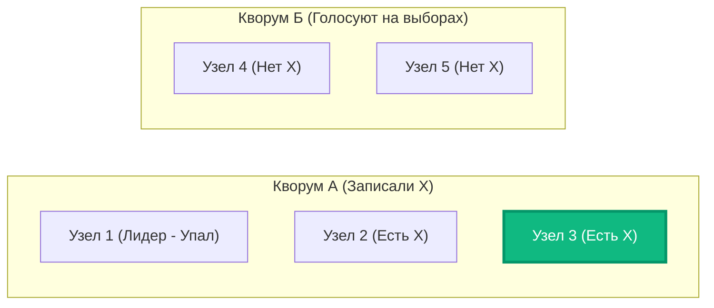
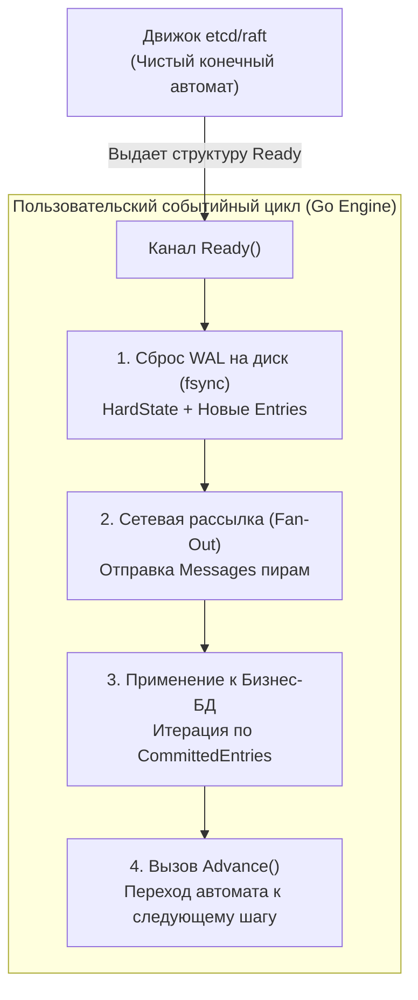
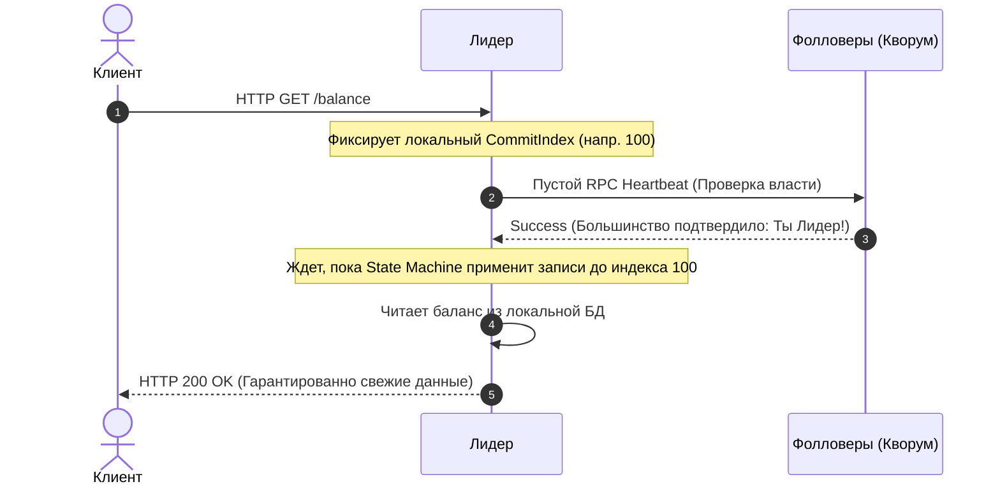

В предыдущих статьях мы шаг за шагом собрали сложнейший пазл распределенного консенсуса: разобрались, как узлы кластера выбирают Лидера ([[3. Raft. Leader election]]), и как этот Лидер заставляет Фолловеров реплицировать записи в свой локальный журнал ([[4. Raft. Log replication]]).

Казалось бы, система построена и готова к бою: выбрали вожака, отправили команду в сеть, дождались подтверждения от большинства (Кворума) — и можно радостно отвечать клиенту `HTTP 200 OK`. 

Но в распределенных системах дьявол всегда кроется в пограничных сценариях (corner cases). Что, если Лидер успел реплицировать запись на большинство серверов, но **упал за наносекунду до того**, как успел пометить эту запись зафиксированной (`Committed`) и отправить ответ клиенту? 

Новый Лидер увидит эту запись в журнале, но как ему понять: имеет ли он право считать её зафиксированной, или ее нужно стереть и заменить новыми данными? 

Без строгих математических гарантий безопасности (**Safety**) любая распределенная база данных рано или поздно перезапишет уже подтвержденную пользователю финансовую транзакцию.

---

## Фундаментальная гарантия: State Machine Safety

Главная и абсолютная цель всего алгоритма Raft формулируется в одном фундаментальном инварианте:

> **State Machine Safety Property:**  
> Если какой-либо сервер применил запись лога с определенным индексом к своей стейт-машине (базе данных), никакой другой сервер кластера никогда не сможет применить другую запись для этого же самого индекса.

Если этот инвариант нарушится хотя бы один раз, система перестанет быть линейно консистентной (Linearizable) и превратится в генератор хаоса. Чтобы железно соблюсти это свойство, Raft задействует два взаимосвязанных механизма, связывающих фазу Выборов и фазу Репликации.

---

## Механизм 1: Математика пересечения Кворумов

В статье про выборы мы сформулировали правило **Election Restriction** (Ограничение на избрание): Фолловер категорически отказывает Кандидату в голосе, если лог Кандидата старше (меньший Терм последней записи) или короче (при равных Термах меньший Индекс), чем собственный лог Фолловера.

Почему это правило математически гарантирует невозможность потери данных?

Вспомним дискретную математику и принцип Дирихле (Pigeonhole Principle):
1. Пусть в кластере работает $N = 5$ узлов. 
2. Лидер зафиксировал запись `X`. Это означает, что запись `X` была гарантированно записана на диск большинства узлов — минимум 3 серверов из 5. Обозначим это множество узлов как **Кворум А** (например, узлы $\{1, 2, 3\}$).
3. Внезапно Лидер падает. Начинаются новые выборы. Чтобы победить, новому Кандидату тоже необходимо собрать строгое большинство голосов — минимум 3 узла из 5. Обозначим это множество как **Кворум Б**.



**Теорема о пересечении кворумов:**  
В любой группе из $N$ элементов любые два подмножества размером $\lfloor N/2 \rfloor + 1$ **гарантированно пересекаются хотя бы по одному общему элементу**:

$$|QA \cap QB| \ge 1$$

Это означает, что в избирательном Кворуме Б **гарантированно присутствует хотя бы один узел** (в нашем примере — Узел 3), который физически сохранил запись `X`. 

Когда отставший Кандидат (например, Узел 4, у которого нет записи `X`) обратится к Узлу 3 за голосом, Узел 3 сверит логи, увидит, что лог претендента устарел, и ответит отказом! Отставший узел никогда не сможет собрать кворум и стать вожаком. Лидером станет только тот, кто уже обладает всеми подтвержденными записями.

---

## Механизм 2: Проблема прошлых эпох (Самое сложное в Raft)

Существует один тончайший сценарий, который ломает человеческую интуицию и заставил создателей Raft переписать раздел безопасности в своей работе. Этот сценарий подробно описан как знаменитая **Figure 8** в оригинальной публикации Диего Онгаро.

Представьте следующую драматическую цепочку событий:
1. **Эпоха 2 (Term 2):** Лидер $S_1$ принимает команду и успевает реплицировать ее на узел $S_2$. Затем $S_1$ внезапно падает, не успев зафиксировать запись.
2. **Эпоха 3 (Term 3):** Узел $S_5$ избирается лидером благодаря голосам $S_3$, $S_4$ и $S_5$ (кворум 3 из 5). $S_5$ принимает новую команду, записывает ее только себе в лог и тоже падает.
3. **Эпоха 4 (Term 4):** Узел $S_1$ оживает, избирается лидером и продолжает работу. Он находит в своем логе незафиксированную запись из **старой эпохи 2** и реплицирует ее на узел $S_3$. 
4. Теперь запись из Терма 2 физически лежит на **трех узлах из пяти** ($S_1, S_2, S_3$). То есть на большинстве!

```
Индекс:      1       2
S1 (Term 4): [1]    [2] -> реплицировал [2] на S3 (теперь на S1, S2, S3!)
S2:          [1]    [2]
S3:          [1]    [2]
S4:          [1]
S5 (Term 3): [1]    [3] (был лидером в Term 3, упал)
```

> [!warning] Ловушка / Gotcha: Интуитивная, но фатальная ошибка
> Казалось бы, Лидер $S_1$ видит: *«Запись из Терма 2 скопирована на большинство узлов ($S_1, S_2, S_3$). Значит, я имею полное право объявить ее зафиксированной (Committed) и вернуть успех клиенту!»*.
> 
> **В Raft это строжайше запрещено!**
> 
> Если $S_1$ объявит ее зафиксированной и в ту же миллисекунду упадет, узел $S_5$ сможет проснуться и выдвинуть свою кандидатуру с Термом 5. Узлы $S_2$, $S_3$ и $S_4$ проголосуют за $S_5$, потому что последняя запись $S_5$ имеет Term 3, а у них — Term 2 (а Term 3 свежее, чем Term 2!).
> 
> Узел $S_5$ выиграет выборы и **перезапишет индекс 2 своей записью из Терма 3**, уничтожив данные, которые $S_1$ только что объявил зафиксированными! Катастрофа!

### Железное правило безопасности Raft:

> **Лидер имеет право фиксировать (commit) записи методом подсчета реплик на большинстве узлов ТОЛЬКО И ИСКЛЮЧИТЕЛЬНО для записей СВОЕЙ ТЕКУЩЕЙ ЭПОХИ.**

Лидер никогда не продвигает `commitIndex` для записей из чужих, прошлых эпох напрямую. 

Как же тогда старые записи вообще фиксируются?  
Лидер просто продолжает штатную работу: принимает новые команды в своей текущей эпохе (Term 4). Как только **хотя бы одна запись текущей эпохи** успешно реплицируется на кворум узлов, **все предшествующие записи автоматически считаются зафиксированными** благодаря фундаментальному свойству *Log Matching Property*!

---

## Под капотом: Raft в Go и канал Ready

Чтобы увидеть, как эти строгие теоретические постулаты воплощаются в высокопроизводительный код на Go, обратимся к архитектуре библиотеки `etcd/raft`.

Создатели `etcd/raft` изолировали алгоритм в виде чистого автомата без ввода-вывода. Любое действие ноды сериализуется через канал `Ready()`:



Взглянем на канонический `select-loop`, управляющий узлом:

```go
package main

import (
	"context"
	"log"

	"go.etcd.io/raft/v3"
	"go.etcd.io/raft/v3/raftpb"
)

type ConsensusEngine struct {
	node         raft.Node
	storage      *raft.MemoryStorage
	walWriter    *WALWriter
	network      *NetworkTransport
	stateMachine *KVStore
}

func (ce *ConsensusEngine) Run(ctx context.Context) {
	for {
		select {
		case <-ctx.Done():
			return

		case rd := <-ce.node.Ready():
			// ШАГ 1: Механическое сочувствие — НАДЕЖНОСТЬ ДИСКА
			// Сохраняем HardState (текущий Term и Vote) и незакоммиченные записи в WAL.
			// fsync() обязан произойти ДО того, как мы отправим пакеты в сеть!
			if !raft.IsEmptyHardState(rd.HardState) || len(rd.Entries) > 0 {
				if err := ce.walWriter.Save(rd.HardState, rd.Entries); err != nil {
					log.Fatalf("Критическая ошибка WAL: %v", err)
				}
				ce.storage.Append(rd.Entries)
			}

			// ШАГ 2: СЕТЕВОЕ ВЗАИМОДЕЙСТВИЕ
			// Рассылаем подготовленные сообщения пирам (RPC AppendEntries и RequestVote)
			ce.network.Send(rd.Messages)

			// ШАГ 3: БЕЗОПАСНОСТЬ БИЗНЕС-ДАННЫХ
			// Применяем к боевой базе данных ТОЛЬКО гарантированно зафиксированные записи!
			for _, entry := range rd.CommittedEntries {
				if entry.Type == raftpb.EntryNormal && len(entry.Data) > 0 {
					ce.applyToStateMachine(entry)
				}
			}

			// ШАГ 4: СИГНАЛ АВТОМАТУ
			// Подтверждаем, что батч обработан, можно готовить следующую пачку
			ce.node.Advance()
		}
	}
}

func (ce *ConsensusEngine) applyToStateMachine(entry raftpb.Entry) {
	// Бизнес-логика обязана быть идемпотентной!
	ce.stateMachine.Execute(entry.Index, entry.Data)
}
```

> [!info] Под капотом: Идемпотентность стейт-машины
> Обратите внимание: при внезапном падении сервера (OOM-killer, сбой питания) и последующей перезагрузке, Raft-движок может повторно выдать в срез `rd.CommittedEntries` записи, которые бизнес-логика **уже успела применить к базе данных** перед крашем (если снимок состояния базы еще не успел зафиксироваться).
> 
> Поэтому функция `applyToStateMachine` **обязана быть строго идемпотентной**. 
> В промышленном коде индекс последней примененной записи (`lastAppliedIndex`) сохраняется в саму целевую базу данных в рамках единой ACID-транзакции с полезными бизнес-данными. Если при повторной накатке `entry.Index <= lastAppliedIndex`, операция просто пропускается без повторного выполнения.

---

## Проблема "Грязного чтения" (Stale Reads)

Если Лидер — это абсолютный и единственный центр принятия решений, возникает соблазнительная мысль: *«Зачем для операций чтения (HTTP GET) гонять консенсус и писать что-то в лог? Пусть Лидер просто отдаст данные из своей оперативной памяти!»*.

> [!tip] Собеседование
> **Вопрос:** Если мы будем выполнять операции чтения (Read-Only) локально на Лидере без согласования с кворумом, к какой катастрофе это может привести?
> 
> **Ответ:** Это приведет к нарушению линейной консистентности и чтению устаревших данных (**Stale Read**). 
> Представьте, что произошел обрыв сети (Network Partition). Наш Лидер оказался в меньшинстве (Partition of Minority). Большинство узлов уже выбрали себе нового молодого Лидера и успешно перезаписали ключ `x = 10`. 
> Старый Лидер еще не знает, что он свергнут (пульсы до него не доходят, а его собственные теряются в оборванной сети). Он наивно считает себя вожаком и на запрос клиента `GET /x` бодро ответит: `x = 5`. Клиент прочитает призрак из прошлого!

Чтобы обеспечить честную линейную консистентность (Linearizable Reads), Raft предлагает два механизма:

### 1. Механизм ReadIndex
Перед тем как вернуть данные из памяти, Лидер обязан подтвердить свою легитимность:



1. Лидер сохраняет текущий `CommitIndex`.
2. Лидер рассылает быстрый раунд Heartbeat-сообщений Фолловерам.
3. Дождавшись подтверждения от кворума, Лидер на 100% уверен, что в кластере нет другого более свежего Лидера.
4. Лидер ждет, пока его стейт-машина применит все записи до сохраненного `CommitIndex`, и возвращает ответ клиенту.

Это гарантирует идеальную строгость ценой одного сетевого RTT (Round-Trip Time) без дискового I/O.

### 2. Механизм Lease Read (Чтение по аренде)
Для экстремального снижения задержек Лидер может использовать аренду (**Lease**). Получив кворум на очередном пульсе, Лидер считает себя легитимным правителем на фиксированный интервал времени (меньший, чем минимальный `Election Timeout`). В течение этого окна Лидер отдает чтения мгновенно без сетевых подтверждений.

Однако, как мы помним из статьи [[5. Time и clock drift]], аренда опирается на физические часы узла. Если операционная система зависнет на 500 мс в паузе Stop-the-World сборщика мусора (GC) или гипервизор заморозит виртуальную машину, таймер аренды может истечь незаметно для процессора, создав окно для чтения фантомных данных.

---

## Итог всего Raft

Мы завершили фундаментальное исследование Raft — самого надежного и понятного протокола консенсуса в современной индустрии.

1. **Три столпа сложности:** Raft превратил запутанную проблему консенсуса в прозрачную цепочку этапов: Выборы лидера $\to$ Репликация лога $\to$ Гарантии безопасности.
2. **Пересечение кворумов:** Ни один отстающий узел не сможет захватить власть, так как кворум голосования неизбежно пересекается с кворумом репликации предыдущей записи.
3. **Защита прошлых эпох (Figure 8):** Лидер коммитит подсчетом реплик только записи своего собственного Терма, страхуя кластер от затирания истории.
4. **Событийный конвейер Go:** В эталонных библиотеках (`etcd/raft`) разделение чистого конечного автомата и инфраструктуры (канал `Ready()`) обеспечивает максимальную скорость дискового I/O и безупречную надежность.
5. **ReadIndex:** Чтение данных требует проверки актуальности власти Лидера, исключая отдачу клиенту устаревших данных из изолированных сегментов сети.

Raft завоевал мир благодаря своей кристальной понятности. Однако до его триумфа пионеры распределенных систем шли сквозь математические дебри алгоритма Paxos. Чтобы стать по-настоящему эрудированным инженером и понимать истоки архитектур Google Chubby и Spanner, в следующей статье мы заглянем в гости к классике: [[6. Paxos обзорно]].