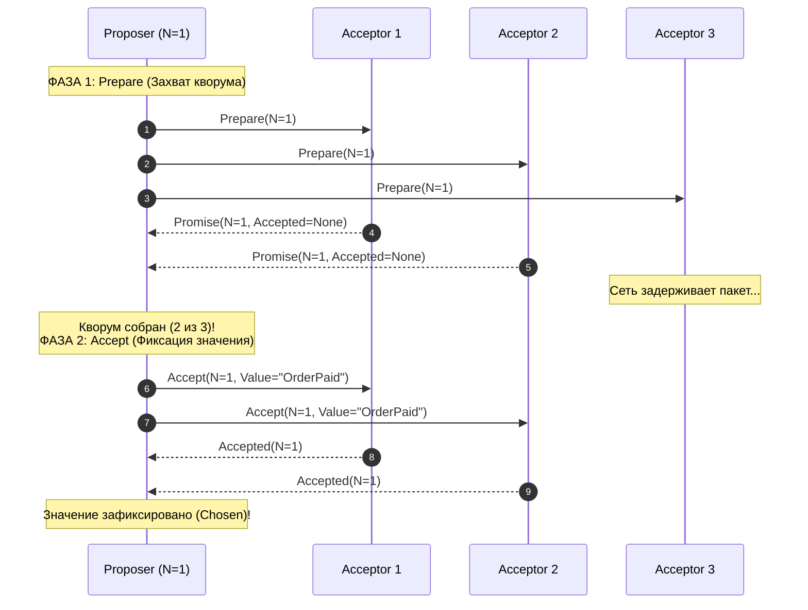
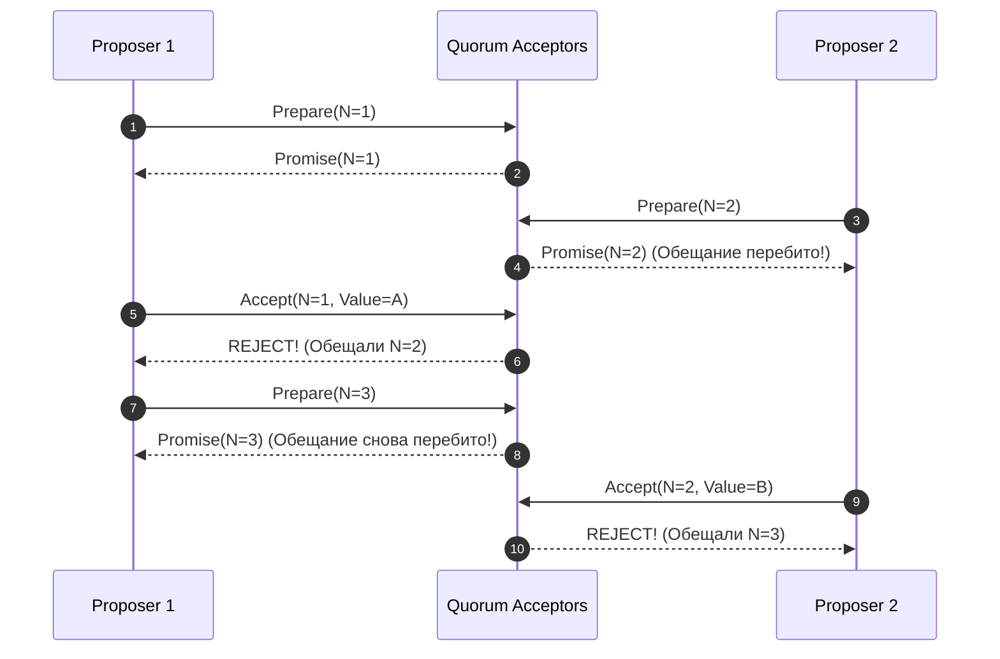

В предыдущих статьях (особенно в [[5. Raft. Safety и гарантии]]) мы досконально исследовали Raft — протокол, ставший безусловным стандартом в современной Cloud Native экосистеме. Он логичен, нагляден, имеет эталонную реализацию на Go (`etcd/raft`), а главное — его внутреннее состояние легко инспектировать и отлаживать в продакшене.

Но если вы окажетесь на серьезном архитектурном собеседовании (System Design) в международных технологических гигантах вроде Google, Amazon или Microsoft, разговор о распределенном консенсусе непременно свернет к его прародителю — **Paxos**.

Paxos — это патриарх и философский фундамент всех современных алгоритмов согласования. Он был сформулирован выдающимся ученым, лауреатом премии Тьюринга Лесли Лэмпортом в 1989 году (и опубликован после многолетних баталий с рецензентами в 1998 году в легендарной статье *"The Part-Time Parliament"*). 

Именно на алгоритме Paxos и его закрытых промышленных вариациях работает инфраструктурный фундамент Google (распределенная блокировка Chubby, глобальная реляционная база Spanner, файловая система Colossus), координатор AWS и протокол легковесных транзакций (LWT) в Apache Cassandra.

Если Raft — это понятный и выверенный инженерный чертеж промышленного станка, то Paxos — это кристальная, абстрактная математическая поэма. Давайте разберемся, как устроен Paxos, в чем его гениальность, и почему мировая Go-индустрия в итоге предпочла уйти от него в объятия Raft.

---

## Философия Paxos: Анархия вместо Диктатуры

Главное ментальное отличие Paxos от Raft заключается в отношении к институту власти.

В статье [[2. Raft. Основы]] мы увидели, что Raft строит свою безопасность на парадигме **Сильного Лидера (Strong Leader)**. В Raft установлена абсолютная монархия: только Лидер имеет право принимать запросы на запись, и только Лидер диктует Фолловерам, что писать в журнал. Все остальные узлы пассивно подчиняются.

**Paxos (в своей классической базовой версии, Basic Paxos) — это децентрализованный протокол без единого лидера (Leaderless).**

В Paxos каждый узел в любой момент времени имеет право выступить с инициативой и предложить свое значение. Протокол математически сконструирован так, что даже если пять серверов одновременно попытаются протолкнуть пять абсолютно разных значений, система гарантирует фундаментальный инвариант: **кластер выберет и зафиксирует ровно одно значение**, а все остальные узлы согласятся с этим выбором. Никакого Split-Brain не произойдет.

---

## Роли в Paxos

Вместо ролей Фолловера, Кандидата и Лидера, архитектура Paxos оперирует тремя функциональными ролями. В реальном Go-приложении один физический сервер (процесс) обычно одновременно исполняет обязанности всех трех ролей:

1. **Proposers (Предлагающие):** Принимают запросы от клиентов и выступают инициаторами предложений, пытаясь убедить кластер утвердить их значение.
2. **Acceptors (Принимающие):** Избирательный комитет и коллективная память кластера. Acceptor-ы голосуют за поступающие предложения, хранят историю своих обещаний на диске и формируют кворум большинства.
3. **Learners (Изучающие):** Наблюдатели. Они не участвуют в голосовании, а лишь пассивно ждут известия о том, какое значение в итоге утвердил кворум Acceptor-ов, чтобы применить его к своей локальной стейт-машине и вернуть результат клиенту.

```mermaid
flowchart LR
    classDef process  fill:#1e293b,stroke:#38bdf8,stroke-width:1px,color:#f8fafc
    classDef success  fill:#064e3b,stroke:#34d399,stroke-width:1px,color:#f8fafc
    classDef error    fill:#7f1d1d,stroke:#f87171,stroke-width:1px,color:#f8fafc
    classDef warning  fill:#78350f,stroke:#fbbf24,stroke-width:1px,color:#f8fafc
    classDef entry    fill:#1e3a5f,stroke:#38bdf8,stroke-width:2px,color:#f8fafc
    classDef aux      fill:#334155,stroke:#64748b,stroke-width:1px,color:#f8fafc
    classDef system   fill:#312e81,stroke:#a78bfa,stroke-width:1px,color:#f8fafc
    classDef data     fill:#132d29,stroke:#2dd4bf,stroke-width:1px,color:#f8fafc
    classDef network  fill:#881337,stroke:#fb7185,stroke-width:1px,color:#f8fafc
    classDef accent   fill:#1e1b4b,stroke:#818cf8,stroke-width:1px,color:#f8fafc
    Client["Клиент"]:::entry --> P["Proposer<br/>(Инициатор)"]
    
    subgraph QuorumAcceptors["Кворум Acceptors (Голосующие)"]
        A1["Acceptor 1"]:::process
        A2["Acceptor 2"]:::process
        A3["Acceptor 3"]:::process
    end
    
    P -->|Фаза 1: Prepare<br/>Фаза 2: Accept| QuorumAcceptors
    QuorumAcceptors -->|Уведомление о решении| L["Learner<br/>(Стейт-машина)"]
```



---

## Две фазы Basic Paxos

Классический **Basic Paxos** решает фундаментальную атомарную задачу: **как группе узлов прийти к согласию по поводу ровно одного значения** (одной переменной). 

Процесс согласования строго разделен на две последовательные фазы (Phase 1 и Phase 2).

> [!info] Под капотом: Номер Предложения (Proposal Number)
> Чтобы упорядочить события во времени без использования физических часов, каждый Proposer обязан снабжать свое предложение уникальным монотонно возрастающим номером — `N`.
> 
> Это прямой концептуальный родственник `Term` в Raft. 
> Чтобы номера `N` от разных Proposer-ов никогда не совпали, в распределенных системах число `N` формируют как пару: `[Логический счетчик].[ID узла]` или `[Timestamp]-[NodeID]`. Например, предложение `100.1` всегда строго меньше, чем `100.2`.

---

### Фаза 1: Prepare и Promise (Подготовка и Обещание)

Цель первой фазы — не записать данные, а «застолбить» за собой право сделать предложение и выяснить, не принял ли кластер какое-либо решение в прошлом.

1. **`Prepare` (Запрос):**  
   `Proposer` генерирует уникальный номер `N` и отправляет сетевой запрос `Prepare(N)` большинству `Acceptors`. Обратите внимание: само полезное значение (Payload) на этом этапе **не передается**! Proposer лишь спрашивает: *«Господа Acceptor-ы, я хочу внести предложение с номером N. Выслушаете ли вы меня?»*.
2. **`Promise` (Обещание):**  
   `Acceptor` получает запрос `Prepare(N)`. Он сверяет `N` с максимальным номером, который он когда-либо видел.
   * Если `N` больше любого ранее виденного номера, Acceptor дает железное обещание (`Promise`):  
     *«Я обещаю, что больше никогда не приму ни одного предложения с номером меньше N»*.
   * **Критически важная деталь:** Если этот `Acceptor` в прошлом уже успел проголосовать за какое-то конкретное значение $V$ с номером $N_v$ во Второй фазе от предыдущего Proposer-а, он обязан честно вернуть это значение в своем ответе: `Promise(N, maxAcceptedValue=V, maxAcceptedN=Nv)`.

---

### Фаза 2: Accept и Accepted (Принятие)

Цель второй фазы — зафиксировать значение в кворуме.

1. **`Accept Request`:**  
   `Proposer` ждет ответов. Если он собрал `Promise` от строгого большинства Acceptor-ов (Кворума), он получает мандат на выдвижение значения.
   * **Железное правило консенсуса:** Если хотя бы один `Acceptor` в своих ответах в Фазе 1 вернул уже принятое ранее значение `Value=X`, наш `Proposer` **обязан отказаться от своего собственного клиентского значения и предложить кластеру именно X** (выбирается значение с максимальным номером `maxAcceptedN`).
   * Если же все Acceptor-ы вернули пустые ответы (до этого момента никто ничего не принимал), Proposer наконец-то имеет право предложить свое собственное значение $V$, полученное от клиента.
   * Proposer рассылает запрос `Accept N, Value` (или `Accept(N, Value)`) кворуму Acceptor-ов.
2. **`Accepted` (Фиксация):**  
   `Acceptor` получает `Accept N, Value`. Он соглашается с предложением и сохраняет пару `(N, Value)` на диск в WAL, **только если** за прошедшие миллисекунды он не дал новое обещание (`Promise`) какому-то другому Proposer-у с номером, превышающим `N`.
3. Как только большинство Acceptor-ов ответили `Accepted`, значение официально считается выбранным кластером (**Chosen**). `Learners` уведомляются о результате и применяют команду.



---

## Dueling Proposers (Дуэль предложений) и Livelock

У абсолютной демократии и отсутствия лидера есть темная сторона. Что произойдет, если два узла-Proposer-а (Узел 1 и Узел 2) одновременно получат запросы от разных клиентов и начнут параллельно их продвигать?

1. Узел 1 рассылает `Prepare N=1`. Кворум дает обещание не принимать ничего меньше 1.
2. Узел 2 тут же рассылает `Prepare N=2`. Кворум видит, что $2 > 1$, и дает Узлу 2 обещание не принимать ничего меньше 2!
3. Узел 1 переходит к Фазе 2 и отправляет `Accept N=1, Value=A`. Но Acceptor-ы отвергают его: они уже пообещали Узлу 2 игнорировать любые номера меньше 2!
4. Узел 1 понимает, что отвергнут. Он не сдается, инкрементирует номер и рассылает `Prepare N=3`. Кворум принимает $N=3$.
5. Теперь Узел 2 пытается отправить `Accept N=2, Value=B`. Но Acceptor-ы отвергают и его: они уже дали клятву Узлу 1 на номер 3!



Эта ситуация называется **Dueling Proposers (Дуэль предложений)**. Процессоры загружены на 100%, сетевые карты раскалены от пакетов, система идеально следует правилам Paxos, но ни одна полезная транзакция не может завершиться! Кластер оказывается в состоянии **Livelock** (динамический паралич).

> [!warning] Ловушка / Gotcha: Ирония Paxos
> Чтобы разрешить проблему бесконечной дуэли Proposer-ов, на практике разработчикам приходится:
> * либо вводить экспоненциальную случайную задержку (Exponential Backoff with Jitter);
> * либо... выбирать среди Proposer-ов одного постоянного «выделенного представителя» (**Distinguished Proposer** / Master), которому временно делегируется монопольное право инициировать Фазу 1.
> 
> Ирония инженерной истории: чтобы заставить протокол без лидера (Leaderless) стабильно работать под реальной производственной нагрузкой, архитекторам пришлось искусственно вернуть в него концепцию... Лидера!

---

## От Basic Paxos к Multi-Paxos

Basic Paxos умеет согласовывать лишь **одну-единственную переменную**. 

Но реальному бэкенду — распределенной базе данных или брокеру сообщений — требуется реплицированный журнал (**Append-Only Log**), состоящий из миллиардов упорядоченных команд.

Алгоритм, распространяющий консенсус на непрерывную последовательность записей, называется **Multi-Paxos**. 

Идея в том, что мы запускаем независимый экземпляр Basic Paxos для каждого слота (индекса) в логе: слот 1 согласовывается своим инстансом Paxos, слот 2 — своим.

Однако выполнять две сетевые фазы (`Prepare` + `Accept`, то есть 2 RTT) на каждую строчку лога — непозволительная роскошь для высоконагруженных систем. 

Поэтому в Multi-Paxos выделяется постоянный Лидер, который:
1. Выполняет Фазу 1 (`Prepare`) **всего один раз** сразу для всех будущих слотов журнала при старте своего правления.
2. После успешного получения кворума Лидер реплицирует все последующие пользовательские команды, выполняя **только Фазу 2 (`Accept`) за 1 сетевой RTT**!

```
Multi-Paxos:
Старт Лидера:    [Prepare] -> [Promise] (Захват кворума для всех слотов)
Слот 1 (SET x):  [Accept]  -> [Accepted] (1 RTT)
Слот 2 (SET y):  [Accept]  -> [Accepted] (1 RTT)
Слот 3 (SET z):  [Accept]  -> [Accepted] (1 RTT)
```

Вам это ничего не напоминает? Совершенно верно: оптимизированный Multi-Paxos структурно превращается в тот самый Raft!

> [!tip] Собеседование
> **Вопрос:** Почему среди теоретиков распределенных систем популярно утверждение: *«Существует только один алгоритм консенсуса — это Paxos. Все остальные алгоритмы — лишь его вариации или оптимизации»*?
> 
> **Ответ:** С математической точки зрения алгоритм Raft действительно изоморфен Multi-Paxos с выделенным лидером. Raft взял фундаментальные идеи Paxos (кворумы, монотонные эпохи/номера), но ввел жесткие прагматичные ограничения (например, запретил дыры в логах и разрешил потоку данных течь строго в одном направлении — от Лидера к Фолловерам). Это превратило абстрактную теорему в предсказуемую инженерную конструкцию.

---

## Почему индустрия перешла на Raft?

Если Multi-Paxos так хорош, почему сообщество Go-разработчиков не пишет на нем новые базы данных, а поголовно использует `etcd/raft`?

Ответ кроется в легендарной статье инженеров Google 2007 года — *"Paxos Made Live: An Engineering Perspective"*, в которой авторы описывали опыт создания Chubby:
> *"Между математическим описанием алгоритма Paxos и требованиями реальной промышленной системы лежит гигантская пропасть... В результате любая реальная система базируется на недоказанном протоколе, который лишь отдаленно напоминает исходный Paxos".*

1. **Отсутствие единой спецификации Multi-Paxos:** В оригинальной статье Лэмпорта Multi-Paxos описывается буквально в нескольких неформальных абзацах. Там не было специфицировано:
   * как безопасно менять состав кластера (Membership Changes: добавление/удаление серверов на лету);
   * как производить обрезку лога и делать снепшоты (Log Compaction);
   * как заполнять "дыры" в журнале при отставании узлов.
2. **Проблема дыр в логе (Log Holes):** В Multi-Paxos инстанс слота 5 может быть согласован раньше, чем слот 4. В результате в журнале образуются дыры. Код стейт-машины на Go, который должен ждать заполнения пропущенных слотов перед выполнением транзакций, чрезвычайно сложен, подвержен состояниям гонки (Data Races) и трудно поддается тестированию.
3. **Отладка и визуализация:** В Raft состояние узла в любой момент времени прозрачно: `(Term, CommitIndex, Role)`. В Paxos состояние распределено между сотнями независимых инстансов слотов, и понять в три часа ночи, почему база данных перестала отвечать, требует квалификации автора докторской диссертации.

---

## Итог

1. **Paxos — математический колосс:** Он доказал возможность безопасного согласования значений в асинхронных сетях с ненадежными узлами и сообщениями.
2. **Leaderless-природа:** Basic Paxos не требует постоянного лидера, позволяя любому узлу инициировать согласование переменной через две фазы: `Prepare` и `Accept`.
3. **Плата за децентрализацию:** Одновременная активность нескольких Proposer-ов порождает конфликтные дуэли (Livelock), что вынуждает на практике возвращаться к единому Лидеру (Multi-Paxos).
4. **Наследие:** Raft не отменил Paxos — он облек его сложнейшие концепции в понятную, строго детерминированную форму, готовую к промышленной эксплуатации в коде на Go.

Мы завершили фундаментальное погружение в теорию и математику распределенного консенсуса. Теперь пора перекинуть мост от алгоритмов к прикладной разработке бэкенда. 

Как на базе алгоритмов консенсуса реализовать механизм, без которого невозможно представить работу современных микросервисов — **распределенные блокировки**? Как гарантировать, что фоновый воркер не начнет списывать деньги дважды, и почему `Redis Redlock` вызывает столько споров среди инженеров? 

Ответы ждут нас в следующей статье: [[7. Distributed locks]].