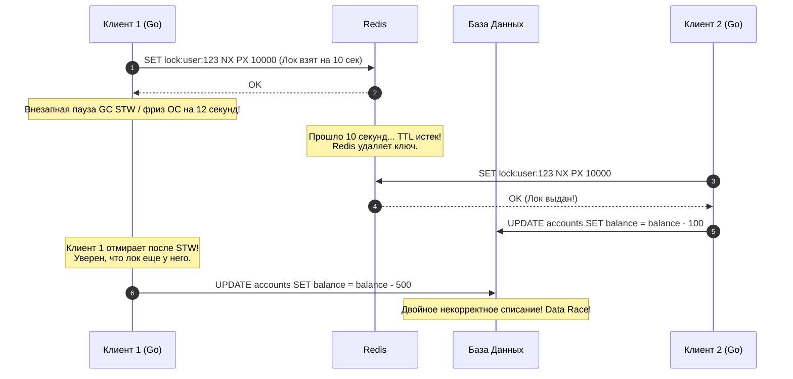
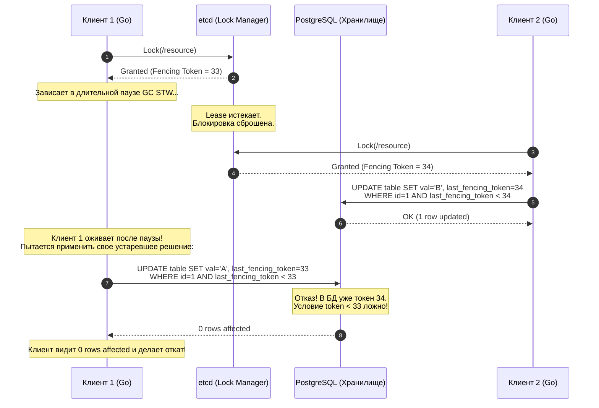

В рамках одного Go-приложения защитить разделяемые данные от состояния гонки (Data Race) тривиально: вы берете проверенный `sync.Mutex`, вызываете метод `Lock()` перед критической секцией и передаете управление defer-функции `Unlock()`. Компилятор Go и подсистема синхронизации рантайма берут всю грязную низкоуровневую работу на себя.

Но представьте, что ваш сервис вырос из скромного прототипа в продакшен-систему, и Kubernetes развернул его в виде 50 параллельных подов (реплик). Локальный `sync.Mutex` в оперативной памяти мгновенно становится абсолютно бесполезным: у каждого пода — свое изолированное виртуальное адресное пространство памяти. 

Если две независимые реплики одновременно попытаются списать средства с одного банковского счета в PostgreSQL, пересчитать кэш или сгенерировать единый финансовый отчет в S3, в системе возникнет разрушительное состояние гонки на уровне инфраструктуры.

Чтобы заставить десятки распределенных серверов выстроиться в строгую и безопасную очередь, нам необходим **Distributed Lock (Распределенная блокировка)**.

---

## Mechanical Sympathy: Локальный vs Распределенный мьютекс

Чтобы осознать масштабы инженерного вызова, давайте заглянем под капот железа и сравним, чем мы жертвуем при переходе от одного процесса к сети.

> [!info] Под капотом: Как устроен `sync.Mutex` в Go
> Локальный мьютекс (`sync.Mutex`) в рантайме Go невероятно компактен: он состоит всего из двух 32-битных полей (суммарно 8 байт): `state int32` и `sema uint32`.
> 1. **Быстрый путь (Fast Path):** Горутина пытается захватить мьютекс с помощью атомарной инструкции процессора `Compare-And-Swap` (CAS). В микроархитектуре x86/ARM это операция над L1/L2 кэшем текущего ядра CPU, занимающая жалкие **наносекунды** без переключения контекста в ядро ОС.
> 2. **Медленный путь (Slow Path):** Если мьютекс занят, планировщик Go не сжигает такты CPU в пустом цикле, а вызывает функцию `runtime_SemacquireMutex`. Горутина переводится в режим ожидания, а поток операционной системы `M` немедленно берет на исполнение другую готовую горутину.
> 3. **Пробуждение:** При освобождении блокировки задействуется механизм `futex` (Fast Userspace Mutex) ядра Linux, мгновенно передающий эстафету следующему ожидающему.
> 
> **Цена:** Наносекунды задержки. **Надежность:** 100% модель Fail-Stop. Если процесс аварийно завершится (panic, SIGKILL), ядро Linux мгновенно закроет дескрипторы и освободит всю память процесса.

**Распределенный лок** переносит эту задачу в непредсказуемый сетевой мир:
1. **Колоссальная деградация задержки:** Захват блокировки требует нескольких сетевых пакетов (RTT). Задержка подскакивает с **10 наносекунд до 10–50 миллисекунд** — падение производительности в миллион раз!
2. **Частичные отказы (Partial Failures):** Процесс может захватить лок, а затем внезапно погибнуть (OOM-killer от ядра Linux или перезагрузка ноды гипервизором). Если у лока нет автоматического таймаута, ресурс окажется заблокированным навечно — наступит глобальный распределенный Deadlock.
3. **Ложные подозрения:** Из-за рассинхронизации физических часов ([[5. Time и clock drift]]) или пауз сборщика мусора система координации может решить, что клиент «умер», и отдать лок другому процессу, в то время как первый клиент всё еще жив и продолжает исполнять критическую секцию.

---

## Наивный подход: Redis и SETNX

Чаще всего начинающие инженеры пытаются решить задачу самым доступным инструментом под рукой — Redis. Команда `SETNX` (*Set if Not eXists*, или современный `SET resource_key my_id NX PX 10000`) выглядит заманчиво просто:

```go
// Псевдокод наивного распределенного лока в Redis
func ProcessTaskWithRedisLock(ctx context.Context, redisClient *redis.Client) error {
	lockKey := "lock:user:123"
	lockValue := uuid.New().String()
	ttl := 10 * time.Second

	// Пытаемся атомарно выставить ключ только если его не существует
	success, err := redisClient.SetNX(ctx, lockKey, lockValue, ttl).Result()
	if err != nil || !success {
		return errors.New("ресурс занят, не удалось захватить лок")
	}

	// Освобождаем лок в конце работы
	defer func() {
		// Внимание: освобождать нужно через Lua-скрипт, проверяя lockValue!
		redisClient.Del(ctx, lockKey)
	}()

	// Выполнение тяжелой бизнес-логики...
	return doBusinessLogic()
}
```

Мы выставляем TTL (Time-To-Live) в 10 секунд, надеясь, что если наш под погибнет, Redis сам удалит ключ через 10 секунд и снимет блокировку.

---

### Почему это сломается? (Проблема STW)

Давайте рассмотрим сценарий из реальной жизни, который регулярно приводит к тяжелейшим инцидентам в высоконагруженных системах:

1. **Клиент 1 (Go-под)** успешно захватывает ключ `lock:user:123` на 10 секунд и начинает транзакцию.
2. В рантайме Go внезапно запускается длительная фаза паузы сборщика мусора (Stop-The-World), либо гипервизор облачного провайдера "замораживает" виртуальную машину на 12 секунд из-за миграции vCPU.
3. Проходят 10 секунд. **Redis честно удаляет ключ по истечении TTL**. С точки зрения Redis, лок свободен.
4. **Клиент 2 (другой Go-под)** приходит за локом `lock:user:123`. Redis отвечает успехом: лок выдан! Клиент 2 начинает модифицировать запись в базе данных.
5. **Клиент 1 просыпается** после паузы GC. Никаких ошибок в рантайме нет: процессор просто продолжил выполнять следующую ассемблерную инструкцию функции `doBusinessLogic()`. Клиент 1 искренне уверен, что он единственный владелец лока!
6. Клиент 1 отправляет запрос на запись в базу данных.
7. **Катастрофа:** Два независимых процесса одновременно пишут в один и тот же критический ресурс. Защита пробита, данные в базе разрушены!



> [!warning] Ловушка / Gotcha: Алгоритм Redlock и дрейф часов
> Чтобы преодолеть ненадежность одиночного узла Redis, создатель Redis Сальваторе Санфилиппо предложил распределенный алгоритм `Redlock`, требующий захвата кворума (например, 3 из 5 независимых инстансов Redis).
> 
> Однако известный исследователь распределенных систем Мартин Клеппман (автор бестселлера *"Designing Data-Intensive Applications"*) в знаменитой дискуссии доказал: **Redlock концептуально небезопасен для строгой консистентности**. 
> 
> Redlock критически опирается на физическое время: он считает, что если узлы выдерживают время жизни лока, то дрейф часов на серверах пренебрежимо мал. Но если из-за скачка NTP (см. [[5. Time и clock drift]]) часы на одном из серверов Redis прыгнут на секунду вперед, узел сбросит лок раньше времени, разрушив гарантии взаимного исключения. 
> 
> Для критичных финансовых и учетных операций строить распределенные блокировки на Redis категорически нельзя.

---

## Решение для взрослых: Консенсус и etcd

Для надежных систем, где цена сбоя — деньги клиентов или целостность реестров, распределенные блокировки строятся исключительно на базе строгих CP-систем распределенного консенсуса, таких как **etcd** (построенном на Raft, см. [[2. Raft. Основы]]) или **ZooKeeper**.

Как etcd решает фундаментальную дилемму мертвого клиента без жестко зашитых таймаутов?

Через связку механизмов **Lease (Аренда)** и потокового **KeepAlive**:
1. Go-клиент запрашивает у etcd создание аренды (`Lease`) с коротким интервалом (например, TTL = 5 секунд).
2. Клиент атомарно создает ключ блокировки в etcd, привязывая его жизненный цикл к созданному `Lease`.
3. Клиентская библиотека etcd в фоновом режиме запускает горутину, которая с высокой частотой (каждые 1.5 секунды) шлет пакеты `KeepAlive` по gRPC-соединению, продлевая аренду.
4. Если процесс на Go аварийно завершается (SIGKILL, падение пода, сбой питания сервера), фоновая горутина погибает. Сигналы пульса прекращаются, и кластер etcd по истечении 5 секунд гарантированно удаляет ключ, снимая блокировку для других участников.

Но что, если Go-под зависнет в глубокой паузе сборщика мусора на 15 секунд?  
Фоновая горутина `KeepAlive` тоже будет заморожена! Аренда истечет, и etcd честно отдаст лок следующему претенденту. Когда первый под очнется, он опять попытается записать устаревшие данные в базу! 

Существует ли способ защититься от этой фундаментальной проблемы физического мира?

---

## Бронебойная защита: Fencing Tokens (Токены ограждения)

Единственный математически корректный способ защитить разделяемый ресурс от "зомби-клиентов" — это механизм **Fencing Tokens (Токены ограждения)**.

Идея заключается в том, что система распределенной блокировки не может в одиночку обеспечить безопасность: **в защите обязана участвовать сама целевая база данных (хранилище)!**

Консенсус-сервис (etcd) при успешном захвате блокировки возвращает клиенту не просто бинарный флаг успеха, а **монотонно возрастающее 64-битное число — Ревизию (Revision / Fencing Token)**. Каждая следующая выданная блокировка гарантированно имеет номер строго больше предыдущей.



> [!tip] Собеседование
> **Вопрос:** Как реализовать поддержку Fencing Token в реляционной базе данных (PostgreSQL или MySQL) без потери производительности?
> 
> **Ответ:** В целевую бизнес-таблицу добавляется колонка `last_fencing_token BIGINT NOT NULL DEFAULT 0`. 
> Любое обновление состояния выполняется строгим атомарным SQL-запросом с проверкой предиката:
> ```sql
> UPDATE orders 
> SET status = 'PROCESSING', last_fencing_token = $1 
> WHERE id = $2 AND last_fencing_token < $1;
> ```
> Если проснувшийся после паузы зомби-клиент попытается выполнить этот запрос со старым токеном ($33 < 34$), СУБД отвергнет изменение: драйвер Go вернет `rowsAffected == 0` (`0 rows affected`). Приложение увидит, что ни одна строка не обновилась, поймет, что лок был утрачен, и прервет транзакцию.

---

## Идиоматичный Go: Реализация лока через etcd

В экосистеме Go официальный SDK etcd предоставляет пакет `go.etcd.io/etcd/client/v3/concurrency`. Он реализует отказоустойчивую распределенную блокировку на основе механизма ревизий и push-уведомлений через **etcd Watch API** (узлы не опрашивают etcd в цикле, а спят на gRPC-стриме, что дает ровно 0% паразитной нагрузки на CPU).

```go
package main

import (
	"context"
	"database/sql"
	"errors"
	"fmt"
	"log"
	"time"

	clientv3 "go.etcd.io/etcd/client/v3"
	"go.etcd.io/etcd/client/v3/concurrency"
)

type Worker struct {
	etcdClient *clientv3.Client
	db         *sql.DB
}

func (w *Worker) ExecuteExclusiveJob(ctx context.Context, jobID int64) error {
	// ШАГ 1: Создаем сессию etcd.
	// Под капотом создается Lease с TTL=5 сек и запускается фоновая горутина
	// для автоматического продления аренды через KeepAlive.
	session, err := concurrency.NewSession(w.etcdClient, concurrency.WithTTL(5))
	if err != nil {
		return fmt.Errorf("ошибка создания etcd session: %w", err)
	}
	// При выходе из функции сессия обязана быть закрыта, чтобы сразу освободить Lease
	defer session.Close()

	// ШАГ 2: Создаем распределенный мьютекс в пространстве ключей etcd
	lockKey := fmt.Sprintf("/locks/jobs/%d", jobID)
	mu := concurrency.NewMutex(session, lockKey)

	log.Printf("Ожидание захвата блокировки для ключа: %s...", lockKey)

	// ШАГ 3: Захватываем блокировку с поддержкой отмены через контекст.
	// Если лок занят другим воркером, горутина уснет на Watch API.
	if err := mu.Lock(ctx); err != nil {
		return fmt.Errorf("не удалось захватить распределенный лок: %w", err)
	}

	// Извлекаем монотонный Fencing Token (глобальную ревизию etcd)
	fencingToken := mu.Header().Revision
	log.Printf("Лок успешно захвачен! Fencing Token (Revision): %d", fencingToken)

	// Гарантируем корректное освобождение мьютекса
	defer func() {
		// Для Unlock используем отдельный изолированный контекст,
		// так как родительский ctx к моменту defer мог уже истечь
		unlockCtx, cancel := context.WithTimeout(context.Background(), 2*time.Second)
		defer cancel()

		if err := mu.Unlock(unlockCtx); err != nil {
			log.Printf("Внимание: ошибка освобождения лока: %v", err)
		}
	}()

	// ШАГ 4: Выполняем критическую бизнес-секцию, обязательно передавая токен в БД!
	return w.applyBusinessUpdate(ctx, jobID, fencingToken)
}

func (w *Worker) applyBusinessUpdate(ctx context.Context, jobID int64, token int64) error {
	query := `
		UPDATE jobs 
		SET status = 'IN_PROGRESS', 
		    last_fencing_token = $1, 
		    updated_at = NOW() 
		WHERE id = $2 AND last_fencing_token < $1;
	`
	result, err := w.db.ExecContext(ctx, query, token, jobID)
	if err != nil {
		return fmt.Errorf("ошибка выполнения SQL: %w", err)
	}

	rows, err := result.RowsAffected()
	if err != nil {
		return err
	}

	if rows == 0 {
		return errors.New("fencing token устарел (0 rows affected): обнаружен зомби-процесс, работа прервана")
	}

	log.Printf("Работа над задачей %d успешно завершена с токеном %d", jobID, token)
	return nil
}
```

---

## Итог

1. **Локальный мьютекс vs Распределенный:** `sync.Mutex` работает за наносекунды благодаря аппаратным инструкциям процессора и поддержке планировщика Go. Распределенный лок платит миллисекундами сети за координацию независимых машин.
2. **Redis и SETNX:** Прекрасны для некритичных оптимизаций (например, предотвращения дублирования фоновых отправок писем), но абсолютно непригодны для критических финансовых задач из-за подверженности паузам Garbage Collector-а и рассинхронизации часов.
3. **Консенсус-платформы (etcd):** Обеспечивают строгие гарантии благодаря Raft-консенсусу, аренде (`Lease`) и потоковому отслеживанию (`KeepAlive`).
4. **Fencing Tokens — золотой стандарт:** Никакой алгоритм блокировок в мире не защитит систему от пауз выполнения на клиенте. Надежность гарантируется только тогда, когда целевая база данных валидирует монотонно растущий токен ограждения при каждой операции записи.

Распределенные блокировки идеальны для кратковременной защиты ресурсов. Но что делать, если среди сотен запущенных микросервисов нам требуется непрерывно удерживать ровно **один активный инстанс-координатор**, переключая нагрузку на горячий резерв при его падении? 

Для решения этой задачи в архитектуре бэкенда применяется паттерн **Leader Election в сервисах**, который мы детально разберем в финальной статье подраздела: [[8. Leader election в системах]].