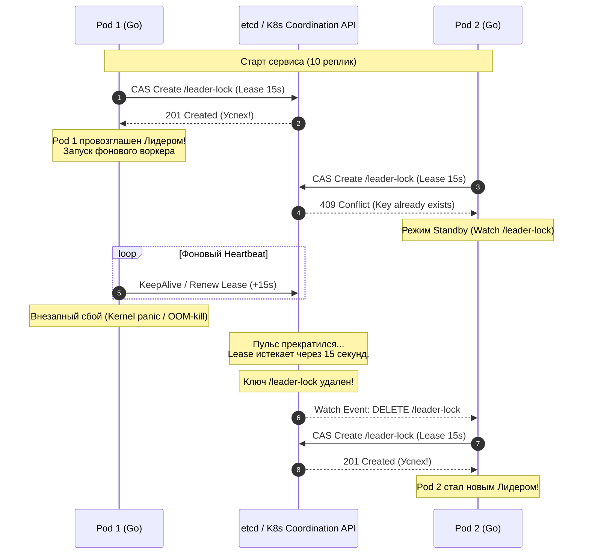

В предыдущих статьях мы глубоко погружались в анатомию и математику распределенного консенсуса: детально изучили три столпа Raft и отдали дань уважения классическому Paxos. Мы разобрались, как системы хранения данных (вроде `etcd` или `CockroachDB`) выбирают вожака, чтобы обеспечить строгую консистентность записей.

Но в реальной жизни большинству бэкенд-инженеров редко приходится писать собственную распределенную базу данных с нуля. Куда чаще перед нами стоит совершенно иная практическая задача: 
> Мы разрабатываем обычный stateless-микросервис на Go (например, биллинговый шлюз или процессинг заказов), который ради надежности развернут в Kubernetes в 10 параллельных подах (репликах). 
> 
> Нам требуется, чтобы **ровно один** из этих десяти подов выполнял эксклюзивную системную работу: например, раз в сутки запускал списание абонентской платы по cron-расписанию, агрегировал метрики или координировал очередь. Если два пода начнут делать это одновременно — с клиентов спишут двойную оплату. А если единственный под упадет — другой обязан мгновенно подхватить эстафету.

Здесь нам на помощь приходит архитектурный паттерн **Leader Election в прикладных системах (Выборы лидера в микросервисах)**.

Важнейший инженерный принцип: **не нужно заново изобретать Raft внутри бизнес-кода вашего сервиса!** Мы просто воспользуемся готовым авторитетом внешней системы консенсуса (`etcd`, Consul или штатный Kubernetes API), чтобы наши Go-процессы элегантно договорились между собой.

---

## Зачем stateless-микросервисам Лидер?

Казалось бы, философия микросервисов проповедует идеал Share-Nothing и взаимозаменяемость реплик. Зачем же выделять среди них «главного»?

В практике высоконагруженных бэкендов Leader Election необходим в трех ключевых сценариях:
1. **Singleton-воркеры (Периодические фоновые задачи):** Регулярные тяжелые расчеты (генерация счетов, очистка устаревших сессий, отправка ночных push-уведомлений), которые категорически нельзя распараллеливать.
2. **Sequential Processing (Последовательная обработка потоков):** Вычитывание партиционированных очередей сообщений (например, топиков Apache Kafka), где порядок обработки событий критичен и гарантируется только при одном активном консьюмере.
3. **External Rate Limiting (Узкие интеграционные горлышки):** Взаимодействие со старыми банковскими шлюзами или сторонними Legacy API, допускающими строго одно активное TCP-соединение на организацию.

---

## Как это работает под капотом (Механика аренды)

Механизм выборов прикладного лидера базируется на фундаменте распределенных блокировок, который мы исследовали в статье [[7. Distributed locks]].

Платформа координации (например, `etcd`) предоставляет примитив **Lease (Аренда)** с установленным сроком жизни:
1. При старте все поды вашего сервиса одновременно пытаются атомарно создать в `etcd` один и тот же ключ (Lock) с привязкой к Lease (например, со сроком жизни в 15 секунд).
2. Благодаря атомарной операции `Compare-And-Swap` (CAS) в кворуме консенсуса **только один под** добивается успеха. Он получает статус Лидера и запускает эксклюзивную бизнес-логику.
3. Остальные девять подов получают отказ `Key already exists` и переходят в режим бдительного ожидания (Watch), подписываясь на события изменения этого ключа.
4. Под-Лидер запускает фоновую горутину, которая с высокой периодичностью (например, каждые 5 секунд) отправляет запросы `KeepAlive`, продлевая свою аренду в кластере.



---

## Leader Election в Kubernetes (client-go)

Если ваш микросервис развернут в инфраструктуре Kubernetes, вам даже не нужно поднимать отдельный кластер `etcd` или городить интеграции с Redis. Сам Kubernetes API предоставляет готовый, промышленный механизм `LeaderElection` из коробки.

В современном Kubernetes для этого используется специализированный ресурс **`Lease`** из API-группы `coordination.k8s.io`.

> [!info] Под капотом: Эволюция блокировок в K8s
> На заре развития Kubernetes разработчики часто реализовывали выборы лидеров через объекты `ConfigMap` или `Endpoints`, постоянно обновляя их аннотации. 
> 
> Это порождало тяжелейшие проблемы: каждое обновление `ConfigMap` приводило к лавине событий (watch-events) по всему кластеру, перегружая `kube-apiserver` и контроллеры узлов. 
> 
> Начиная с Kubernetes 1.14 был представлен легковесный ресурс `Lease` в группе `coordination.k8s.io`. Он специально спроектирован для частых heartbeats и минимизирует накладные расходы на etcd кластера.

Взглянем на идиоматичный продакшен-код на Go с использованием официальной библиотеки `k8s.io/client-go`:

```go
package main

import (
	"context"
	"log"
	"os"
	"time"

	metav1 "k8s.io/apimachinery/pkg/apis/meta/v1"
	"k8s.io/client-go/kubernetes"
	"k8s.io/client-go/rest"
	"k8s.io/client-go/tools/leaderelection"
	"k8s.io/client-go/tools/leaderelection/resourcelock"
)

func main() {
	ctx, cancel := context.WithCancel(context.Background())
	defer cancel()

	// 1. Получаем конфигурацию доступа к API-серверу изнутри пода K8s
	config, err := rest.InClusterConfig()
	if err != nil {
		log.Fatalf("Ошибка получения in-cluster config: %v", err)
	}
	clientset := kubernetes.NewForConfigOrDie(config)

	// Идентификатором пода обычно выступает его имя из переменной окружения HOSTNAME
	podID := os.Getenv("HOSTNAME")
	if podID == "" {
		podID = "local-dev-instance"
	}

	lockName := "billing-cron-lock"
	lockNamespace := "default"

	// 2. Создаем блокировку на базе ресурса Lease из coordination.k8s.io
	lock := &resourcelock.LeaseLock{
		LeaseMeta: metav1.ObjectMeta{
			Name:      lockName,
			Namespace: lockNamespace,
		},
		Client: clientset.CoordinationV1(),
		LockConfig: resourcelock.ResourceLockConfig{
			Identity: podID,
		},
	}

	// 3. Запускаем конечный автомат выборов
	leaderelection.RunOrDie(ctx, leaderelection.LeaderElectionConfig{
		Lock:            lock,
		ReleaseOnCancel: true,
		LeaseDuration:   15 * time.Second, // Время удержания лидерства без продления
		RenewDeadline:   10 * time.Second, // Окно, за которое Лидер обязан продлить аренду
		RetryPeriod:     2 * time.Second,  // Интервал между попытками захвата для кандидатов

		Callbacks: leaderelection.LeaderCallbacks{
			OnStartedLeading: func(ctx context.Context) {
				log.Printf(">>> Узел %s успешно избран Лидером! Запуск задач...", podID)
				// ВАЖНО: передаем внутрь функции переданный ctx!
				doBusinessLogic(ctx)
			},
			OnStoppedLeading: func() {
				// Вызывается, если узел потерял связь с API-сервером или уступил лидерство
				log.Printf("<<< Узел %s утратил лидерство! Немедленная остановка.", podID)
				// В продакшене идиоматично завершить процесс, чтобы K8s перезапустил под
				os.Exit(0)
			},
			OnNewLeader: func(identity string) {
				if identity == podID {
					return
				}
				log.Printf("Действующий лидер кластера: %s. Ожидание в горячем резерве...", identity)
			},
		},
	})
}
```

---

## Главная ловушка: Призрачный Лидер (Split-Brain)

В приведенной выше архитектуре таится коварнейшая ловушка распределенных систем.

Давайте смоделируем ситуацию:
1. `Pod 1` триумфально захватил аренду `Lease` и начал выполнение функции `doBusinessLogic(ctx)`.
2. Функция отправляет тяжелый сетевой запрос или уходит в цикл обработки 100 000 записей.
3. В этот момент процесс попадает под жесткий **CPU Throttling** со стороны Linux CFS (Completely Fair Scheduler) из-за превышения `cpu limits` в Kubernetes, либо рантайм Go замирает в длительной паузе сборщика мусора.
4. Фоновая горутина `client-go`, обязанная вызывать продление аренды до истечения `RenewDeadline`, тоже оказывается замороженной!
5. Время `LeaseDuration` (15 секунд) истекает. С точки зрения Kubernetes, `Pod 1` погиб.
6. `Pod 2` в горячем резерве видит освобождение ресурса, захватывает `Lease` и запускает свою функцию `doBusinessLogic`.
7. **Внезапно `Pod 1` размораживается!** 

> [!warning] Ловушка / Gotcha: Раздвоение личности в кластере
> Что произойдет с `Pod 1`?  
> Процессор просто продолжит выполнение функции `doBusinessLogic` со следующей инструкции в памяти! 
> 
> В системе одновременно работают **два активных Лидера**: `Pod 1` и `Pod 2`. Оба отправляют команды записи, оба считают себя единственными вожаками. Кластер развалился на конкурирующие куски — произошел **Split-Brain** на прикладном уровне!

---

## Mechanical Sympathy: Как защититься от призраков?

Вы не можете физически остановить TCP-пакет, который уже отправлен сетевой картой в коммутатор. Но вы обязаны свести к минимуму окно уязвимости.

Библиотека `client-go` при потере лидерства **отменяет (cancel)** контекст `ctx`, переданный в колбэк `OnStartedLeading`. 

Ваша бизнес-логика обязана маниакально проверять этот контекст перед каждым действием:

```go
func doBusinessLogic(ctx context.Context) {
	ticker := time.NewTicker(1 * time.Second)
	defer ticker.Stop()

	for {
		select {
		case <-ctx.Done():
			// Лидерство потеряно! Немедленно гасим все горутины и выходим
			log.Println("Контекст аннулирован: немедленный аборт работы!")
			return

		case <-ticker.C:
			// Перед КАЖДЫМ критическим шагом проверяем отмену
			if err := ctx.Err(); err != nil {
				return
			}

			// Передаем ctx абсолютно во все сетевые и SQL-вызовы!
			if err := executeCriticalStep(ctx); err != nil {
				log.Printf("Ошибка шага: %v", err)
			}
		}
	}
}

func executeCriticalStep(ctx context.Context) error {
	// База данных прервет выполнение, если ctx отменится до завершения транзакции
	_, err := db.ExecContext(ctx, "UPDATE billing_tasks SET status = 'IN_PROGRESS' WHERE id = 1")
	return err
}
```

> [!tip] Собеседование
> **Вопрос:** Гарантирует ли проверка `<-ctx.Done()` стопроцентную защиту от состояния Split-Brain при потере лидерства?
> 
> **Ответ:** Нет! Это классический вопрос на понимание физики распределенных систем. 
> 
> Контекст в Go — это механизм **кооперативной (мягкой)** отмены. Между моментом, когда ваш код проверил `if err := ctx.Err()`, и моментом, когда сформированный SQL-запрос физически применится ядром СУБД, может произойти внезапная пауза GC или задержка сетевого оборудования. В этот промежуток времени новый Лидер уже мог успеть изменить состояние.
> 
> Leader Election на уровне приложения — это архитектурная оптимизация для исключения избыточной нагрузки. Но абсолютная, математическая защита от Split-Brain достигается **исключительно на стороне самой базы данных с помощью Fencing Tokens (Токенов ограждения)**, о которых мы говорили в статье [[7. Distributed locks]].

---

## Итог раздела "Консенсус"

Мы завершили фундаментальное исследование распределенного консенсуса — самого сложного и математически изощренного раздела распределенных систем.

Давайте окинем взглядом пройденный путь:
1. **Зачем нужен консенсус ([[1. Зачем нужен consensus]]):** Физические сети ненадежны, узлы подвержены падениям, а наивные решения неизбежно приводят к Split-Brain. Единственное спасение — математика кворумов большинства.
2. **Raft ([[2. Raft. Основы]] – [[5. Raft. Safety и гарантии]]):** Алгоритм, декомпозировавший проблему на три понятные части:
   * **Leader Election:** Случайные таймауты разрушают Livelock, а ограничение выборов (`Election Restriction`) сохраняет историю.
   * **Log Replication:** Линейный журнал команд гарантирует, что детерминированные конечные автоматы (State Machines) придут к идентичному состоянию.
   * **Safety & ReadIndex:** Защита от затирания старых эпох (Figure 8) и исключение "грязных чтений" устаревшими лидерами.
3. **Paxos ([[6. Paxos обзорно]]):** Академический прародитель консенсуса, чья гибкость без лидера порождает риск Livelock, требуя возврата к концепции выделенного лидера (Multi-Paxos).
4. **Практика бэкенда ([[7. Distributed locks]] и [[8. Leader election в системах]]):** 
   * Распределенные мьютексы требуют использования Fencing Tokens для нейтрализации пауз Garbage Collector-а.
   * Выборы лидеров в микросервисах элегантно решаются штатными инструментами Kubernetes (`coordination.k8s.io/Lease`) и жесткой связкой с `context.Context`.

Однако строгий распределенный консенсус требует сетевых раундтрипов и синхронных дисковых сбросов (`fsync`). Он медлителен.

В реальных высоконагруженных системах мы часто не можем позволить себе платить задержкой (Latency) в десятки миллисекунд за каждый запрос. Архитекторы вынуждены идти на компромисс и **ослаблять гарантии согласованности ради скорости и доступности**.

Какие модели консистентности существуют в природе, что такое причинная (Causal) и монотонная согласованность, и как найти идеальный баланс между скоростью и надежностью? 

Ответы ждут нас в следующем модуле: [[1. Consistency модели]].