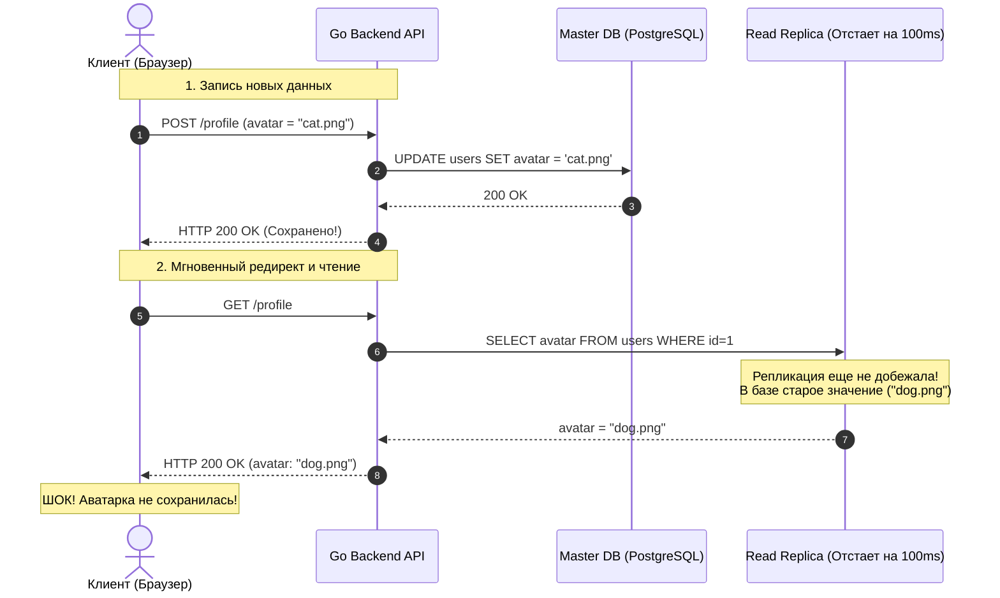

В разделе «Основы» мы выяснили фундаментальную истину: распределенные системы живут по законам неумолимых компромиссов. Теоремы CAP и PACELC математически доказали, что при обрывах сетевых магистралей или в моменты пиковых нагрузок инженеру всегда приходится выбирать между доступностью, задержкой (Latency) и согласованностью данных.

Но что именно мы, разработчики бэкенда, вкладываем в простое слово «согласованность» (**Consistency**)?

Когда вы пишете в однопоточной функции на Go:
```go
x := 1
fmt.Println(x)
```
вы на 100% уверены, что на экран выведется `1`. Это естественное ожидание детерминизма вшито в наш мозг годами работы с локальной памятью. Регистры процессора и L1-кэш обеспечивают абсолютную свежесть данных на наносекундных интервалах.

Но когда ваша база данных размазана по пяти серверам в разных уголках мира, переменная `x` перестает быть уютной ячейкой памяти в кэше процессора. Теперь это реплицированное состояние (Replicated State). 

Если сервер `A` в Амстердаме выполнил операцию `x = 1` и ответил успехом клиенту, в какую именно микросекунду об этом узнает сервер `B` в Сингапуре? И что прочитает мобильный пользователь в Токио, если он обратится к серверу `B` ровно в тот момент, когда оптический сетевой пакет с новыми данными еще только пересекает Индийский океан?

Чтобы программисты могли писать предсказуемый код и не сходить с ума от сетевого недетерминизма, распределенные системы предоставляют нам **Модели согласованности (Consistency Models)**.

---

## Что такое модель согласованности?

> **Модель согласованности** — это формальный контракт (спецификация правил) между программистом и распределенной системой хранения данных.

Этот контракт гласит:  
*«Если ты, разработчик, взаимодействуешь со мной по оговоренным правилам (выбираешь правильные кворумы, передаешь идентификаторы сессий или используешь определенные уровни транзакций), я гарантирую, что результаты твоих операций чтения и записи будут подчиняться строго определенному порядку во времени»*.


В распределенной инженерии действует фундаментальное правило сложности:
* **Чем строже модель согласованности**, тем проще писать бизнес-логику (система ведет себя как привычная локальная переменная), но тем медленнее она работает и тем менее она устойчива к сетевым сбоям (узлы вынуждены синхронно блокироваться ради консенсуса).
* **Чем слабее модель согласованности**, тем сложнее и коварнее прикладной код на Go (разработчику приходится вручную разруливать конфликты, отслеживать версии и терпеть устаревшие данные), но тем фантастически быстрее и доступнее работает распределенный кластер.

---

## Главная ловушка: Linearizability vs Serializability

Прежде чем исследовать спектр моделей, мы обязаны устранить главную терминологическую путаницу в компьютерных науках, на которой регулярно спотыкаются даже Senior-инженеры на архитектурных интервью.

> [!tip] Собеседование
> **Вопрос:** В чем фундаментальная разница между Линеаризуемостью (Linearizability) и Сериализуемостью (Serializability)?
> 
> **Ответ:** Это две принципиально разные концепции, пришедшие из абсолютно разных областей Computer Science, хотя звучат они обманчиво похоже:
> 
> 1. **Serializability (Сериализуемость)** — это гарантия из мира **транзакционных баз данных (буква «I» в ACID)**. 
>    Она касается **множества операций над множеством разных объектов** в рамках транзакций. Сериализуемость гарантирует, что параллельно исполняющиеся транзакции завершатся с тем же результатом, как если бы они выполнялись строго по очереди в каком-то одном последовательном порядке. При этом сериализуемость **ничего не обещает относительно реального физического времени (wall-clock time)**! Транзакция, начавшаяся в 12:00, теоретически может быть сериализована *раньше* транзакции, начавшейся в 11:59.
> 
> 2. **Linearizability (Линеаризуемость / Строгая согласованность)** — это гарантия из мира **распределенных систем и конкурентного программирования**. 
>    Она касается **одиночных операций над одним объектом** (регистром или ключом). Линеаризуемость гарантирует, что как только операция записи завершилась успешно (клиент получил подтверждение), **любое последующее чтение этого объекта любым клиентом в любой точке планеты обязано вернуть это новое значение** (или еще более свежее). Линеаризуемость **жестко и неразрывно привязана к физическому времени (wall-clock)**.
> 
> Элитные распределенные СУБД (Google Spanner, CockroachDB) объединяют оба мира, предоставляя высший стандарт надежности — **Strict Serializability (Строгую Сериализуемость)**: транзакции изолированы, а их последовательность строго синхронизирована с глобальным физическим временем (через TrueTime или гибридные логические часы HLC).

---

## Спектр моделей (Data-Centric Models)

Данные модели (ориентированные на данные) описывают глобальный порядок, который распределенная система гарантирует всем своим узлам. Рассмотрим их по нисходящей: от предельно строгих к максимально расслабленным.

```
[Строгие, синхронные, дорогие]
       ▲  Linearizability (Строгая согласованность в реальном времени)
       │  Sequential Consistency (Единый глобальный порядок без привязки к часам)
       │  Causal Consistency (Причинно-следственный порядок / Happens-Before)
       ▼  Eventual Consistency (Согласованность в конечном счете)
[Слабые, асинхронные, высокопроизводительные]
```

### 1. Линеаризуемость (Linearizability / Strong Consistency)

Создает для программиста идеальную иллюзию работы с **одним-единственным компьютером**. 

Если операция записи $W(x=1)$ на узле `A` завершилась во времени до того, как операция чтения $R(x)$ стартовала на узле `B`, операция $R(x)$ **обязана вернуть `1`**. Никаких перемещений во времени назад не допускается.

* **Как достигается:** Исключительно через распределенный консенсус (Raft, Paxos). Каждая запись требует подтверждения кворума большинства узлов с обязательным сбросом на диск (`fsync`). Чтения также обязаны проверять кворум или подтверждать актуальность лидера (механизм `ReadIndex` в Raft).
* **Где применяется:** Системы хранения метаданных и координации: `etcd`, `Consul`, хранилище блокировок Google Chubby.

### 2. Последовательная согласованность (Sequential Consistency)

Сформулирована Лесли Лэмпортом в 1979 году. Мы снимаем жесткую привязку к физическим часам (wall-clock time), но сохраняем железное правило: **все узлы кластера обязаны видеть все операции записи в абсолютно одинаковом порядке**. При этом операции каждого отдельного процесса обязаны выполняться в порядке его локальной программы.

*Аналогия:* Представьте групповой чат. Если Алиса написала шутку, а Боб отправил смайлик в ответ, последовательная согласованность гарантирует, что ни один участник чата ни при каких обстоятельствах не увидит смайлик Боба *раньше* шутки Алисы. Однако сам факт доставки этой цепочки сообщений до пользователя в Австралии может задержаться на несколько секунд относительно Европы.

### 3. Причинная согласованность (Causal Consistency)

Система отслеживает причинно-следственные связи событий по отношению «произошло до» (**Happens-Before** $\to$). 

Если событие $B$ причинно зависит от события $A$ (например, клиент прочитал $A$ и на основе этого записал $B$), то система гарантирует, что абсолютно все узлы кластера увидят $A$ раньше, чем $B$. 

А что насчет независимых, параллельных операций (Concurrent Operations)? Их разные узлы имеют право видеть в произвольном порядке!

* **Где применяется:** Распределенные collaborative-системы, чаты, распределенные базы данных на базе Векторных часов ([[5. Vector clocks]]).

### 4. Согласованность в конечном счете (Eventual Consistency)

Самая слабая, но самая популярная модель современного высоконагруженного веба. Сформулирована техническим директором Amazon Вернером Фогельсом в 2007 году.

Правило предельно лаконично:  
*Если поток обновлений ключа прекратится, то спустя некоторое конечное время (миллисекунды или секунды) все реплики в кластере гарантированно придут к абсолютно идентичному состоянию.*

В каждый конкретный момент времени узлы могут находиться в состоянии разброда и шатания, возвращая клиентам устаревшие данные.

* **Как достигается:** Асинхронная фоновая репликация, Gossip-протоколы, механизмы Read Repair и Anti-Entropy.
* **Где применяется:** `Cassandra`, `Redis` (с асинхронными репликами), DynamoDB, Amazon S3, системы доменных имен DNS, CDN-кэши.

---

## Гарантии сессий (Client-Centric Models)

Строгая линеаризуемость уничтожает пропускную способность распределенной системы (в соответствии с PACELC). Поэтому на практике Go-разработчики строят бэкенды на базах данных со слабой согласованностью (Eventual Consistency), но достраивают необходимые гарантии на уровне сессии конкретного клиента. 

Эти механизмы впервые были формализованы в исследовательском проекте Bayou (Doug Terry et al., 1994).

---

### Read Your Writes (Читай свои записи)

> [!warning] Ловушка / Gotcha: Классическая драма с аватаркой в Master-Slave
> Представьте типичный сценарий в микросервисе на Go, работающем с PostgreSQL с асинхронной Read-репликой:
> 1. Пользователь загружает новую аватарку в профиль.
> 2. Go-бэкенд выполняет `UPDATE users SET avatar = 'cat.png'` в Master-базу.
> 3. Master отвечает успехом, бэкенд возвращает пользователю `HTTP 200 OK`.
> 4. Браузер тут же делает редирект на страницу профиля и запрашивает свежие данные пользователя: `GET /api/v1/profile`.
> 5. Go-бэкенд для масштабирования читает этот `GET`-запрос из пула **Read-реплик (Slave)**.
> 6. Асинхронная репликация PostgreSQL отстает от мастера всего на 80 миллисекунд. Реплика еще не успела применить WAL-запись!
> 7. Пользователь видит старую аватарку. Он решает, что сервис сломался, и в панике нажимает кнопку сохранения еще десять раз подряд!



Модель **Read Your Writes (RYW)** дает железобетонное обещание:  
*Если конкретный клиент изменил данные, то любые последующие чтения, инициированные этим же клиентом, гарантированно вернут обновленную версию.* При этом другие клиенты в системе вполне могут еще несколько секунд наблюдать старые данные!

#### Как реализовать Read Your Writes в Go:
1. **Sticky Routing (Липкий роутинг по времени):**  
   Когда пользователь совершает операцию записи, балансировщик или слой доступа к данным в Go помечает его сессию флагом. В течение следующих $N$ секунд (например, 5 секунд) **все запросы на чтение от этого UserID принудительно направляются на Master-узел**, минуя отстающие реплики.
2. **Токены консистентности (Version Vectors / LSN):**  
   При записи база данных возвращает номер позиции журнала транзакций (Log Sequence Number, LSN в Postgres). Go-бэкенд помещает этот токен в JWT-куку или возвращает в HTTP-заголовке `X-Data-Revision`. При следующем чтении бэкенд обращается к реплике с условием: *«Отдай данные, только если твоя позиция репликации не меньше этого LSN. Если ты отстаешь — подожди догонки или перенаправь запрос на Мастер»*.

```go
package repository

import (
	"context"
	"fmt"
)

type ConsistencyToken string

type UserProfile struct {
	ID        string
	AvatarURL string
}

type UserRepository struct {
	masterDB  DBConnection
	replicaDB DBConnection
}

// GetProfileWithRYW реализует гарантию Read Your Writes
func (r *UserRepository) GetProfileWithRYW(ctx context.Context, userID string, minToken ConsistencyToken) (*UserProfile, error) {
	// Если клиент недавно писал данные и передал токен ревизии
	if minToken != "" {
		replicaLSN := r.replicaDB.CurrentReplicationLSN(ctx)
		
		// Если реплика отстает от ревизии клиента — читаем с Мастера!
		if replicaLSN < minToken {
			return r.masterDB.QueryUser(ctx, userID)
		}
	}

	// Реплика актуальна — безопасно читаем из пула реплик
	return r.replicaDB.QueryUser(ctx, userID)
}
```

---

### Monotonic Reads (Монотонные чтения)

Гарантирует, что **время для клиента никогда не потечет вспять**. Если клиент однажды прочитал свежее значение, он никогда в последующих запросах не увидит более старую версию данных.

Представьте, что пользователь открыл страницу баланса в банковском приложении и несколько раз обновляет экран клавишей `F5`:
* Запрос 1 прилетел на **Реплику 1** (она отстает на 2 секунды). Баланс: **$100**.
* Запрос 2 прилетел на **Реплику 2** (она свежая, догнала мастер). Баланс: **$50** (произошло списание средств).
* Запрос 3 из-за раунд-робина снова попал на **Реплику 1**. Баланс внезапно опять стал **$100**!

В глазах пользователя деньги то исчезают, то материализуются из воздуха. Это разрушает доверие к сервису.

**Решение в Go:**  
Привязка сессии клиента к конкретному инстансу реплики (Sticky Session по хэшу `hash(UserID) % len(replicas)`). Реплика может слегка отставать от мастера, но ее локальное время **всегда движется строго вперед**. Пользователь никогда не испытает иллюзии путешествия во времени назад.

---

## Mechanical Sympathy: Архитектура CPU как зеркало распределенных систем

> [!info] Под капотом: Кэши процессора и закон подобия
> Если вы хотите по-настоящему глубоко прочувствовать модели согласованности, посмотрите на кристалл современного многоядерного процессора. 
> 
> Устройство современного x86 или ARM процессора — это **микроскопическая распределенная система прямо на кремнии**:
> * Локальный L1/L2 кэш ядра CPU — это локальная Read-реплика.
> * Оперативная память (DRAM) — это медленный удаленный Master.
> 
> Когда ядра процессора исполняют код, они для скорости пишут во внутренние буферы записи (**Store Buffers**). В этот момент ядра находятся в режиме слабой согласованности.
> 
> И только когда в коде на Go вызывается `sync.Mutex` или атомарные инструкции из пакета `sync/atomic`, компилятор генерирует аппаратные инструкции с барьерами памяти (`MFENCE`, `LOCK CMPXCHG` на x86 или `DMB` на ARM). Эти барьеры заставляют контроллер шины запустить протокол когерентности кэшей **MESI**, принудительно синхронизируя кэш-линии ядер ценой десятков тактов простоя конвейера.
> 
> Консенсус на уровне серверов — это ровно те же барьеры памяти процессора, только растянутые с наносекунд на миллисекунды сетевых кабелей.

---

## Итог

1. **Модель согласованности** — это контракт, устанавливающий допустимый порядок видимости операций чтения и записи для клиентов.
2. **Linearizability vs Serializability:** Линеаризуемость гарантирует свежесть одиночных операций во времени (wall-clock), а сериализуемость — изоляцию составных транзакций без привязки к часам.
3. **Строгие модели (Linearizability):** Исключают ошибки, но требуют дорогого консенсуса (`etcd`, `Consul`) и синхронных дисковых операций.
4. **Слабые модели (Eventual Consistency):** Обеспечивают запредельную пропускную способность (`Cassandra`, `Redis`), перекладывая ответственность за сглаживание несоответствий на плечи разработчиков бэкенда.
5. **Сессионные гарантии (Read Your Writes, Monotonic Reads):** Позволяют дешево построить комфортный пользовательский UX поверх отстающих асинхронных реплик.

Выбор между строгой согласованностью и согласованностью в конечном счете — фундаментальная развилка при проектировании любого микросервиса. 

В следующей статье мы детально столкнем эти два мира лбами и разберем практические компромиссы их применения в реальных Go-архитектурах: [[2. Strong vs eventual consistency]].