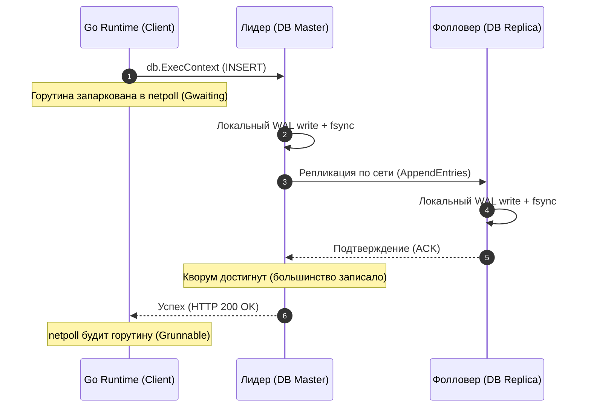
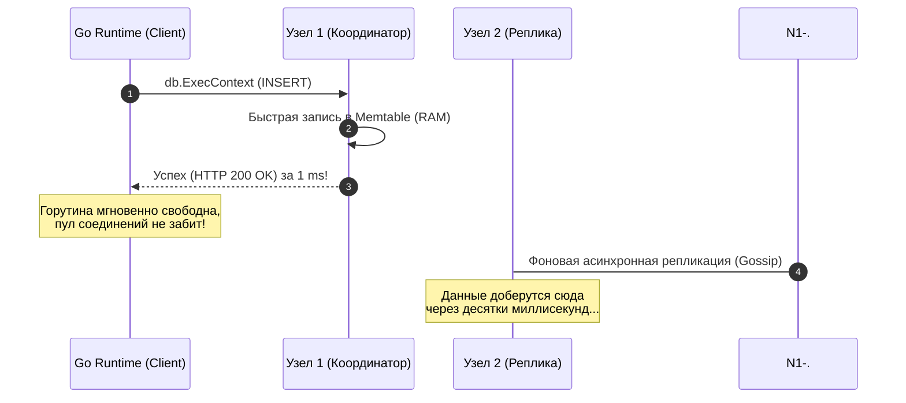

В прошлой статье [[1. Consistency модели]] мы выяснили, что согласованность — это строгий контракт между распределенной базой данных и кодом вашего приложения. Мы изучили всю шкалу возможных гарантий — от математически выверенной линеаризуемости до полного расслабления в eventual consistency.

Теперь пришло время столкнуть лбами две ключевые парадигмы, вокруг которых крутятся 99% архитектурных баталий в современном бэкенде: **Strong Consistency (Строгая согласованность / Линеаризуемость)** и **Eventual Consistency (Согласованность в конечном счете)**.

Выбор между ними — это не вопрос эстетики или личных симпатий к реляционным СУБД или NoSQL-решениям. Это фундаментальный инженерный расчет: сколько миллисекунд задержки готов терпеть пользователь, какую нагрузку выдержит пул соединений в Go, и готов ли бизнес к тому, что клиент на пару секунд увидит данные из прошлого.

---

## Strong Consistency: Иллюзия монолита

**Строгая согласованность (Linearizability)** создает кристальную и надежную иллюзию: распределенная система ведет себя так, словно в природе существует **всего одна-единственная физическая копия данных**.

Как только операция записи успешно завершена (клиент получил подтверждающий сетевой статус `HTTP 200 OK`), любое последующее чтение, к какому бы узлу кластера в любой точке планеты оно ни обратилось, гарантированно вернет именно это свежее значение.

Для инженера-разработчика это райский сад:
* Код прост и линеен;
* Никаких состояний гонки на уровне чтения;
* Никаких «призрачных» откатов баланса;
* Бизнес-логика защищена от двойных трат и конфликтов.

Но физические законы Вселенной и скорость распространения света в оптоволокне неумолимы. За эту идеальную иллюзию мы обязаны заплатить жесточайший налог на производительность.

---

### Mechanical Sympathy: Налог на синхронизацию

Давайте детально проследим, что происходит в «железе», сетевом стеке Linux и рантайме Go, когда ваш бэкенд выполняет операцию `INSERT` в строгую распределенную базу данных (например, кластер `etcd` или синхронную группу PostgreSQL).

Ваша прикладная горутина вызывает метод:
```go
_, err := db.ExecContext(ctx, "INSERT INTO accounts (id, balance) VALUES ($1, $2)", accountID, 1000)
```

1. **Go Runtime:** Драйвер базы данных формирует бинарный пакет и совершает системный вызов `write` в TCP-сокет. Планировщик Go немедленно переводит текущую горутину в состояние ожидания `Gwaiting` и паркует ее на системном селекторе `netpoll` (под капотом — Linux `epoll`). Поток ОС `M` освобождается и берет на исполнение другие задачи.
2. **Master-узел СУБД:** Сервер принимает пакет. Он не может просто записать данные в оперативную память. Он выполняет системный вызов `write` и тяжелейший `fsync` в локальный журнал упреждающей записи (**Write-Ahead Log, WAL**), принудительно сбрасывая кэш дискового контроллера.
3. **Сетевой транзит к репликам:** Мастер формирует репликационные пакеты и отправляет их через сетевые коммутаторы на подчиненные узлы (Фолловеры).
4. **Реплики:** Каждая реплика принимает изменения, выполняет локальный `write` и собственный `fsync` на свой физический накопитель.
5. **Подтверждение (ACK):** Реплики отправляют сетевой ответ с подтверждением Мастеру.
6. **Кворум:** Мастер подсчитывает голоса. Как только он убеждается, что строгое большинство узлов (Кворум) надежно зафиксировало байты на диске, он наконец-то отправляет ответный пакет в TCP-сокет вашего Go-приложения.
7. **Пробуждение в Go:** Системный вызов `epoll_wait` в потоке рантайма Go ловит событие поступления данных, горутина переводится из `Gwaiting` в `Grunnable`, подхватывается свободным процессором `P`, и функция `db.ExecContext(ctx, query)` завершает свою работу.



#### Цена вопроса: Бутылочное горлышко соединений

Реальная задержка вызова `db.ExecContext` складывается из физической цепочки:

$$\text{Latency} = \text{RTT}_{\text{master}} + \text{Fsync}_{\text{master}} + \text{RTT}_{\text{replica}} + \text{Fsync}_{\text{replica}} + \text{RTT}_{\text{client}}$$

В реальном облачном кластере это составляет от **15 до 60 миллисекунд** на каждый единичный чих!

Горутины в Go стоят дешево (всего ~2–4 КБ на стек), и миллион спящих в `Gwaiting` горутин память не разорят. Но **пул соединений к базе данных в стандартной библиотеке `database/sql` строго ограничен** (параметры `SetMaxOpenConns` и `SetMaxIdleConns`)!

Если ваш сервис испытывает всплеск входящей нагрузки до 10 000 RPS, а каждый запрос удерживает драгоценное TCP-соединение из пула на протяжении 40 миллисекунд в ожидании кворумного `fsync`, пул соединений мгновенно исчерпывается. Новые клиентские запросы выстраиваются в многотысячную очередь ожидания, таймеры контекстов начинают взрываться по `ctx.Err() == context.DeadlineExceeded`, и сервис захлебывается в каскадном отказе.

Строгая согласованность всегда драматически ограничивает предельную пропускную способность (**Throughput**) системы.

---

## Eventual Consistency: Скорость ценой хаоса

**Согласованность в конечном счете (Eventual Consistency)** смело срывает оковы синхронных блокировок. Гарантия звучит сдержанно:  
*Если в систему перестанут поступать новые изменения, то спустя некоторое время все узлы кластера придут к абсолютно идентичному состоянию.*

Это царство высокодоступных AP-систем (Apache Cassandra, Amazon DynamoDB, ScyllaDB, асинхронные реплики PostgreSQL и Redis). Они спроектированы для того, чтобы утилизировать сетевой стек и многоядерные процессоры на 100%, перемалывая сотни тысяч запросов в секунду с минимальными задержками.

---

### Mechanical Sympathy: Fire and Forget

Что происходит, когда Go-код пишет данные в AP-систему (например, в Cassandra с уровнем согласованности `Write Consistency = 1` или асинхронную очередь):

1. Узел кластера принимает входящий пакет.
2. Он мгновенно записывает структуру данных в быструю оперативную память (в Cassandra это кольцевой буфер `Memtable`) и дописывает байты в последовательный журнал без вызова блокирующего `fsync`.
3. Узел **немедленно** отправляет вашему Go-клиенту успешный ответ.
4. Ваша горутина в Go просыпается через **0.8–1.5 миллисекунды**! Соединение из `database/sql` тут же возвращается в пул и готово обслуживать следующего пользователя.
5. И только потом, в фоновом режиме, узел начинает асинхронно распространять обновления соседям по кластеру (через протоколы Gossip, репликационные очереди или Anti-Entropy фоновые задачи).



Система демонстрирует ошеломляющую пропускную способность: 100 000 RPS утилизируют сервер без малейших признаков очередей. Но за все в жизни приходится платить.

> [!warning] Ловушка / Gotcha: Аномалия Read-After-Write
> Пользователь совершает покупку или меняет пароль. Go-бэкенд отправляет запись на Узел 1 и моментально отвечает клиенту: *«Успешно!»*. 
> 
> Мобильное приложение делает следующий шаг и обращается за профилем пользователя. Балансировщик нагрузки перенаправляет этот `GET`-запрос на Узел 2. 
> 
> Асинхронный Gossip-пакет еще не долетел до Узла 2. Узел 2 заглядывает в свое локальное хранилище и честно отвечает: *«Баланс старый, пароль не менялся»*. 
> 
> Пользователь в бешенстве пишет в техподдержку: *«Где мои деньги? Ваше приложение списало средства, но не выдало товар!»*. Инженеры начинают экстренно искать баги в логике, хотя это фундаментальное следствие физики Eventual Consistency.

---

## Как это выглядит в коде (Эмуляция подходов)

Если бы мы разрабатывали собственный распределенный движок на Go, архитектурный водораздел между синхронной и асинхронной моделью выглядел бы следующим образом:

---

### Строгий подход (Synchronous Replication)

Мы держим горутину клиента на привязи до тех пор, пока большинство узлов кластера не подтвердят дисковую фиксацию:

```go
package cluster

import (
	"context"
	"fmt"
)

type StrongServer struct {
	wal      WALStorage
	replicas []*ReplicaClient
}

func (s *StrongServer) HandleWriteStrong(ctx context.Context, data []byte) error {
	// ШАГ 1: Локальная запись с обязательным сбросом кэша на диск
	if err := s.wal.WriteAndFsync(data); err != nil {
		return fmt.Errorf("локальная запись в WAL провалена: %w", err)
	}

	// ШАГ 2: Параллельная сетевая рассылка репликам
	ackCh := make(chan struct{}, len(s.replicas))
	for _, replica := range s.replicas {
		go func(r *ReplicaClient) {
			// Выполняем синхронный RPC-вызов
			if err := r.SendAppend(ctx, data); err == nil {
				ackCh <- struct{}{}
			}
		}(replica)
	}

	// ШАГ 3: Блокирующее ожидание сбора Кворума большинства
	acks := 1 // Учитываем собственный подтвержденный голос
	quorum := (len(s.replicas) / 2) + 1

	for acks < quorum {
		select {
		case <-ackCh:
			acks++
		case <-ctx.Done():
			// Если сеть тормозит, клиент получает ошибку по таймауту!
			return fmt.Errorf("таймаут сбора кворума: %w", ctx.Err())
		}
	}

	// Клиент получает подтверждение ТОЛЬКО после согласия большинства
	return nil
}
```

---

### Eventual подход (Asynchronous Replication)

Мы мгновенно отпускаем клиентский запрос, сбрасывая задачу синхронизации в фоновый конвейер каналов:

```go
package cluster

import (
	"context"
	"errors"
	"log"
)

type EventualServer struct {
	memtable         MemoryStore
	asyncQueue       chan []byte
	replicas         []*ReplicaClient
}

func (s *EventualServer) HandleWriteEventual(ctx context.Context, data []byte) error {
	// ШАГ 1: Молниеносная запись в оперативную память (RAM)
	if err := s.memtable.Insert(data); err != nil {
		return err
	}

	// ШАГ 2: Сброс в асинхронную очередь репликации без блокировки
	select {
	case s.asyncQueue <- data:
		// Успешно поставлено в очередь
	default:
		// Защита от исчерпания памяти при переполнении буфера (Backpressure)
		return errors.New("очередь репликации переполнена, сработал backpressure")
	}

	// ШАГ 3: Мгновенно возвращаем клиенту 200 OK (задержка < 1 мс)
	return nil
}

// Фоновый воркер работает абсолютно независимо от пользовательских HTTP-горутин
func (s *EventualServer) backgroundReplicationWorker(ctx context.Context) {
	for {
		select {
		case <-ctx.Done():
			return
		case entry := <-s.asyncQueue:
			for _, replica := range s.replicas {
				// Ошибки репликации не аффектят клиента:
				// реплика догонит состояние позже через механизмы Anti-Entropy
				if err := replica.SendAsync(context.Background(), entry); err != nil {
					log.Printf("Внимание: реплика временно недоступна: %v", err)
				}
			}
		}
	}
}
```

> [!tip] Собеседование
> **Вопрос:** Если мы развернули Apache Cassandra (классическую базу с Eventual Consistency), можем ли мы программно заставить отдельный критический запрос вести себя строго консистентно?
> 
> **Ответ:** Да! Модель согласованности в семействе Dynamo-подобных систем настраивается гибко **на уровне каждого отдельного запроса** (Tunable Consistency). 
> 
> Если вы укажете параметры `Write Consistency = QUORUM` и `Read Consistency = QUORUM`, система обеспечит строгую согласованность (Linearizability). 
> 
> Математическое условие пересечения кворумов выражается классической формулой:
> 
> $$R + W > N$$
> 
> где $N$ — общее число реплик, $W$ — число узлов, подтвердивших запись, а $R$ — число узлов, опрошенных при чтении. Если сумма $R + W$ строго больше $N$, множество узлов записи и множество узлов чтения гарантированно пересекутся хотя бы по одному узлу, хранящему самую свежую версию данных! 
> 
> Подробно всю математику и физику кворумов мы разберем в статье [[4. Quorum]].

---

## Сравнение лоб в лоб

| Критерий | Strong Consistency (Строгая) | Eventual Consistency (В конечном счете) |
| :--- | :--- | :--- |
| **Гарантия корректности** | Чтение в любой момент возвращает самую последнюю запись. | Чтение может вернуть устаревшую версию данных. |
| **Задержка (Latency)** | Высокая: ожидание сетевых RTT и системных вызовов `fsync`. | Минимальная: запись в память (RAM) за доли миллисекунды. |
| **Поведение при сбоях сети**| Падение доступности в изолированном сегменте (CP). | Непрерывная работа всех доступных сегментов (AP). |
| **Нагрузка на пул БД** | Высокая: горутины подолгу удерживают открытые сокеты. | Низкая: сокет освобождается почти мгновенно. |
| **Сложность бизнес-кода**| Минимальная: система предсказуема как локальная переменная. | Высокая: необходимость версионирования, токенов и слияний. |
| **Где применять в проде?** | Финансовые балансы, оформление заказов, складские остатки. | Лайки, счетчики просмотров, комментарии, IoT-телеметрия. |

---

## Итог

1. **Strong Consistency** спасает от логических багов и бережет нервы продуктовой команды, но беспощадно наказывает задержками и исчерпанием пула соединений при высоких нагрузках.
2. **Eventual Consistency** позволяет бэкенду выдерживать миллионные потоки событий без деградации времени отклика, но требует применения сессионных паттернов для защиты пользовательского опыта.
3. Профессиональный архитектор никогда не выбирает одну модель для всего монолита: внутри одной системы финансовые транзакции пишутся со строгим кворумом, а лента уведомлений — в режиме согласованности в конечном счете.

Но что происходит, если два независимых клиента в режиме Eventual Consistency одновременно обновят один и тот же ключ на разных репликах? В системе возникнет конфликт версий данных! 

Как распределенные системы обнаруживают такие расхождения прямо в момент чтения и тихо «залечивают» поврежденные реплики на лету? 

Об этом мы поговорим в следующей статье: [[3. Read repair]].