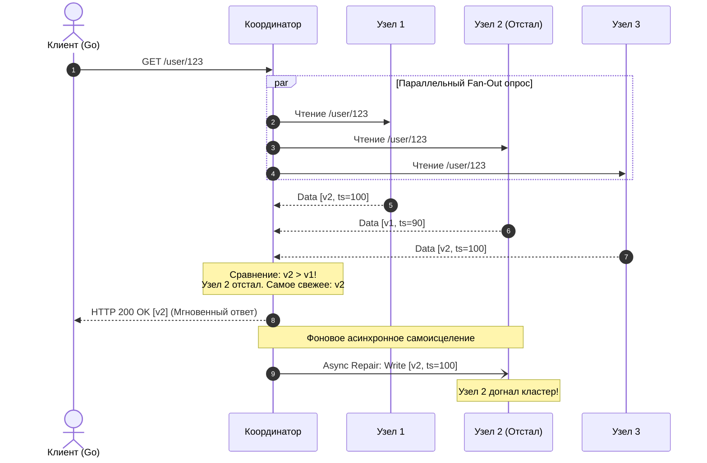

В прошлой статье [[2. Strong vs eventual consistency]] мы глубоко исследовали цену, которую инженер платит за запредельную скорость в системах с Eventual Consistency. Мы выяснили, что асинхронная фоновая репликация позволяет распределенному кластеру перемалывать колоссальные нагрузки без задержек на синхронные блокировки.

Но у этой свободы есть оборотная сторона: **рассинхронизация реплик во времени**. В любой произвольный момент времени узлы кластера неизбежно хранят разные версии одних и тех же данных.

Каким образом распределенная система в конечном счете (**eventually**) приходит к согласованности?

Казалось бы, самое прямолинейное решение — запустить тяжелого фонового демона, который будет непрерывно сканировать петабайты данных на накопителях всех серверов, сопоставлять контрольные суммы и выравнивать несовпадения. Но такая процедура (называемая полной фоновой антиэнтропией) мгновенно парализует дисковую подсистему (уничтожит бюджет IOPS) и забьет межсерверные сетевые каналы.

Создатели легендарных распределенных систем (Amazon DynamoDB, Apache Cassandra, Riak) нашли восхитительно красивое и ленивое решение: **пусть сами клиенты чинят расхождения непосредственно в момент чтения данных!**

Этот механизм называется **Read Repair (Ремонт при чтении)**.

---

## Механика Read Repair

Идея Read Repair поражает своим инженерным прагматизмом: если клиентское приложение всё равно тратит сетевой раундтрип на чтение записи, давайте параллельно опросим несколько реплик, на лету сверим их версии и, если кто-то из узлов отстал от жизни, незаметно обновим его прямо во время обработки клиентского запроса!

Рассмотрим пошаговую механику на примере кластера из трех узлов:

1. **Client Request:** Go-клиент отправляет запрос на чтение (`GET /user/123`) любому узлу кластера, который на время запроса берет на себя роль **Координатора (Coordinator)**.
2. **Fan-Out Read:** Координатор параллельно рассылает запрос трем серверам, хранящим копии этой записи: `Узел 1`, `Узел 2` и `Узел 3`.
3. **Responses with Metadata:** Узлы возвращают полезную нагрузку вместе с монотонным таймстампом или версией записи.
4. **Конфликт версий:** Координатор сравнивает полученные ответы:
   * `Узел 1` вернул версию `v2` с меткой времени `ts=100`;
   * `Узел 2` вернул устаревшую версию `v1` с меткой времени `ts=90`;
   * `Узел 3` вернул свежую версию `v2` с меткой времени `ts=100`.
   Поскольку `v2 > v1`, Координатор мгновенно делает вывод: `Узел 2` пропустил последнее обновление из-за сетевого лага!
5. **Ответ клиенту:** Координатор не заставляет клиента ждать завершения ремонта. Он немедленно отдает пользователю свежие данные версии `v2`.
6. **Async Repair:** В фоновом режиме Координатор отправляет асинхронную команду `Узлу 2`: *«Прими свежую версию v2 и обнови свой локальный диск!»*.



> [!info] Под капотом: Экономия сетевого трафика через Дайджесты (Digest Reads)
> Представьте, что запрашиваемый документ весит 5 Мегабайт. Если Координатор скачает 5 МБ с каждого из трех узлов, он прокачает через сеть 15 Мегабайт только ради того, чтобы убедиться, что байты одинаковы! Под нагрузкой в 5 000 RPS это гарантированно вызовет коллапс сетевых интерфейсов.
> 
> В боевых СУБД (например, в Cassandra) применяется изящная оптимизация — **Digest Reads**:
> 1. Координатор запрашивает полные данные (5 МБ) только у **одного** ближайшего узла.
> 2. У остальных двух узлов Координатор запрашивает только **Дайджест (Digest)** — легковесный MD5/SHA256 хэш данных (32 байта) и их Timestamp.
> 3. Координатор вычисляет хэш от полученных полных данных и сравнивает его с дайджестами соседей.
> 4. Если хэши сошлись на 100% — сеть сэкономлена, данные консистентны. Если обнаружено расхождение — только тогда Координатор дочитывает полные данные с отставшего узла, выполняет слияние и запускает Read Repair.

---

## Mechanical Sympathy: Read Repair в Go

Давайте посмотрим, как паттерн «Ремонт при чтении» элегантно реализуется на Go. Это канонический пример использования паттерна Fan-Out / Fan-In, неблокирующих каналов и контекстной отмены:

```go
package repair

import (
	"context"
	"fmt"
	"log"
	"sync"
	"time"
)

type VersionedData struct {
	Payload   []byte
	Timestamp int64
	NodeID    string
}

type Node interface {
	ID() string
	Fetch(ctx context.Context, key string) ([]byte, int64, error)
	ApplyUpdate(ctx context.Context, key string, data VersionedData) error
}

// ReadWithRepair параллельно читает с реплик и чинит отставшие узлы в фоне
func ReadWithRepair(ctx context.Context, key string, replicas []Node) ([]byte, error) {
	// Буферизованный канал под размер всех реплик исключает утечки горутин
	respCh := make(chan VersionedData, len(replicas))

	// 1. Fan-Out: асинхронно опрашиваем все реплики
	for _, node := range replicas {
		go func(n Node) {
			data, ts, err := n.Fetch(ctx, key)
			if err == nil {
				respCh <- VersionedData{Payload: data, Timestamp: ts, NodeID: n.ID()}
			} else {
				// В случае ошибки возвращаем пустой маркер
				respCh <- VersionedData{NodeID: n.ID(), Timestamp: -1}
			}
		}(node)
	}

	var latestData VersionedData
	var staleNodes []string
	responsesCount := 0

	// 2. Fan-In: собираем ответы с контролем таймаута
	for responsesCount < len(replicas) {
		select {
		case resp := <-respCh:
			responsesCount++
			if resp.Timestamp < 0 {
				continue // Пропускаем упавшие ноды
			}

			if resp.Timestamp > latestData.Timestamp {
				// Нашли более свежие данные: все ранее виденные узлы объявляются отставшими
				if latestData.Timestamp > 0 {
					staleNodes = append(staleNodes, latestData.NodeID)
				}
				latestData = resp
			} else if resp.Timestamp < latestData.Timestamp {
				// Текущий ответ отстал от лидера
				staleNodes = append(staleNodes, resp.NodeID)
			}

		case <-ctx.Done():
			return nil, fmt.Errorf("таймаут сбора реплик: %w", ctx.Err())
		}
	}

	if latestData.Timestamp <= 0 {
		return nil, fmt.Errorf("не удалось прочитать ключ %s ни с одной реплики", key)
	}

	// 3. Асинхронный Read Repair (Fire-and-Forget)
	if len(staleNodes) > 0 {
		// Запускаем ремонт в отдельной горутине, чтобы не задерживать ответ клиенту
		go triggerReadRepair(key, latestData, staleNodes, replicas)
	}

	return latestData.Payload, nil
}

func triggerReadRepair(key string, freshData VersionedData, staleNodes []string, allNodes []Node) {
	// Создаем изолированный контекст с собственным таймаутом для фоновой задачи
	repairCtx, cancel := context.WithTimeout(context.Background(), 3*time.Second)
	defer cancel()

	nodeMap := make(map[string]Node, len(allNodes))
	for _, n := range allNodes {
		nodeMap[n.ID()] = n
	}

	for _, nodeID := range staleNodes {
		targetNode, exists := nodeMap[nodeID]
		if !exists {
			continue
		}

		log.Printf("[ReadRepair] Обновление отставшего узла %s для ключа %s (ts=%d)", nodeID, key, freshData.Timestamp)
		if err := targetNode.ApplyUpdate(repairCtx, key, freshData); err != nil {
			log.Printf("[ReadRepair] Ошибка обновления узла %s: %v", nodeID, err)
		}
	}
}
```

В этой архитектуре клиент мгновенно получает результат, как только Координатор вычислил максимальный Timestamp. Тяжелая работа по синхронизации вытеснена в фон (`triggerReadRepair`), разгружая критический путь исполнения.

---

## Проблема "Мертвых душ" и Томбстоуны

Read Repair безупречно работает для операций обновления. Но что произойдет, если пользователь решит **удалить** свои данные?

Рассмотрим катастрофический сценарий в наивной системе:
1. `Узел 1` и `Узел 2` хранят профиль пользователя. `Узел 3` временно отключился из-за сетевого сбоя.
2. Пользователь отправляет запрос `DELETE /user/123`.
3. Координатор отправляет команду удаления. `Узел 1` и `Узел 2` стирают запись из файловой системы с помощью системного вызова `unlink` или команды `delete`.
4. Сетевой кабель починили, и `Узел 3` возвращается в строй. У него на диске по-прежнему лежит старая запись пользователя!
5. Приходит запрос на чтение `GET /user/123`. Координатор опрашивает все три узла.
6. `Узел 1` и `Узел 2` отвечают: *«У нас пусто, ключа не существует»*.
7. `Узел 3` бодро рапортует: *«Вот запись пользователя: [Данные, ts=90]»*.

```
Узел 1: [Пусто (удалено)]
Узел 2: [Пусто (удалено)]
Узел 3: [Данные, ts=90] -> (ожил после сетевого сбоя)
```

Как среагирует наивный алгоритм Read Repair?  
Координатор подумает: *«Ого, на Узле 1 и Узле 2 данные пропали! Наверное, там случился сбой диска. К счастью, на Узле 3 сохранилась резервная копия!»*. 

Координатор берет старые данные с `Узла 3`, отдает их клиенту и **принудительно записывает обратно на Узел 1 и Узел 2**! Удаленный пользователь восстал из мертвых. В распределенных системах это явление называют **Zombie Resurrection (Воскрешение зомби)**.

---

### Решение: Tombstones (Надгробия)

> [!warning] Ловушка / Gotcha: В распределенных БД нельзя стирать данные физически
> Чтобы исключить воскрешение призраков, в распределенных базах данных данные **категорически запрещено удалять с диска физически** в момент операции `DELETE`.
> 
> Вместо этого система записывает специальный маркер — **Tombstone (Надгробие)**. Надгробие — это полноценная запись лога, содержащая ключ, свежий `Timestamp` и метаданные смерти объекта.

Когда запускается Read Repair в системе с надгробиями:
* `Узел 1` возвращает: `[Tombstone, ts=105]`;
* `Узел 2` возвращает: `[Tombstone, ts=105]`;
* `Узел 3` возвращает: `[Данные, ts=90]`.

Координатор сравнивает временные метки: $105 > 90$. Смерть наступила позже рождения! Координатор сообщает клиенту `HTTP 404 Not Found` и отправляет надгробие на `Узел 3`, синхронизируя удаление по всему кластеру.

И только спустя продолжительный льготный период (в Cassandra это `gc_grace_seconds`, по умолчанию 10 дней), когда кластер гарантированно разнес надгробие по всем серверам, фоновый процесс уплотнения диска (**Compaction**) физически зачищает байты с накопителя.

---

## Read Repair vs Anti-Entropy

Ленивая модель Read Repair элегантна, но у нее есть один очевидный ахиллесов пяточный нерв: **она чинит исключительно «горячие» данные**, к которым активно обращаются клиенты.

Если в системе хранятся архивные финансовые отчеты пятилетней давности, и во время сетевого сбоя три года назад пара реплик разошлась во мнениях, механизм Read Repair никогда не узнает об этой проблеме, потому что эти ключи никто не читает. В кластере начинает незаметно накапливаться **тихая энтропия (Silent Drift)**.

> [!tip] Собеседование
> **Вопрос:** Если Read Repair не гарантирует синхронизацию «холодных» архивных данных, как распределенные AP-хранилища добиваются 100% консистентности в долгосрочной перспективе?
> 
> **Ответ:** Настоящие распределенные хранилища используют двухконтурный механизм самоисцеления:
> 1. **Read Repair (Реактивный контур):** Мгновенно и дешево устраняет расхождения «на лету» при обработке пользовательского трафика.
> 2. **Active Anti-Entropy Repair (Проактивный контур):** Тяжелый регламентный фоновый процесс, запускаемый по расписанию (например, раз в неделю).
> 
> Чтобы фоновая синхронизация не передавала терабайты сырых данных по сети, узлы строят **Деревья Меркла (Merkle Trees)** — криптографические деревья хэшей от диапазонов ключей (Token Ranges). 
> 
> Серверы обмениваются лишь компактными корневыми хэшами деревьев (всего несколько десятков байт). Если корни совпали — терабайтный диапазон данных идентичен на 100%! Если корни различаются, узлы спускаются на уровень ниже по ветвям дерева, мгновенно локализуя единичный поврежденный блок данных, и пересылают по сети строго этот отсутствующий фрагмент.

---

## Итог

1. **Read Repair — ленивое самоисцеление:** Клиентские операции чтения используются как триггер для обнаружения и исправления расхождений между репликами без простоя системы.
2. **Асинхронность и Дайджесты:** Чтобы ремонт не бил по задержке (Latency), Координатор отдает клиенту свежие данные немедленно, вынося досылку обновлений в фоновые горутины, а сетевой трафик оптимизируется передачей хэш-дайджестов.
3. **Надгробия (Tombstones):** Физическое удаление данных в распределенных системах заменяется записью маркеров смерти с монотонным таймстампом, предотвращая воскрешение зомби-записей от отставших узлов.
4. **Anti-Entropy с Деревьями Меркла:** Надежная страховка от тихой энтропии для холодных данных, гарантирующая сходимость кластера на больших горизонтах времени.

В рассмотренном нами коде Координатор ждал ответов от всех реплик: условие `responsesCount < len(replicas)`. Но если мы обязаны дождаться 100% узлов, то падение хотя бы одного сервера намертво заблокирует чтение данных, уничтожив доступность (Availability)!

Каким образом распределенные базы данных умудряются гарантировать актуальность данных, опрашивая лишь **часть** серверов? 

Ответ кроется в элегантной математике распределенных кворумов, которую мы разберем в следующей статье: [[4. Quorum]].