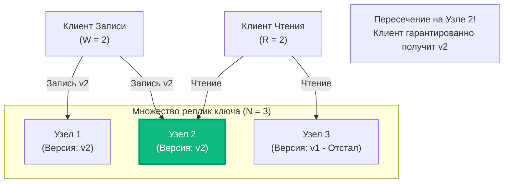

В предыдущих статьях мы исследовали два противоположных полюса распределенного мира: абсолютную согласованность (Strong Consistency), требующую синхронных кворумов и дисковых пауз, и расслабленную доступность (Eventual Consistency), позволяющую репликам отставать во времени. В статье [[3. Read repair]] мы увидели, как система может лениво чинить отставшие узлы прямо во время клиентских запросов.

Но в реальном промышленном бэкенде — особенно в децентрализованных хранилищах поколения Amazon Dynamo (таких как Apache Cassandra, ScyllaDB или Riak) — согласованность не является жестко зашитым бинарным выбором «все или ничего».

Согласованность здесь — это **динамический ползунок (Tunable Consistency)**, который вы, как Go-разработчик, настраиваете индивидуально под каждый конкретный сетевой запрос к базе данных!

Математическим фундаментом, позволяющим тонко регулировать этот баланс между скоростью и строгостью данных, является концепция **Кворума (Quorum)**.

---

## Уравнение Кворума: R + W > N

В основе кворумных архитектур лежит ключевой параметр: **`N` — Фактор репликации (Replication Factor)**. Это число серверов в кластере, на которых физически сохраняется дубликат одной и той же конкретной записи.

> [!warning] Ловушка / Gotcha: Что такое параметр N?
> Распространенная ошибка на технических интервью — путать `N` с общим количеством серверов в кластере. 
> Если ваш кластер Cassandra насчитывает 120 физических серверов в трех дата-центрах, а в схеме данных указан `Replication Factor = 3`, то **$N = 3$**! 
> Каждая конкретная строка данных физически реплицируется ровно на три выделенных узла (Token Range), а остальные 117 серверов о ее существовании даже не подозревают.

Чтобы управлять поведением операций, разработчик задает два параметра:
* **`W` (Write Quorum, кворум записи):** Минимальное число узлов, от которых координатор обязан получить подтверждение успешной записи (на диск или в Memtable) до того, как вернет клиенту статус `HTTP 200 OK`.
* **`R` (Read Quorum, кворум чтения):** Число реплик, которые координатор параллельно опрашивает при чтении, чтобы сравнить их версии, отсечь устаревшие данные и вернуть самую свежую запись.

**Золотое правило строгого Кворума:**
Чтобы гарантировать, что операция чтения *всегда* вернет самую последнюю зафиксированную версию данных (исключив чтение призраков и устаревших значений), система обязана удовлетворять строгому неравенству:

$$R + W > N$$

---

### Принцип Дирихле (Механика пересечения)

Почему эта простая математическая формула дает столь мощную гарантию?

Здесь вступает в силу фундаментальный принцип дискретной математики — **принцип Дирихле (Pigeonhole Principle)**, или теорема о пересечении кворумов:

> Если сумма мощностей двух подмножеств строго превышает мощность базового множества ($|Q_R| + |Q_W| > N$), эти два подмножества **гарантированно пересекаются хотя бы по одному общему элементу**:
> 
> $$|Q_R \cap Q_W| \ge 1$$

Этот единственный общий узел (Intersection Node) является свидетелем последней записи: на нем физически присутствует свежая версия данных с наибольшим таймстампом. Координатор сравнивает полученные ответы, видит актуальную версию и возвращает ее клиенту!



---

## Настройка ползунка (Use Cases)

В зависимости от профиля вашего сервиса (преобладают ли записи или преобладают чтения), вы выставляете значения `W` и `R` в конфигурации драйвера базы данных прямо в коде на Go. 

Разберем классический кластер с фактором репликации **`N = 3`**.

---

### 1. Сбалансированный кворум (`W = 2`, `R = 2`)

Канонический выбор по умолчанию для большинства систем:

$$2 + 2 > 3 \quad (\text{Условие } R + W > N \text{ строго соблюдено})$$

* **Отказоустойчивость:** Система безболезненно переживает падение любого одного узла из трех.
* **Задержка:** И чтение, и запись имеют предсказуемую умеренную задержку, так как координатор ждет ответов от двух самых быстрых узлов из трех.

---

### 2. Оптимизация записи (`W = 1`, `R = 3`)

Режим для систем с экстремальным потоком входящих данных (**Write-Heavy**):

$$1 + 3 > 3 \quad (\text{Условие строго соблюдено})$$

* **Запись мгновенна:** Координатор ждет ответа от одного-единственного ближайшего узла и сразу отпускает клиента.
* **Чтение хрупко и медленно:** Координатор обязан дождаться подтверждений от всех трех реплик. Если хотя бы один узел из трех перезагружается или испытывает сетевой лаг, операция чтения зависнет по таймауту!
* **Применение:** Системы сбора метрик, логов, трекинг геолокации курьеров или IoT-телеметрия, где записи происходят миллионы раз в секунду, а чтение выполняется редко внутренними аналитическими сервисами.

---

### 3. Оптимизация чтения (`W = 3`, `R = 1`)

Режим для сервисов с преобладанием запросов на чтение (**Read-Heavy**):

$$3 + 1 > 3 \quad (\text{Условие строго соблюдено})$$

* **Чтение молниеносно:** Запрос выполняется за доли миллисекунды из памяти любого одного ближайшего сервера.
* **Запись медленна и уязвима:** Чтобы обновить данные, необходимо дождаться успешного ответа от всех трех серверов. Падение хотя бы одного узла делает обновление невозможным.
* **Применение:** Каталоги товаров интернет-магазинов, кэширующие справочники, конфигурационные флаги (Feature Flags).

---

### 4. Полный Eventual Consistency (`W = 1`, `R = 1`)

Режим «педаль в пол»:

$$1 + 1 < 3 \quad (\text{Условие кворума нарушено!})$$

* Максимально возможная пропускная способность и минимальная задержка сети.
* **Плата:** Чтение может попасть на реплику, которая еще не получила фоновый Gossip-пакет, и клиент прочитает устаревшие данные (Stale Read). Инженер осознанно идет на этот компромисс ради максимального RPS.

---

## Mechanical Sympathy: Реализация кворума в Go

Если вы проектируете собственный распределенный шлюз или агрегатор микросервисов на Go, сбор кворума — это классическая инженерная задача на синхронизацию горутин.

Здесь критически важно использовать **кооперативную отмену контекста (`context.WithCancel`)**, чтобы не оставлять «висящие» горутины и срезать хвосты сетевых задержек:

```go
package quorum

import (
	"context"
	"errors"
	"fmt"
)

type Node interface {
	ID() string
	SendWrite(ctx context.Context, data []byte) error
}

// WriteWithQuorum отправляет запись на N узлов и ждет подтверждения от W узлов
func WriteWithQuorum(ctx context.Context, data []byte, W int, nodes []Node) error {
	if len(nodes) < W {
		return errors.New("недостаточно узлов для достижения кворума")
	}

	// Создаем дочерний контекст для досрочной отмены медленных горутин
	quorumCtx, cancel := context.WithCancel(ctx)
	// Обязательный defer: когда кворум набран, оставшиеся горутины будут прерваны!
	defer cancel()

	ackCh := make(chan struct{}, len(nodes))
	errCh := make(chan error, len(nodes))

	// Fan-Out: параллельный опрос всех реплик
	for _, n := range nodes {
		go func(node Node) {
			if err := node.SendWrite(quorumCtx, data); err != nil {
				errCh <- err
				return
			}
			ackCh <- struct{}{}
		}(n)
	}

	// Fan-In: подсчет подтверждений
	acks := 0
	errs := 0
	maxAllowedErrors := len(nodes) - W

	for {
		select {
		case <-ackCh:
			acks++
			if acks >= W {
				// Кворум W собран! defer cancel() моментально погасит медленные запросы
				return nil
			}

		case err := <-errCh:
			errs++
			// Fast-Fail оптимизация: если ошибок стало слишком много, 
			// собрать кворум W математически невозможно — выходим немедленно!
			if errs > maxAllowedErrors {
				return fmt.Errorf("кворум записи не достигнут (ошибок: %d, лимит: %d): последнее: %w", 
					errs, maxAllowedErrors, err)
			}

		case <-ctx.Done():
			// Родительский таймаут запроса истек
			return fmt.Errorf("таймаут сбора кворума: %w", ctx.Err())
		}
	}
}
```

> [!info] Под капотом: Срезание хвостов задержек (Tail Latency Elimination)
> Обратите внимание на профиль латентности кворумного запроса. 
> Время выполнения вызова `WriteWithQuorum` определяется скоростью **W-го самого быстрого узла**. 
> 
> Если при $N=3, W=2$ два узла ответили за **8 мс** и **12 мс**, а третий узел попал в паузу сборщика мусора и завис на **250 мс**, ваш Go-клиент получит подтверждение ровно через **12 миллисекунд**! Запрос к отстающему серверу будет мгновенно прерван отменой `quorumCtx`. 
> 
> Кворумная механика является мощнейшим оружием для борьбы с длинными хвостами задержек ($P99$ Latency), о которых мы говорили в [[3. Latency и network fallacies]].

---

## Sloppy Quorum и Hinted Handoff

Что произойдет, если в схеме с $N = 3$ и $W = 2$ два целевых узла для ключа `X` внезапно вышли из строя (например, сгорел стоечный коммутатор)?

По строгим правилам операция записи обязана завершиться с ошибкой: мы физически не можем собрать $W = 2$ подтверждения из трех назначенных реплик. Система теряет Доступность (Availability), что нарушает философию AP-систем.

Создатели архитектуры Dynamo предложили компромисс: **Sloppy Quorum (Нестрогий кворум)**.

Координатор видит, что назначенные узлы недоступны. Чтобы не возвращать клиенту статус ошибки `HTTP 500`, он временно записывает данные на **любые другие живые узлы кластера**, не входящие в стандартный диапазон репликации этого ключа. К этим записям прикрепляется специальная мета-информация — «напоминание»:
> *«Внимание: этот ключ принадлежит Узлу 2. Передай его законному владельцу, как только он вернется в строй!»*

Этот механизм передачи долгов называется **Hinted Handoff**.

Как только упавший Узел 2 оживает, соседние серверы обнаруживают это через протокол Gossip и автоматически пересылают ему накопленные записи.

*Плата за доступность:* Во время действия Sloppy Quorum стандартное чтение с $R=2$ не сможет найти эти данные (ведь они лежат на «чужих» временных серверах). Уравнение $R + W > N$ временно нарушается, и система кратковременно деградирует до слабой согласованности, но сервис не падает.

---

## Подводные камни кворумов

> [!tip] Собеседование
> **Вопрос:** Если мы настроили строгий кворум ($R + W > N$, например $W = 2, R = 2$ при $N = 3$), гарантирует ли это нам абсолютную Линеаризуемость (Linearizability), как в Raft?
> 
> **Ответ:** **Категорически нет!** Это одна из самых коварных ловушек на собеседованиях по распределенным системам.
> 
> Уравнение $R + W > N$ гарантирует чтение свежих данных **только при условии строго последовательных операций**. 
> 
> Если два независимых клиента **одновременно (concurrently)** отправят операции записи одного и того же ключа на разные узлы кластера, в системе без сильного лидера (Raft/Paxos) эти записи достигнут реплик в разном порядке! 
> 
> Базы данных Dynamo-типа для разрешения таких коллизий обычно применяют эвристику **Last-Write-Wins (LWW)**, опирающуюся на физические таймстампы серверов. А как мы помним из статьи [[5. Time и clock drift]], физические часы на серверах подвержены дрейфу и скачкам NTP. В результате запись, сделанная физически позже, может получить меньший таймстамп и быть **молча стерта** из кластера! 
> 
> Кворумные NoSQL-базы без распределенного консенсуса не подходят для строгих финансовых проводок.

---

## Итог

1. **Кворум ($R + W > N$)** — это математический механизм управления балансом между скоростью записи, скоростью чтения и надежностью данных.
2. **Принцип Дирихле:** Пересечение множеств чтения и записи гарантирует, что хотя бы один узел при чтении отдаст актуальную версию данных.
3. **Tail Latency Reduction:** Кворумная выборка в Go срезает медленные хвосты задержек за счет ранней отмены контекста (`context.WithCancel`).
4. **Sloppy Quorum и Hinted Handoff:** Позволяют сохранить доступность на запись даже при отказе целевых реплик ценой временной потери строгой согласованности.
5. **Предел возможностей:** Кворумы отлично защищают от частичных сбоев оборудования, но бессильны перед конфликтами одновременных записей от разных клиентов.

Если физические часы врут, а кворум не может упорядочить одновременные записи — как распределенная система может определить, какая операция была причиной, а какая — следствием? 

Нам нужен инструмент логического упорядочивания событий. О том, как работают векторные часы, мы поговорим в следующей статье: [[5. Vector clocks]].