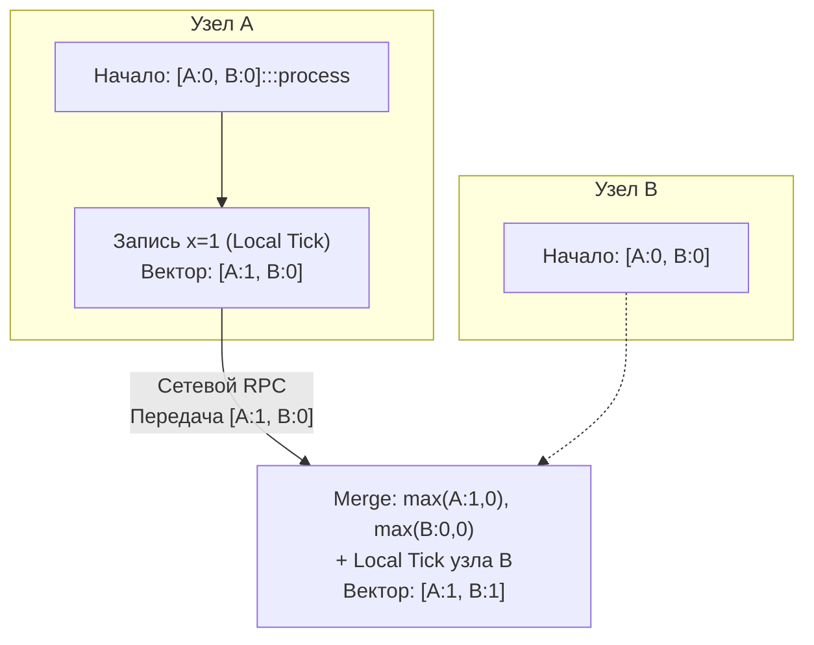

В статье [[5. Time и clock drift]] мы выучили суровый физический урок: в распределенных системах физическим часам (генераторам кварцевых колебаний и протоколам синхронизации NTP) доверять нельзя. Из-за температурного дрейфа, сетевых задержек и скачков виртуализации системное время на разных серверах течет с разной скоростью.

Если мы наивно используем стандартный `timestamp` для разрешения конфликтов при параллельной записи (знаменитая стратегия *Last-Write-Wins*, LWW), мы гарантированно потеряем бизнес-данные. Сервер с отстающими на пару миллисекунд часами бесследно сотрет более свежую запись клиента просто потому, что его системное время оказалось численно меньше.

Как же распределенной системе ответить на фундаментальные вопросы:
1. *Какое из двух событий произошло раньше другого?*
2. *Является ли событие $B$ следствием события $A$ (причинно-следственная связь)?*
3. *И самое главное: произошли ли два события параллельно (конкурентно), без взаимного знания друг о друге?*

Чтобы победить физику, инженеры отказались от физических часов и создали часы логические. Высшим этапом их эволюции в NoSQL-базах данных стали **Векторные часы (Vector Clocks)**.

---

## Иллюзия времени: От Лэмпорта к Векторам

В 1978 году Лесли Лэмпорт в своей эпохальной работе сформулировал понятие отношения «произошло до» (**Happens-Before**, $\to$). 

Лэмпорт предложил простой механизм: пусть каждый узел ведет обычный целочисленный счетчик (логические часы Лэмпорта). Перед каждым событием узел делает `counter++`. При отправке сетевого сообщения счетчик прикрепляется к пакету. Получатель обновляет свои часы по правилу:

$$L_{\text{local}} = \max(L_{\text{local}}, L_{\text{msg}}) + 1$$

Часы Лэмпорта идеально упорядочивали события в одну глобальную цепочку, но у них был фатальный теоретический изъян:
> **Ограничение часов Лэмпорта:**  
> Если событие $A$ причинно предшествовало событию $B$ ($A \to B$), то гарантировано $L(A) < L(B)$.  
> **Но обратное утверждение неверно!** Глядя на два числа $L(A) = 4$ и $L(B) = 5$, вы **не можете определить**, зависело ли $B$ от $A$, или эти два события произошли абсолютно изолированно в параллельных вселенных на разных концах земного шара.

В 1988 году Колин Фидж (Colin Fidge) и Фридеманн Маттерн (Friedemann Mattern) независимо друг от друга предложили расширение: чтобы обнаруживать конкурентность, скалярный счетчик необходимо превратить в **Вектор**.

---

## Анатомия Векторных Часов

**Векторные часы** — это структура данных, представляющая собой вектор (массив или ассоциативную карту) счетчиков. 

Размер этого вектора в классической теории равен числу узлов $N$ в кластере. Каждый узел хранит не только собственный счетчик времени, но и срез своих актуальных знаний о логическом времени всех остальных участников системы!

В языке Go векторные часы моделируются как структура с картой счетчиков: `map[string]uint64` (где ключ — уникальный ID узла).

---

### Три золотых правила

Пусть у нас есть кластер из трех узлов: $A$, $B$ и $C$. Каждый узел начинает жизненный цикл с чистого нулевого вектора: `[A:0, B:0, C:0]`.

1. **Локальное событие (Local Tick):**  
   Перед выполнением любой локальной операции (запись данных, транзакция, отправка пакета) узел инкрементирует **свой собственный компонент** в векторе:
   $$V_i[i] = V_i[i] + 1$$
2. **Передача контекста (Attach):**  
   При отправке любого сетевого сообщения узел прикрепляет полную текущую копию своего вектора $V_i$ к полезной нагрузке.
3. **Слияние при получении (Merge & Tick):**  
   Когда узел $j$ получает пакет с удаленным вектором $V_{\text{msg}}$, он:
   * Вычисляет **поэлементный максимум** между своим вектором и полученным:
     $$\forall k: \quad V_j[k] = \max(V_j[k], V_{\text{msg}}[k])$$
   * Инкрементирует **свой собственный счетчик**, фиксируя событие приема сообщения:
     $$V_j[j] = V_j[j] + 1$$



---

## Математика причинности (Causality)

Имея на руках два вектора $V_1$ и $V_2$, прикрепленные к двум версиям одного и того же объекта, мы можем строго математически определить их взаимное отношение, выполнив **поэлементное сравнение**:

### 1. Доминирование / Предшествование (`V1 < V2`)
Событие $V_1$ произошло **строго ДО** события $V_2$ ($V_1 \to V_2$), если:
* Каждый элемент вектора $V_1$ меньше либо равен соответствующему элементу $V_2$:  
  $$\forall k: \quad V_1[k] \le V_2[k]$$
* И существует хотя бы один элемент, где неравенство строгое:  
  $$\exists j: \quad V_1[j] < V_2[j]$$

*Пример:*  
$V_1 = [A:1, B:0]$ и $V_2 = [A:1, B:1]$.  
Поскольку $1 \le 1$ и $0 < 1$, мы с абсолютной уверенностью заявляем: $V_1$ предшествовало $V_2$. Версия $V_2$ полностью включает в себя историю $V_1$ и является ее прямым потомком. Конфликта нет!

---

### 2. Тождественность (`V1 == V2`)
Все элементы векторов равны. Это одно и то же событие, дубликат сетевого пакета.

---

### 3. Конфликт / Конкурентность (`V1 || V2`)
Два события произошли **конкурентно (одновременно / независимо)**, если:
* В векторе $V_1$ есть компонент, который больше, чем в $V_2$;
* **И** в векторе $V_2$ есть компонент, который больше, чем в $V_1$!

*Пример:*  
$$V_1 = [A:2, B:1] \quad \text{и} \quad V_2 = [A:1, B:2]$$
Для узла $A$: $2 > 1$. Но для узла $B$: $1 < 2$.  
Ни один вектор не доминирует над другим! Узел $A$ развивал свою историю, не зная о действиях узла $B$, а узел $B$ писал свои данные, не зная об узле $A$. 

**Это математическое доказательство конфликта данных (`V1 || V2`).**

> [!tip] Собеседование
> **Вопрос:** База данных Amazon Dynamo (или Riak) получила две параллельные версии профиля пользователя с векторами `[A:3, B:1, C:1]` и `[A:2, B:4, C:1]`. Какую из версий база данных обязана сохранить на диске?
> 
> **Ответ:** База данных **категорически не имеет права затирать ни одну из них**! 
> Поэлементное сравнение показывает конфликт: по узлу $A$ свежее первая версия ($3 > 2$), но по узлу $B$ свежее вторая ($4 > 1$). 
> Это конкурентные записи. База данных обязана сохранить **обе версии** как равноправных «братьев» (**Siblings**). 
> При следующем чтении база вернет клиенту обе версии, чтобы прикладной Go-код (или сам пользователь в UI) выполнил их осознанное бизнес-слияние (Merge).

---

## Mechanical Sympathy: Векторные часы в Go

Давайте спроектировать потокобезопасную, эффективную реализацию векторных часов на Go с полным алгоритмом сравнения:

```go
package vclock

import (
	"sync"
)

type Order int

const (
	Equal Order = iota
	Before
	After
	Concurrent
)

// VectorClock представляет логические часы на базе хэш-таблицы
type VectorClock struct {
	mu     sync.RWMutex
	nodeID string
	vc     map[string]uint64
}

func New(nodeID string) *VectorClock {
	return &VectorClock{
		nodeID: nodeID,
		vc:     make(map[string]uint64),
	}
}

// Tick увеличивает локальный счетчик текущего узла
func (v *VectorClock) Tick() {
	v.mu.Lock()
	defer v.mu.Unlock()
	v.vc[v.nodeID]++
}

// Clone возвращает изолированный снимок вектора для сериализации в сеть
func (v *VectorClock) Clone() map[string]uint64 {
	v.mu.RLock()
	defer v.mu.RUnlock()

	cp := make(map[string]uint64, len(v.vc))
	for k, val := range v.vc {
		cp[k] = val
	}
	return cp
}

// Merge выполняет объединение с входящим удаленным вектором
func (v *VectorClock) Merge(remote map[string]uint64) {
	v.mu.Lock()
	defer v.mu.Unlock()

	for node, remoteVal := range remote {
		if localVal, exists := v.vc[node]; !exists || remoteVal > localVal {
			v.vc[node] = remoteVal
		}
	}
	// Инкремент собственного счетчика в честь события слияния
	v.vc[v.nodeID]++
}

// Compare определяет причинно-следственную связь между двумя снимками векторов
func Compare(v1, v2 map[string]uint64) Order {
	v1Bigger := false
	v2Bigger := false

	// Собираем полный пул всех известных узлов из обоих векторов
	allKeys := make(map[string]struct{}, len(v1)+len(v2))
	for k := range v1 {
		allKeys[k] = struct{}{}
	}
	for k := range v2 {
		allKeys[k] = struct{}{}
	}

	for k := range allKeys {
		val1 := v1[k]
		val2 := v2[k]

		if val1 > val2 {
			v1Bigger = true
		} else if val1 < val2 {
			v2Bigger = true
		}

		// Если оба флага выставлены — это гарантированный конфликт
		if v1Bigger && v2Bigger {
			return Concurrent
		}
	}

	if v1Bigger && !v2Bigger {
		return After // v1 новее, чем v2 (v2 -> v1)
	}
	if !v1Bigger && v2Bigger {
		return Before // v1 произошло ДО v2 (v1 -> v2)
	}
	return Equal
}
```

---

## Цена метаданных и нагрузка на сеть/GC

Векторные часы математически безупречны, но в промышленной эксплуатации они несут в себе коварную угрозу производительности рантайма Go.

> [!info] Под капотом: Проблема взрыва векторов (Vector Explosion)
> В нашей структуре на Go используется `map[string]uint64`. 
> Вспомним внутреннее устройство хэш-таблицы в рантайме Go: карта состоит из заголовка `hmap` и массива бакетов `bmap`, каждый из которых аллоцируется в куче (heap).
> 
> В Dynamo-подобных базах вектор прикрепляется к **каждому индивидуальному ключу**. 
> Если кластер состоит из сотен микросервисов или подов Kubernetes, динамически создающихся и уничтожающихся в ходе HPA-автоскейлинга, в векторе накапливаются тысячи устаревших записей:
> `{"pod-xyz-1": 2, "pod-abc-2": 5, "pod-def-3": 1, ...}`.
> 
> Это приводит к двум катастрофическим последствиям:
> 1. **Раздувание сетевого I/O:** Размер служебных метаданных начинает многократно превышать размер самого полезного JSON/Protobuf пейлоуда.
> 2. **GC Pressure:** Десериализация миллионов таких карт на высоких RPS создает лавину объектов `bmap` в памяти, вызывая всплески пауз сборщика мусора Go (GC Thrashing).

---

## Эволюция: Dotted Version Vectors (DVV)

Чтобы обуздать векторный взрыв, современные распределенные хранилища (такие как Riak KV) перешли от классических Vector Clocks к усовершенствованной математической модели — **Dotted Version Vectors (DVV)**.

В архитектуре DVV метаданные разделяются на два уровня:
1. **Глобальный контекст (Causal Context):** Один компактный вектор часов хранится на уровне всего ключа.
2. **Точка обновления (Dot):** Каждое конкретное значение помечается предельно легкой парой: `[NodeID: Counter]`.

Это позволяет:
* Сжать сетевые метаданные на 80–90%;
* Безопасно производить усечение (Pruning / Garbage Collection) старых, неактивных узлов из векторов без риска повредить причинно-следственную цепочку.

---

## Итог

1. **Логическое время вместо физического:** Из-за дрейфа аппаратных кварцевых часов отслеживание причинности в распределенных системах возможно только через логические метки.
2. **Векторные часы** — единственный инструмент, позволяющий не просто упорядочить события, но и строго математически доказать факт их одновременности (конкурентности: `V1 || V2`).
3. **Обнаружение конфликтов:** При обнаружении конкурентных векторов база данных не делает опасных предположений, а сохраняет обе версии как братьев (Siblings).
4. **Векторный взрыв:** Рост размера кластера перегружает память и GC в Go, что требует перехода к Dotted Version Vectors и механизмам прунинга метаданных.

Мы научились безошибочно выявлять конфликты. Но что делать дальше? 

База данных не может бесконечно копить сотни версий-братьев для одного и того же профиля пользователя или корзины покупок. 

Каким образом распределенные системы и прикладные микросервисы объединяют конфликтующие данные воедино? 

Об этом мы поговорим в следующей статье: [[6. Conflict resolution]].