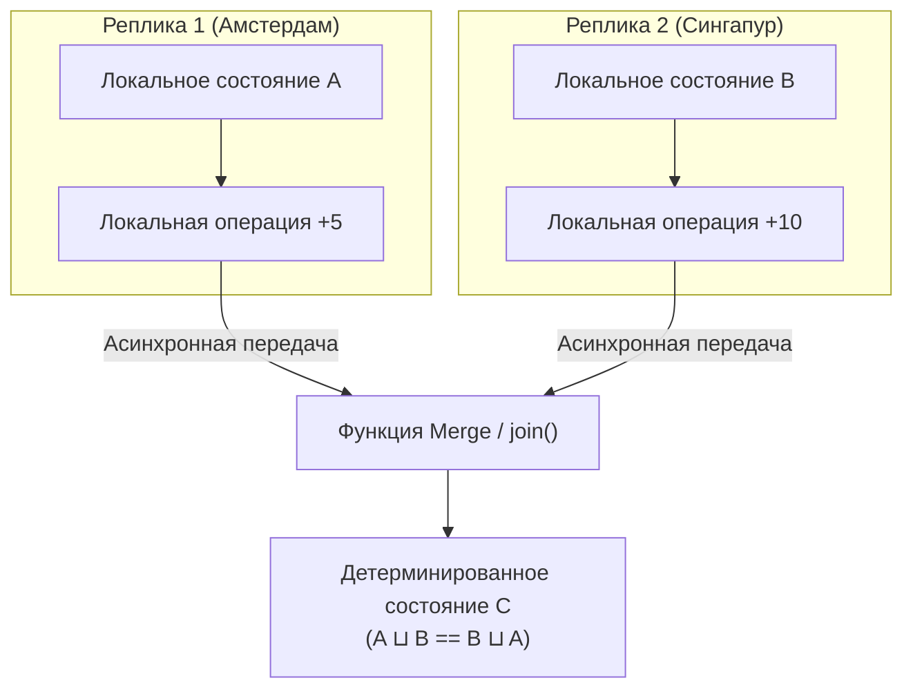

В прошлой статье [[6. Conflict resolution]] мы подробно изучили природу конфликтов в системах с Eventual Consistency. Мы увидели, что грубое решение Last-Write-Wins молча уничтожает данные, а ручное разрешение сиблингов на стороне клиента требует сложной доменной логики и постоянной отправки обновлений в базу.

Но математика подарила нам еще один, поистине поразительный путь. 

Что, если бы мы могли изначально проектировать структуры данных так, чтобы они **в принципе не могли войти в неразрешимый конфликт**? Чтобы любые два сервера, получив один и тот же набор изменений в абсолютно разном порядке и с любыми задержками, детерминированно сошлись к **абсолютно идентичному состоянию** без единого раунда распределенного консенсуса (без Raft и Paxos)?

Такие математические конструкции существуют. В 2011 году группа исследователей во главе с Марком Шапиро (Marc Shapiro) формализовала их под именем **CRDT (Conflict-free Replicated Data Types — Бесконфликтные реплицированные типы данных)**.

Если Векторные Часы ([[5. Vector clocks]]) — это инструмент для *детекции* конфликтов, то CRDT — это архитектурный метод *дизайна* данных, делающий конфликты физически невозможными.

---

## Что такое CRDT?

> **CRDT** — это класс структур данных, которые могут независимо и параллельно модифицироваться на разных узлах сети без какой-либо блокировки или координации, с гарантией того, что реплики сойдутся к единому согласованному состоянию.

Эта гарантия носит строгое академическое название — **Strong Eventual Consistency (SEC, Строгая согласованность в конечном счете)**. В отличие от обычной Eventual Consistency, где сходимость требует эвристик и ручного труда, в SEC сходимость математически неизбежна.

Математический секрет CRDT базируется на теории полурешеток (**Join-Semilattice**). Чтобы структура данных была бесконфликтной, ее операция слияния (**`join()`** или **`Merge`**) обязана обладать тремя незыблемыми алгебраическими свойствами:

1. **Коммутативность:** Порядок слияния не важен.  
   $$A \sqcup B = B \sqcup A$$
   (Не имеет значения, пришел ли сначала пакет из Сингапура, а затем из Франкфурта, или наоборот).
2. **Ассоциативность:** Группировка операций не важна.  
   $$(A \sqcup B) \sqcup C = A \sqcup (B \sqcup C)$$
   (Узлы могут объединяться в кластеры и обмениваться данными по любым топологиям).
3. **Идемпотентность:** Повторное применение уже известной информации не меняет состояние.  
   $$A \sqcup A = A$$
   (Сетевые дубликаты пакетов и повторные ретраи абсолютно безвредны).



---

## Типы CRDT

В теории распределенных вычислений выделяют два фундаментальных семейства CRDT:

1. **State-based CRDT (CvRDT — Сходящиеся по состоянию):**  
   Узлы периодически отсылают друг другу **свое полное текущее состояние**. Получатель применяет функцию слияния `join()`, которая находит наименьшую верхнюю грань (Least Upper Bound, LUB).  
   *Плюс:* Невероятная устойчивость к сбоям сети (пакеты могут теряться, дублироваться и перемешиваться).  
   *Минус:* Растущий размер сетевых пакетов при передаче больших структур.
2. **Operation-based CRDT (CmRDT — Коммутативные по операциям):**  
   Узлы транслируют по сети не всё состояние, а **только дельты операций** (например: «добавь 5» или «удали элемент X»).  
   *Плюс:* Минимальный сетевой трафик.  
   *Минус:* Требует надежного транспортного слоя, гарантирующего доставку сообщений без потерь.

---

## 1. Counters (Счетчики)

Обычная переменная `int64` в Go не является CRDT. Если два узла одновременно прочитают `10` и сделают локальный инкремент `inc`, а затем перешлют состояние, один инкремент будет молча утерян.

### G-Counter (Grow-only Counter)
Счетчик, который умеет только расти. 

Каждый узел с индексом `i` владеет персональным слотом в векторе: $V[i]$.  
* Правило инкремента: узел `i` имеет право увеличивать **только свой собственный слот** $V[i]$ на шаг `+1`.
* Правило слияния: функция `join()` берет поэлементный максимум:
  $$\forall k: \quad V_{\text{merged}}[k] = \max(V_A[k], V_B[k])$$
* Итоговое значение: простая сумма всех слотов вектора.

```
Узел A: [A:1, B:0]  (сделал +1)
Узел B: [A:0, B:2]  (сделал два раза +1)
Слияние: [A:max(1,0), B:max(0,2)] = [A:1, B:2]
Итог: 1 + 2 = 3
```

---

### PN-Counter (Positive-Negative Counter)

Что делать, если счетчик должен поддерживать операцию декремента (например, количество активных пользователей онлайн)?

**PN-Counter** объединяет в себе два изолированных G-Counter:
* Счетчик `P` — аккумулирует все операции сложения;
* Счетчик `N` — аккумулирует все операции вычитания.

Итоговое значение в любой момент времени вычисляется как строгая разность: `sum(P) - sum(N)`:

$$\text{Value} = \sum(P) - \sum(N)$$

Когда узел хочет уменьшить счетчик, он просто инкрементирует свою ячейку в векторе `N`! При слиянии оба вектора объединяются через функцию `max()`, сохраняя идеальную сходимость.

---

## 2. Sets (Множества)

Множества позволяют хранить уникальные коллекции элементов (например, список тегов к статье или список участников конференции).

1. **G-Set (Grow-only Set):**  
   Множество, куда можно только добавлять элементы. Операция слияния — классическое математическое объединение множеств ($A \cup B$). Элементы никогда не удаляются.
2. **2P-Set (Two-Phase Set):**  
   Состоит из двух внутренних G-Set: множества добавлений ($A$) и множества удалений ($R$, Tombstones).  
   Элемент считается присутствующим, если он есть в $A$ и отсутствует в $R$.  
   *Ограничение:* Если элемент однажды попал в $R$, его **невозможно добавить повторно никогда в жизни**.
3. **OR-Set (Observed-Remove Set):**  
   Промышленный золотой стандарт. Позволяет добавлять и удалять элементы произвольное число раз.  
   При каждом добавлении элемент снабжается уникальным идентификатором (UUID или Dot). Удаление помечает как удаленные только те конкретные уникальные теги, которые узел наблюдал на момент удаления. Если в ту же миллисекунду другой узел добавил этот же элемент параллельно с новым тегом, элемент останется во множестве!

---

## Mechanical Sympathy: CRDT в Go

При реализации CRDT на Go необходимо помнить о физике процессора и распределении памяти.

> [!info] Под капотом: Карта против Непрерывного слайса
> В академических примерах счетчики часто реализуют через `map[string]int64`, где ключом выступает строковый ID узла. 
> 
> Однако в высокопроизводительном промышленном коде с фиксированным числом серверов идиоматично использовать **плотный непрерывный срез целых чисел `[]int64`**, где индекс в срезе соответствует уникальному порядковому номеру узла в кластере (`0, 1, 2...`).
> 
> Это дает колоссальные преимущества:
> 1. Полное исключение хэширования строк и поиска в бакетах;
> 2. Последовательный обход слайса `[]int64` идеально ложится в кэш-линию процессора (L1 Data Cache, 64 байта);
> 3. Функция `Merge` превращается в молниеносный цикл, который компилятор Go может векторизовать через SIMD-инструкции!

Взглянем на чистую потокобезопасную реализацию **G-Counter** на Go:

```go
package crdt

import (
	"sync"
)

// GCounter реализует State-based Grow-only Counter (CvRDT)
type GCounter struct {
	mu     sync.RWMutex
	nodeID string
	state  map[string]int64
}

func NewGCounter(nodeID string) *GCounter {
	return &GCounter{
		nodeID: nodeID,
		state:  make(map[string]int64),
	}
}

// Inc атомарно увеличивает локальный слот текущего узла
func (c *GCounter) Inc() {
	c.mu.Lock()
	defer c.mu.Unlock()
	c.state[c.nodeID]++
}

// Value возвращает суммарное согласованное значение счетчика
func (c *GCounter) Value() int64 {
	c.mu.RLock()
	defer c.mu.RUnlock()

	var total int64
	for _, val := range c.state {
		total += val
	}
	return total
}

// Merge выполняет операцию слияния полурешетки (LUB / Join)
func (c *GCounter) Merge(other *GCounter) {
	c.mu.Lock()
	defer c.mu.Unlock()

	other.mu.RLock()
	defer other.mu.RUnlock()

	// Фундаментальное правило CvRDT: функция слияния должна быть LUB (Least Upper Bound).
	// Для монотонно растущих счетчиков это всегда операция MAX.
	for node, remoteVal := range other.state {
		if currentVal, exists := c.state[node]; !exists || remoteVal > currentVal {
			c.state[node] = remoteVal
		}
	}
}

// StateCopy возвращает изолированную копию среза для передачи по сети
func (c *GCounter) StateCopy() map[string]int64 {
	c.mu.RLock()
	defer c.mu.RUnlock()

	cp := make(map[string]int64, len(c.state))
	for k, v := range c.state {
		cp[k] = v
	}
	return cp
}
```

---

## Где это применяется?

1. **Redis Enterprise (Active-Active Geo-Distribution):**  
   Позволяет разворачивать геораспределенные кластеры Redis между Европой, США и Азией. Приложения пишут в локальный Redis в своем регионе с околонулевой задержкой, а Redis Enterprise автоматически синхронизирует и мерджит хэши, строки и множества на базе CRDT.
2. **Совместное редактирование в реальном времени (Figma, Apple Notes, Google Docs):**  
   Каждое нажатие клавиши или перемещение векторного слоя формирует операцию в CRDT-дереве (Yjs, Automerge), гарантируя сходимость документа у всех соавторов даже после выхода из оффлайн-режима.
3. **Распределенные чаты и мониторинг присутствия (Presence Tracking):**  
   Отслеживание счетчиков просмотров видео, списка онлайн-пользователей и истории реакций без единой точки отказа.

---

## Подводные камни CRDT

> [!tip] Собеседование
> **Вопрос:** В чем заключается главная скрытая плата и фундаментальный недостаток CRDT по сравнению с традиционной централизованной записью в реляционную БД?
> 
> **Ответ:** **Колоссальный оверхед метаданных (Metadata Overhead)** и сложность сборки мусора (Garbage Collection). 
> 
> Чтобы математически гарантировать идемпотентность и коммутативность слияния, CRDT обязаны хранить историю происхождения каждого изменения. Например, в OR-Set удаление элемента не стирает память, а создает надгробие (Tombstone) с уникальным идентификатором. 
> 
> Если система обрабатывает миллиарды вставок и удалений в сутки, объем служебных метаданных может в десятки раз превысить полезный объем бизнес-данных! Очистка старых надгробий без риска сломать сходимость требует сложнейших протоколов стабильной отсечки (Stable Snapshot GC).

---

## Итог

1. **CRDT** выводят разрешение конфликтов из зоны риска: сходимость данных становится детерминированной математической гарантией.
2. **Три кита алгебры:** Коммутативность, ассоциативность и идемпотентность функции `Merge` гарантируют, что порядок и дубликаты сетевых пакетов больше не способны разрушить консистентность.
3. **Спектр структур:** От базовых G-Counter и PN-Counter (с разностью $\sum P - \sum N$) до полнофункциональных множеств OR-Set.
4. **Цена гармонии:** Платой за отсутствие блокировок и распределенных транзакций является разрастание метаданных и необходимость поддержания сборщиков мусора для надгробий.

Мы разобрались, как детерминированно согласовывать изменения на уровне отдельных объектов, счетчиков и коллекций. 

Однако реальные бизнес-процессы (например, перевод денег со счета на счет или бронирование авиабилета с одновременным списанием миль) требуют согласованного изменения **сразу нескольких независимых баз данных или микросервисов**.

Как гарантировать атомарность («все или ничего») в распределенном мире? 

Об этом пойдет речь в финальной статье подраздела: [[8. Distributed transactions]].