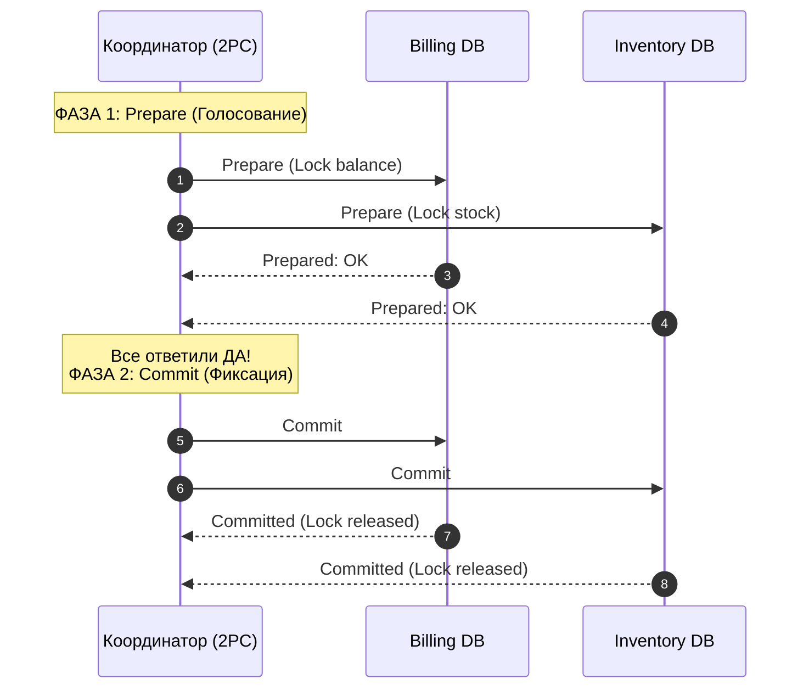
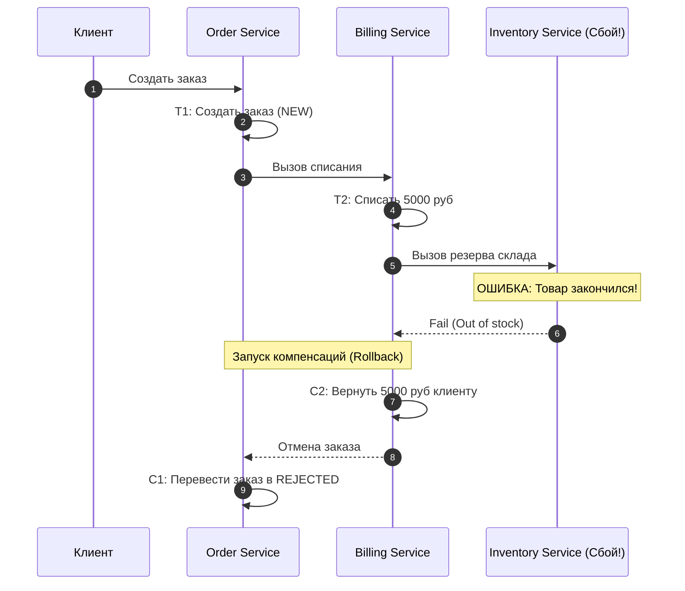
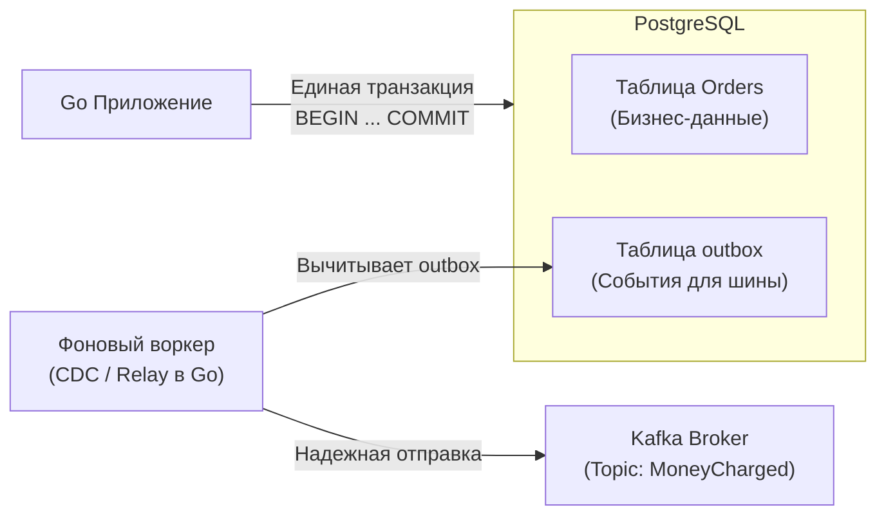

В предыдущих главах мы научились обеспечивать консистентность отдельного ключа, регистра или документа. Мы изучили кворумы, векторные часы и структуры CRDT. Но в реальной бизнес-архитектуре операции редко замыкаются на одной строчке таблицы.

Представьте классический сценарий покупки товара на маркетплейсе:
1. **`Billing Service`:** Списать 5 000 рублей с кредитной карты пользователя.
2. **`Inventory Service`:** Зарезервировать последнюю пару кроссовок на складе.
3. **`Order Service`:** Создать заказ со статусом «Оплачен» и сформировать чек.

В эпоху монолитных систем это решалось элементарно: вы открывали локальную транзакцию в PostgreSQL, выполняли три SQL-запроса и вызывали `COMMIT`. Если на шаге склада товар заканчивался, база данных откатывала транзакцию (**Rollback**), возвращая систему в исходное идеальное состояние. База данных гарантировала свойства **ACID** (Atomicity, Consistency, Isolation, Durability).

Но в современном облачном бэкенде действует парадигма **Database-per-Service**: у каждого микросервиса — своя собственная, физически изолированная база данных.

Если `Billing Service` успешно списал средства, а сетевой запрос к `Inventory Service` упал по таймауту из-за перегрузки склада — бизнес сталкивается с катастрофой: деньги у клиента списаны, а товара нет!

**Распределенная транзакция** — это набор согласованных операций над несколькими независимыми базами данных или микросервисами, обеспечивающий неделимость бизнес-процесса («все или ничего»).

---

## 1. Проблема 2PC (Two-Phase Commit)

Историческим стандартом обеспечения атомарности между несколькими узлами является протокол двухфазной фиксации — **Two-Phase Commit (2PC)**, стандартизированный консорциумом X/Open (спецификация XA).

---

### Как это работает:

В протоколе участвуют **Координатор (Coordinator)** и несколько участников (**Participants** / Ресурсов). Процесс разделен на две синхронные фазы:

1. **Фаза 1: Подготовка (Prepare Phase / Voting):**
   * Координатор отправляет всем участникам запрос: *«Готовы ли вы зафиксировать изменения?»*.
   * Каждый участник запускает локальную транзакцию, захватывает блокировки строк в БД, пишет данные в свой WAL и отвечает: `VOTE_COMMIT` (Да) или `VOTE_ABORT` (Нет).
2. **Фаза 2: Фиксация (Commit Phase):**
   * Если **все до единого** участники ответили «Да», Координатор отправляет всем команду `GLOBAL_COMMIT`. Участники фиксируют транзакцию и снимают блокировки.
   * Если хотя бы один участник ответил «Нет» (или не ответил вовсе по таймауту сети), Координатор рассылает команду `GLOBAL_ROLLBACK`. Все узлы откатывают локальные изменения.



> [!warning] Ловушка / Gotcha: Почему 2PC — антипаттерн в микросервисах
> В распределенных Go-микросервисах протокол 2PC практически **никогда не используется**, так как он парализует систему:
> 1. **Блокирующие ресурсы:** На протяжении обеих фаз строки в базах данных остаются заблокированными на чтение и запись. Если сеть моргнет, блокировки будут удерживаться секундами, исчерпывая пул соединений.
> 2. **Зависание в неопределенности (In-Doubt State):** Если Координатор падает между Фазой 1 и Фазой 2, участники остаются заблокированными навсегда: они не имеют права ни закоммитить, ни откатить транзакцию без решения координатора.
> 3. **Катастрофическая задержка:** Задержка всей транзакции равна сумме задержек самого медленного участника и двух последовательных сетевых RTT со сбросами `fsync` на каждом узле.

---

## 2. Паттерн Saga (Сага)

В высоконагруженных микросервисных архитектурах жесткие блокировки (2PC) уступили место паттерну **Saga (Сага)**, предложенному Гектором Гарсиа-Молиной и Кеннетом Салемом еще в 1987 году.

> **Сага** — это цепочка независимых локальных транзакций. Каждая транзакция обновляет локальную базу данных одного сервиса и публикует событие. 
> 
> Если какой-то шаг завершается ошибкой, Сага запускает цепочку **компенсирующих транзакций (Compensating Transactions)**, которые последовательно откатывают изменения предыдущих шагов в обратном порядке.

Критически важно понимать: компенсирующая транзакция — это **не SQL ROLLBACK**. Она не может волшебно стереть прошлое. Это *семантическое действие*, компенсирующее эффект: например, возврат списанных денег на счет или отправка извинительного промокода.



Существует два фундаментальных способа реализации Саг:

---

### А. Оркестрация (Orchestration)

При оркестрации процессом руководит **центральный координатор (Оркестратор)**. Он хранит стейт-машину саги, пошагово отдает приказы сервисам и в случае аварии запускает сценарии компенсации.

В Go-экосистеме индустриальным стандартом для оркестрации саг стал движок **`Temporal.io`** (а также Cadence). Он позволяет писать отказоустойчивые распределенные саги как обычный синхронный Go-код, автоматически персистя каждый шаг и возобновляя выполнение при падении серверов.

*Плюсы:* Идеальная прозрачность, нет циклических зависимостей, легко отслеживать статус саги.

---

### Б. Хореография (Choreography)

При хореографии центрального диспетчера нет. Сервисы общаются децентрализованно через брокер сообщений (Kafka или RabbitMQ).

Каждый сервис подписывается на события коллег:
1. `Order Service` создает заказ и бросает событие `OrderCreated`.
2. `Billing Service` слушает топик, видит `OrderCreated`, списывает деньги и публикует событие `MoneyCharged`.
3. `Inventory Service` ловит `MoneyCharged`, видит нехватку товара и публикует событие `StockReservationFailed`.
4. `Billing Service` ловит ошибку и возвращает деньги на карту.

*Плюсы:* Слабая связанность (Loose Coupling), сервисы независимы.  
*Минусы:* Сложно визуализировать граф бизнес-процесса; риск возникновения циклических зависимостей.

---

## 3. Distributed Transactions и Go-рантайм

Реализация распределенных транзакций в Go требует маниакальной дисциплины при работе с внешними ресурсами. Вы не можете просто вызвать в цикле функцию базы данных, а следом отправить сообщение в Kafka!

---

### Механическая симпатия: Outbox Pattern

Классическая ошибка разработчика — попытка выполнить двойную запись (**Dual Write**):

```go
// АНТИПАТТЕРН: Гарантированная потеря консистентности при сбое!
func HandlePayment(ctx context.Context, db *sql.DB, kafkaProducer *kafka.Producer, orderID string) error {
	// ШАГ 1: Обновляем БД
	_, err := db.ExecContext(ctx, "UPDATE billing SET status = 'CHARGED' WHERE order_id = $1", orderID)
	if err != nil {
		return err
	}

	// ШАГ 2: Шлем событие в брокер
	// ЧТО ЕСЛИ СЕТЬ МОРГНЕТ ИЛИ ПРОЦЕСС УМРЕТ ПО OOM ЗДЕСЬ?!
	// База обновлена, а событие MoneyCharged в Kafka никогда не уйдет!
	return kafkaProducer.Send("MoneyCharged", orderID)
}
```

Решением является паттерн **Transactional Outbox**:
1. В рамках **одной локальной ACID-транзакции** вы сохраняете бизнес-данные и записываете полезную нагрузку будущего сообщения в служебную таблицу `outbox` в той же самой базе данных.
2. Отдельный фоновый процесс (Relay / Change Data Capture, например Debezium) вычитывает таблицу `outbox` и гарантированно отправляет сообщения в брокер с семантикой **at-least-once**.



---

## 4. TCC (Try-Confirm-Cancel)

Паттерн **TCC** — это элегантная реализация двухфазной фиксации, но перенесенная с уровня блокировок СУБД на **уровень бизнес-логики приложения**.

Каждый участвующий сервис реализует три контракта API:
1. **Try:** Предварительное резервирование ресурсов. Например, сервис счетов переводит 100 рублей в поле `balance_pending = 100`, но не списывает их окончательно.
2. **Confirm:** Окончательное подтверждение операции. Снятие резерва и перевод денег получателю.
3. **Cancel:** Отмена резервирования в случае сбоя соседних сервисов.

> **Золотое правило TCC:**  
> Все методы `Try`, `Confirm` и `Cancel` **обязаны быть строго идемпотентными**. Если из-за сетевого ретрая метод `Confirm` выполнится три раза подряд, баланс не должен списаться трижды.

---

## Подводные камни распределенных транзакций

> [!tip] Собеседование
> **Вопрос:** Какой паттерн выбрать для распределенной транзакции: 2PC или Saga?
> 
> **Ответ:** 
> * **2PC (Two-Phase Commit)** обеспечивает **строгую согласованность (ACID / CP)**, но убивает масштабируемость, пропускную способность и доступность системы из-за синхронных блокировок. Применим только внутри узкоспециализированных распределенных баз данных (CockroachDB, Spanner).
> * **Saga** обеспечивает **согласованность в конечном счете (Eventual Consistency / AP)**, гарантируя высокую доступность и низкую задержку. Платой за это является усложнение кода: необходимость реализации компенсирующих транзакций и аккуратная обработка промежуточных состояний (когда деньги списаны, а заказ еще оформляется). 
> 
> В подавляющем большинстве микросервисных систем на Go де-факто стандартом является **Saga**.

---

## Итог

1. **Забудьте о 2PC в микросервисах:** Блокировки строк через сеть парализуют масштабирование и создают точки каскадных отказов.
2. **Saga — промышленный выбор:** Разделяйте глобальную транзакцию на цепочку локальных шагов с обязательным проектированием компенсирующих действий.
3. **Transactional Outbox:** Единственный безопасный способ связать реляционную базу данных и брокер сообщений без риска потери событий.
4. **Идемпотентность — фундамент надежности:** Сетевые ретраи неизбежны, поэтому любой шаг саги и метод `Confirm`/`Cancel` в TCC обязан спокойно переносить дубликаты вызовов.

Мы завершили фундаментальный подраздел «Данные и согласованность». Мы изучили, как данные реплицируются, как разрешаются неизбежные конфликты и как оркеструются сложные бизнес-транзакции.

Теперь пора перейти к архитектурному каркасу, на котором строятся все эти механизмы в реальном продакшене. 

Что представляет собой микросервисная архитектура с точки зрения Go-инженера? 

Переходим к следующему подразделу: [[1. Что такое микросервис]].