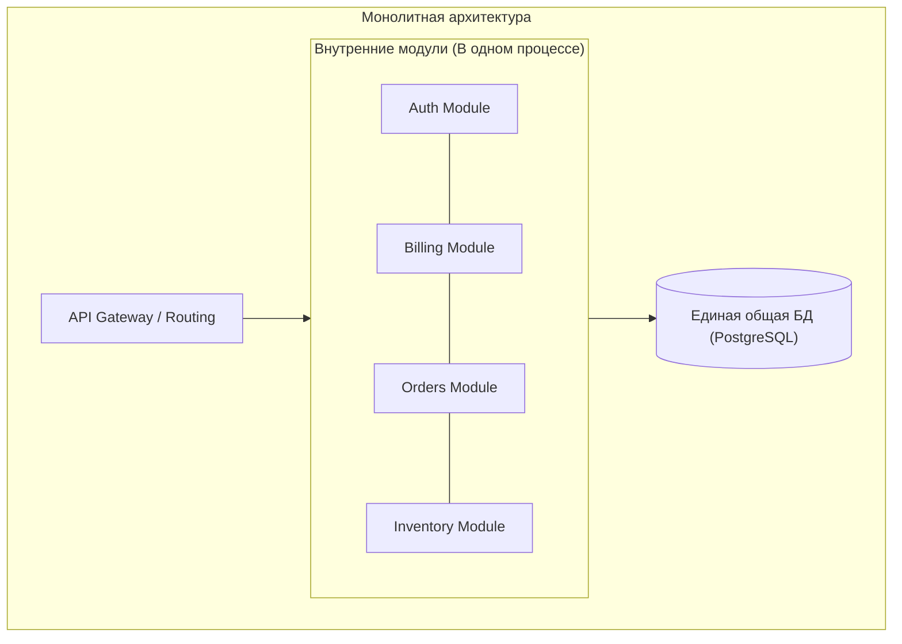
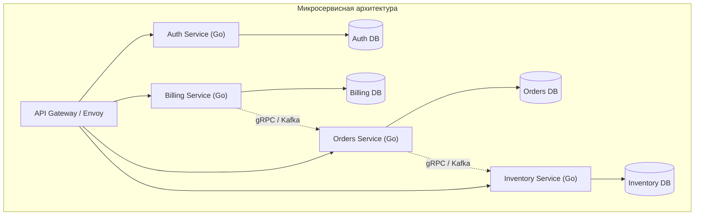

За последние десять лет слово «микросервисы» проделало путь от модного лозунга калифорнийских конференций до непререкаемого догмата современной бэкенд-разработки. Однако для зрелого Senior-инженера микросервис — это не просто «маленькая программа» или «контроллер с парой роутов».

Микросервисы — это осознанный архитектурный ответ на фундаментальные организационные и технические ограничения растущих монолитных систем. 

В этой статье мы разберем суть смены парадигмы, выясним, почему язык Go стал фактическим языком облачной микросервисной революции, и честно подсчитаем налог, который любая компания платит за переход к распределенной архитектуре.

---

## Монолит vs Микросервисы: Смена парадигмы

В классической **монолитной архитектуре** абсолютно все бизнес-компоненты (аутентификация пользователей, биллинг, каталог, оформление заказов) компилируются в один общий исполняемый бинарник и запускаются в рамках **одного процесса операционной системы**. 

* **Связанность:** Взаимодействие между модулями — это обычный вызов функции в памяти. Процессор тратит на него **наносекунды**, оперируя L1/L2 кэшем и регистрами.
* **Транзакции:** Свойства ACID гарантируются единой базой данных «из коробки». Достаточно открыть `BEGIN ... COMMIT`, и финансовая консистентность соблюдена.
* **Масштабирование:** Чтобы справиться с нагрузкой на биллинг в Черную Пятницу, вам приходится копировать весь тяжелый монолит целиком на десятки виртуальных машин, даже если каталог и отзывы простаивают.

**Микросервисная архитектура** кардинально переосмысляет устройство системы: приложение проектируется как созвездие небольших, независимых и автономных сервисов. Каждый сервис реализует конкретную **бизнес-функцию** и общается с соседями исключительно по сети через легковесные протоколы (gRPC поверх HTTP/2, REST поверх HTTP/1.1 или асинхронные очереди сообщений).

---

### Ключевые свойства истинного микросервиса:

1. **Автономность (Independent Deployability):**  
   Сервис можно независимо собрать, протестировать и задеплоить в продакшен в любой момент рабочего дня. Если для релиза сервиса `Billing` вам требуется синхронно перевыкатывать сервис `Orders`, у вас нет микросервисов. У вас возник худший из миров — **распределенный монолит** (Distributed Monolith), вобравший в себя все сетевые проблемы распределенных систем и потерявший простоту монолита.
2. **Собственные данные (Database per Service):**  
   Фундаментальное, самое строгое и самое болезненное правило: **каждый микросервис единолично владеет своей базой данных**. Никакой другой сервис в компании не имеет права обращаться к его таблицам напрямую через SQL. Любой доступ к данным осуществляется строго через публичный контракт API сервиса-владельца.
3. **Ориентированность на бизнес-домен (Bounded Context):**  
   Границы микросервиса очерчиваются не техническими слоями (например, «слой работы с базой данных» или «слой валидации JSON»), а реальными бизнес-контекстами предметной области в соответствии с методологией предметно-ориентированного проектирования (**Domain-Driven Design, DDD**).

---

## Почему Go — "родной" язык микросервисов?

Язык Go создавался инженерами Google (Роб Пайк, Кен Томпсон, Роберт Гризмер) в конце 2000-х годов ровно в тот момент, когда инфраструктурные монолиты поискового гиганта подошли к физическому пределу масштабирования. 

Go был с первого дня спроектирован для сетевого программирования и несет архитектурные гены облачных вычислений:

* **Статическая бинарная сборка:**  
  Компилятор Go упаковывает всё приложение и его зависимости в единственный самодостаточный бинарный файл. Серверу не требуется предустановленная Java Virtual Machine (JVM), Python-интерпретатор или динамические библиотеки. Контейнеры на базе `scratch` или `distroless` весят всего **от 10 до 25 Мегабайт**, что позволяет оркестраторам Kubernetes поднимать и масштабировать поды за считанные секунды.
* **Минимальный Memory Footprint:**  
  В то время как пустой сервис на Java Spring Boot потребляет 300–500 МБ оперативной памяти только на инициализацию рантайма, микросервис на Go в состоянии покоя занимает скромные **10–25 МБ RSS**. Это позволяет эффективно нарезать физические серверы на сотни изолированных контейнеров с высокой плотностью упаковки.
* **Конкурентность как примитив:**  
  Микросервисы проводят 95% своего времени в ожидании ввода-вывода (Network I/O к соседним сервисам и базам данных). Модель легких горутин (со стеком от 2 КБ) и системный селектор `netpoll` (Linux `epoll`) позволяют одному экземпляру Go-сервиса легко удерживать 50 000 параллельных сетевых соединений без взрывного расхода памяти на потоки ОС.
* **Мощь стандартной библиотеки:**  
  Пакет `net/http` в стандартной библиотеке Go настолько зрел, надежен и оптимизирован под многопоточность, что на нем строят продакшен-сервисы мирового уровня без необходимости тащить тяжеловесные сторонние фреймворки.

---

## Плюсы: За что мы их любим

* **Масштабируемость инженерных команд (Закон Конвея):**  
  Организации проектируют системы, копирующие структуру их внутренних коммуникаций (Melvin Conway, 1967). Когда штат вырастает до 150 инженеров, они больше не могут бесконфликтно коммитить в один общий репозиторий монолита. Микросервисы позволяют командам по 6–8 человек (правило двух пицц Джеффа Безоса) полностью владеть своим сервисом от написания кода до деплоя и мониторинга.
* **Технологическая гетерогенность:**  
  Сервис `Billing` пишется на строго типизированном и быстром Go, сервис рекомендаций ML — на Python с библиотеками PyTorch, а система полнотекстового поиска строится на готовом Java-решении.
* **Изоляция сбоев (Blast Radius):**  
  Если в сервисе отзывов произошла утечка памяти или возникла паника, падает только он. Пользователи по-прежнему могут авторизоваться, наполнить корзину и оплатить товар.

---

## Минусы: Теневая сторона (The Tax)

Микросервисная архитектура — это сложнейшая инженерная сделка. Мы осознанно обмениваем понятную сложность локального кода на **колоссальную эксплуатационную и сетевую сложность (Operational Complexity)**:

1. **Сетевая ненадежность и задержки:**  
   Вместо наносекундных вызовов функций в памяти вы получаете миллисекунды сетевого RTT, потерю TCP-пакетов, таймауты и проблему частичных отказов ([[4. Partial failure]]).
2. **Утрата глобального ACID:**  
   В распределенной системе больше нельзя сделать атомарный коммит на весь бизнес-процесс. Приходится переходить к моделям слабой согласованности (Eventual Consistency), проектировать компенсирующие транзакции и внедрять сложные саги ([[8. Distributed transactions]]).
3. **Observability-кошмар:**  
   В монолите для поиска бага достаточно заглянуть в один лог-файл. В микросервисной паутине единый пользовательский клик порождает каскад из сотен RPC-запросов. Без систем сквозной распределенной трассировки (OpenTelemetry, Jaeger) и корреляционных ID понять причину пятисотой ошибки невозможно.
4. **Инфраструктурный налог:**  
   Вам неизбежно потребуются Kubernetes, Service Mesh (Envoy/Istio), распределенный сбор метрик (Prometheus), централизованные хранилища секретов (Vault) и развитые пайплайны CI/CD.

---

## Подводные камни внедрения

> [!tip] Собеседование
> **Вопрос:** В какой момент жизненного цикла проекта команде следует переходить с монолита на микросервисную архитектуру?
> 
> **Ответ:** Переход на микросервисы оправдан **только тогда, когда организационная сложность координации людей превышает выгоду от простоты монолита**. 
> 
> Микросервисы решают прежде всего проблему масштабирования разработки, а не производительности железа (распределенная система всегда работает медленнее монолита из-за сетевого оверхеда). 
> 
> Если стартап из пяти разработчиков начинает проект с микросервисов, они потратят 80% времени на написание манифестов Kubernetes, настройку gRPC и борьбу с сетевыми таймаутами вместо создания ценности для бизнеса. 
> 
> Золотой стандарт индустрии (правило Мартина Фаулера): **начинайте с модульного монолита** с жесткими внутренними границами пакетов в Go, и выносите модули в микросервисы только по мере реального роста команд и нагрузки.

---

## Итог

1. **Микросервис** — это не про размер исходного файла, а про **четкие границы бизнес-ответственности** (Bounded Context) и независимость развертывания.
2. **Database per Service:** Единственный способ избежать скрытой жесткой связанности компонентов — запретить общий доступ к таблицам на уровне базы данных.
3. **Go — естественная среда:** Статическая компиляция, крошечный оверхед по памяти и нативная модель конкурентности (`netpoll`, горутины) делают Go эталонным языком для контейнеризированных микросервисов.
4. **Плата за архитектуру:** Переход к микросервисам требует зрелой инфраструктуры, распределенной трассировки и готовности жить в мире частичных отказов.

Решение о переходе принято. Но как именно разделить систему на независимые части? Где провести красную линию между доменами, чтобы не превратить архитектуру в клубок взаимных блокировок? 

О стратегиях декомпозиции систем мы поговорим в следующей статье: [[2. Границы сервисов]].