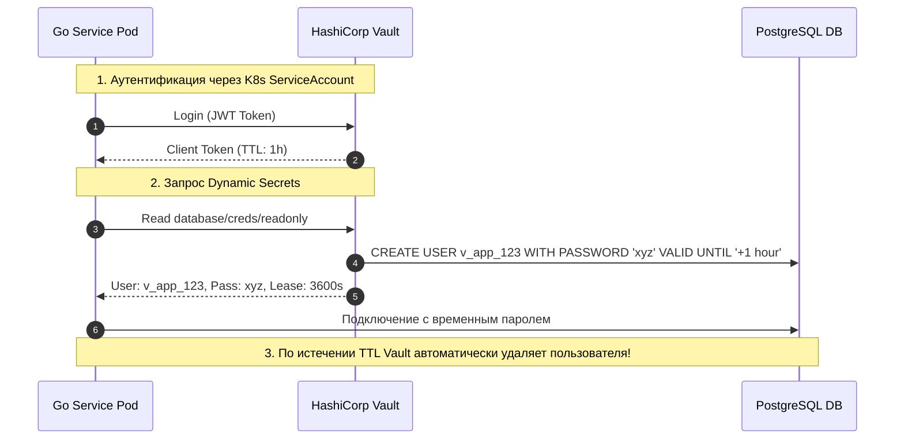
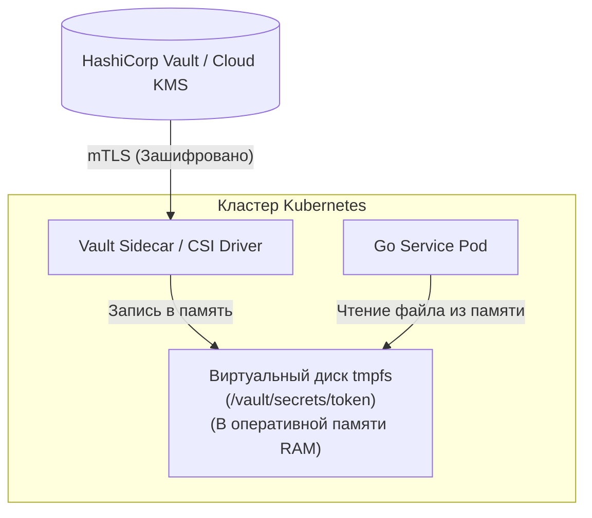
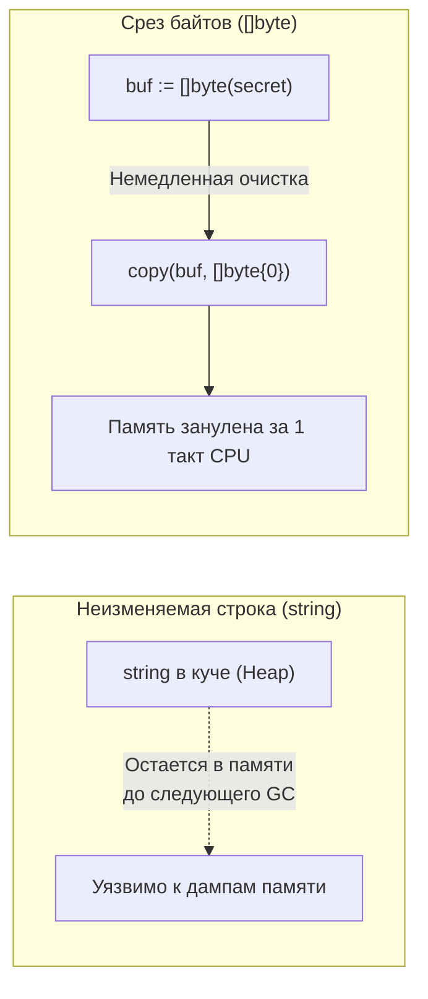

В практике бэкенд-разработки граница между «обычной конфигурацией» и «секретом» иногда кажется размытой, пока кто-нибудь в два часа ночи случайно не закоммитит боевой токен доступа к AWS или пароль от базы данных в публичный GitHub-репозиторий.

Инженерное правило проверки здесь предельно лаконично:  
> *«Если случайное попадание этого значения в публичный доступ или лог заставит всю команду экстренно менять мастер-пароли и отзывать сертификаты — перед вами не конфиг, а критический секрет».*

**Secrets Management (Управление секретами)** — это комплексная инженерная дисциплина безопасного хранения, строго авторизованной доставки, динамической генерации и регулярной ротации чувствительных данных (паролей СУБД, приватных TLS-ключей, API-токенов платежных систем и симметричных ключей шифрования).



---

## 1. Почему Environment Variables — это «на троечку»?

Многие разработчики, воодушевившись идеями Twelve-Factor App, по привычке передают секреты через обычные переменные окружения. Безусловно, это намного лучше хардкода в кодовой базе, однако в реальном продакшене у этого подхода есть серьезные уязвимости:

* **Утечка через отладочные дампы и логи:** Любая системная утилита `env`, аварийный сброс ядра (Core Dump) при `SIGSEGV` или неосторожный логгер при фатальной ошибке процесса выведет полный список переменных окружения прямо в систему сбора логов (Elasticsearch, Loki).
* **Наследование дочерними процессами:** Любой системный вызов `os/exec` или запуск внешней сторонней CLI-утилиты из Go-кода по умолчанию передает все переменные родительского окружения дочернему процессу.
* **Видимость в панелях управления:** В консолях облачных провайдеров и дашбордах Kubernetes переменные окружения пода открыты любому разработчику, обладающему минимальными правами на просмотр манифестов.
* **Отсутствие ротации:** Чтобы сменить пароль, переданный через переменную окружения, вам необходимо перезапустить (убить) контейнер.

---

## 2. HashiCorp Vault: Золотой стандарт

Для построения безопасных распределенных сред де-факто отраслевым стандартом стал **HashiCorp Vault** (а также облачные менеджеры секретов: AWS Secrets Manager, Google Cloud Secret Manager).

Архитектура Vault опирается на три ключевых принципа:

1. **Динамические секреты (Dynamic Secrets):** Вместо использования одного статического пароля от СУБД на все поды, Vault генерирует уникальную пару логин/пароль по требованию с ограниченным временем жизни (например, на 1 час). Когда аренда истекает, Vault самостоятельно удаляет учетную запись в PostgreSQL.
2. **Аренда и отзыв (Leasing & Revocation):** Каждый выданный секрет имеет срок аренды. Если нода была скомпрометирована, офицер безопасности нажимает кнопку отзыва (`Revoke`), и скомпрометированные ключи мгновенно аннулируются во всей инфраструктуре.
3. **Неизменяемый журнал аудита (Audit Log):** Каждое обращение к каждому ключу фиксируется в криптографически подписанном журнале: кто, с какого IP-адреса и когда запрашивал секрет.

---

## 3. Секреты в Kubernetes

В Kubernetes базовым примитивом является объект `Secret`. Однако начинающие инженеры часто забывают, что по умолчанию манифесты секретов хранятся в базе `etcd` в открытом кодировании **base64**. Это не шифрование, а лишь текстовое представление бинарных данных!



**Инженерные способы защиты секретов в K8s:**
1. **Encryption at rest:** Активация сквозного шифрования базы `etcd` с использованием внешнего KMS-провайдера (Key Management Service).
2. **External Secrets Operator (ESO):** Контроллер в K8s, который автоматически синхронизирует секреты из защищенного внешнего хранилища (Vault, AWS Secrets Manager) в локальные `Secret` объекты кластера.
3. **Secrets Store CSI Driver / Vault Agent Injector:** Самый надежный подход. Секреты монтируются напрямую в виртуальную файловую систему в оперативной памяти пода (**tmpfs**). Они вообще никогда не записываются на физический диск сервера и не передаются через переменные окружения `env`.

---

## 4. Mechanical Sympathy: Безопасность в рантайме Go

Даже если инфраструктура безупречно защищена, неосторожный код на Go способен легко скомпрометировать секреты.



> [!warning] **Опасность: String Immortality**
> В языке Go тип `string` принципиально неизменяем (immutable). Строковый заголовок указывает на непрерывный массив байтов в куче или сегменте констант.
> 
> Если вы прочитали секретный токен в тип `string`, вы не можете принудительно стереть его из оперативной памяти! Он будет физически существовать в куче процессора до тех пор, пока сборщик мусора GC не доберется до него, а память не будет перезаписана другими аллокациями. Если процесс упадет с дампом памяти или кто-то снимет профиль кучи (`pprof/heap`), секрет окажется на виду. А вызов `fmt.Sprintf("%v", cfg)` намертво отправит пароль в логи.

### Идиоматичные правила гигиены Go:

* **Работайте с `[]byte` вместо `string`:** Пароли и симметричные ключи должны храниться в виде байтовых срезов `[]byte`. Как только соединение установлено, память немедленно зануляется:
  ```go
  func wipeMemory(buf []byte) {
      for i := range buf {
          buf[i] = 0
      }
  }
  // или через системное копирование:
  // copy(buf, []byte{0})
  ```
* **Кастомная маскировка в логах и JSON:** Обязательно реализуйте интерфейсы `Stringer` и `MarshalJSON` для типов с секретами, чтобы при форматировании вместо паролей выводились звездочки `****` или маркер `[REDACTED]`. Используйте тег структуры `json:"-"`.

```go
package main

import (
	"encoding/json"
	"fmt"
	"log"
)

// SecretString маскирует значение при любых выводах в консоль
type SecretString string

func (s SecretString) String() string {
	return "****"
}

func (s SecretString) MarshalJSON() ([]byte, error) {
	return json.Marshal("****")
}

type DBConfig struct {
	Host     string       `json:"host"`
	Password SecretString `json:"-"` // Никогда не сериализовать в открытом виде
}

// Защита от случайного логирования через fmt.Println(cfg)
func (c DBConfig) String() string {
	return fmt.Sprintf("DBConfig(Host: %s, Password: %s)", c.Host, c.Password)
}

func main() {
	cfg := DBConfig{
		Host:     "postgres.internal",
		Password: "super-secret-password-123",
	}

	// Безопасный вывод: пароль защищен
	log.Printf("Загружена конфигурация: %v", cfg)
	
	bytes, _ := json.Marshal(cfg)
	log.Printf("JSON представление: %s", string(bytes))
}
```

---

## 5. Итог

1. **Репозиторий Git — табу для секретов.** Если вам жизненно необходимо хранить зашифрованные секреты рядом с манифестами (GitOps), используйте специализированные утилиты с асимметричным шифрованием: Mozilla `sops` или `git-crypt`.
2. **Централизованный менеджер секретов:** В продакшене используйте HashiCorp Vault или облачные KMS для управления ключами, динамической выдачи учетных данных и автоматической ротации сертификатов.
3. **Монтирование в RAM:** В Kubernetes инжектируйте секреты через `tmpfs` в виде файлов, избегая открытых переменных окружения `env`.
4. **Гигиена в коде Go:** Применяйте срез `[]byte` с последующим обнулением для чувствительных данных и защищайте структуры кастомными реализациями `Stringer` и `MarshalJSON`, выводя `****` вместо сырых значений.

Мы завершили масштабное исследование микросервисной архитектуры — от границ доменов и владения данными до контрактов, динамического обнаружения и безопасного менеджмента секретов.
