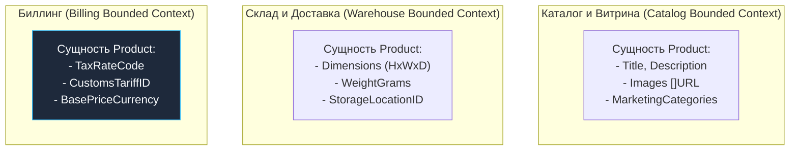
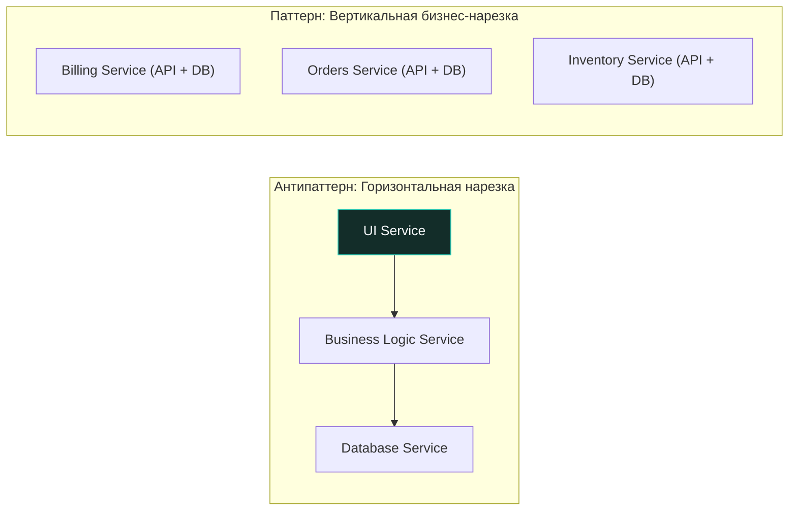

Разделение крупной системы на микросервисы — это не тактическая задача по написанию кода, а стратегическое архитектурное решение. 

Если провести границы неверно, вы получите печально известный **«распределенный монолит»**: архитектурного франкенштейна, вобравшего в себя худшее из обоих миров — хрупкую связность монолита, помноженную на сетевые задержки, каскадные сбои и транзакционную несогласованность распределенных систем.

В этой статье мы разберем, как определить оптимальные границы сервисов с помощью принципов предметно-ориентированного проектирования (**Domain-Driven Design, DDD**), почему физический «размер» сервиса в строках кода — это последний параметр, о котором должен думать инженер, и как правильная нарезка защищает процессорные мощности Go-рантайма.

---

## Bounded Context: Фундамент границ

Главным концептуальным компасом при нарезке распределенной системы служит понятие **Bounded Context (Ограниченный контекст)**, сформулированное Эриком Эвансом в книге по Domain-Driven Design.

В любой крупной компании одно и то же слово означает совершенно разные вещи в зависимости от бизнес-подразделения. 

Возьмем простую сущность **`Product` (Товар)**:
* Для **Отдела продаж и маркетинга** товар — это привлекательное описание, фотографии высокого разрешения, SEO-теги, скидочные акции и отзывы покупателей.
* Для **Складской логистики (Warehouse)** товар — это физические габариты в миллиметрах, вес брутто, класс опасности при транспортировке и номер складской паллеты.
* Для **Бухгалтерии и биллинга** товар — это код налоговой классификации (НДС), таможенная пошлина, себестоимость и валюта расчетов.



Если вы попытаетесь создать в монолите единую универсальную структуру `Product` на все случаи жизни, вы неизбежно породите чудовищную модель из ста полей, где половина значений пустует, а любая правка валидации ломает работу соседних отделов.

> **Золотое правило Bounded Context:**  
> Граница микросервиса должна совпадать с границей ограниченного контекста, внутри которого действует единый, непротиворечивый язык общения (**Ubiquitous Language**), а модели данных сфокусированы на решении конкретной бизнес-задачи.

---

## Признаки правильной границы

Как практикующему Go-инженеру понять, что архитектурная граница проведена верно? Обратите внимание на четыре ключевых индикатора:

---

### 1. Единая ответственность (SRP)

Сервис обязан отвечать за одну цельную бизнес-функцию. 

Индикатор простой: если изменение в алгоритме расчета налога заставляет вас лезть в репозиторий и менять Go-код в сервисе доставки — ваши архитектурные границы дали течь. Зависимости должны быть направлены на устойчивые контракты, а не на внутреннюю реализацию.

---

### 2. Автономность данных

Сервис должен располагать всеми необходимыми данными для выполнения своей основной работы. 

Если для обработки типового запроса сервису `A` требуется синхронно выполнить цепочку RPC-запросов к сервисам `B`, `C` и `D`, эти сервисы обладают **высокой связанностью (High Coupling)**. При падении сервиса `C` сервис `A` становится полностью недееспособен. 

В такой ситуации сервисы либо нарезаны слишком мелко, либо вам необходимо пересмотреть модель владения данными и перейти на асинхронную репликацию событий.

---

### 3. Темп изменений

Разные компоненты бизнеса эволюционируют с принципиально разной скоростью:
* **Маркетинговые промо-механики и реферальные программы** могут обновляться дважды в неделю;
* **Ядро финансового учета и биллинга** меняется раз в полгода после аудита.

Выделение динамичных компонентов в отдельные сервисы позволяет деплоить их десятки раз в день, не подвергая риску стабильность консервативных финансовых узлов.

---

## Типичные ошибки при нарезке

Большинство неудачных микросервисных архитектур терпят крах из-за двух классических заблуждений:

### 1. Технологические слои (Layered Services)

**Грубейшая ошибка:** Нарезка сервисов по горизонтальным техническим уровням: «Database Service», «Logging Service» или «UI Backend Service». 

Микросервисы обязаны нарезаться **вертикально** — сквозными ломтями бизнес-функциональности. Горизонтальная техническая нарезка превращает обычное добавление одного поля на веб-форму в кошмар: разработчику приходится последовательно менять код в пяти разных репозиториях и координировать их синхронный релиз!



---

### 2. Сущностные сервисы (Entity Services)

**Ошибка наивного моделирования:** Создание сервисов вокруг отдельных таблиц реляционной базы данных (например, `UserService`, `OrderService`, `ItemService`).

Это порождает так называемую **анемичную модель** и катастрофическую «болтливость» сети (**Chatty Architecture**): чтобы выполнить элементарную операцию оформления заказа, приложению приходится выполнить 15 последовательных сетевых вызовов между микро-сущностями. 

Вместо сервиса вокруг таблицы создавайте сервис вокруг **Бизнес-процесса** (например, `Checkout Service`, управляющий процессом покупки).

---

## Mechanical Sympathy: Границы и рантайм Go

Архитектурные границы — это не просто диаграммы в Miro, это прямое воздействие на ядро процессора и планировщик Go.

> [!info] Под капотом: Физическая цена границы в железе
> В рамках одного Go-модуля вызов функции:
> ```go
> res := Calculate(order)
> ```
> занимает **1.5–3 наносекунды**. Компилятор Go может автоматически встроить ее тело на место вызова (**Inlining**, флаг `-gcflags="-m"`), исключив даже накладные расходы на инструкцию ассемблера `CALL`. Память не аллоцируется, аргументы передаются через регистры CPU (ABIInternal).
> 
> Как только вы переносите функцию `Calculate()` за границу отдельного микросервиса, вызов превращается в сетевой RPC:
> 1. **Сериализация:** Структура данных сериализуется в Protobuf/JSON. Происходит аллокация буферов в куче (`runtime.mallocgc`), создавая нагрузку на Garbage Collector.
> 2. **Системные вызовы ядра:** Байты копируются в буферы сокетов Linux, запускается сетевой стек (TCP/IP, TLS шифрование).
> 3. **Сетевой транзит:** Пакет летит через физические коммутаторы стойки (добавляя 0.5–2 миллисекунды задержки).
> 4. **Парковка горутины:** Планировщик Go паркует горутину в `Gwaiting` на `netpoll`.
> 
> Если вы нарезали систему на крошечные нано-сервисы, **до 80% всего процессорного времени кластера будет расходоваться впустую** — на сериализацию JSON, сброс кэш-линий и упаковку TCP-пакетов вместо полезных вычислений!

---

## Стратегия декомпозиции

1. **Правило крупного калибра (Coarse-Grained First):**  
   Если границы между доменами еще размыты, держите код внутри единого модульного монолита. Вынести хорошо изолированный Go-пакет в отдельный микросервис занимает пару дней. Обратно склеить десять ошибочно нарезанных сервисов с рассогласованными базами данных требует месяцев мучительного рефакторинга.
2. **Асинхронные события как маркер границы:**  
   Если два модуля могут взаимодействовать через доменные события по схеме Fire-and-Forget (например: «Заказ оплачен» $\to$ «Отправить уведомление по почте») — между ними проходит идеальная граница для разделения на микросервисы. Если модулям требуется жесткая двухсторонняя транзакция — держите их вместе.
3. **Согласование с Законом Конвея:**  
   Если две команды сидят в разных часовых поясах, попытка заставить их коммитить в один сервис приведет к постоянным конфликтам веток и блокировкам. Нарежьте сервисы так, чтобы каждая команда единолично владела своими компонентами.

---

## Подводные камни разделения данных

> [!tip] Собеседование
> **Вопрос:** Что делать, если двум независимым сервисам требуются одни и те же данные? Например, сервису заказов (`Order Service`) и сервису курьерской доставки (`Delivery Service`) критически необходим адрес доставки пользователя?
> 
> **Ответ:** В микросервисной архитектуре существует три классических шаблона решения:
> 
> 1. **Передача снимка данных (Snapshot in Command — Рекомендуемый):**  
>    В момент оформления заказа адрес копируется из профиля пользователя и передается как неизменяемый снимок (Value Object) внутри команды `CreateDelivery`. Сервису доставки не нужно никуда ходить по сети — адрес заморожен на момент оформления покупки.
> 2. **Асинхронная репликация событий (Event-Driven Duplication):**  
>    Сервис доставки слушает очередь сообщений `UserAddressChanged` и сохраняет копию адресов в свою локальную базу данных. Чтение происходит мгновенно из локальной БД ценой небольшой избыточности диска (Eventual Consistency).
> 3. **Запрос по идентификатору (Query by Reference):**  
>    Заказ хранит только внешний ключ `UserID`, а `Delivery Service` перед выездом курьера делает синхронный сетевой gRPC-вызов в `UserService`. Минус: появление жесткой сетевой зависимости и рост латентности.

---

## Итог

1. **Bounded Context — основа границ:** Сервисы очерчиваются вокруг единого бизнес-смысла терминов, а не вокруг таблиц базы данных.
2. **Высокое зацепление (Cohesion) и слабая связанность (Coupling):** Сервис должен быть самодостаточным и не требовать хоровода синхронных RPC-вызовов к соседям для выполнения базовых задач.
3. **Остерегайтесь нано-сервисов:** Сетевой налог и сериализация в Go могут превратить высоконагруженную систему в генератор сетевых задержек.
4. **Организационная гармония:** Границы сервисов должны усиливать автономность инженерных команд, уменьшая потребность в синхронизации между людьми.

Границы очерчены. Но как только мы разделили систему, мы столкнулись с самым бескомпромиссным правилом микросервисов: кому принадлежат данные и как запретить сервисам влезать в чужие базы? 

Об этом мы поговорим в следующей статье: [[3. Data ownership]].