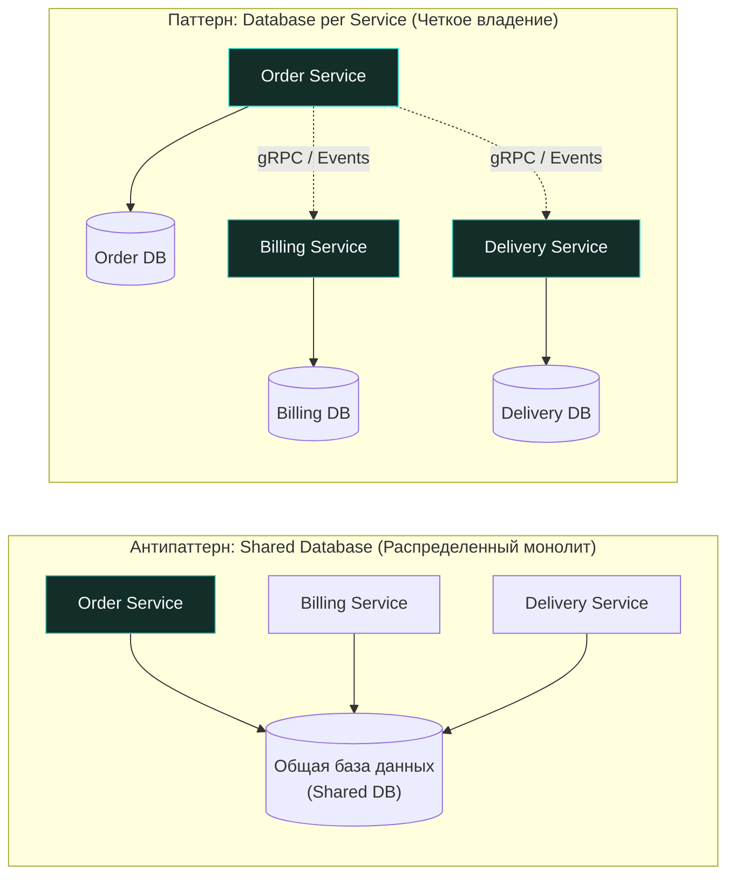
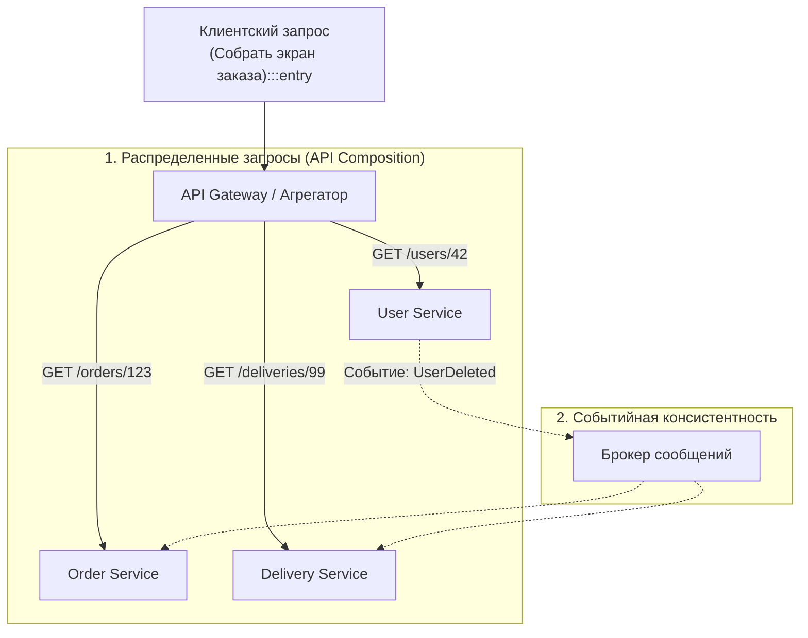

В монолитной архитектуре реляционная база данных долгое время служила уютной «коммунальной квартирой». Любой модуль или фоновый воркер мог без лишних церемоний выполнить размашистый `JOIN` между таблицей пользователей, корзиной, счетами и историей заказов. Все жили под защитой транзакций ACID, внешних ключей (`FOREIGN KEY`) и единого планировщика блокировок СУБД.

Но в мире микросервисов эта «коммуналка» мгновенно превращается в архитектурный капкан. Если два независимых сервиса напрямую читают и модифицируют одни и те же таблицы, они оказываются жестко связаны на уровне физической схемы данных. Достаточно переименовать или разделить колонку, изменить тип поля или добавить индекс, как вам придется синхронно тестировать, перекомпилировать и выкатывать оба сервиса одновременно. Независимость разработки рассыпается в прах.

Принцип **Data Ownership (Владение данными)** гласит: каждый микросервис является единственным и единоличным владельцем своих данных. Никакой другой сервис или внешний компонент не имеет права обращаться к его хранилищу напрямую в обход публичного API.

---

## Золотое правило: Database per Service

Фундаментальное правило микросервисной гигиены требует: у каждого сервиса должна быть своя собственная база данных (или как минимум изолированная логическая схема/tenant в кластере СУБД), доступ к которой осуществляется **строго через API** этого сервиса.

Этот барьер обеспечивает три важнейших инженерных свойства:

* **Инкапсуляция:** Внутренняя структура таблиц, шардирование и нормализация — это сугубо приватная деталь реализации. Вы можете безболезненно сменить PostgreSQL на MongoDB или ScyllaDB внутри сервиса `Comments`, и остальная система этого даже не заметит, пока контракт API остается стабильным.
* **Масштабируемость:** Вы получаете свободу настраивать СУБД под специфику профиля нагрузки. Например, сервис `Recommendations` может использовать графовую Neo4j или векторную БД, логам подойдет ClickHouse, а сервису `Auth` для хранения сессий и токенов — сверхбыстрый Redis.
* **Изоляция сбоев:** Тяжелый аналитический отчет или зависший `Seq Scan` в БД сервиса `Recommendations` больше не способен заблокировать пул соединений и исчерпать CPU дискового массива, а значит, сервис `Auth` продолжит штатно и мгновенно авторизовывать пользователей.

---

## Проблемы децентрализации данных

Когда мы лишаемся общей базы данных, мы неизбежно сталкиваемся с тремя классическими вызовами распределенного хранения:

### 1. Распределенные запросы (JOIN across services)
Как отобразить на экране мобильного приложения список заказов пользователя вместе с его текущим адресом, балансом бонусных баллов и статусом доставки, если эти сущности физически раскиданы по трем разным базам данных на разных серверах?
* **API Composition (Агрегация в коде):** Специальный сервис-агрегатор (BFF — Backend For Frontend или API Gateway) выполняет параллельные сетевые запросы к нужным микросервисам (например, через горутины и `sync.WaitGroup` в Go) и сшивает результаты воедино в оперативной памяти.
* **CQRS (Command Query Responsibility Segregation):** Для высоконагруженных экранов сшивать данные на лету каждым HTTP-запросом слишком накладно. Мы создаем выделенное представление на чтение (Read Model), которое подписывается на события от сервисов и формирует денормализованные, предварительно соединенные срезы, читаемые за один O(1) запрос.

### 2. Целостность и консистентность
В монолите целостность связей опирается на внешние ключи (`FOREIGN KEY`) и каскадные операции на уровне движка InnoDB или Postgres. В распределенной среде внешних ключей между базами физически не существует.
* **Событийная консистентность:** Если пользователь удален в `Auth Service`, сервис генерирует и публикует во внешнюю шину событие `UserDeleted`. Заинтересованный сервис `Orders` поймает это событие в бэкграунде и выполнит собственную доменную политику (например, очистит персональные данные или переведет историю в архив).
* **Мягкие ссылки:** Вместо физического внешнего ключа в реляционной таблице сохраняется просто числовой или строковый идентификатор `user_id`. Приложение и предметная логика берут на себя ответственность за обработку ситуаций, когда сущность по указанному `user_id` уже отсутствует или еще не создана.

### 3. Дублирование данных
Попытка любой ценой соблюсти академический принцип DRY (Don't Repeat Yourself) в микросервисах часто приводит к потере автономности. Чтобы не опрашивать соседний сервис по сети на каждый чих, архитекторы сознательно идут на контролируемую денормализацию. 

Например, `Delivery Service` может сохранять локальную неизменяемую копию имени клиента и номера телефона на момент создания отправления, чтобы не дергать `User Service` при каждом расчете маршрута курьера и формировании путевого листа.

---

## Mechanical Sympathy: Shared Data и Go Runtime

Инженеры, привыкшие писать эффективный многопоточный код на Go, легко поймут глубинную суть Data Ownership через аналогию с многопоточностью.

В рантайме Go существует золотой принцип:  
> *«Do not communicate by sharing memory; instead, share memory by communicating.»*

Когда две горутины бесконтрольно читают и пишут в одну область памяти без мьютекса или атомиков, мы получаем гонку данных (`data race`), порчу памяти и крах рантайма. Попытка повесить глобальный мьютекс убивает масштабируемость: ядра процессора встают в очередь, протокол когерентности кэшей MESI раскаляет шину инвалидацией Cache Lines (64 байта), конвейер инструкций сбрасывается.

Общая база данных между микросервисами — это в точности распределенный аналог расшаренной памяти без синхронизации! Сервисы начинают конкурировать за блокировки строк, создавать распределенные взаимоблокировки (`deadlocks`) и страдать от неожиданных изменений чужих схем. 

Единственный способ масштабировать систему — изолировать локальное состояние и общаться через передачу сообщений. База данных микросервиса — это его приватная память, а каналы связи — типизированные очереди сообщений и сетевые RPC.

> [!info] Под капотом: Общие библиотеки vs Общие данные
> Огромный соблазн для Go-разработчиков при распиле системы — создать единый репозиторий или пакет `shared_models.go`, содержащий канонические структуры всех таблиц и моделей предметной области, и импортировать его во все микросервисы проекта.
> 
> **Это коварная ловушка.** 
> Как только вы добавите новое поле в структуру `User` или измените валидацию поля в `shared_models.go`, вы создадите неявную связь между всеми микросервисами. Любое изменение потребует синхронного обновления зависимостей, перекомпиляции и перевыкатки десятков сервисов.
> 
> Идиоматичный подход для Go — проектировать легковесные независимые структуры переноса данных (Data Transfer Objects, DTO), содержащие исключительно те поля, которые необходимы конкретному контексту. Копирование нескольких определений структур (`Loose Coupling`) во много раз дешевле, чем скрытая компиляционная монолитность.

---

## Стратегии передачи владения

Если бизнес-процесс выходит за рамки одного сервиса и требует надежного переноса состояния, применяются проверенные паттерны координации:

1. **Transactional Outbox:** Нельзя просто сделать `INSERT` в локальную БД, а затем вызвать `producer.Publish()` в Kafka — если приложение упадет между этими двумя действиями, система окажется в рассинхронизированном состоянии. Паттерн Outbox сохраняет бизнес-сущность и исходящее событие в одной локальной ACID-транзакции в специальную таблицу `outbox`, откуда фоновый ретранслятор гарантированно доставляет его в брокер ([[8. Distributed transactions]]).
2. **Control Plane vs Data Plane:** Один сервис может являться владельцем эталонной конфигурации и мастер-данных (Control Plane), но централизованно рассылать снапшоты остальным сервисам для локального кэширования и мгновенного чтения без задержек (Data Plane).
3. **Change Data Capture (CDC):** Использование специализированных коннекторов (таких как Debezium) для асинхронного вычитывания логов упреждающей записи СУБД (Write-Ahead Log / WAL) и автоматической трансляции изменений напрямую в шину событий.

> [!tip] Собеседование
> **Вопрос:** Мы разделяем монолит на микросервисы. В центре системы находится огромная реляционная таблица `Orders`, к которой обращаются десятки модулей. С чего начать распутывание этого узла?
> **Ответ:** Первым делом необходимо выявить единственного законного «хозяина» данных (Owner). Задайте вопрос: какой бизнес-домен инициирует создание и изменение заказов? Ответ — создаваемый `Order Service`.
> Далее блокируется прямой доступ сторонних систем к таблице `Orders` (например, через разделение прав учетных записей в PostgreSQL). Все сторонние потребители переводятся на чтение и запись исключительно через API нового сервиса. Если это создает недопустимую сетевую задержку или нагрузку, на стороне потребителей внедряется локальное кэширование, асинхронная репликация событий или витрины данных CQRS.

---

## Итог

**Data Ownership** — это дисциплина архитектурных границ. Мы осознанно отказываемся от мгновенного удобства произвольных SQL-запросов и каскадных внешних ключей ради независимости команд, надежной изоляции отказов и автономного масштабирования сервисов. Без строгого владения данными микросервисная архитектура неизбежно скатывается в самый опасный антипаттерн — распределенный ком грязи (Distributed Big Ball of Mud).

Когда данные надежно изолированы внутри границ своих сервисов, возникает следующая ключевая инженерная задача: как организовать эффективный, устойчивый к сетевым сбоям и задержкам обмен сообщениями между ними. Об этом подробно пойдет речь в следующей статье: [[4. Service communication]].