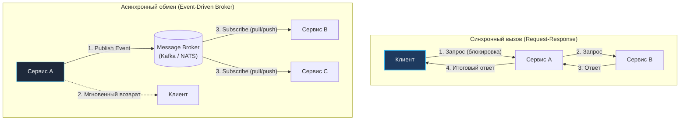
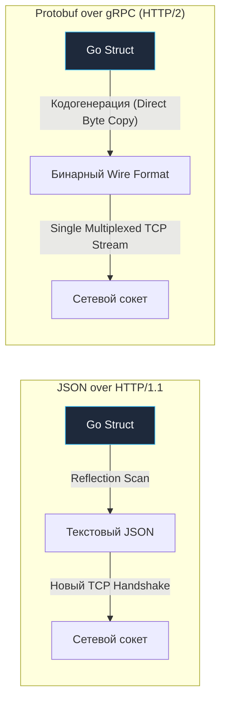

Когда вы работаете внутри одного скомпилированного бинарного файла Go, вызов функции или метода — это тривиальная ассемблерная инструкция `CALL`. В соответствии с современным соглашением `ABIInternal` аргументы передаются напрямую через регистры центрального процессора (`RAX`, `RBX`, `RCX`), а переключение контекста занимает доли наносекунды. Если одна функция завершается ошибкой, указатель стека просто раскручивается, а вызывающий код немедленно получает значение `err`.

Но стоит распилить приложение на микросервисы, как вызов функции превращается в путешествие через сетевой стек ядра Linux, коммутаторы дата-центра, очереди сетевой карты и сериализаторы данных. Обычный вызов теперь стоит не 2 наносекунды, а 2 миллисекунды — в миллион раз дороже! Более того, сеть недетерминирована: пакет может задержаться, потеряться или продублироваться.

В этой статье мы подробно разберем два фундаментальных способа взаимодействия распределенных сервисов — синхронный и асинхронный, а также исследуем, как инженерные механизмы языка Go помогают минимизировать накладные расходы на постоянную «болтливость» сетевых узлов.

---

## 1. Синхронное взаимодействие (Request-Response)

В синхронной модели сервис-клиент отправляет сетевой запрос и **блокирует** дальнейшее выполнение текущего сценария (или подвешивает горутину в ожидании ответа из сокета), ожидая результат от сервиса-сервера.

Это наиболее интуитивная парадигма: она полностью повторяет привычный ментальный шаблон вызова функций в коде и традиционно реализуется через REST API (JSON поверх HTTP/1.1) или gRPC (Protocol Buffers поверх HTTP/2).

### gRPC: Золотой стандарт для Go

Для внутреннего межсервисного общения (East-West traffic) в современной Go-экосистеме передача неструктурированного текстового JSON по HTTP/1.1 по праву считается антипаттерном. Де-факто отраслевым стандартом стал фреймворк **gRPC**:

* **Высокая производительность:** Компактный бинарный формат сериализации Protocol Buffers расходует в разы меньше трафика и тактов CPU, чем текстовый парсинг JSON.
* **Строгие типизированные контракты:** Схема данных и интерфейс RPC-методов фиксируются в `.proto` файлах. Компилятор `protoc` генерирует готовый клиентский и серверный Go-код с надежной статической типизацией.
* **Мультиплексирование HTTP/2:** Десятки параллельных запросов могут передаваться внутри одного открытого TCP-соединения через виртуальные стримы, исключая проблему Head-of-Line Blocking на уровне HTTP-сессий.
* **Полнодуплексный стриминг:** Поддержка клиентских, серверных и двунаправленных потоков данных прямо из коробки.

> [!warning] Ловушка / Gotcha: Тесная связность (Temporal Coupling)
> Главный архитектурный порок синхронного взаимодействия — сильная временная связность (Temporal Coupling).
> Если сервис `B` замедлился или упал, сервис `A` не может завершить свою транзакцию и вынужден удерживать открытые соединения и горутины.
> В распределенных системах длинная цепочка синхронных вызовов (`A -> B -> C`) катастрофически снижает доступность: если каждый узел доступен на 99.9%, то доступность цепочки падает как $0.999^3 \approx 99.7\%$. Любой локальный сбой порождает каскадную деградацию всей системы (подробнее в [[4. Partial failure]]).

---

## 2. Асинхронное взаимодействие (Messaging)

В асинхронной модели взаимодействующие сервисы разделены во времени и пространстве при помощи буфера — **брокера сообщений** (Message Broker: Apache Kafka, RabbitMQ, NATS JetStream). 

Сервис-отправитель формирует сообщение, передает его брокеру и, получив подтверждение записи (acknowledgment), немедленно возвращает управление клиенту. Его больше не волнует, доступен ли принимающий сервис прямо в эту секунду.

### Паттерны:

1. **Publish/Subscribe (Событийная модель):** 
   Сервис `Order` успешно завершает оформление покупки и публикует доменное событие `OrderCreated`. На этот топик независимо подписаны:
   - `Email Service` (для отправки чека клиенту),
   - `Analytics Service` (для фиксации метрик выручки),
   - `Shipping Service` (для создания заявки на складе).  
   Каждый потребитель вычитывает сообщения с собственной комфортной скоростью (Consumer Lag), не создавая нагрузки на отправителя.

2. **Point-to-Point (Очередь задач / Work Queue):**
   Сообщение из очереди забирает ровно один свободный рабочий узел (воркер) из пула консьюмеров. Это классический выбор для ресурсоемких фоновых задач: перекодирование видео, распознавание документов или ресайз изображений.

---

## 3. Сравнение подходов

| Архитектурное свойство | Синхронно (gRPC / HTTP) | Асинхронно (Kafka / NATS) |
| :--- | :--- | :--- |
| **Связность во времени** | Высокая (оба узла обязаны быть онлайн прямо сейчас) | Низкая (полная автономность продюсера и консьюмера) |
| **Сквозная задержка (Latency)** | Минимальная для клиента (мгновенный ответ) | Задержка доставки через брокер (от десятков мс до минут) |
| **Сложность отладки** | Простая (трассировка стека и логов понятна) | Требует распределенной трассировки (`OpenTelemetry`, `traceparent`) |
| **Обработка всплесков нагрузки** | Плохая (пик трафика перегружает вызываемые бэкенды) | Идеальная (брокер выступает как естественный буфер / Shock Absorber) |
| **Отказоустойчивость** | Отказ любого звена ломает всю цепочку | Сообщения сохраняются в брокере при сбоях воркеров |

---

## Mechanical Sympathy: Сериализация и Go

Любой обмен данными между узлами — это процесс преобразования структур данных в оперативной памяти Go в поток байтов для отправки в сетевой сокет (маршалинг) и обратная сборка на принимающей стороне (анмаршалинг). 

Для Senior-разработчика критически важно понимать цену каждого выделенного байта и такта CPU в этом цикле.

> [!info] Под капотом: Аллокации при маршалинге
> Стандартный библиотечный пакет `encoding/json` полагается на **рантайм-рефлексию** (`reflect`). При каждом вызове `json.Marshal()` рантайм вынужден инспектировать типы полей, читать теги структур, динамически проверять интерфейсы и выделять память в куче (`heap allocation`) под промежуточные строки и буферы. На высоких RPS (десятки тысяч запросов в секунду) это превращается в существенную нагрузку на Garbage Collector и частые паузы Stop-the-World.
> 
> **gRPC и Protobuf** подходят к проблеме иначе — через статическую кодогенерацию. В сгенерированном коде компилятор заранее знает точные смещения каждого поля структуры. Сериализатор записывает теги и значения напрямую в предвыделенный байтовый срез без использования рефлексии. В связке с пулами буферов (`sync.Pool`) это снижает число аллокаций до нуля, сберегая драгоценные такты процессора для бизнес-логики.

---

## Паттерны устойчивости (Resilience)

Если архитектурная задача требует синхронного межсервисного общения, разработчик обязан защитить систему проверенным арсеналом инструментов отказоустойчивости:

1. **[[3. Timeout]]:** Ни один сетевой вызов не имеет права выполняться без контекста с дедлайном (`context.WithTimeout`). Если удаленный сервис повис из-за взаимоблокировки в БД, клиент должен оборвать соединение через 200–500 мс, а не ждать вечно, блокируя пул горутин.
2. **[[2. Retry и backoff]]:** В распределенных сетях часто случаются кратковременные потери пакетов. Повторные попытки с экспоненциальным откладыванием (Exponential Backoff) и случайным дрожанием (Jitter) позволяют пережить сбой без добивания упавшего сервиса лавиной запросов.
3. **[[1. Circuit Breaker]]:** Паттерн «автоматического выключателя». Если сервис `B` начинает отвечать ошибками 500 на 50% запросов, Circuit Breaker мгновенно размыкает цепь (State: Open), возвращая клиентам быстрый отказ или дефолтный ответ из кэша (Fallback), давая удаленному сервису время на восстановление.

---

> [!tip] Собеседование
> **Вопрос:** Какой протокол выбрать для общения микросервисов: REST или gRPC?
> **Ответ:** Архитектурный оптимум — разделять трафик:
> 1. **North-South трафик (внешний):** Для внешних клиентов (веб-браузеры, мобильные приложения, сторонние партнеры) лучше подходит HTTP/REST (или GraphQL), поскольку JSON универсален, поддерживается любыми платформами и легко инспектируется стандартными инструментами (cURL, Postman, браузерный DevTools).
> 2. **East-West трафик (внутри кластера):** Для общения между внутренними микросервисами идеален gRPC. Он дает бинарную компактность, строгую типизацию, мультиплексирование TCP-потоков по HTTP/2 и драматически снижает нагрузку на CPU и память Go-серверов.

---

## Итог

Выбор протокола коммуникации — это постоянный инженерный компромисс между **мгновенной синхронностью ответа** и **автономной устойчивостью всей системы**. 

Зрелый продакшен-бэкенд на Go виртуозно комбинирует оба мира: высокоскоростной синхронный gRPC с настроенными таймаутами и выключателями для критичных пользовательских запросов в реальном времени, и отказоустойчивую асинхронную шину Kafka/NATS для доменных событий, интеграций и репликации данных.

Однако надежное общение невозможно без строгого согласования формата передаваемых данных между командами. О том, как формализовать и сопровождать эти договоренности без страха сломать продакшен, мы поговорим в следующей статье: [[5. API contracts]].