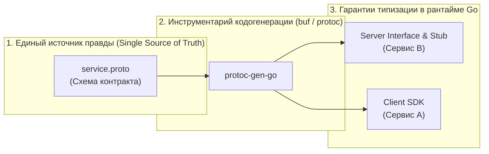
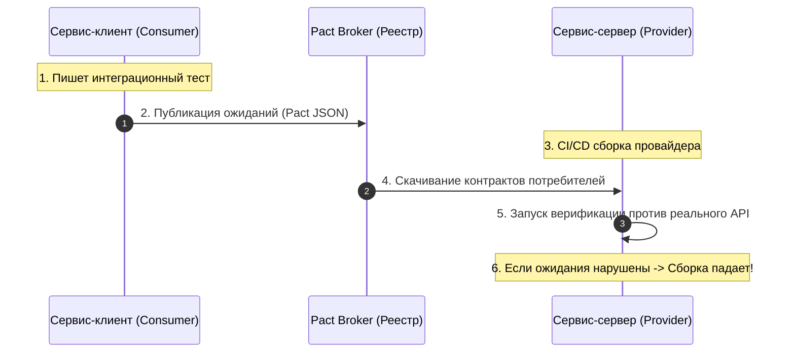

Когда все компоненты вашей системы живут в рамках одного репозитория на Go, компилятор `go build` выступает вашим самым строгим и надежным союзником. Если один разработчик решит переименовать поле структуры из `user_id` в `uuid`, компилятор немедленно остановит сборку с четким указанием строки и файла. Ошибка будет локализована за доли секунды прямо в вашей IDE еще до запуска тестов.

Но как только вы разнесли компоненты по разным микросервисам и репозиториям, эта компиляционная защита мгновенно испаряется. Если сервис `A` ожидает, что в теле запроса придет поле `user_id`, а сервис `B` после очередного релиза молча начал отправлять `uuid`, то на этапе компиляции никто не заметит подвоха. Ошибка проявится только на продакшене в виде `nil pointer dereference`, пустых записей в базе данных или лавины пятисотых кодов ответа.

**API Contract (API-контракт)** — это строгое, формальное и машиночитаемое соглашение между поставщиком (Provider) и потребителем (Consumer) о правилах сетевого взаимодействия. Это настоящая «конституция» вашей распределенной системы, гарантирующая стабильность и предсказуемость эволюции сервисов.



---

## 1. Типы контрактов

В современной инженерной практике для Go-бэкендов выделяют два ключевых подхода к описанию контрактов:

### А. Схемные контракты (gRPC / Protobuf)

Это эталонный и наиболее надежный способ построения межсервисных контрактов. Интерфейсы методов и структуры полезной нагрузки фиксируются в бинарно-нейтральных `.proto` файлах:

* **Single Source of Truth:** Контракт полностью отделен от кода конкретного сервиса. Часто схемы версионируются в отдельном репозитории (Schema Registry) с использованием современных утилит вроде `buf`.
* **Строгая статическая типизация:** Из одной схемы компилятор автоматически генерирует Go-структуры, интерфейсы серверов и валидированные клиентские заглушки (Stubs). Любая опечатка в имени поля отсекается на этапе `go build`.
* **Встроенная обратная совместимость:** В wire format Protocol Buffers данные идентифицируются не по строковым именам полей, а по числовым тегам (Field Numbers). Это позволяет сервисам читать старые и новые сообщения без сбоев сериализации.

### Б. Документарные контракты (OpenAPI / Swagger)

Традиционный выбор для внешних публичных REST API, где клиентами выступают мобильные приложения, веб-фронтенды или сторонние интеграторы:

* **Машиночитаемый YAML/JSON:** Описывает HTTP-методы (`GET`, `POST`), пути, заголовки, статус-коды и JSON-схемы валидации тел запроса.
* **Богатая экосистема:** Позволяет автоматически генерировать интерактивную веб-документацию (Swagger UI), мок-серверы для локальной разработки и клиентские библиотеки для десятков языков программирования (например, через `oapi-codegen` для Go).

---

## 2. Контрактное тестирование (Consumer-Driven Contracts)

Наличие схемы в формате Protobuf или OpenAPI защищает от синтаксических нестыковок, но не спасает от смысловых и логических поломок. Например, сервер может продолжать отдавать корректную строку, но вместо реального `user_id` начать возвращать пустое значение `""` или `"N/A"`.

Чтобы предотвратить разрушение интеграций при независимых релизах, в зрелых командах применяется методология **Consumer-Driven Contracts (CDC)** (например, на базе фреймворка Pact):



Суть подхода состоит из трех четких фаз:
1. **Потребитель (Consumer)** пишет локальный интеграционный тест против мока, в котором явно фиксирует свои минимально необходимые требования к ответу сервера.
2. Сгенерированный файл контракта (Pact JSON) отправляется в общий реестр (Pact Broker).
3. **Поставщик (Provider)** в собственном CI/CD пайплайне скачивает актуальные контракты всех своих клиентов и прогоняет их против своего живого контроллера. Если кто-то из клиентов оказывается сломан, билд блокируется до выхода в прод.

---

## 3. Mechanical Sympathy: Контракты и рантайм Go

В языке Go нулевые значения (`zero values`) примитивных типов определены строго: для чисел это `0`, для строк — `""`, для булевых флагов — `false`. В сетевых протоколах это порождает классическую проблему: клиент прислал явный ноль или просто не передал поле?

> [!info] Под капотом: Опциональность полей
> В классическом JSON сериализаторе `encoding/json` при анмаршалинге в структуру с полем `Age int` невозможно различить, пришел ли JSON `{"age": 0}` или `{}`. В обоих случаях в поле структуры окажется `0`. Если ваш обработчик сохраняет эту структуру в БД, вы рискуете перезаписать существующее значение нулем!
> 
> В современном Go и Protobuf v3 эта проблема решается двумя путями:
> 1. Ключевое слово `optional` в `.proto` генерирует в Go-структуре поле-указатель `*int64` или методы `HasAge()`. Если поле не передано в бинарном потоке, указатель равен `nil`.
> 2. Специальные типы-обертки из библиотеки `google/protobuf/wrappers.proto`, такие как `google.protobuf.Int64Value`. В рантайме Go это также представляет собой указатель на структуру-обертку, позволяя элегантно и надежно отличать намеренную передачу нуля от полного отсутствия данных без лишних аллокаций.

---

## 4. Золотые правила работы с контрактами

Чтобы распределенная система не требовала постоянных ночных созвонов при каждом деплое, инженеры следуют трем фундаментальным правилам:

1. **Закон Постела (Принцип робастности):**  
   *«Будь консервативен в том, что отправляешь, и либерален в том, что принимаешь».*  
   Если клиентский сервис прислал в запросе новое или лишнее поле, которого еще нет в вашей текущей локальной схеме — проигнорируйте его, не возвращая ошибку 400. Именно так работают декодеры Protobuf из коробки.
2. **Никогда не удаляйте поля и теги:**  
   Если поле устарело, пометьте его ключевым словом `deprecated` в схеме, но сохраните в определении сообщения. В Protobuf зарезервируйте номер поля (`reserved 4;`), чтобы будущие разработчики случайно не переиспользовали освободившийся тег для других данных. Удаление рабочего поля — это гарантированный breaking change.
3. **Явная версионируемость пространства имен:**  
   Всегда закладывайте номер мажорной версии пакета в путь протокола и URL. Контракты версий `v1` и `v2` должны иметь возможность одновременно сосуществовать в одной кодовой базе без взаимных конфликтов типов.

```protobuf
// service.proto
syntax = "proto3";

package orders.v1;

option go_package = "github.com/example/orders/gen/v1;ordersv1";

// Запрос на создание заказа
message CreateOrderRequest {
  string user_id = 1;
  repeated string item_ids = 2;
  
  // Опциональное поле: компилятор сгенерирует *string
  optional string promo_code = 3;
  
  // Поле выведено из эксплуатации, но тег защищен
  // reserved 4;
}

message CreateOrderResponse {
  string order_id = 1;
  string status = 2;
}

service OrderService {
  rpc CreateOrder(CreateOrderRequest) returns (CreateOrderResponse);
}
```

---

> [!tip] Собеседование
> **Вопрос:** Как правильно обновить контракт взаимодействия микросервисов, если требуется внести ломающее изменение (Breaking Change)?
> **Ответ:** Ломающие изменения никогда не выкатываются одномоментно. Применяется стратегия параллельных версий (Parallel Run):
> 1. **Фаза расширения:** Провайдер реализует новый эндпоинт или метод (например, пакет `v2`), сохраняя полную работоспособность старого `v1`. Сервер деплоится в прод.
> 2. **Фаза миграции:** Команды потребителей постепенно и автономно переводят свои сервисы на `v2` (используя Canary-деплои и мониторинг метрик).
> 3. **Фаза сжатия:** Когда метрики подтверждают, что трафик на эндпоинт `v1` упал строго до нуля, старый контракт объявляется закрытым и безопасно удаляется из кодовой базы.

---

## Итог

API-контракт — это инженерный фундамент распределенной системы, заменяющий локальный компилятор на уровне сети. В Go-экосистеме связка **gRPC + Protobuf** обеспечивает максимальную надежность благодаря автоматической кодогенерации, строгой проверке типов и эффективной бинарной сериализации.

Но даже идеально описанный контракт неизбежно развивается вместе с требованиями бизнеса. О том, как управлять версиями API, избегать конфликтов и поддерживать параллельные жизненные циклы сервисов, мы поговорим в следующей статье: [[6. Versioning сервисов]].