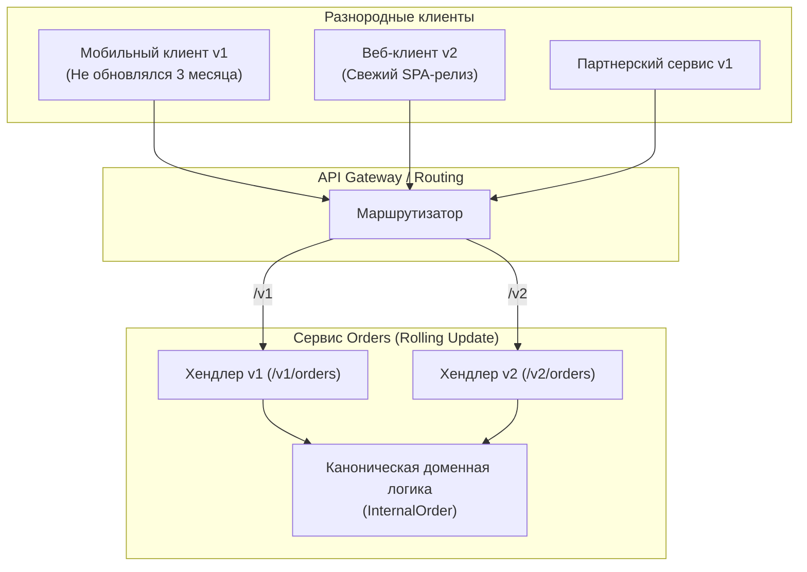
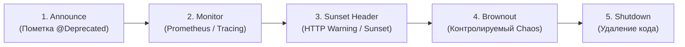
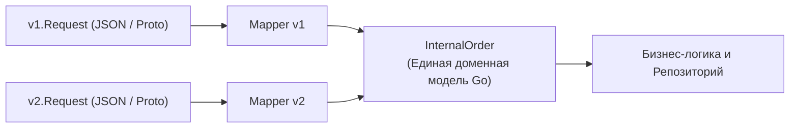

Разработка микросервисной системы — это не короткий спринт, где можно однажды спроектировать идеальную схему и забыть о ней, а затяжной инженерный марафон. Требования бизнеса, фискальное законодательство, оптимизации производительности и новые фичи непрерывно подталкивают к эволюции интерфейсов.

Но в распределенной среде невозможно нажать кнопку «обновить всё» и мгновенно перевести весь кластер на свежую версию. В реальности процесс плавного обновления (Rolling Update) сотен подов в Kubernetes занимает десятки минут. Хуже того: мобильное приложение на смартфоне пользователя может не обновляться месяцами, а внешние партнеры могут годами отправлять запросы в старом формате. В любой момент времени в вашей системе будут сосуществовать компоненты разных поколений.

**Versioning (Версионирование)** — это дисциплина и архитектурная стратегия управления жизненным циклом интерфейсов, позволяющая развивать систему безболезненно и автономно, не провоцируя каскадных падений у зависимых потребителей.



---

## 1. Два пути эволюции API

В теории распределенных систем эволюция протоколов опирается на две противоположные, но дополняющие друг друга концепции:

### Обратимая совместимость (Backward Compatibility)
Сервер новой версии способен беспрепятственно принимать и корректно обрабатывать запросы от клиентов предыдущих версий.
* **Пример в коде:** Добавление нового необязательного поля в HTTP-ответ сервера или поддержка нового опционального query-параметра. Старый клиент просто не знает о новом поле и не запрашивает его, а сервер возвращает ответ без ошибок.
* **Правило Go/Protobuf:** Ни при каких обстоятельствах не изменяйте номера тегов у существующих полей в `.proto` файлах и не переименовывайте методы в рамках мажорной версии.

### Прямая совместимость (Forward Compatibility)
Клиенты старых версий способны успешно обрабатывать ответы, пришедшие от обновленного сервера более свежей версии.
* **Пример:** Клиент версии `v1` обращается к серверу, который уже обновился до `v2`. Сервер присылает расширенный ответ с новыми метаданными. Старый клиент читает известные ему поля, а незнакомые данные просто отбрасывает.
* **Закон Постела в Go:** При десериализации JSON или бинарного Protobuf в сгенерированные Go-структуры (`struct`), рантайм по умолчанию игнорирует поля, отсутствующие в определении типа приемника, не вызывая паники или ошибки парсинга. Это и обеспечивает физическую прямую совместимость в продакшене.

---

## 2. Стратегии версионирования

В инженерной практике Go-разработки применяются три основные стратегии адресации версий:

### Версионирование в пути (Path Versioning)
Наиболее наглядный, прозрачный и популярный подход для REST API:
* `https://api.service.com/v1/orders`
* `https://api.service.com/v2/orders`

* **Достоинства:** Идеальная изоляция сетевой маршрутизации. Любой Ingress-контроллер (Nginx, Envoy, Traefik) может направить трафик `/v1` и `/v2` на совершенно разные пулы подов без анализа заголовков или содержимого пакетов.
* **Недостатки:** Расползание кодовой базы. Разработчикам приходится параллельно поддерживать два набора маршрутов и контроллеров.

### Версионирование через заголовки (Header Versioning)
Версия передается в стандартных или пользовательских HTTP-заголовках контентного согласования (Content Negotiation):
* `Accept: application/vnd.myapi.v2+json`

* **Достоинства:** Семантическая чистота URL. Один и тот же ресурс идентифицируется каноническим URI, меняется лишь представление схемы.
* **Недостатки:** Затруднена ручная отладка через браузер, невозможно легко настроить кэширование на промежуточных CDN-прокси без тонкого конфигурирования заголовка `Vary`, требуется внутренняя логика диспетчеризации в коде роутера Go.

### Пакетное версионирование в gRPC
В Protocol Buffers версионирование элегантно решается на уровне ключевого слова `package`:

```protobuf
syntax = "proto3";

// Версия заложена прямо в пространство имен пакета
package orders.v2;

option go_package = "github.com/org/gen/orders/v2;ordersv2";

service OrderService {
  rpc GetOrder(GetOrderRequest) returns (GetOrderResponse);
}
```

В кодовой базе Go это преобразуется в полностью независимые сгенерированные пакеты:
```go
import "github.com/org/gen/orders/v2"
```
Такой подход позволяет в одном бинарном файле зарегистрировать на одном gRPC-сервере реализации интерфейсов `ordersv1.OrderServiceServer` и `ordersv2.OrderServiceServer`, мирно разделяющих общий сетевой сокет.

---

## 3. Семантическое версионирование (SemVer)

Для управления релизами библиотек, общих контрактов и бинарных микросервисов общепринят стандарт `MAJOR.MINOR.PATCH` (например, релиз `2.3.1`):

1. **MAJOR (Мажорная версия):** Внесены ломающие изменения (Breaking Changes), несовместимые с предыдущими контрактами. Требует обязательного перехода на новый префикс пути или пакет (`/v1` -> `/v2`).
2. **MINOR (Минорная версия):** Добавлена новая бизнес-функциональность при сохранении 100% обратной совместимости. Клиентам обновление не вредит.
3. **PATCH (Патч-версия):** Исправлены ошибки реализации или закрыты уязвимости безопасности без модификации публичного интерфейса.

---

## 4. Процесс вывода из эксплуатации (Deprecation)

Поддерживать версию `v1` бесконечно невозможно: это увеличивает технический долг, усложняет миграции баз данных и расходует оперативную память подов. Зрелый процесс снятия старых интерфейсов с поддержки (Decommissioning) состоит из пяти фаз:



1. **Announce (Анонс):** Метод объявляется устаревшим (`Deprecated`) в документации OpenAPI и в godoc-комментариях к коду.
2. **Monitor (Мониторинг):** В Prometheus навешиваются метрики с лейблом `api_version="v1"`. Инженеры точно видят, какие конкретно токены и сервисы всё еще обращаются к старой версии.
3. **Sunset Header (Предупреждение):** В HTTP-ответы серверов добавляются стандартные заголовки `Sunset` (дата окончательного отключения по RFC 8594) и `Warning` (RFC 7234), информирующие вызывающую сторону о скором выводе из эксплуатации.
4. **Brownout («Учения»):** Кратковременные отключения устаревшего эндпоинта (на 5–15 минут) в рабочее время. Это лучший способ разбудить забывчивые команды потребителей, чьи сервисы всё еще ходят в `v1` вопреки письмам и алертам.
5. **Shutdown (Окончательное удаление):** Когда метрики трафика стабильно показывают 0 RPS, устаревший хендлер и структуры удаляются из кодовой базы.

---

## Mechanical Sympathy: Версионирование и типизация Go

В Go попытка скопировать весь код бизнес-логики при переходе с `v1` на `v2` приводит к дублированию, расхождению логики и скрытым багам. 

Правильный инженерный подход заключается в изоляции транспортных моделей от доменного ядра через шаблоны адаптеров:



> [!info] Под капотом: Композиция и адаптеры
> Вместо того чтобы дублировать методы репозитория и сервисного слоя для `v2`, идиоматично спроектировать единую внутреннюю модель `InternalOrder`.
> 
> 1. Транспортный хендлер `v1` принимает запрос `v1.Request` и выполняет маппинг в каноническую структуру `InternalOrder` (заполняя новые поля значениями по умолчанию).
> 2. Транспортный хендлер `v2` принимает запрос `v2.Request` и выполняет маппинг в тот же самый `InternalOrder`.
> 3. Доменное ядро системы работает исключительно с `InternalOrder` и вообще ничего не знает о сетевых протоколах и версиях внешних API. Это сохраняет чистоту архитектуры и защищает процессорные кэши от раздувания дублирующегося машинного кода.

---

> [!tip] Собеседование
> **Вопрос:** Что безоговорочно считается ломающим изменением (Breaking Change) в Protobuf и gRPC?
> **Ответ:** В Protobuf ломающими являются следующие действия:
> 1. Изменение числового номера тега у существующего поля (сообщение декодируется в мусор или упадет с ошибкой).
> 2. Изменение типа данных поля (например, превращение `int32` в `string`).
> 3. Переименование сервиса, пакета или RPC-метода (меняется wire-URL вызова `/package.Service/Method`).
> 4. Удаление существующего поля без защиты тега (если клиент все еще отправляет значение, а новый сервер решит переиспользовать этот же номер для другого типа).
> 5. Усиление валидации входных данных (например, поле было опциональным, но бизнес-логика сервера начала жестко требовать его наличия и возвращать `InvalidArgument`).

---

## Итог

Версионирование — это искусство делать изменения безопасными и незаметными для пользователей. Запомните золотое правило: **лучшее изменение в распределенной системе — это то, которое не требует повышения мажорной версии**. Если задачу можно решить добавлением нового опционального поля или расширением структуры — сделайте именно так.

Однако даже при аккуратном версионировании распределенная система постоянно живет в состоянии смешанных версий. О том, как на уровне кода и рантайма обеспечить выживаемость сервисов при непрерывных накатах и откатах, мы поговорим в следующей статье: [[7. Backward compatibility]].