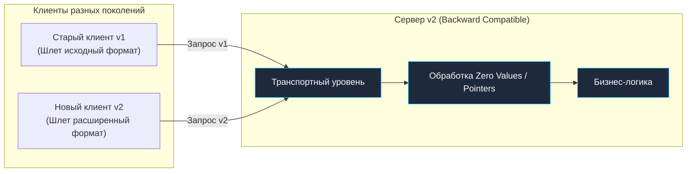
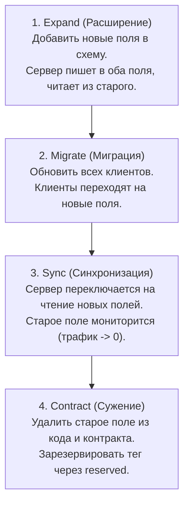
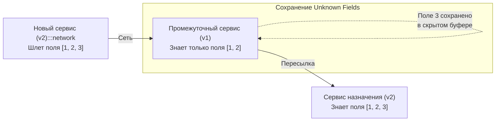

В мире распределенных систем существует негласный закон, сформулированный инженером Google Хайрамом Райтом (Hyrum's Law):  
> *«При достаточном количестве пользователей API не имеет значения, что вы обещали в контракте: любое наблюдаемое поведение вашей системы станет зависимостью для кого-то».*

Когда сотни микросервисов разрабатываются десятками независимых команд и выкатываются в продакшен десятки раз в день, **обратная совместимость (Backward Compatibility)** перестает быть просто признаком хорошего тона — она становится главным механизмом выживания архитектуры. Вы никогда не сможете в один момент времени переключить рубильник и обновить сервер вместе со всеми его клиентами.

Обратная совместимость гарантирует, что **новый сервер безупречно понимает и обрабатывает запросы от старых клиентов**. Если после релиза версии `v2` сервиса мобильное приложение пользователя, не обновлявшееся в App Store три месяца, внезапно начинает получать `HTTP 400` или падать с кодом `500` — вы нарушили контракт и сломали продакшен.



---

## 1. Золотые правила Protobuf

Поскольку в современной микросервисной архитектуре на Go протокол gRPC служит стандартом де-факто для внутреннего общения, обеспечение обратной совместимости тесно связано с механикой кодирования **Protocol Buffers**.

### Поля и Теги

В бинарном потоке Protobuf wire format никогда не передает строковые имена полей (такие как `user_id` или `description`). Вместо этого каждое поле упаковывается в виде комбинации числового тега и типа кодирования (Wire Type): `(field_number << 3) | wire_type`.

- **Правило 1:** Никогда не изменяйте числовые номера тегов у существующих полей в `.proto` файлах. Перенос тега на другое поле приведет к фатальной порче данных.
- **Правило 2:** Если вы выводите поле из эксплуатации, явно зарезервируйте его номер и строковое имя через ключевое слово `reserved`. Это гарантирует, что будущий разработчик случайно не переиспользует освободившийся тег для новых данных:
  ```protobuf
  message UserProfile {
    reserved 4, 12 to 15;
    reserved "legacy_status", "old_address";
    string user_id = 1;
  }
  ```

### Новые поля

Добавление нового поля в Protobuf — это абсолютно безопасная и обратно совместимая операция. 

Старые клиенты, получая ответ от обновленного сервера с новыми полями, просто проигнорируют неизвестный тег при чтении бинарного потока. Новый же сервер, получая запрос от старого клиента, не обнаружит тега в потоке байтов и автоматически инициализирует поле каноническим **Zero Value** (по умолчанию `0` для `int`, `""` для строк, `false` для булевых типов) или предоставит явную проверку наличия через предикат `has` (если поле помечено модификатором `optional`).

---

## 2. Ловушки JSON в Go

В отличие от строго типизированного Protobuf, работа с неструктурированным JSON в Go таит множество коварных ловушек. 

Стандартный пакет `encoding/json` по умолчанию игнорирует неизвестные поля при анмаршалинге (`json.Unmarshal`) в структуру Go, что создает иллюзию автоматической совместимости. Однако настоящая опасность кроется в механике нулевых значений языка.

> [!warning] Ловушка / Gotcha: Проблема Zero Values
> В языке Go базовый тип `int` по умолчанию инициализируется нулем `0`, а тип `bool` — значением `false`.
> 
> Представьте типичный сценарий: в версии `v1` поле `is_active` в JSON-ответе всегда передавалось со значением `true`. В версии `v2` команда решила удалить это поле или сделать его опциональным. Старый клиент отправляет на обновленный сервер JSON без этого ключа:
> ```json
> {"user_id": "123"}
> ```
> Ваш Go-сервер `v2` выполняет анмаршалинг в структуру:
> ```go
> type UpdateUserRequest struct {
>     UserID   string `json:"user_id"`
>     IsActive bool   `json:"is_active"`
> }
> ```
> В результате поле `IsActive` получит дефолтное значение `false`! Если сервер сохранит эту структуру в базу данных, активный пользователь будет заблокирован просто потому, что старый клиент не прислал удаленное поле.
> 
> **Решение:** Используйте указатели на примитивные типы (`*bool`, `*int`) для всех опциональных полей:
> ```go
> type UpdateUserRequest struct {
>     UserID   string `json:"user_id"`
>     IsActive *bool  `json:"is_active"`
> }
> ```
> Если ключ отсутствует во входном JSON, поле останется равным `nil`. Бизнес-логика проверяет указатель (`if req.IsActive != nil`) и не перезаписывает статус в СУБД ложным значением.

---

## 3. Паттерн "Expand and Contract" (Расширение и Сужение)

Если архитектурная задача требует провести ломающее изменение схемы данных (например, разделить поле ФИО на `first_name` и `last_name` или изменить тип данных), это категорически запрещено делать одномоментно. Применяется классический четырехэтапный танец: **Expand and Contract** (также известный как Parallel Run):



1. **Expand (Расширение):** В контракт добавляются новые поля, сохраняя старые. Сервер обновляется так, чтобы при записи заполнять оба поля, поддерживая консистентность.
2. **Migrate (Миграция):** Команды-потребители независимо обновляют свои сервисы и мобильные клиенты, переводя их на чтение и запись новых полей.
3. **Sync (Синхронизация):** Сервер переключает основное чтение на новое поле. Метрики в Prometheus подтверждают, что старое поле больше никем не читается.
4. **Contract (Сужение):** Устаревшие поля и адаптеры безопасно удаляются из кодовой базы, а номера тегов в схеме Protobuf блокируются ключевым словом `reserved`.

---

## 4. Mechanical Sympathy: Unknown Fields в Go

Когда Go-микросервис получает бинарное сообщение Protobuf, содержащее поля, о существовании которых он еще не знает (потому что сообщение пришло от более нового сервиса или клиента), эти байты не отбрасываются в мусорную корзину.



> [!info] Под капотом: Поле `XXX_unrecognized`
> В старых реализациях кодогенератора (пакет `github.com/golang/protobuf`) каждая сгенерированная структура содержала явное экспортируемое поле:
> ```go
> XXX_unrecognized []byte
> ```
> Современная библиотека `google.golang.org/protobuf` (APIv2) хранит неизвестные поля внутри непрозрачного внутреннего состояния, доступного через методы рефлексии `protoimpl.MessageState`.
> 
> **Зачем это нужно распределенной системе?** 
> Это свойство критично для построения шлюзов, роутеров, брокеров и промежуточных сервисов (Proxy / Service Mesh). Промежуточный сервис может прочитать известные ему поля (например, ID маршрута), добавить свои заголовки и отправить сообщение дальше по цепочке, **не потеряв** новые поля, адресованные конечному получателю. Это гарантирует сохранение прямой совместимости (Forward Compatibility) на уровне сети.

---

## 5. Валидация и обратная совместимость

Самый распространенный и незаметный способ случайно обрушить прод — это **ужесточение валидации** входных данных:

- **Версия v1:** Поле `description` в запросе являлось необязательным. Тысячи клиентских устройств отправляли запросы без этого поля.
- **Версия v2:** Новый разработчик добавил валидацию:  
  `if req.Description == "" { return status.Error(codes.InvalidArgument, "description required") }`
- **Результат:** Сервер начинает отвечать ошибками `HTTP 400` / `InvalidArgument`, и бизнес-процессы пользователей моментально парализуются.

**Инженерный совет:** Любое новое правило валидации обязано проходить фазу мягкого запуска (`soft-launch`). Сервер не прерывает запрос ошибкой, а лишь инкрементирует счетчик в мониторинге и логирует предупреждение. Только когда графики покажут 0 срабатываний, проверку можно переводить в блокирующий режим.

---

> [!tip] Собеседование
> **Вопрос:** Как организовать непрерывный автоматический контроль обратной совместимости API в CI/CD?
> **Ответ:** Защита выстраивается на нескольких эшелонах автоматизации:
> 1. **Статический анализ схем:** Использование линтеров вроде `buf breaking`. Утилита на этапе Git Hook или Pull Request сравнивает текущую версию `.proto` с базовой веткой `main` и немедленно блокирует сборку при удалении поля, смене тега или изменении типа данных.
> 2. **Контрактные тесты:** Запуск набора `Pact-тестов`, проверяющих соответствие реальных ответов сервиса ожиданиям клиентов.
> 3. **Канареечные релизы (Canary):** Выкатка новой версии сервиса на 2–5% трафика с пристальным отслеживанием графиков ошибок 4xx/5xx в течение первых 30 минут.

---

## Итог

1. **Теги в Protobuf неприкосновенны.** Никогда не меняйте числовые идентификаторы полей.
2. **JSON коварен в рантайме Go.** Используйте указатели на типы (`*bool`, `*int`), чтобы надежно различать дефолтный ноль и намеренное отсутствие поля.
3. **Ломайте систему плавно.** Всегда применяйте паттерн «Expand and Contract».
4. **Соблюдайте закон Постела.** Будьте снисходительны к входящим сообщениям и игнорируйте неизвестные атрибуты.

Мы подробно разобрали, как гарантировать стабильность протоколов при непрерывных обновлениях кода. Но в динамическом облачном кластере возникает другая фундаментальная сложность: сервисы постоянно перезапускаются, масштабируются, меняют IP-адреса и порты. Как клиентскому приложению мгновенно найти живой экземпляр нужного сервиса? Об этом пойдет речь в следующей статье: [[8. Service Discovery]].