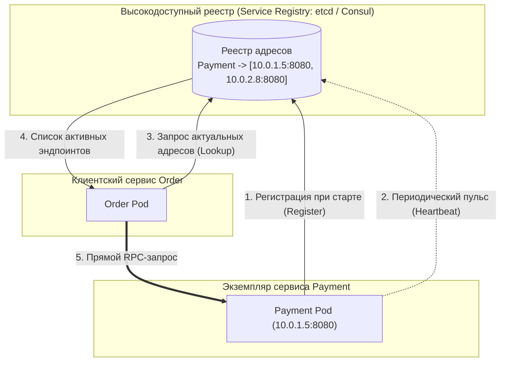
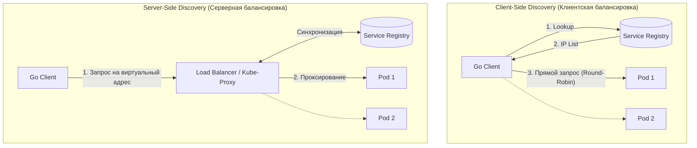
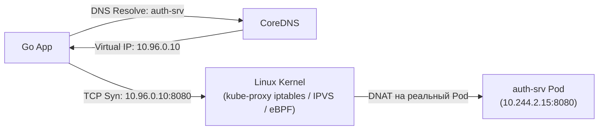

В старые добрые времена физических bare-metal серверов жизнь бэкенд-разработчика отличалась спартанским спокойствием: в серверной стойке стоял физический сервер СУБД с неизменным IP-адресом `192.168.1.10`, а рядом — два сервера приложений. Разработчик единожды прописывал эти адреса в текстовый `.yaml` конфиг, и система работала годами без малейших изменений топологии.

Но в эпоху контейнеризации и динамических облачных платформ (Kubernetes, HashiCorp Nomad, AWS ECS) концепция постоянных IP-адресов окончательно ушла в прошлое. Контейнеры и поды мигрируют между физическими нодами, гибнут при нехватке памяти (OOMKilled), автоматически масштабируются горизонтально (HPA) от 3 до 300 реплик во время пиковых распродаж. Каждый вновь рожденный экземпляр получает совершенно новый эфемерный IP-адрес. Прописывать такие адреса вручную в файлы конфигураций физически невозможно.

**Service Discovery (Обнаружение сервисов)** — это фундаментальный архитектурный паттерн и инфраструктурный механизм, позволяющий микросервисам динамически находить сетевые координаты друг друга в постоянно меняющемся облачном окружении без перезапуска и ручной правки конфигураций.



---

## 1. Как это работает: Реестр сервисов

В эпицентре любой распределенной системы обнаружения находится **Service Registry** (Реестр сервисов). Это распределенная, отказоустойчивая база данных (обычно работающая на базе алгоритма консенсуса Raft, такая как `etcd` или `Consul`), выполняющая роль актуальной телефонной книги кластера.

Жизненный цикл взаимодействия состоит из трех ключевых этапов:

1. **Регистрация (Registration):** В момент инициализации процесс сервиса `Payment` обращается к реестру и сообщает: «Я экземпляр сервиса `Payment`, мой сетевой адрес `10.0.1.5`, порт `8080`». Запись снабжается временным сертификатом аренды (Lease / TTL).
2. **Проверка жизнеспособности (Health Check / Heartbeat):** Сервис обязан каждые несколько секунд подтверждать свой статус («пульс» или TTL keep-alive). Если процесс завис в dead-lock или аварийно завершился, аренда истекает, и реестр автоматически вычеркивает мертвый узел из маршрутной карты.
3. **Обнаружение (Lookup):** Когда сервису `Order` требуется провести транзакцию через `Payment`, он запрашивает у реестра перечень всех активных реплик и получает актуальный срез IP-адресов для балансировки.

---

## 2. Клиентское vs Серверное обнаружение

В зависимости от того, на чьи плечи ложится обязанность обращения в реестр и выбора конкретного узла, архитектура разделяется на два диаметральных подхода:



### Client-Side Discovery
В модели обнаружения на стороне клиента само вызывающее приложение (ваш Go-код или встроенная клиентская библиотека) берет на себя всю координацию:
- Клиент обращается в реестр (Consul / Eureka), забирает полный список инстансов целевого сервиса и кэширует его в оперативной памяти.
- При каждом сетевом вызове клиентский балансировщик выбирает конкретный IP (по алгоритмам Round Robin, Power of Two Choices или Least Connections) и шлет пакет напрямую на целевой сокет.
- **Инструменты:** Netflix Ribbon/Eureka, HashiCorp Consul SDK, нативные gRPC-резолверы (`resolver.Builder` в Go).
- **Плюсы:** Отсутствие промежуточных сетевых узлов (hops), минимальная задержка (микросекунды), тонкий контроль балансировки прямо из Go-кода.
- **Минусы:** Логика обнаружения внедряется в каждый микросервис, раздувая клиентский стек и усложняя поддержку при наличии зоопарка языков (Go, Python, Java).

### Server-Side Discovery
Клиент ничего не знает о динамической топологии сети. Он отправляет запрос на стабильный виртуальный хостнейм или промежуточный балансировщик (Load Balancer).
- Балансировщик непрерывно синхронизирует таблицу маршрутизации с реестром и берет на себя диспетчеризацию входящего трафика.
- **Инструменты:** Kubernetes Services (Kube-proxy), AWS ALB, Envoy Proxy, Nginx.
- **Плюсы:** Абсолютная прозрачность для кода микросервиса. Клиент использует стандартные библиотеки `net/http` без внешних зависимостей.
- **Минусы:** Дополнительный промежуточный сетевой прыжок, увеличивающий сетевую задержку и требующий масштабирования самого балансировщика.

---

## 3. Service Discovery в Kubernetes

Если ваш микросервисный стек развернут в оркестраторе Kubernetes, вы непрерывно используете Service Discovery, даже не задумываясь об этом. Механизм прозрачно реализован через тандем **CoreDNS** и абстракцию **Service**.



Когда манифест определяет абстрактный ресурс `Service` с именем `auth-srv`, Kubernetes выполняет следующее:
1. Выделяет стабильный виртуальный IP-адрес из диапазона сервисов (ClusterIP), который никогда не меняется на протяжении жизни манифеста.
2. Внутренний DNS-сервер CoreDNS связывает имя `auth-srv` с выделенным ClusterIP.
3. Ваш Go-сервис просто выполняет вызов по адресу `http://auth-srv:8080`.
4. Демон **kube-proxy**, используя возможности ядра Linux (цепочки `iptables`, хеш-таблицы `IPVS` или eBPF-программы в современных CNI вроде Cilium), перехватывает пакеты, направленные на виртуальный ClusterIP, и на лету подменяет адрес назначения (`DNAT`) на реальный эфемерный IP одного из живых подов.

---

## 4. Mechanical Sympathy: Регистрация и Graceful Shutdown в Go

В распределенной системе недостаточно просто корректно зарегистрироваться в реестре при старте. Куда важнее — **вовремя и дисциплинированно разрегистрироваться (Deregister)** при завершении работы.

Если под в Kubernetes получает команду на завершение (например, при деплое новой версии), а процесс Go мгновенно схлопывается, в реестре еще некоторое время (до истечения таймаута Health Check) остается запись о мертвом инстансе. Клиенты, продолжая слать туда запросы, будут сталкиваться с пачками системных ошибок `Connection Refused`.

Идиоматичный паттерн в продакшене Go — перехват системных сигналов операционной системы (`SIGTERM`, `SIGINT`) и реализация строгого двухфазного Graceful Shutdown:

```go
package main

import (
	"context"
	"log"
	"net/http"
	"os"
	"os/signal"
	"syscall"
	"time"
)

func main() {
	server := &http.Server{Addr: ":8080"}

	// 1. Регистрация в реестре (Consul / etcd)
	// registry.Register("order-service", "10.0.1.5", 8080)

	// Канал для перехвата сигналов ОС
	stop := make(chan os.Signal, 1)
	signal.Notify(stop, syscall.SIGTERM, syscall.SIGINT)

	go func() {
		if err := server.ListenAndServe(); err != nil && err != http.ErrServerClosed {
			log.Fatalf("Listen error: %v", err)
		}
	}()

	// Блокируем горутину до получения сигнала остановки
	<-stop
	log.Println("Получен сигнал завершения. Начинаем Graceful Shutdown...")

	// 2. ФАЗА 1: Немедленная разрегистрация в Service Discovery
	// Сообщаем реестру, чтобы клиенты прекратили слать нам новые запросы
	// registry.Deregister("order-service")

	// Небольшая пауза для распространения обновления по сети и сброса кэшей
	time.Sleep(2 * time.Second)

	// 3. ФАЗА 2: Остановка HTTP-сервера с контекстом дедлайна
	// Даем 10 секунд на корректное завершение уже выполняющихся запросов
	ctx, cancel := context.WithTimeout(context.Background(), 10*time.Second)
	defer cancel()

	if err := server.Shutdown(ctx); err != nil {
		log.Printf("Принудительное завершение сервера: %v", err)
	}

	log.Println("Сервер успешно остановлен без потери клиентских соединений.")
}
```

> [!info] Под капотом: Ротация и DNS Caching в Go
> По умолчанию резолвер в стандартном пакете Go `net` кэширует DNS-ответы операционной системы. Если ваше приложение обращается к соседнему сервису через имя хоста, убедитесь, что вы не удерживаете постоянный TCP-коннект к одному-единственному поду вечно, игнорируя появление новых реплик. Настройка `MaxIdleConnsPerHost` и периодический `IdleConnTimeout` в `http.Transport` заставляют Go корректно балансировать трафик по всему динамическому пулу инстансов.

> [!tip] Собеседование
> **Вопрос:** В чем разница между Client-Side и Server-Side Discovery и что выбрать для микросервисов на Go?
> **Ответ:** При Server-Side Discovery (Kubernetes Service) архитектура проще: код на Go чист от инфраструктурных библиотек, а маршрутизацию берет на себя платформа. 
> Однако при переходе на высокопроизводительный gRPC и стриминг через HTTP/2 стандартный L4-балансировщик Kube-proxy оказывается бессилен: он открывает одно TCP-соединение на один под и шлет туда весь трафик. Для полноценной балансировки gRPC-стримов в Go применяют либо **Client-Side Discovery** (через gRPC headless service resolver), либо **Service Mesh** (Envoy sidecar proxy), распределяющий вызовы на L7-уровне.

---

## 5. Итог

1. **Service Discovery** — это динамическая «телефонная книга» и навигатор распределенной системы, обеспечивающий бесшовную маршрутизацию в условиях постоянного масштабирования и сбоев.
2. **Kubernetes** предоставляет Server-Side Discovery из коробки через связку CoreDNS, ClusterIP и Kube-proxy, снимая рутину маршрутизации с прикладного разработчика.
3. При построении высоконагруженных gRPC-кластеров на Go приоритет смещается в сторону клиентской балансировки или L7 Service Mesh для честного распределения HTTP/2-потоков.
4. **Graceful Shutdown** в связке с явной разрегистрацией в реестре при сигналах `SIGTERM` / `SIGINT` — железное правило предотвращения ошибок `Connection Refused` во время плановых релизов.

Но даже когда сервисы умеют моментально находить друг друга по сети, им необходимо знать, с какими параметрами, флагами и лимитами работать. Как доставлять актуальные настройки в сотни работающих подов без перезапуска приложений? Об этом мы поговорим в следующей статье: [[9. Configuration management]].