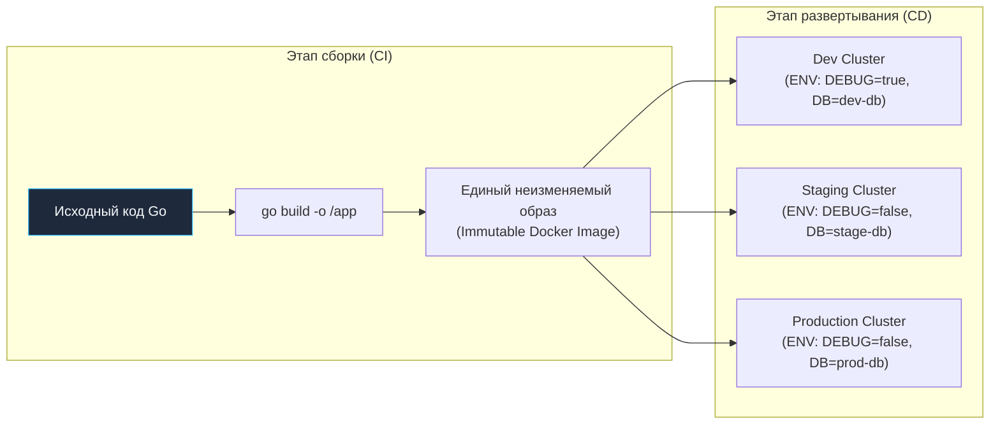
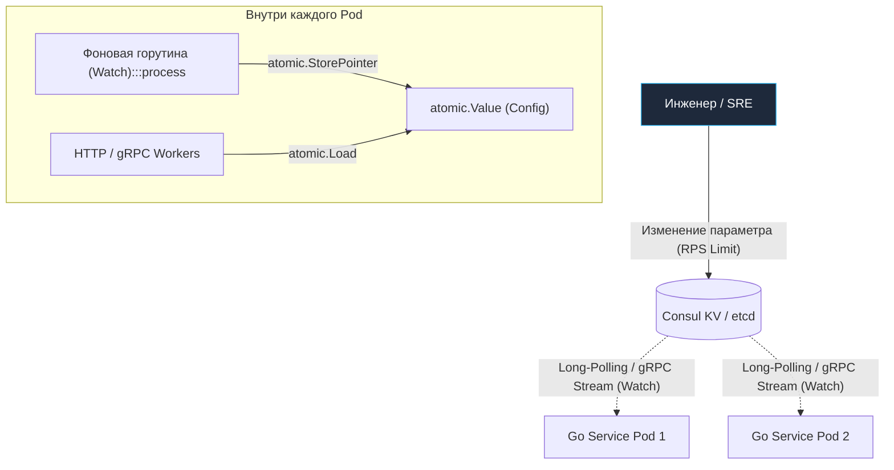

В уютном мире небольших монолитных приложений управление конфигурацией нередко сводилось к единственному файлу `config.yaml`, лежащему рядом с исполняемым файлом, или — что греха таить — к константам, захардкоженным прямо в исходном коде. Пока проект обслуживался одной командой и жил на паре серверов, с этим можно было мириться.

Но когда система разрастается до 50 независимых микросервисов, каждый из которых развернут в десятках реплик на трех разных окружениях (development, staging, production), ручная правка файлов превращается в кошмар. Возникает классический феномен **Configuration Drift (конфигурационный дрейф)**: никто в команде точно не знает, с какими таймаутами, строками подключения и флагами функциональности реально запущен конкретный инстанс в кластере.

**Configuration Management (Управление конфигурацией)** — это инженерный процесс централизованного контроля, версионирования и безопасной доставки параметров системы, гарантирующий полную воспроизводимость сред и предсказуемость поведения сервисов.



---

## 1. Философия 12-Factor App

Фундаментальный канон облачной архитектуры, сформулированный в методологии The Twelve-Factor App (Фактор III), гласит: **«Храните конфигурацию в среде окружения»**.

* **Разделение кода и настроек:** Исполняемый файл и Docker-образ должны быть абсолютно нейтральны к окружению. Один и тот же скомпилированный бинарник обязан без пересборки запускаться как на ноутбуке разработчика, так и в боевом кластере Kubernetes. Все различия (адреса очередей, лимиты пулов соединений, порт сокета) передаются снаружи через **переменные окружения (Environment Variables)**.
* **Go-way:** В стандартной библиотеке Go доступен примитив `os.LookupEnv` (или `os.Getenv`). В промышленном коде принято использовать проверенные временем библиотеки вроде `caarlos0/env` (декодирование переменных в структуры через теги) или универсальный `viper`.

---

## 2. Централизованные хранилища (Dynamic Config)

Когда количество настроек и микросервисов переваливает за сотни, передавать всё полотно переменных через манифесты `ConfigMap` становится неудобно. Для динамических распределенных сред применяются централизованные распределенные хранилища конфигураций: **HashiCorp Consul**, **etcd**, **Apache ZooKeeper** или **AWS AppConfig**.



**Ключевые преимущества централизованного подхода:**
* **Единый источник правды:** Все параметры кластера собраны в одном надежном реестре с поддержкой аудита и RBAC.
* **Динамическое обновление без рестарта (Hot Reload):** С помощью механизма подписок (`Consul Watch` или etcd watch API) сервис мгновенно узнает об изменении параметров без перезапуска процесса, прогрева кэшей и сброса активных клиентских соединений.
* **Атомарность и версионирование:** Возможность мгновенного отката на предыдущую ревизию (Rollback), если новое значение таймаута привело к каскадной деградации базы данных.

---

## 3. Секреты — это не конфиги

Критическая ошибка начинающих архитекторов — относиться к секретам как к обычным конфигурационным параметрам.

Пароли от баз данных, приватные TLS-сертификаты, токены доступа к платежным шлюзам и ключи шифрования категорически запрещено передавать в открытом виде в текстовых файлах, хранить в Git-репозиториях или пробрасывать через общедоступные переменные окружения, которые легко утекают в дампы процессов (`/proc/$PID/environ`) и логи трейсинга.

Для безопасного управления секретами используются специализированные менеджеры: **HashiCorp Vault**, **AWS Secrets Manager**, **Google Secret Manager**.
* **Vault в экосистеме Go:** При старте сервис аутентифицируется в Vault (например, используя Kubernetes ServiceAccount токен), получает временный токен аренды с ограниченным TTL и вычитывает расшифрованные секреты напрямую в оперативную память. Секреты не сохраняются на диск, регулярно ротируются и защищены сквозным аудитом обращений.

---

## 4. Mechanical Sympathy: Парсинг и типизация в Go

Go — строго типизированный язык со статической проверкой типов. Попытка парсить конфигурационные параметры в неструктурированные динамические словари вида `map[string]interface{}` лишает вас главной защиты языка — компилятора.

Идиоматичный подход — парсить внешние параметры в строго типизированную структуру в момент инициализации приложения по принципу **Fail-Fast**: если обязательный параметр отсутствует или имеет некорректный формат, сервис обязан немедленно упасть при старте с информативным логом, а не завершаться аварийно посреди ночи при попытке первого сетевого вызова.

```go
package main

import (
	"log"
	"sync/atomic"

	"github.com/caarlos0/env/v11"
)

// AppConfig хранит строго типизированные параметры
type AppConfig struct {
	Port     int    `env:"PORT" envDefault:"8080"`
	DBAddr   string `env:"DB_ADDR,required"`
	LogLevel string `env:"LOG_LEVEL" envDefault:"info"`
}

// ConfigManager управляет потокобезопасным горячим обновлением
type ConfigManager struct {
	current atomic.Value // хранит *AppConfig
}

func NewConfigManager() (*ConfigManager, error) {
	cfg := AppConfig{}
	// Парсинг тегов env с валидацией обязательных полей
	if err := env.Parse(&cfg); err != nil {
		return nil, err
	}

	cm := &ConfigManager{}
	cm.current.Store(&cfg)
	return cm, nil
}

// Get возвращает актуальный снимок конфигурации за 1 такт процессора без мьютексов
func (cm *ConfigManager) Get() *AppConfig {
	return cm.current.Load().(*AppConfig)
}

// UpdateConfig вызывается обработчиком событий Consul Watch / Viper
func (cm *ConfigManager) UpdateConfig(newCfg *AppConfig) {
	cm.current.Store(newCfg)
	log.Printf("Конфигурация успешно обновлена на лету: LogLevel=%s", newCfg.LogLevel)
}
```

> [!info] Под капотом: Lock-free чтение с atomic.Value
> В высоконагруженных сетевых сервисах, обрабатывающих сотни тысяч запросов в секунду, горутины непрерывно обращаются к параметрам конфигурации (лимиты таймаутов, флаги фичей). Использование стандартного `sync.RWMutex` для каждого обращения создает жесткую конкуренцию за кэш-линию процессора (Cache Line Bouncing) протокола когерентности MESI.
> 
> Использование `atomic.Value` позволяет реализовать паттерн Copy-on-Write: фоновая горутина обновляет указатель на новую структуру за одну атомарную процессорную инструкцию `LOCK CMPXCHG`, а рабочие горутины читают данные без блокировок и ожидания в очередях.

> [!tip] Собеседование
> **Вопрос:** Как организовать безопасное конфигурирование микросервисов в Kubernetes?
> **Ответ:** Архитектурный оптимум строится на разделении ответственности:
> 1. **Нечувствительные параметры:** Описываются в манифестах `ConfigMap` и монтируются в поды как переменные окружения или файлы.
> 2. **Секреты:** Хранятся в зашифрованном виде во внешнем хранилище (HashiCorp Vault / AWS Secrets Manager) и инжектируются в контейнер через специализированные CSI-драйверы (Secrets Store CSI Driver) прямо в оперативную память (tmpfs).
> 3. **Валидация:** В `main()` на старте сервиса выполняется строгая валидация (Fail Fast). Если отсутствует критичный адрес (например, `REDIS_ADDR`), процесс возвращает ненулевой код выхода, предотвращая перевод нерабочего пода в статус Ready.

---

## 5. Итог

1. **Immutable Build:** Код и артефакты сборки неизменяемы. Любая вариативность между окружениями инжектируется исключительно через переменные среды.
2. **Строгая типизация:** В Go категорически избегайте `map[string]interface{}`. Конфигурация обязана парситься в строго типизированные структуры при старте с контролем обязательных полей.
3. **Безопасность:** Конфигурация разделяется на публичные параметры (Consul/ConfigMap) и конфиденциальные данные (HashiCorp Vault). Секретам не место в репозиториях и логах.
4. **Fail-Fast валидация:** Проверяйте корректность всех критических настроек на старте, чтобы сервис не упал посреди рабочего дня из-за опечатки в названии хоста `REDIS_ADDR`.

Подробному разбору того, как надежно изолировать, шифровать, динамически генерировать и ротировать конфиденциальные ключи и сертификаты в облачной среде, посвящена заключительная статья подраздела: [[10. Secrets management]].