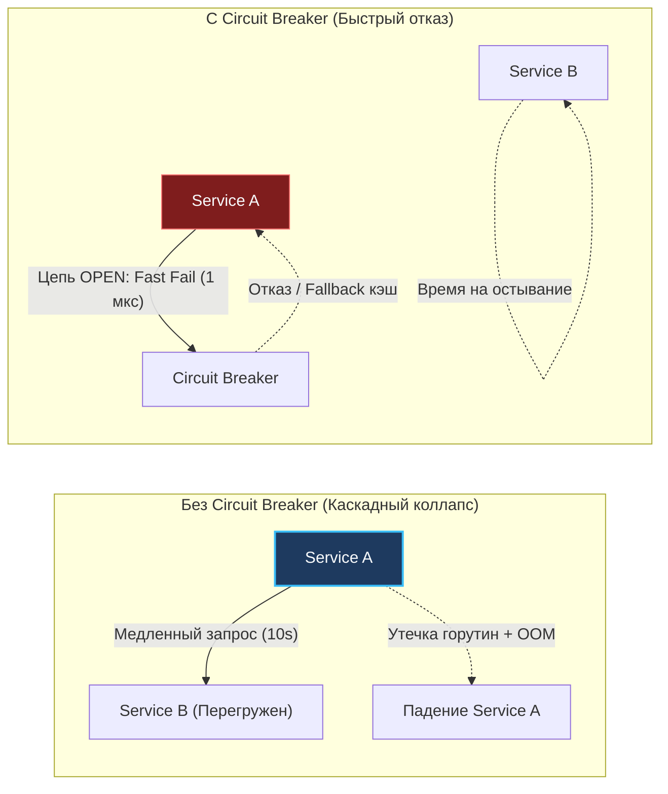
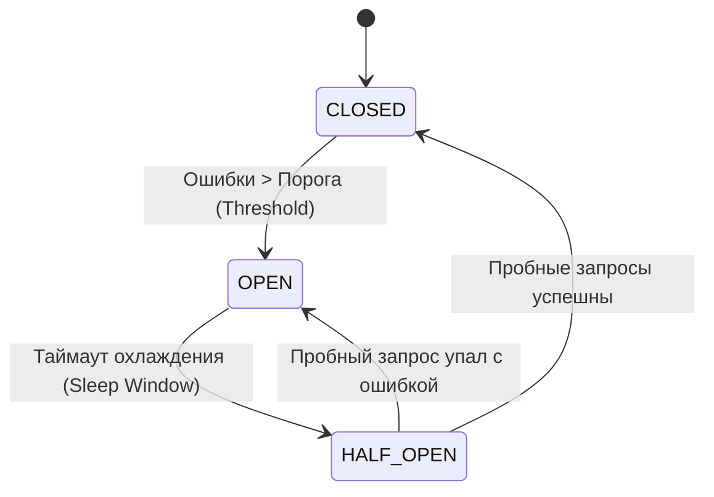
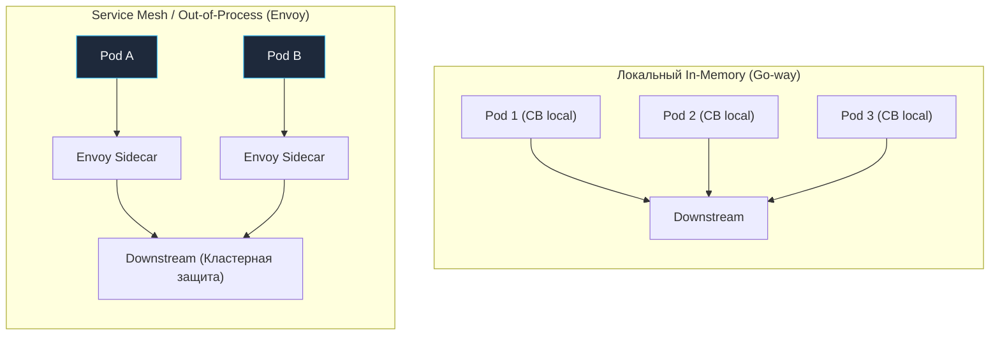

## Предохранитель для вашего бэкенда

Представьте старую квартиру, в которой одновременно включили электрический чайник, микроволновку, масляный радиатор и мощную стиральную машину. Медный провод в стене мгновенно раскаляется, изоляция начинает плавиться, и если бы в щитке не стоял электромагнитный автомат — пожар был бы неизбежен. Автомат с громким щелчком размыкает электрическую цепь, жертвуя сиюминутным комфортом ради спасения всего дома.

В распределенных системах мы сталкиваемся с абсолютно идентичным физическим феноменом. Когда один из удаленных сервисов или реплика базы данных начинает задыхаться от нагрузки, медленно отвечать или выбрасывать ошибки, слепое продолжение отправки запросов превращается в преступление. Вы не просто окончательно добиваете «лежачего», вы провоцируете каскадный отказ (Cascading Failure), утягивающий на дно всю цепочку вызывающих микросервисов.

Паттерн **Circuit Breaker (Предохранитель / Автоматический выключатель)** защищает архитектуру от лавинообразных перегрузок, реализуя фундаментальный принцип надежности: **Fast Failure (мгновенный отказ)**.

В этой статье мы подробно разберем, как именно отсутствие предохранителя разрушает Go-приложения на уровне операционной системы, процессорных кэшей и рантайма, как грамотно реализовать этот механизм и какие коварные ловушки ждут инженера на собеседованиях по System Design.



---

## Анатомия катастрофы: Что если Circuit Breaker нет?

Представим классический сценарий частичного сбоя, рассмотренный в статье [[4. Partial failure]]: ваш Go-сервис (Service A) обращается по HTTP/REST или gRPC к внешнему биллингу или сервису отзывов (Service B). Сервис B внезапно деградировал: вместо привычных 50 мс ответы зависают на 10 секунд (вплоть до предельного таймаута сокета).

Если в кодовой базе нет предохранителя, внутри рантайма Go разворачивается следующая трагедия:

1. **Лавинообразный рост числа горутин (Goroutine Leak):** В сетевой модели Go каждый входящий запрос обслуживается в собственной легковесной горутине. Если Service B перестал вовремя отвечать, горутины в Service A не могут завершиться и зависают в состоянии ожидания сетевого ввода-вывода. При входящем потоке всего в 10 000 RPS за 10 секунд ожидания в памяти скапливается 100 000 висящих горутин.
2. **Колоссальное давление на память и сборщик мусора (GC Pressure):** Минимальный размер стека горутины в Go составляет 2 КБ. 100 000 горутин — это минимум 200 МБ чистой памяти только под стеки, не считая аллокаций структур запросов, заголовков, контекстов `context.Context` и буферов сокетов. Сборщик мусора Go (Garbage Collector) вынужден при каждом цикле STW и фоновом сканировании обходить все эти сотни тысяч «живых» объектов, расходуя львиную долю ядер CPU на бесполезную работу.
3. **Исчерпание сетевых дескрипторов (FD Exhaustion):** Каждый незавершенный исходящий HTTP-запрос удерживает открытый TCP-сокет в ядре Linux. Лимит файловых дескрипторов процесса (`ulimit -n`, по умолчанию часто 1024 или 65535) и диапазон эфемерных портов ядра (`ip_local_port_range`) мгновенно исчерпываются.
4. **Гибель Service A:** Лишенный ресурсов Service A перестает принимать новые входящие подключения (`accept: too many open files`), операционная система выбивает процесс через Linux OOM Killer, и здоровый сервис погибает просто потому, что терпеливо ждал ответа от соседа.

Circuit Breaker решает эту катастрофу радикально: как только количество ошибок или задержек превышает безопасный порог, он **размыкает цепь и полностью прекращает сетевые вызовы**. Все последующие обращения мгновенно завершаются ошибкой (Fast Fail) за доли микросекунды, горутины немедленно завершают работу, сокеты освобождаются, а сборщик мусора остается в зоне комфорта.

---

## Машина состояний Circuit Breaker

В сердце любого предохранителя заложен строгий конечный автомат (Finite State Machine), оперирующий тремя базовыми состояниями:



1. **CLOSED (Цепь замкнута):** Штатный режим работы. Электрический ток и пользовательские запросы свободно текут через автомат. Предохранитель выполняет реальные вызовы downstream-сервиса, непрерывно замеряя процент ошибок (`failure rate`) и скользящее окно запросов.
2. **OPEN (Цепь разомкнута):** Аварийный режим. Процент сбоев или таймаутов превысил критическую планку. Предохранитель блокирует все исходящие запросы на корню: функция-обертка немедленно возвращает клиенту ошибку `ErrCircuitBreakerOpen` (или `ErrOpenState`), вообще не обращаясь к сетевому стеку. Больной сервис получает передышку для восстановления.
3. **HALF-OPEN (Цепь полуоткрыта):** Режим зондирования. По истечении таймера охлаждения (Sleep Window, например 10–30 секунд) автомат осторожно пропускает строго ограниченное число пробных запросов (обычно 1–3 штуки). 
   - Если пробные запросы завершились успехом — сервис выздоровел, цепь переходит в **CLOSED**, счетчики сбрасываются.
   - Если хотя бы один пробный запрос падает с ошибкой — цепь немедленно возвращается в **OPEN** еще на один цикл ожидания.

> [!info] Под капотом
> В состоянии OPEN выигрыш в производительности и ресурсах носит фундаментальный характер. Вместо выделения буферов, системного вызова `syscall` ядра Linux для записи в сокет и переключения контекста с парковкой горутины в сетевом поллере `netpoll`, процессор выполняет всего несколько инструкций сравнения в оперативной памяти и возвращает ошибку `error` за 2–5 наносекунд.

---

## Реализация на Go: Идиомы и производительность

В производственной среде стандартом де-факто для Go является библиотека `github.com/sony/gobreaker`. Однако, чтобы писать по-настоящему надежные системы, необходимо понимать, как именно синхронизируется состояние автомата в условиях жесточайшего конкурентного доступа тысяч горутин.

### Наивная реализация (и почему она плоха)

Классическая ошибка начинающих инженеров — поместить всю логику подсчета и переключения автомата под обычный взаимный замок `sync.Mutex`.

```go
// Антипаттерн: примитивная синхронизация в горячем сетевом пути
type NaiveCB struct {
    mu       sync.Mutex
    failures int
    state    State
}

func (cb *NaiveCB) Execute(req func() error) error {
    cb.mu.Lock()
    if cb.state == StateOpen {
        cb.mu.Unlock()
        return errors.New("circuit breaker is OPEN")
    }
    cb.mu.Unlock()

    err := req()

    cb.mu.Lock()
    defer cb.mu.Unlock()
    if err != nil {
        cb.failures++
        // смена стейта...
    }
    return err
}
```

**Проблема механического сочувствия (Mechanical Sympathy):** В высоконагруженном микросервисе Circuit Breaker находится на критическом пути исполнения (Hot Path). Десятки тысяч горутин начинают яростно конкурировать за один-единственный мьютекс. Возникает разрушительный Lock Contention:
- Ядра процессора тратят такты на спинлоки, а планировщик Go вынужден постоянно парковать (`goready` / `gopark`) горутины в системные очереди ожидания.
- Протокол когерентности кэшей процессора (MESI) раскаляет шину памяти: строка кэша (Cache Line, 64 байта), содержащая счетчик мьютекса, непрерывно инвалидируется между L1/L2 кэшами разных процессорных ядер (Cache Line Bouncing).

### Правильный подход: Атомарные операции

Промышленные решения (включая реализацию `sony/gobreaker`) стремятся максимально изолировать чтение состояния от блокировок. Состояния автомата (Closed, Open, Half-Open) и счетчики обращений синхронизируются через атомарные инструкции процессора (`atomic.LoadInt32`, `atomic.AddUint64`, `atomic.CompareAndSwapInt32`), а эксклюзивная блокировка захватывается на микроскопические наносекунды исключительно в момент фазового перехода автомата.

Рассмотрим идиоматичный пример использования библиотеки `gobreaker` в сетевом клиенте Go:

```go
package main

import (
	"errors"
	"fmt"
	"io"
	"net/http"
	"time"

	"github.com/sony/gobreaker"
)

var breaker *gobreaker.CircuitBreaker

func init() {
	settings := gobreaker.Settings{
		Name:        "HTTP-Client-Protection",
		MaxRequests: 2,                // Сколько запросов пропустить в Half-Open
		Interval:    30 * time.Second, // Окно сброса счетчиков в состоянии Closed
		Timeout:     10 * time.Second, // Таймаут нахождения в Open до попытки зондирования
		ReadyToTrip: func(counts gobreaker.Counts) bool {
			// Открываем цепь, если сделано не менее 10 запросов и процент ошибок >= 50%
			failureRatio := float64(counts.TotalFailures) / float64(counts.Requests)
			return counts.Requests >= 10 && failureRatio >= 0.5
		},
		OnStateChange: func(name string, from gobreaker.State, to gobreaker.State) {
			fmt.Printf("Circuit Breaker [%s] изменил состояние: %s -> %s\n", name, from, to)
		},
	}

	breaker = gobreaker.NewCircuitBreaker(settings)
}

// SafeCall выполняет сетевой запрос под защитой предохранителя
func SafeCall(url string) ([]byte, error) {
	// Execute перехватывает управление и контролирует вызов целевой функции
	body, err := breaker.Execute(func() (interface{}, error) {
		resp, err := http.Get(url)
		if err != nil {
			return nil, err
		}
		defer resp.Body.Close()

		// Классифицируем ошибки: 5xx считаются падением бэкенда
		if resp.StatusCode >= 500 {
			return nil, fmt.Errorf("downstream 5xx status: %d", resp.StatusCode)
		}

		return io.ReadAll(resp.Body)
	})

	if err != nil {
		// Проверяем, был ли вызов заблокирован самим предохранителем
		if errors.Is(err, gobreaker.ErrOpenState) {
			// Fast Failure: цепь разомкнута! Мгновенно отдаем запасной вариант
			return nil, fmt.Errorf("circuit breaker OPEN: быстрый отказ без сетевого вызова")
		}
		return nil, err
	}

	return body.([]byte), nil
}
```

---

> [!tip] Собеседование
> **Вопрос:** Как ваша система должна реагировать, если Circuit Breaker переходит в состояние `ErrOpenState`?
> **Ответ:** Старший инженер никогда не отвечает «просто возвращаем 500 пользователю». Вызов Circuit Breaker обязан сопрягаться с паттерном [[7. Graceful degradation]] (Плавная деградация) и механизмами Fallback:
> 1. Если упал сервис персональных рекомендаций — отдаем статический топ популярных товаров из Redis или локальной памяти.
> 2. Если упал сервис расчетных скидок — считаем заказ по базовой цене без учета бонусов, сохраняя возможность покупки.
> 3. Если упала внешняя аналитика — отбрасываем событие в асинхронный локальный лог.  
> Система частично деградирует по функциональности, но остается на 100% доступной для выполнения ключевых бизнес-операций.

---

## Архитектурные ловушки (Gotchas)

### 1. Circuit Breaker vs Retry
Паттерн [[2. Retry и backoff]] (повтор запросов) и Circuit Breaker решают противоположные задачи. Retry целенаправленно бомбардирует сервис повторными запросами при временных сбоях. Circuit Breaker стремится оградить умирающий сервис от любых обращений.

**Как их гармонично подружить?**  
Политика повторных попыток (Retry) всегда должна находиться **внутри** контура Circuit Breaker. Если предохранитель зафиксировал состояние `OPEN`, любые попытки `Retry` обязаны быть немедленно прерваны. Нет никакого инженерного смысла повторять попытку, которая заведомо обречена на сброс.

### 2. Игнорирование бизнес-ошибок
Самая опасная ошибка конфигурации — считать любую ошибку поводом для размыкания цепи.

Если удаленный платежный шлюз отвечает статусом `400 Bad Request` (клиент ввел некорректный CVC) или `403 Forbidden` (истек срок действия токена пользователя), это означает, что сервис чувствует себя прекрасно и штатно обрабатывает бизнес-валидацию! 

Если вы будете инкрементировать счетчик отказов Circuit Breaker при получении клиентских ошибок 4xx, один ботнет или пользователь с кривым скриптом, спамящий невалидными запросами, легко выбьет предохранитель и отключит платежи для всех легитимных клиентов сервиса.

**Железное правило:** В счетчик предохранителя засчитываются исключительно инфраструктурные сбои: коды ответов `5xx`, сетевые разрывы соединения (Connection Reset), дедлайны `context.DeadlineExceeded` и сетевые таймауты (см. [[3. Timeout]]).

### 3. Локальный vs Распределенный Circuit Breaker

В облачном кластере Kubernetes ваше приложение развернуто в виде 100 независимых подов. Допустим, порог срабатывания предохранителя настроен на 10 ошибок подряд.

Если внешний сервис ляжет, каждый из 100 подов сделает по 10 неудачных запросов, прежде чем его собственный локальный автомат перейдет в состояние `OPEN`. В результате лежащий сервис получит 1000 добивающих ударов по сети!



* **Локальный In-Memory CB:** Работает в оперативной памяти каждого процесса на чистых атомиках Go. Нулевой оверхед по сети, максимальная надежность (нет внешних зависимостей). Является стандартным выбором для 95% проектов на Go. Порог настраивается с поправкой на число реплик.
* **Распределенный CB (через Redis):** Хранит счетчики глобально. Создает жесткую зависимость от доступности Redis и добавляет 1–2 мс сетевой задержки на каждый чих.
* **Service Mesh (Envoy / Istio):** Переносит логику Circuit Breaking на уровень L7-прокси (sidecar), централизованно собирая статистику на уровне кластера и снимая эту заботу с прикладного Go-кода.

---

## Итог

1. **Fast Failure спасает кластер:** Circuit Breaker предотвращает каскадный коллапс инфраструктуры, сбрасывая вызовы к деградирующим сервисам за микросекунды и сберегая горутины, сокеты и процессорное время.
2. **Три состояния автомата:** CLOSED (нормальный пропуск), OPEN (полная изоляция и быстрый отказ), HALF-OPEN (контрольное зондирование жизнеспособности).
3. **Механическое сочувствие:** Промышленные реализации опираются на неблокирующие операции `atomic`, исключая Cache Contention в критическом пути сетевых вызовов.
4. **Комплексная защита:** Предохранитель обязан дополняться механизмами Graceful Degradation и Fallback, превращая фатальные отказы в незаметное для пользователей снижение функциональности.

В следующей статье мы подробно изучим инструмент, неразрывно связанный с вызовами в распределенных системах: [[2. Retry и backoff]], и выясним, как случайный разброс времени (Jitter) предотвращает так называемый «шторм повторов», способный уничтожить восстанавливающийся сервис.