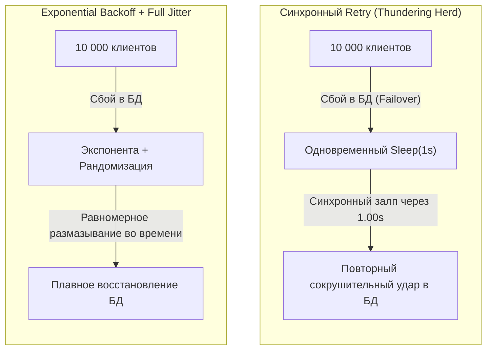
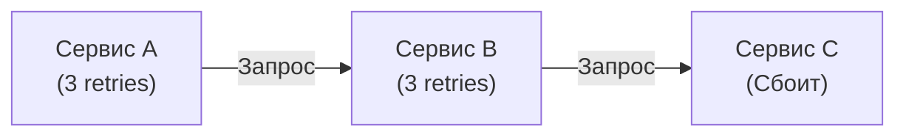

## Искусство не сдаваться (но делать это умно)

В предыдущей статье мы исследовали [[1. Circuit breaker]] — архитектурный предохранитель, который бескомпромиссно заявляет: «Сервис перегружен, цепь разорвана, не бей лежачего». Но в реальной жизни распределенных систем далеко не каждый сетевой сбой означает катастрофический отказ инфраструктуры.

Пакет в виртуальной сети облака может потеряться из-за кратковременной перестройки маршрутов в SDN, база данных PostgreSQL может на 10 миллисекунд поймать взаимную блокировку транзакций (Deadlock), а под в Kubernetes — перезапускаться при плановом накате релиза. Если при первой же мимолетной заминке сразу возвращать пользователю красный экран с ошибкой — это откровенно плохой инженерный дизайн и разрушенный пользовательский опыт (UX).

Мы обязаны попытаться еще раз. Паттерн **Retry (Повторные попытки)** предназначен для прозрачного сглаживания временных, транзитных (transient) сетевых аномалий. 

Однако реализация повторов «в лоб» превращает ваше приложение в мощнейшее оружие массового поражения: вместо спасения системы вы собственноручно организуете сокрушительную DDoS-атаку на собственную базу данных. В этой статье мы разберем физику таймингов, математику случайного рассеивания нагрузки, внутреннее устройство таймеров в рантайме Go и ключевые ловушки проектирования.



---

## Наивный Retry и Thundering Herd Problem

Посмотрим на код, который часто пишут начинающие разработчики:

```go
// Антипаттерн: примитивный фиксированный Retry
func BadRetry(do func() error) error {
    var err error
    for i := 0; i < 3; i++ {
        if err = do(); err == nil {
            return nil
        }
        time.Sleep(1 * time.Second) // Задержка ровно в 1 секунду
    }
    return err
}
```

В чем кроется скрытая угроза этого простого цикла?

Представьте, что кластер СУБД или балансировщик кратковременно «моргнул» (произошел Failover мастера на 2–3 секунды). В этот момент у вас работало 10 000 параллельных запросов. Все 10 000 горутин одновременно получают сетевую ошибку, синхронно вызывают `time.Sleep` ровно на одну секунду, одновременно просыпаются через 1000 миллисекунд и **единым плотным фронтом** обрушиваются на только что поднявшуюся базу данных!

База данных, едва начавшая прогревать кэши и открывать пулы соединений, мгновенно захлебывается и падает снова. Этот кошмар архитекторов называется **Thundering Herd Problem (Проблема стада бизонов)**: фиксированные, регулярные интервалы повторов синхронизируют независимых клиентов в мощные резонансные волны нагрузки.

---

## Математика спасения: Exponential Backoff и Jitter

Чтобы разорвать фазовую синхронизацию клиентов и дать деградирующему сервису время на плавное «дыхание», в распределенных системах применяют комбинацию двух математических инструментов:

### 1. Exponential Backoff (Экспоненциальная задержка)

Вместо константного интервала время ожидания перед каждым следующим повтором увеличивается экспоненциально в зависимости от номера попытки.

Каноническая формула: `Wait = Base * 2^Attempt` (или в математической записи $\text{Wait} = \text{Base} \times 2^{\text{Attempt}}$).

Где:
* Попытка 0: $\text{Base} \times 2^0 = 100\text{ мс}$
* Попытка 1: $\text{Base} \times 2^1 = 200\text{ мс}$
* Попытка 2: $\text{Base} \times 2^2 = 400\text{ мс}$
* Попытка 3: $\text{Base} \times 2^3 = 800\text{ мс}$

Экспонента быстро раздвигает временные рамки: если downstream-сервис испытывает затяжные трудности, мы не забиваем его канал, а кратно снижаем частоту запросов.

### 2. Jitter (Джиттер / Случайный разброс)

Одной лишь экспоненциальной задержки недостаточно. Если 10 000 запросов споткнулись в один момент времени $t_0$, то через 100 мс они вновь придут вместе, затем через 200 мс снова ударят вместе. Резонанс сохраняется.

Нам необходим контролируемый хаос. **Jitter** добавляет случайную энтропию в расчетную формулу ожидания.

Исследования распределенных систем (популяризированные инженерами Amazon Web Services) доказали максимальную эффективность алгоритма **Full Jitter**:
$$\text{Wait} = \text{random}(0, \, \min(\text{MaxDelay}, \, \text{Base} \times 2^{\text{Attempt}}))$$

```mermaid
flowchart TD
    Req["Входящий запрос"] --> Call["1. Сетевой вызов сервиса"]
    Call --> IsOK{"2. Успех?"}
    IsOK -->|Да| ExitOK["Возврат результата"]
    IsOK -->|Нет| IsTransient{"3. Ошибка транзитная?"}
    
    IsTransient -->|Нет (4xx / Fatal)| Fail["Fast Fail: Отказ без повторов"]
    IsTransient -->|Да (5xx / Timeout)| Limit{"4. Лимит попыток?"}
    
    Limit -->|Исчерпан| FailMax["Возврат финальной ошибки"]
    Limit -->|Есть запас| Backoff["5. Расчет Full Jitter:<br/>rand(0, Base * 2^attempt)"]
    
    Backoff --> Sleep["6. Ожидание через time.NewTimer<br/>с проверкой ctx.Done()"]
    Sleep --> Call
```

Случайный разброс по диапазону от нуля до текущей экспоненциальной границы превращает узкий смертоносный пик нагрузки в ровный, легко перевариваемый распределенный поток.

---

## Production-Ready реализация на Go

Промышленный механизм повторов обязан удовлетворять трем строгим критериям:
1. Поддерживать отмену через `context.Context` (если пользователь закрыл вкладку или сработал общий дедлайн, повторы должны немедленно прекратиться).
2. Исключать утечки памяти в таймерах рантайма.
3. Различать транзитные ошибки от перманентных.

```go
package retry

import (
	"context"
	"errors"
	"fmt"
	"math/rand/v2"
	"net"
	"time"
)

// Config задает параметры политики повторов
type Config struct {
	MaxRetries int           // Максимальное число попыток (например, 3)
	BaseDelay  time.Duration // Базовый интервал (например, 100ms)
	MaxDelay   time.Duration // Верхний потолок ожидания (например, 3s)
}

// IsTransient проверяет, является ли сбой временным
func IsTransient(err error) bool {
	if err == nil {
		return false
	}

	// Ошибки сети и временные таймауты подлежат повтору
	var netErr net.Error
	if errors.As(err, &netErr) && (netErr.Timeout() || netErr.Temporary()) {
		return true
	}

	// Дополнительно: здесь проверяются HTTP 502 Bad Gateway, 503, 504
	return true
}

// Do выполняет переданную функцию с защитой Exponential Backoff + Full Jitter
func Do(ctx context.Context, cfg Config, fn func(ctx context.Context) error) error {
	var lastErr error

	for attempt := 0; attempt < cfg.MaxRetries; attempt++ {
		// Проверяем контекст перед каждой попыткой
		if err := ctx.Err(); err != nil {
			return err
		}

		lastErr = fn(ctx)
		if lastErr == nil {
			return nil // Операция успешно завершилась
		}

		// Если ошибка фатальная (не транзитная), прерываемся без повторов
		if !IsTransient(lastErr) {
			return lastErr
		}

		// Если попытки исчерпаны, возвращаем последнюю ошибку
		if attempt == cfg.MaxRetries-1 {
			break
		}

		// Вычисляем экспоненциальную задержку с джиттером
		delay := calculateBackoff(cfg.BaseDelay, cfg.MaxDelay, attempt)

		// Используем time.NewTimer для строгого контроля над аллокациями памяти
		timer := time.NewTimer(delay)

		select {
		case <-ctx.Done():
			// Обязательно останавливаем таймер, чтобы освободить внутренние структуры
			timer.Stop()
			return ctx.Err()

		case <-timer.C:
			// Время паузы истекло, переходим к следующей итерации
		}
	}

	return fmt.Errorf("исчерпан лимит повторных попыток (%d): %w", cfg.MaxRetries, lastErr)
}

func calculateBackoff(base, max time.Duration, attempt int) time.Duration {
	// Расчет экспоненты: base * 2^attempt со сдвигом битов
	multiplier := 1 << attempt
	exp := float64(base) * float64(multiplier)

	if exp > float64(max) {
		exp = float64(max)
	}

	// Идиоматичный Full Jitter на современном Go math/rand/v2
	// random в диапазоне [0, exp)
	jitter := rand.Float64() * exp
	return time.Duration(jitter)
}
```

> [!info] Под капотом
> **Почему `time.NewTimer` вместо удобного `time.After` или блокирующего `time.Sleep`?**
> 
> Использование `time.After` внутри циклов в высоконагруженном коде — классическая причина скрытой утечки памяти. Метод `time.After(delay)` создает экземпляр `time.Timer` в куче. Если горутина выходит из блока `select` по каналу `ctx.Done()`, созданный таймер **не может быть собран GC** до тех пор, пока не истечет полный интервал `delay`! При тысячах отмененных запросов в секунду миллионы «висящих» структур таймеров перегружают рантайм.
> 
> Паттерн с созданием `time.NewTimer` и явным вызовом `timer.Stop()` гарантирует немедленное удаление таймера из внутренних структур рантайма.
> 
> На уровне планировщика Go: когда горутина зависает в чтении канала `<-timer.C`, рантайм вызывает `runtime.gopark`. Горутина переходит из состояния `_Grunnable` в статус `_Gwaiting` и отцепляется от физического потока ядра операционной системы (M). Системный поток свободен и мгновенно берет на исполнение другие горутины. Сам таймер помещается в локальную процессорную кучу таймеров (P timer heap). Фоновый системный монитор (`sysmon`) или сам P отслеживают наступление системного времени `nanotime()`, будят горутину и переводят её обратно в статус `_Grunnable`. Никаких дорогих блокировок ядра Linux или переключений контекста CPU не происходит.

---

## Архитектурные ловушки (Gotchas)

### 1. Умножение повторов (Retry Amplification)

Представим распределенную цепочку синхронных вызовов между микросервисами: `A -> B -> C`.



Если сервис `C` испытывает затруднения, а в каждом звене бездумно настроено по 3 повтора, то:
1. Сервис `B` попытается вызвать `C` 3 раза.
2. Потерпев неудачу, `B` вернет ошибку сервису `A`.
3. Сервис `A` посчитает ошибку от `B` временной и повторит запрос к `B` еще 2 раза.
4. При каждом таком повторе `B` снова 3 раза ударит по `C`!

В итоге сервис `C` получит $3 \times 3 = 9$ запросов на один клиентский клик. В цепочке из четырех микросервисов глубина умножения достигнет $3^3 = 27$ запросов. Система устраивает самострел (Retry Storm), гарантированно сжигая процессорные ядра и сетевые очереди downstream-сервиса.

**Архитектурное решение:** 
- Повторные попытки должны выполняться **строго на одном уровне абстракции** (обычно на входном API Gateway или внешнем BFF). Внутренние межсервисные вызовы должны сразу возвращать ошибку.
- Использование сквозных «бюджетов повторов» (Retry Budget) через заголовки распределенного контекста, ограничивающих глобальную долю ретраев до 5–10% от общего RPS.

### 2. Идемпотентность — Строгое требование

Повторять можно **исключительно идемпотентные операции**. 

Если вы отправляете запрос `POST /charge` (списание денежных средств с банковской карты), запрос успешно дошел до шлюза банка, деньги списались со счета клиента, но на обратном пути произошел сетевой таймаут сокета — ваш клиент получит ошибку соединения. Если в коде настроен автоматический Retry — со счета спишется двойная сумма! Подробнее этот сценарий разобран в материале [[4. Partial failure]].

> [!tip] Собеседование
> **Вопрос:** Как гарантировать безопасность автоматических повторов для мутирующих запросов (POST/PUT)?
> **Ответ:** Реализацией сквозных **ключей идемпотентности (Idempotency Key)**. Клиентский код перед первой отправкой генерирует уникальный идентификатор транзакции (UUID v4) и передает его в HTTP-заголовке `Idempotency-Key`. 
> Сервер проверяет наличие ключа в распределенном хранилище (Redis/PostgreSQL) внутри атомарной транзакции. Если ключ обрабатывается впервые — транзакция фиксируется. Если тот же ключ приходит повторно в рамках Retry — сервер не выполняет бизнес-логику списания заново, а мгновенно возвращает закэшированный ответ первой успешной транзакции.

### 3. Circuit Breaker + Retry

В надежных распределенных архитектурах Retry всегда выступает клиентом для паттерна [[1. Circuit breaker]]. 

Если удаленный сервис лежит безнадежно, Circuit Breaker переходит в состояние `OPEN`. Очередной вызов целевой функции мгновенно возвращает ошибку `ErrCircuitBreakerOpen`. 

Обработчик `IsTransient` в коде Retry обязан распознавать эту ошибку как **терминальную (не подлежащую повторам)** и немедленно прерывать цикл (Fast Fail). Бесполезно раз за разом прогонять экспоненциальный таймер, когда рубильник питания удаленного сервиса выключен на аппаратном уровне.

---

## Итог

1. **Забудьте про фиксированный Sleep:** Синхронные паузы неизбежно порождают разрушительную проблему Thundering Herd.
2. **Экспоненциальный Backoff + Full Jitter:** Единственный научно обоснованный способ сгладить всплески нагрузки при восстановлении упавших сервисов.
3. **Дисциплина памяти в Go:** Используйте `time.NewTimer` с явным вызовом `timer.Stop()`, чтобы исключить утечки ресурсов при отмене контекста `ctx.Done()`.
4. **Идемпотентность свята:** Повторяйте запросы только при наличии гарантий идемпотентности (`Idempotency-Key`).
5. **Контролируйте каскады:** Избегайте Retry Amplification в цепочках сервисов, настраивая повторы исключительно на внешнем периметре системы.

Мы научились ждать и предпринимать повторные попытки при временных сбоях. Но как долго должен длиться каждый отдельный сетевой вызов до того, как мы признаем его провалившимся? В следующей статье мы разберем критически важный защитный рубеж распределенных систем: [[3. Timeout]], и выясним, почему отсутствие таймаутов остается главной причиной ночных аварий в продакшене.