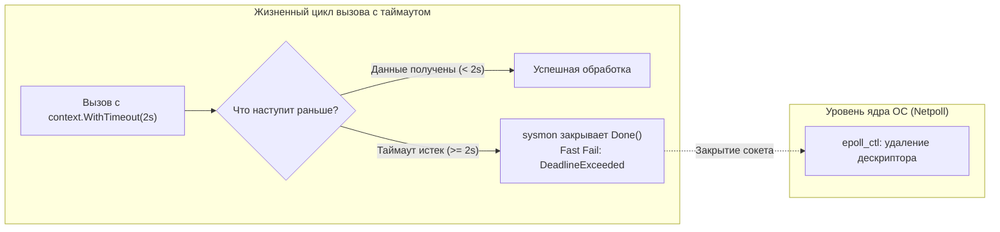
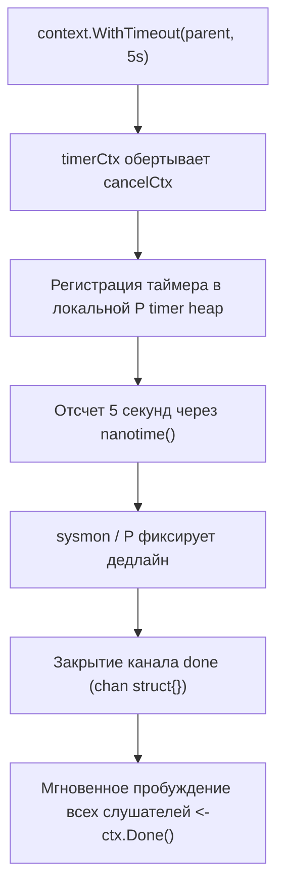
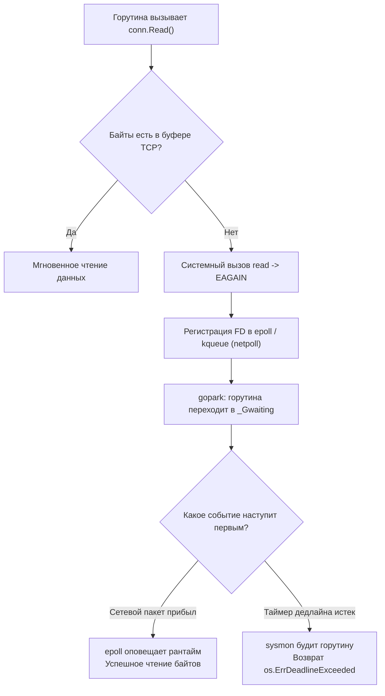

## Время как критический ресурс: Почему бесконечное ожидание убивает

В теории надежности распределенных систем существует жесткое эмпирическое правило, впервые сформулированное в статье [[4. Partial failure]]:  
> *«Медленный ответ в сотни раз опаснее и разрушительнее, чем мгновенная ошибка».*

Быстрый отказ позволяет вызывающей стороне немедленно отреагировать: показать пользователю актуальные закэшированные данные, перенаправить запрос в резервный дата-центр или аккуратно повторить операцию (с соблюдением экспоненциального бэкоффа из [[2. Retry и backoff]]). 

Напротив, медленный ответ подвешивает всю систему в мучительной неопределенности. Горутины застревают в ожидании сетевого ввода-вывода, оперативная память расходуется на удержание структур, сетевые сокеты и файловые дескрипторы блокируются ядром операционной системы. Когда лимиты исчерпываются, сервис падает замертво.

**Timeout (Таймаут)** — это жесткая, бескомпромиссная граница времени, которую система готова отвести на выполнение конкретной операции. Если отведенный интервал истек, вызов принудительно обрывается без каких-либо поблажек.

В языке Go концепция управления временем возведена в абсолют: стандартная библиотека предоставляет элегантные и глубоко интегрированные механизмы через пакет `context` и сетевой поллер `net`. Разберем, как эта магия работает под капотом рантайма и как спроектировать эшелонированную оборону ваших микросервисов.



---

## Под капотом: context.WithTimeout

Главным дирижером жизненного цикла вызовов в Go выступает интерфейс `Context`. Когда в коде вызывается конструктор `ctx, cancel := context.WithTimeout(parent, 5*time.Second)`, рантайм Go запускает сложный механизм взаимодействия между планировщиком, кучей таймеров и памятью:

1. Создается внутренняя структура `timerCtx`, являющаяся оберткой над `cancelCtx`.
2. Функция `time.AfterFunc` регистрирует таймер в локальной куче таймеров текущего логического процессора рантайма (P).
3. Когда системный таймер отсчитывает 5 секунд, фоновый системный монитор рантайма (`sysmon`) или планировщик процессора P обнаруживают наступление дедлайна.
4. Вызывается внутренняя функция `cancel`, которая атомарно меняет статус контекста и закрывает внутренний канал `done` (`chan struct{}`).



> [!info] Под капотом
> Закрытие канала в Go — это мощнейший аппаратный широковещательный механизм (Broadcast). 
> 
> Когда сигнальный канал `done` закрывается, абсолютно **все** горутины, заблокированные в чтении `<-ctx.Done()`, просыпаются одновременно. Чтение из закрытого канала мгновенно возвращает нулевое значение структуры без каких-либо блокировок. Планировщик рантайма Go переводит эти горутины из спящего состояния `_Gwaiting` в очередь готовых к исполнению задач `_Grunnable`. При следующем такте процессора горутина проверяет `ctx.Err()` и получает каноническую ошибку `context.DeadlineExceeded`.

---

## Network Timeouts и Netpoll: Взгляд со стороны ОС

Контекст задает логическую границу на уровне приложения. Но что физически заставляет сетевой сокет в ядре Linux прекратить ожидание байтов из сетевой карты?

Когда среда выполнения Go открывает новое сетевое соединение `net.Conn`, она немедленно переводит системный файловый дескриптор сокета в **неблокирующий режим (Non-blocking I/O)** с помощью флага `O_NONBLOCK`.

Если прикладная горутина вызывает `conn.Read()`, а буфер приема TCP-стека операционной системы пуст:
1. Системный вызов `read` возвращает ошибку `EAGAIN` («ресурс временно недоступен»).
2. Рантайм Go не крутит процессор в холостом цикле. Он регистрирует файловый дескриптор сокета в системном сетевом поллере (`netpoll`), работающем через мультиплексор `epoll` в Linux или `kqueue` в macOS.
3. Горутина паркуется с помощью внутреннего вызова `gopark`, освобождая физический поток операционной системы (M) для других задач.

Когда разработчик устанавливает дедлайн через `conn.SetReadDeadline(time.Now().Add(time.Second))`, рантайм связывает сетевой дескриптор с таймером.



Если таймер дедлайна срабатывает раньше, чем сетевой интерфейс получает TCP-пакет, рантайм принудительно пробуждает горутину, а операция чтения завершается системной ошибкой `os.ErrDeadlineExceeded`.

---

## Ловушки стандартной библиотеки (Gotchas)

### 1. Дефолтный http.Client — путь к катастрофе

Самая распространенная и опасная ошибка начинающих разработчиков на Go — наивное использование стандартного HTTP-клиента или шорткатов пакета `http`:

```go
// АНТИПАТТЕРН: Никогда не используйте в продакшене!
resp, err := http.Get("http://api.service.com/data")
```

Дефолтный `http.Client` инициализируется со значением `Timeout: 0`, что означает **абсолютную бесконечность**. 

Если удаленный бэкенд завис, сетевой коммутатор дропнул TCP FIN пакеты, а операционная система удерживает сокет в состоянии `ESTABLISHED`, ваша горутина будет висеть в памяти **вечно**. Через пару часов пиковой нагрузки тысячи горутин исчерпают оперативную память, и процесс будет уничтожен системным OOM Killer.

> [!warning] Ловушка / Gotcha
> Вы обязаны явно и осознанно конфигурировать таймауты на всех этапах сетевого взаимодействия: от установки TCP-рукопожатия до вычитывания тела ответа `Body`.

**Эталонная конфигурация HTTP-клиента для высоконагруженных систем:**

```go
package client

import (
	"net"
	"net/http"
	"time"
)

// NewProductionHTTPClient создает защищенный клиент с эшелонированными таймаутами
func NewProductionHTTPClient() *http.Client {
	return &http.Client{
		// Общий жесткий таймаут на ВСЮ операцию (Dial + TLS + Request + Read Body)
		Timeout: 10 * time.Second,
		Transport: &http.Transport{
			// Таймаут на установку первичного TCP соединения
			DialContext: (&net.Dialer{
				Timeout:   2 * time.Second,
				KeepAlive: 30 * time.Second,
			}).DialContext,
			// Лимиты пула постоянных соединений
			MaxIdleConns:        100,
			MaxIdleConnsPerHost: 20,
			IdleConnTimeout:     90 * time.Second,
			// Таймаут на завершение криптографического TLS-рукопожатия
			TLSHandshakeTimeout: 3 * time.Second,
			// Максимальное время ожидания первых байтов заголовков ответа
			ResponseHeaderTimeout: 5 * time.Second,
			// Ожидание подтверждения от сервера при передаче заголовка Expect: 100-continue
			ExpectContinueTimeout: 1 * time.Second,
		},
	}
}
```

### 2. Отмена контекста не "убивает" горутину аппаратно

Многие инженеры ошибочно полагают, что если функция получила `ctx` с дедлайном, и время вышло, то компилятор или рантайм Go принудительно остановят горутину наподобие системного сигнала `kill -9` в Linux.

**Это опаснейшее заблуждение.** Отмена контекста в Go носит **исключительно кооперативный характер**.

Закрытие канала `Done()` — это лишь вежливая просьба: «Пожалуйста, заверши работу». Если ваш код выполняет тяжелые вычислительные операции (CPU-bound) внутри цикла и явно не опрашивает `ctx.Done()`, горутина продолжит беспрепятственно работать, сжигая процессорные такты впустую, даже если клиент уже 5 минут назад закрыл браузер!

```go
// ПЛОХО: Горутина крутится в цикле, намертво игнорируя отмену контекста
func HeavyProcessingBad(ctx context.Context, data []byte) {
    for i := 0; i < 1_000_000; i++ {
        computeSHA256(data) // Жжет CPU впустую
    }
}

// ПРАВИЛЬНО: Кооперативная проверка статуса контекста в теле цикла
func HeavyProcessingSafe(ctx context.Context, data []byte) error {
    for i := 0; i < 1_000_000; i++ {
        select {
        case <-ctx.Done():
            // Прерываем работу немедленно, возвращаем context.DeadlineExceeded или Canceled
            return ctx.Err()
        default:
            // Канал открыт — продолжаем выполнение следующей итерации
        }

        computeSHA256(data)
    }
    return nil
}
```

> [!tip] Собеседование
> **Вопрос:** В чем принципиальное отличие между настройкой поля `Client.Timeout` и передачей `context.WithTimeout` в HTTP-запрос?
> **Ответ:** Настройка `Client.Timeout` задает безусловный таймер на весь совокупный цикл жизни запроса (включая установку соединения, редиректы и чтение потока `Body`).
> Передача `context.Context` обеспечивает сквозную управляемость: контекст можно отменить снаружи по множеству независимых триггеров (пользователь нажал кнопку отмены, API Gateway прислал сигнал прерывания, соседняя горутина завершилась ошибкой в `errgroup`). Кроме того, тот же самый `ctx` можно пробросить дальше в драйвер базы данных или в дочерние gRPC-вызовы, мгновенно останавливая всю цепочку распределенной операции при первом сбое.

---

## Server-Side Timeouts: Защита от медленных клиентов

Защите подлежат не только исходящие сетевые клиенты, но и сам входящий сервер. Без строго настроенных таймаутов на сервере система становится беззащитной перед атаками класса **Slowloris**.

Злоумышленник (или мобильный телефон в зоне нестабильного 2G) открывает TCP-сокет и начинает отправлять тело запроса со скоростью один байт в 10 секунд. Если 10 000 таких соединений повиснут одновременно, сервер исчерпает лимит дескрипторов сокетов и перестанет обслуживать легитимный трафик.

В Go сервер настраивается через поля структуры `http.Server`:

```go
server := &http.Server{
    Addr:         ":8080",
    Handler:      router,
    // Предельное время на вычитывание ВСЕГО запроса целиком (включая Body)
    ReadTimeout:  5 * time.Second,
    // Предельное время на чтение заголовков (прямая защита от атак Slowloris)
    ReadHeaderTimeout: 2 * time.Second,
    // Предельное время на формирование и запись ответа клиенту
    WriteTimeout: 10 * time.Second,
    // Время удержания открытого Keep-Alive соединения в режиме ожидания
    IdleTimeout:  120 * time.Second,
}
```

---

## БД и SQL Таймауты

Таймауты жизненно необходимы при взаимодействии с реляционными и NoSQL базами данных (см. [[12. Базы данных]]). Современные драйверы PostgreSQL для Go, такие как `pgx` и классический `pq`, глубоко интегрированы с абстракцией контекста.

Когда при выполнении тяжелого запроса `SELECT` контекст отменяется по истечении дедлайна, драйвер `pgx` не просто выбрасывает ошибку в вызывающий Go-код. Он в фоновом режиме открывает отдельное служебное TCP-соединение к СУБД и отправляет низкоуровневую управляющую команду `pg_cancel_backend()`. 

В результате процесс PostgreSQL немедленно прекращает выполнение дорогостоящего сканирования таблиц и освобождает процессорные ресурсы ядра СУБД, спасая дисковый массив от паразитной нагрузки.

---

## Итог

1. **Никаких нулевых таймаутов:** Каждый сетевой вызов, HTTP-клиент, входящий сервер и запрос к базе данных обязаны иметь явный, обоснованный дедлайн.
2. **Кооперативная природа Go:** Помните, что `context.Context` не прерывает горутины принудительно. Регулярно опрашивайте `<-ctx.Done()` в циклических и ресурсоемких операциях.
3. **Глубокая интеграция с Netpoll:** Сетевые дедлайны сокетов в Go работают с максимальной эффективностью благодаря неблокирующему вводу-выводу ядра Linux (`epoll`) и парковке горутин без расхода процессорных тактов.
4. **Сквозная отмена:** Пробрасывайте `ctx` через все слои микросервиса — от входного веб-хендлера до SQL-запросов и RPC-клиентов.

Однако даже при идеально настроенных таймаутах один внезапный всплеск тяжелых аналитических запросов способен монополизировать все доступные горутины сервиса, парализуя жизненно важные быстрые эндпоинты (такие как Health Checks). Для надежной изоляции ресурсов между независимыми сценариями применяется архитектурный паттерн, который мы разберем в следующей статье: [[4. Bulkhead]].