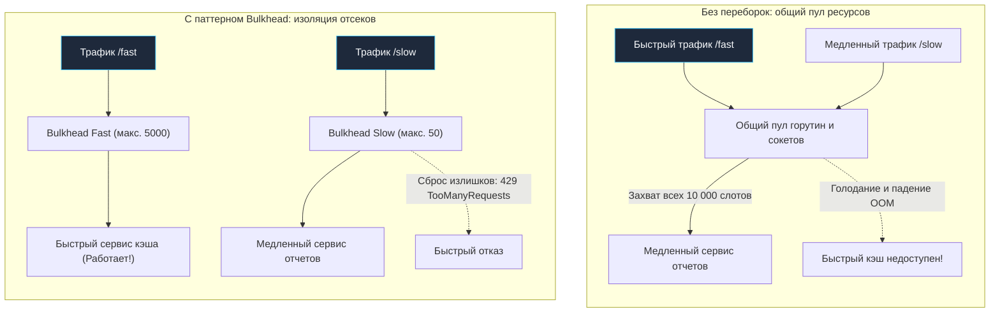

## Переборки непотопляемого бэкенда

Термин **Bulkhead (водонепроницаемая переборка)** пришел в архитектуру распределенных систем из классического кораблестроения. Корпус современной подводной лодки или океанского лайнера разделен прочными поперечными переборками на независимые изолированные отсеки. 

Если судно получает пробоину ниже ватерлинии, морская вода затапливает исключительно один отсек. Корабль теряет часть плавучести и хода, однако водонепроницаемые двери локализуют аварию, и судно остается на плаву. Если бы переборок не существовало — вода беспрепятственно заполнила бы весь трюм от носа до кормы, и корабль неминуемо пошел бы ко дну.

В микросервисной среде мы сталкиваемся в точности с такой же угрозой: один «пробитый» (аномально медленный, подвисший или перегруженный) downstream-сервис способен утопить всю систему, монополизировав общие ресурсы приложения (пулы горутин, сокеты операционной системы, оперативную память и процессорное время Garbage Collector).

В предыдущих главах мы подробно исследовали [[1. Circuit breaker]] (аварийный рубильник по проценту ошибок) и [[3. Timeout]] (временные границы ожидания). Но что делать, если удаленный сервис не возвращает ошибок, а просто работает в 20 раз медленнее обычного из-за всплеска легитимного трафика? Здесь вступает в силу паттерн **Bulkhead**, реализующий физическую изоляцию ресурсов.



---

## Проблема: Разделяемые пулы в Go

В классических корпоративных платформах (Java, .NET) веб-серверы исторически опирались на пулы системных потоков ОС (Thread Pools) фиксированного размера (например, 200 потоков). В такой модели паттерн Bulkhead реализовывался созданием отдельных пулов потоков под каждый внешний сервис.

В среде Go господствует совершенно иная идиома. Рантайм Go стимулирует запуск легковесной горутины на каждый входящий запрос — стандартный пакет `net/http` делает это по умолчанию. Поскольку горутина требует всего около 2 КБ начального стека, у разработчиков возникает опасная иллюзия: «Горутины бесплатны, поэтому пулы и ограничения нам не нужны».

**Однако физические ресурсы операционной системы и рантайма строго конечны.**

Представим типовой API Gateway на Go, обслуживающий два независимых маршрута:
* `/fast` — ультрабыстрое чтение горячих данных из кэша Redis (латентность 2 мс).
* `/slow` — ресурсоемкая генерация аналитических отчетов и выгрузок (латентность 5–10 секунд).

Если сервис аналитики начинает деградировать, клиенты эндпоинта `/slow` остаются висеть в режиме ожидания. В рантайме Go каждую секунду спавнятся тысячи новых горутин. Каждая из них аллоцирует буферы ввода-вывода, удерживает открытый клиентский TCP-сокет и резервирует соединение в пуле `http.Transport`.

Вскоре процесс исчерпывает системный лимит файловых дескрипторов `ulimit -n` или завершается аварийно из-за нехватки оперативной памяти (OOM Killer). В результате входящие запросы к эндпоинту `/fast` перестают обрабатываться, хотя Redis полностью исправен и свободен. Корабль пошел ко дну целиком из-за одной локальной пробоины в отсеке тяжелых отчетов.

---

## Реализация Bulkhead в Go: Семафоры

Поскольку в Go мы не оперируем тяжелыми потоками ОС, архитектурная цель Bulkhead — жестко ограничить **конкурентность (Concurrency)** исполнения конкретного критического блока. 

Идиоматичный и высокопроизводительный способ организации переборки в Go — использование **Семафора (Semaphore)** на базе буферизированного канала (`buffered channel` со структурой `struct{}`).

```go
package bulkhead

import (
	"context"
	"errors"
)

// ErrBulkheadFull сигнализирует о полном заполнении изолированного отсека
var ErrBulkheadFull = errors.New("bulkhead is full: no available slots")

// Bulkhead изолирует ресурсы и ограничивает конкурентность
type Bulkhead struct {
	sem chan struct{}
}

// NewBulkhead создает изолированный отсек с заданной максимальной вместимостью
func NewBulkhead(maxConcurrent int) *Bulkhead {
	return &Bulkhead{
		sem: make(chan struct{}, maxConcurrent),
	}
}

// Execute выполняет целевую функцию строго в рамках выделенной квоты
func (b *Bulkhead) Execute(ctx context.Context, fn func() error) error {
	// Попытка занять свободный слот в отсеке
	select {
	case b.sem <- struct{}{}:
		// Слот успешно захвачен
		// defer гарантирует освобождение слота даже при аварийной панике внутри fn
		defer func() { <-b.sem }()

	case <-ctx.Done():
		// Вызывающий клиент отменил операцию до получения слота
		return ctx.Err()

	default:
		// Fast Failure: отсек переполнен! Мгновенно отказываем, не допуская очереди
		return ErrBulkheadFull
	}

	// Выполняем изолированную полезную нагрузку
	return fn()
}
```

---

## Как это использовать в архитектуре?

В сервисной архитектуре создаются независимые экземпляры `Bulkhead` под каждый внешний сетевой ресурс или разнородные группы хендлеров:

```go
package main

import (
	"errors"
	"net/http"
	"bulkhead"
)

var (
	// Отсек для тяжелых отчетов: не более 50 одновременных горутин
	analyticsBulkhead = bulkhead.NewBulkhead(50)
	// Отсек для быстрого кэша: держит до 5000 одновременных операций
	cacheBulkhead = bulkhead.NewBulkhead(5000)
)

func HandleAnalytics(w http.ResponseWriter, r *http.Request) {
	err := analyticsBulkhead.Execute(r.Context(), func() error {
		// Долгий вызов аналитического сервиса...
		return nil
	})

	if errors.Is(err, bulkhead.ErrBulkheadFull) {
		// Мгновенный ответ: отсек полон, не жжем ресурсы
		http.Error(w, "Сервис аналитики перегружен (Bulkhead Full)", http.StatusTooManyRequests)
		return
	}
}
```

```mermaid
flowchart TD
    classDef process  fill:#1e293b,stroke:#38bdf8,stroke-width:1px,color:#f8fafc
    classDef success  fill:#064e3b,stroke:#34d399,stroke-width:1px,color:#f8fafc
    classDef error    fill:#7f1d1d,stroke:#f87171,stroke-width:1px,color:#f8fafc
    classDef warning  fill:#78350f,stroke:#fbbf24,stroke-width:1px,color:#f8fafc
    classDef entry    fill:#1e3a5f,stroke:#38bdf8,stroke-width:2px,color:#f8fafc
    classDef aux      fill:#334155,stroke:#64748b,stroke-width:1px,color:#f8fafc
    classDef system   fill:#312e81,stroke:#a78bfa,stroke-width:1px,color:#f8fafc
    classDef data     fill:#132d29,stroke:#2dd4bf,stroke-width:1px,color:#f8fafc
    classDef network  fill:#881337,stroke:#fb7185,stroke-width:1px,color:#f8fafc
    classDef accent   fill:#1e1b4b,stroke:#818cf8,stroke-width:1px,color:#f8fafc
    ClientFast["Клиенты /fast"]:::process --> BFast["Bulkhead Fast<br/>Квота: 5000 слотов"]
    ClientSlow["Клиенты /slow"]:::process --> BSlow["Bulkhead Slow<br/>Квота: 50 слотов"]

    BFast -->|Свободно| CacheService["Кэш-сервис (2 мс)"]
    BSlow -->|Свободно (<= 50)| ReportService["Сервис аналитики (10 с)"]
    BSlow -->|Переполнение (> 50)| Fast429["429 Too Many Requests<br/>(Fast Failure)"]
```

---

## Mechanical Sympathy: Почему канал, а не Mutex?

> [!tip] Собеседование
> **Вопрос:** Почему для реализации семафора в Go используют буферизированный канал `chan struct{}`, а не связку `sync.Mutex` со счетчиком `int`?
> **Ответ:** Примитив `sync.Mutex` спроектирован для защиты разделяемых данных от гонок (Data Race), а не для координации жизненного цикла горутин. 
> Если строить семафор на мьютексе, реализация неблокирующего захвата с поддержкой отмены по таймауту (`ctx.Done()`) потребует либо спинлоков, либо сложной конструкции с `sync.Cond`, подверженной дедлокам и утечкам. Конструкция `select` с каналом нативно интегрирована в планировщик рантайма Go и решает эту задачу с максимальной аппаратной эффективностью.

> [!info] Под капотом
> Как именно выполняется инструкция `b.sem <- struct{}{}` на уровне рантайма?
> 
> Внутренняя структура канала `hchan` хранит кольцевой буфер `buf`, счетчик элементов `hchan.qcount` и две очереди ожидания: `recvq` и `sendq` (двусвязные списки блокированных горутин в виде структур `sudog`).
> 
> Поскольку размер пустого типа `struct{}` равен строго **нулю байт**, компилятор Go активирует внутреннюю оптимизацию `elemtype.size == 0`. Рантайм вообще не выделяет память под буфер `buf` в куче! Канал оперирует исключительно как легковесный атомарный целочисленный счетчик слотов.
> 
> Когда отсек заполнен (лимит исчерпан), конструкция `select` с веткой `default` компилируется в оптимизированный неблокирующий вызов рантайма `chanpark`. Рантайм просто атомарно проверяет счетчик. Если свободных мест нет — мгновенно активируется ветка `select default`. Никакой системной парковки горутины через `gopark` не происходит, поток операционной системы (M) не усыпляется, процессорные кэши не сбрасываются. Операция занимает считанные наносекунды!

---

## Продвинутый вариант: Weighted Semaphore

В реальных базах данных операции имеют кардинально разный вес:
- Легкий точечный запрос по первичному ключу (`SELECT * FROM users WHERE id = 1`) расходует 1 условную единицу ресурсов СУБД.
- Тяжелый аналитический отчет с агрегацией (`SELECT ... JOIN ... GROUP BY`) сжигает 10 или 20 единиц пула.

Обычный буферизированный канал `chan struct{}` оперирует неделимыми квантами по 1 слоту. Для взвешенного распределения применяется пакет `golang.org/x/sync/semaphore` (также известный как `x/sync/semaphore`).

```go
package main

import (
	"context"
	"golang.org/x/sync/semaphore"
)

// Выделяем общий весовой бюджет для базы данных: 100 единиц
var dbBulkhead = semaphore.NewWeighted(100)

func ExecuteQuery(ctx context.Context, isHeavy bool) error {
	var weight int64 = 1
	if isHeavy {
		weight = 10 // Тяжелый запрос с JOIN бронирует 10 слотов
	}

	// Захват веса с учетом контекста дедлайна
	if err := dbBulkhead.Acquire(ctx, weight); err != nil {
		return err // Контекст отменился раньше, чем освободились слоты
	}
	defer dbBulkhead.Release(weight)

	// Выполнение запроса в СУБД...
	return nil
}
```

Под капотом `x/sync/semaphore` использует классический мьютекс `sync.Mutex` и список ожидания. Каждая заблокированная горутина аллоцирует локальный сигнальный канал `ready := make(chan struct{})` и засыпает на нем. Когда тяжелая операция освобождает 10 единиц веса, семафор пробуждает ровно столько ожидающих горутин, сколько помещается в освободившийся объем, исключая возникновение Thundering Herd.

---

## Архитектурные ловушки (Gotchas)

### 1. Bulkhead vs Rate Limiter vs Circuit Breaker

На собеседованиях по System Design эти три паттерна часто смешивают. Запомните их строгие границы:

1. **Rate Limiter:** Ограничивает **частоту событий во времени** (например, не более 100 запросов в секунду). Его цель — защитить систему от злоумышленников и DDoS.
2. **Circuit Breaker:** Реагирует на **процент ошибок**. Если удаленный сервис упал и отвечает 500, он разрывает цепь. См. [[1. Circuit breaker]].
3. **Bulkhead:** Ограничивает **конкурентность в текущий момент времени** (не более 50 активных горутин одновременно). Его цель — защитить локальные ресурсы узла (память, пулы соединений, FD) от захвата одним медленным сценарием.

Они выстраиваются в эшелонированную оборону:
`Входящий трафик -> Rate Limiter -> Bulkhead -> Circuit Breaker -> Вызов сети`.

### 2. Подбор лимитов

Главная сложность внедрения Bulkhead — определение числовых значений емкости отсеков.
- Занизите лимит (например, поставите 5) — начнете безосновательно отбрасывать легитимных пользователей.
- Завысите лимит (поставите 20 000) — сервис словит OOM раньше, чем сработает защита переборки.

Емкость отсека рассчитывается на основе фундаментального закона теории очередей — **Закона Литтла (Little's Law)**:
$$\text{Concurrency} = \text{RPS} \times \text{Latency}$$

В коде и расчетах это выражается как `Concurrency = RPS * Latency`.  
Если эндпоинт в пике обслуживает 1000 RPS со средней латентностью 0.1 секунды (100 мс), нормальный уровень параллельно выполняющихся запросов составляет: $1000 \times 0.1 = 100$. Размер отсека `Bulkhead` целесообразно выставить на уровне 130–150 слотов, оставив 30–50% запаса на естественные флуктуации задержек.

---

## Итог

1. **Изоляция сбоев:** Паттерн Bulkhead гарантирует, что деградация одного медленного сервиса не потопит все приложение.
2. **Горутины требуют памяти:** Несмотря на легковесность, тысячи висящих горутин монополизируют память стека, дескрипторы сокетов и пулы `http.Transport`.
3. **Идиоматичный семафор в Go:** Буферизированный канал `chan struct{}` нулевого размера с неблокирующим `select default` обеспечивает минимальные накладные расходы на уровне наносекунд.
4. **Взвешенные переборки:** Для разнородных задач (легкий `SELECT` vs тяжелый аналитический `JOIN`) используется библиотека `golang.org/x/sync/semaphore`.

Мы научились изолировать отсеки ресурсов внутри сервиса. Но что делать, когда наплыв трафика превышает пределы физических возможностей всего сервера в целом, а процессор и память подходят к 100% утилизации? На этот случай применяется жесткая защитная мера сброса балласта: [[5. Load shedding]].