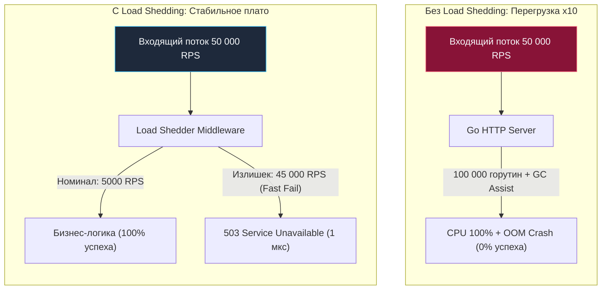
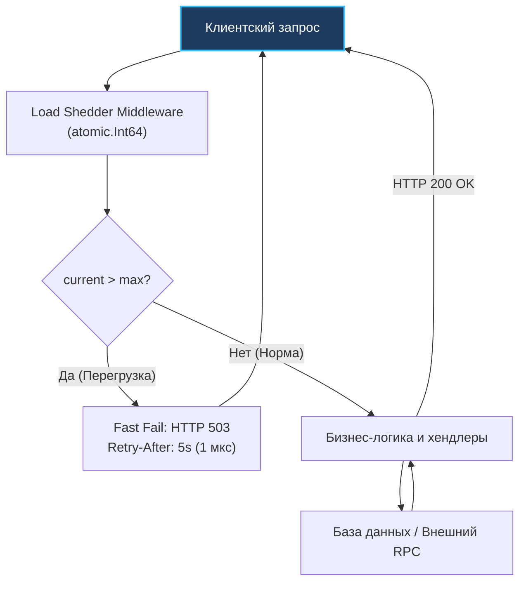

## Сброс балласта: Искусство выживания при перегрузке

Представьте, что вы пилотируете воздушный шар, который попал в нисходящий термический поток и стремительно теряет высоту, рискуя на полной скорости разбиться об острые скалы. У экипажа нет времени проводить совещания и выяснять, почему нагреватель не справляется — нужно немедленно сбросить мешки с песком за борт. Жертвуя балластом, вы облегчаете гондолу, выравниваете траекторию и спасаете жизни пассажиров.

В архитектуре высоконагруженных распределенных систем этот паттерн называется **Load Shedding (Сброс нагрузки / Сброс балласта)**.

Когда сервер захлебывается от лавины входящих запросов, слепая попытка обработать *абсолютно всё* приводит к катастрофе: в результате не будет обработан *ни один запрос*. Приложение сорвется в штопор деградации (Out Of Memory или CPU Starvation) и утянет за собой всю инфраструктуру. 

Load Shedding — это осознанный, математически выверенный и мгновенный отказ в обслуживании избыточной части входящего потока ради того, чтобы сервер мог стабильно, предсказуемо и на максимальной производительности обслуживать свой номинальный максимум полезной нагрузки.



---

## Mechanical Sympathy: Спираль смерти сборщика мусора

Что именно происходит в недрах рантайма Go (в стандартном сетевом стеке `net/http` или `gRPC`), когда входящий трафик внезапно превышает расчетный предел сервера в 5–10 раз?

1. **Безудержный спавн горутин:** Стандартный сервер `http.Server` на каждое принятое операционной системой TCP-соединение незамедлительно выполняет инструкцию `go c.serve(ctx)`. Ядро Linux через `epoll` с легкостью принимает тысячи соединений в секунду, порождая в памяти десятки тысяч конкурирующих горутин.
2. **Взрывной рост аллокаций в куче:** Каждая горутина требует минимум 2 КБ начального стека (способного динамически расти), а также выделяет структуры в куче (Heap) под буферы чтения сокетов, парсинг заголовков, декодирование JSON, контексты и доменные объекты.
3. **Спираль смерти сборщика мусора (GC Death Spiral):** При стремительном заполнении кучи активизируется Garbage Collector. В Go сборщик мусора работает параллельно с полезной нагрузкой (Concurrent Mark and Sweep). Ему необходимо просканировать сотни тысяч указателей на стеках зависших горутин.
4. **Ассистирование аллокациям (Mark Assists) и голодание CPU:** Если прикладные горутины выделяют память быстрее, чем фоновый GC успевает ее сканировать, рантайм принудительно переключает рабочие горутины в режим *Mark Assist*. Вместо обработки запросов горутины начинают тратить процессорные такты на помощь сборщику мусора! Доля полезного CPU падает до нуля, а сквозная задержка (Latency) взлетает до десятков секунд.
5. **Каскадный резонанс:** Из-за колоссальных задержек клиенты массово отваливаются по таймаутам (см. [[3. Timeout]]) и, что хуже всего, инициируют повторные попытки (см. [[2. Retry и backoff]]), утраивая входящий шквал. Сервер окончательно погибает по Out Of Memory.

Load Shedding рубит этот порочный круг в самом зародыше:  
> *«У меня в активной обработке уже находится 1000 запросов. Я не стану принимать 1001-й: я немедленно верну ему `503 Service Unavailable`, сберегая память и процессор для первой тысячи».*

---

## Rate Limiting vs Load Shedding

> [!tip] Собеседование
> **Вопрос:** В чем принципиальная разница между Rate Limiter и Load Shedder?
> **Ответ:** 
> * **Rate Limiter (Ограничение частоты):** Защищает систему от конкретного *потребителя*. Опирается на внешние квоты и политики доступа (например, не более 100 запросов в минуту для API-токена или IP `192.168.1.1`). Решение принимается на основе *идентификатора клиента*.
> * **Load Shedding (Сброс балласта):** Защищает систему *саму от себя*. Опирается на *внутреннее физическое состояние сервера* (утилизация CPU, глубина очередей, количество активных запросов In-flight). Решение о сбросе принимается глобально: если сервер тонет, он безжалостно отбрасывает запросы независимо от того, насколько честен и уважаем вызвавший их клиент.

---

## Метрики для сброса: Как понять, что мы тонем?

Главное требование к механизму Load Shedding — экстремальная дешевизна проверки. Решение должно приниматься за единицы наносекунд: нельзя запускать тяжелый аналитический расчет при обработке каждого входящего сетевого пакета.

В инженерной практике выделяют три метрики перегрузки:

1. **Метрики ОС и кучи (CPU / Memory Based):** Периодический опрос системных счетчиков загрузки CPU или функции рантайма `runtime.ReadMemStats`.
   - *Недостаток:* Эти метрики неизбежно запаздывают. К тому моменту, как утилизация CPU зафиксирует 98%, внутренняя очередь запросов уже будет безнадежно забита на несколько секунд вперед.
2. **In-Flight Requests (Количество активных запросов):** Самый надежный, простой и эффективный подход в Go. Количество одновременно выполняющихся запросов отслеживается через легковесный атомарный счетчик.
3. **Queue Latency / Sojourn Time (Время нахождения в очереди):** Алгоритмы класса CoDel (Controlled Delay). Если запрос пролежал во входном буфере дольше допустимого порога (например, 200 мс), он признается просроченным и немедленно сбрасывается без передачи в обработчик бизнес-логики.

---

## Реализация In-Flight Load Shedder на Go

Спроектируем эталонный, неблокирующий (Lock-free) защитный middleware для HTTP-сервера на Go с использованием атомиков:

```go
package loadshedding

import (
	"net/http"
	"sync/atomic"
)

// InFlightShedder осуществляет сброс балласта по числу активных задач
type InFlightShedder struct {
	inflight atomic.Int64
	max      int64
}

// NewInFlightShedder инициализирует защитный барьер с верхним порогом
func NewInFlightShedder(maxRequests int64) *InFlightShedder {
	return &InFlightShedder{
		max: maxRequests,
	}
}

// Middleware перехватывает входящие запросы до аллокации тяжелых ресурсов
func (ls *InFlightShedder) Middleware(next http.Handler) http.Handler {
	return http.HandlerFunc(func(w http.ResponseWriter, r *http.Request) {
		// Атомарно инкрементируем счетчик выполняющихся запросов
		current := ls.inflight.Add(1)

		// Гарантируем декремент счетчика при любом исходе (включая panic)
		defer ls.inflight.Add(-1)

		// Проверяем, не превышен ли критический порог насыщения
		if current > ls.max {
			// КРИТИЧЕСКИ ВАЖНО:
			// Не вычитываем r.Body, не декодируем JSON, не аллоцируем память!
			// Мгновенно возвращаем 503 статус
			w.Header().Set("Retry-After", "5")
			http.Error(w, "Service Unavailable: Load Shedding in effect", http.StatusServiceUnavailable)
			return
		}

		// Сервер в пределах нормы — передаем управление бизнес-логике
		next.ServeHTTP(w, r)
	})
}
```

> [!info] Под капотом
> Почему в реализации Load Shedding используется `atomic.Int64`, а не семафор на каналах, как в [[4. Bulkhead]]?
> 
> Паттерн Bulkhead допускает ожидание в очереди слотов. Load Shedding — это бескомпромиссный, мгновенный Fast Fail прямо на пороге приложения. 
> 
> Инструкция `ls.inflight.Add(1)` на аппаратном уровне компилируется в одну процессорную инструкцию с префиксом блокировки шины `LOCK XADD` (на архитектуре x86-64). Процессор атомарно модифицирует регистр в L1-кэше за считанные такты. Никаких переключений контекста, никаких структур `sudog` и никаких блокировок рантайма — операция практически бесплатна.



---

## Архитектурные ловушки (Gotchas)

### 1. Приоритезация (Priority Load Shedding)

Сбрасывать запросы вслепую методом «русской рулетки» — опасная стратегия. 

Если ваш сервис одновременно обрабатывает проведение платежей и собирает некритичные клики мобильной аналитики, то при наплыве трафика фоновая телеметрия забьет все слоты, а прибыльные платежные транзакции начнут массово отбрасываться с ошибкой `503`.

**Инженерное решение:** Многоуровневое квотирование по приоритетам (Shedding Tiers).  
Пусть абсолютный предел сервера составляет 1000 активных горутин:
- Фоновая телеметрия (Background): сбрасывается при достижении `inflight > 600`.
- Стандартные запросы чтения (Regular): сбрасываются при `inflight > 800`.
- Критичные бизнес-операции (Critical / Checkout): обслуживаются вплоть до `inflight = 1000`.

Если в текущий момент нагрузка составляет `inflight = 650`, фоновая телеметрия моментально получает отказ `503`, а платежи и оформление заказов продолжают проходить на максимальной скорости. Определение приоритета должно выполняться максимально дешево: по HTTP-методу, пути URL или легкому заголовку, строго **до** парсинга тяжелого тела запроса.

### 2. LIFO vs FIFO (Парадокс очередей)

Если Load Shedding внедряется на уровне очередей задач (в брокерах сообщений или внутренних воркерах), архитекторы сталкиваются с классическим парадоксом очередей.

Традиционные очереди работают по принципу FIFO (First In, First Out). Но во время перегрузки сообщения, пролежавшие в очереди 10 секунд, обрабатывать уже **бессмысленно** — клиент давно отвалился по клиентскому таймауту. Тратить ресурсы процессора на их запоздалое выполнение — преступление.

В моменты пиковой перегрузки интеллектуальные системы переключают очереди в режим **LIFO (Last In, First Out)**: сервер обрабатывает самые свежие, актуальные запросы, а безнадежно устаревший «хвост» очереди массово сбрасывает (Drop Tail).

### 3. Куда ставить Load Shedding?

В идеальной облачной топологии сброс нагрузки должен происходить как можно ближе к границе сети (Edge): на уровне Ingress-контроллеров, Nginx, Envoy или API Gateway. Сбросить лишний TCP-пакет на уровне L7-прокси намного дешевле, чем пропускать его в контейнер Go.

Однако наличие встроенного Load Shedder прямо в коде сервиса на Go является обязательным эшелоном обороны (Defense in Depth). Это защищает узел от внутрикластерного шторма запросов (East-West трафик) и спасает от ошибок в конфигурации внешних балансировщиков.

---

## Итог

1. **Спасение от спирали смерти:** Load Shedding предотвращает лавинообразный спавн горутин и паралич сборщика мусора при пиковых нагрузках.
2. **Абсолютный Fast Fail:** В отличие от Circuit Breaker, защищающего исходящие сетевые вызовы, Load Shedding спасает *сам входящий узел*.
3. **Lock-Free эффективность:** Атомарные счетчики `atomic.Int64` позволяют выполнять проверку перегрузки за наносекунды с помощью процессорной инструкции `LOCK XADD`.
4. **Приоритеты превыше всего:** Сбрасывая балласт, первыми за борт отправляют мешки с песком (фоновую аналитику), защищая транзакции клиентов.

Мы надежно защитили наш сервис таймаутами, семафорами переборок и аварийным сбросом нагрузки. Теперь он способен выдержать жесточайшие шторма. Но как инфраструктурный оркестратор (например, Kubernetes) узнает, что наш под здоров, готов принимать трафик или, напротив, завис в дедлоке и требует перезагрузки? Для этого сервису необходима грамотная телеметрия самодиагностики, которую мы подробно разберем в следующей статье: [[6. Health checks]].