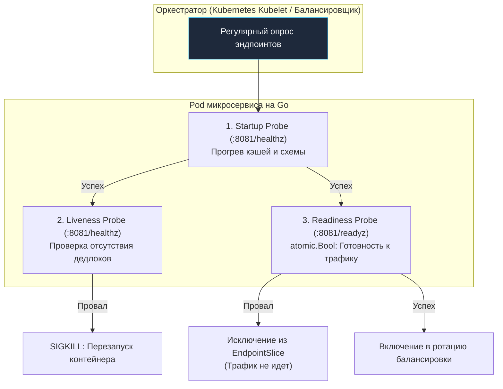

## Пульс системы: Зачем сервису рассказывать о своих болезнях

Мы последовательно спроектировали настоящую инженерную крепость: наш Go-микросервис защищен от сетевых аномалий внешнего мира с помощью [[1. Circuit breaker]] и [[3. Timeout]], а внутренние ресурсы надежно изолированы переборками [[4. Bulkhead]] и сбросом лишней нагрузки [[5. Load shedding]].

Но любая неприступная крепость может пасть из-за скрытой внутренней катастрофы.

Что произойдет, если горутина внутри сервиса захватила мьютекс и зависла в бесконечной взаимной блокировке (Deadlock)? Или если пул соединений с базой данных исчерпался из-за незакрытых транзакций, и каждый входящий запрос обречен на вечное ожидание свободного сокета? С точки зрения операционной системы процесс контейнера абсолютно жив, потребление CPU близко к нулю, системные вызовы не падают. Но функционально сервис превратился в **зомби** — он не способен обработать ни одного полезного байта.

Если инфраструктурный оркестратор (Kubernetes, Nomad или внешний L7-балансировщик) не узнает об этом внутреннем параличе, он продолжит направлять тысячи пользовательских запросов в этот мертвый узел.

Паттерн **Health Checks (Проверки жизнедеятельности / Самодиагностика)** — это стандартизированный протокол внутренней телеметрии, с помощью которого микросервис непрерывно рапортует инфраструктуре о своем физическом и функциональном состоянии. В этой статье мы разберем трехуровневую модель проб, объясним, почему смешивание диагностических эндпоинтов с бизнес-трафиком убивает кластер, и выясним, как правильно организовать проверки в рантайме Go.



---

## Три кита Health Checks в мире Kubernetes

В современных облачных архитектурах де-факто стандартом стала трехуровневая модель проб, реализованная в Kubernetes (см. [[2. Kubernetes. Основы]]). Оркестратор регулярно задает сервису три принципиально разных вопроса, и на каждый из них должен следовать свой строго изолированный ответ:

### 1. Liveness Probe (Проверка живости)
* **Вопрос:** «Ты вообще жив, способен выполнять инструкции процессора или наглухо завис в дедлоке?»
* **Действие при сбое:** Kubelet безжалостно **убивает** контейнер (посылая сигналы `SIGTERM`, а затем `SIGKILL`) и перезапускает новый экземпляр пода.
* **Имплементация:** Предельно легковесный эндпоинт. Он не должен проверять базы данных или внешние сетевые сервисы! Его единственная задача — вернуть `200 OK`, подтверждая, что рантайм Go активен, а планировщик горутин жив.

### 2. Readiness Probe (Проверка готовности)
* **Вопрос:** «Ты готов прямо в эту секунду принимать и качественно обслуживать клиентский трафик?»
* **Действие при сбое:** Оркестратор **не убивает процесс**, но моментально **исключает под из балансировки** (удаляет его IP из сетевых таблиц Service и EndpointSlice). Трафик перестает поступать в узел до тех пор, пока проверка снова не вернет успех.
* **Имплементация:** Проверяет локальное состояние готовности. Если сервис временно потерял связь с базой данных, прогревает локальные кэши или сработал Load Shedder — проверка возвращает статус `503 Service Unavailable`. Сервис получает время на восстановление, не подвергаясь разрушительным перезапускам.

### 3. Startup Probe (Проверка запуска)
* **Вопрос:** «Ты уже завершил начальную инициализацию или все еще читаешь конфигурации?»
* **Зачем нужна:** Крупные сервисы на Go при старте могут вычитывать гигабайты справочников в память, компилировать регулярные выражения или прогревать пулы соединений в течение 30–60 секунд. Если бы оркестратор сразу опрашивал Liveness Probe с коротким таймаутом, он бы циклически убивал сервис еще до завершения его старта (CrashLoopBackOff). Startup Probe блокирует Liveness и Readiness до своего первого успешного срабатывания.

---

## Архитектура на Go: Изоляция портов

> [!warning] Ловушка / Gotcha
> Самая грубая и фатальная ошибка при проектировании Health Checks в Go — регистрация диагностических маршрутов `/health` и `/ready` в общем мультиплексоре `http.ServeMux` на том же самом сетевом порту (например, `:8080`), где обрабатывается весь бизнес-трафик.

**Анатомия катастрофы (Mechanical Sympathy):**
Представьте, что ваш сервис захлестнула непредвиденная волна входящих запросов. Лимиты горутин исчерпаны, семафоры переборок заполнены, а очередь входящих TCP-соединений в ядре Linux (`somaxconn` и `backlog` сокета) переполнена под завязку.

Kubelet каждые 10 секунд отправляет стандартный проверочный HTTP-запрос на `http://pod-ip:8080/health`. Но сетевой стек ядра Linux вынужден отбрасывать (drop) пакет `TCP SYN`, потому что очередь `somaxconn` сокета 8080 переполнена!

Kubelet ловит таймаут соединения, решает, что сервис умер, и... **принудительно убивает живой, активно работающий под!** Нагрузка с убитого пода мгновенно перераспределяется на оставшиеся поды кластера, вызывая цепную реакцию массовых перезапусков (Restart Storm). Кластер складывается за считанные минуты.

**Архитектурный стандарт Senior-инженера:**  
Инфраструктурные маршруты (Health Checks, метрики Prometheus, отладочный профилировщик pprof) обязаны обслуживаться на **выделенном изолированном сетевом порту** (например, `:8081`), защищенном от внешнего интернет-трафика.

```go
package main

import (
	"context"
	"log"
	"net/http"
	"sync/atomic"
	"time"
)

// Состояние готовности сервиса: lock-free флаг в памяти
var isReady atomic.Bool

func main() {
	// 1. ИНФРАСТРУКТУРНЫЙ СЕРВЕР (Порт :8081)
	// Доступен только Kubelet и сборщику метрик внутри кластера
	infraMux := http.NewServeMux()

	// Liveness: проверяет только живучесть самого процесса Go
	infraMux.HandleFunc("/healthz", func(w http.ResponseWriter, r *http.Request) {
		w.WriteHeader(http.StatusOK)
		w.Write([]byte("200 OK: Process alive"))
	})

	// Readiness: зависит от внутренней готовности компонентов
	infraMux.HandleFunc("/readyz", func(w http.ResponseWriter, r *http.Request) {
		if isReady.Load() {
			w.WriteHeader(http.StatusOK)
			w.Write([]byte("200 OK: Ready to serve traffic"))
			return
		}

		// 503 сообщает Kubelet: процесс жив, но трафик слать нельзя
		w.WriteHeader(http.StatusServiceUnavailable)
		w.Write([]byte("503: Initializing or degraded"))
	})

	infraServer := &http.Server{
		Addr:         ":8081", // ВАЖНО: изолированный сокет!
		Handler:      infraMux,
		ReadTimeout:  1 * time.Second,
		WriteTimeout: 1 * time.Second,
	}

	go func() {
		log.Println("Инфраструктурный сервер запущен на :8081")
		if err := infraServer.ListenAndServe(); err != nil && err != http.ErrServerClosed {
			log.Fatalf("Ошибка инфраструктурного сервера: %v", err)
		}
	}()

	// 2. БИЗНЕС-СЕРВЕР (Порт :8080)
	// Принимает пользовательские запросы
	businessMux := http.NewServeMux()
	businessMux.HandleFunc("/api/v1/orders", func(w http.ResponseWriter, r *http.Request) {
		w.Write([]byte("Order processed"))
	})

	businessServer := &http.Server{
		Addr:    ":8080",
		Handler: businessMux,
	}

	// Фоновый процесс инициализации и проверки зависимостей
	go func() {
		log.Println("Инициализация зависимостей: подключение к БД и прогрев кэша...")
		time.Sleep(2 * time.Second) // Имитация прогрева
		isReady.Store(true)         // Включаем прием трафика
		log.Println("Сервис полностью готов к приему трафика")
	}()

	log.Println("Бизнес-сервер слушает на :8080")
	if err := businessServer.ListenAndServe(); err != nil && err != http.ErrServerClosed {
		log.Fatalf("Ошибка бизнес-сервера: %v", err)
	}
}
```

> [!info] Под капотом
> Запуск двух независимых экземпляров `http.Server` создает два отдельных файловых дескриптора слушающих сокетов в ядре Linux. Внутренний сетевой поллер Go (`netpoll`) регистрирует их в мультиплексоре событий независимо. 
> 
> Даже если сокет на порту 8080 захлебывается от десятков тысяч соединений, сокет на порту 8081 сохраняет кристально чистую очередь соединений. Kubelet получает ответ за доли миллисекунды, гарантируя абсолютную стабильность мониторинга.

---

## Архитектурные ловушки (Deep Health Checks)

> [!tip] Собеседование
> **Вопрос:** Допустимо ли в Liveness Probe выполнять проверку сетевой доступности базы данных PostgreSQL (например, `db.Ping()` или вызов `SELECT 1`)?
> **Ответ:** **Категорически НЕДОПУСТИМО.** Это грубейший архитектурный антипаттерн, гарантированно приводящий к каскадному коллапсу всей инфраструктуры.

Представьте сценарий: между кластером микросервисов и базой данных произошел минутный сбой сетевого оборудования (Network Partition).

**Что произойдет, если база проверяется внутри Liveness Probe:**
1. Все 100 подов вашего микросервиса одновременно не могут достучаться до БД.
2. Liveness Probe на всех 100 подах синхронно возвращает ошибку.
3. Kubelet на всех серверах начинает **одновременно убивать и перезапускать все поды сервиса** (массовый CrashLoopBackOff).
4. Когда сеть восстанавливается, базе данных приходится выдерживать одновременный шквал от 100 поднимающихся подов, пытающихся открыть соединения через `database/sql` пул, провести TLS-хендшейки и аутентификацию (Thundering Herd). СУБД падает уже под тяжестью самих поднимающихся сервисов!

**Что произойдет, если проверка зависимостей вынесена в Readiness Probe:**
1. Все 100 подов проваливают Readiness.
2. Оркестратор плавно исключает их из балансировки: пользователи временно видят ошибку `503`.
3. **Но процессы приложений остаются в живых!** Горутины не перезапускаются, открытые TCP-сокеты к БД в пуле `database/sql` сохраняются или спокойно восстанавливаются в фоновом режиме.
4. Как только сетевой сбой устранен, Readiness мгновенно возвращает `200 OK`, Kubernetes возвращает поды в ротацию, и система оживает за доли секунды без единого рестарта.


**Золотые правила проектирования проверок:**
* **Liveness:** Строго локальная, внутренняя проверка жизнеспособности процесса. Никаких внешних сетевых вызовов.
* **Readiness:** Проверяет внешние зависимости, НО исключительно через фоновые воркеры с кэшированием статуса в атомарных переменных `atomic.Bool`. Если при каждом входящем хелсчеке от Kubelet (10 раз в секунду на 100 подах) выполнять реальный SQL-запрос `SELECT 1`, вы создадите бесполезную нагрузку в 1000 RPS на базу данных исключительно ради работы проверок!

---

## Итог

1. **Разделение зон ответственности:** Liveness отвечает за живучесть процесса (защита от дедлоков), Readiness — за готовность принимать трафик (проверка зависимостей), Startup — за безопасный прогрев сервиса при старте.
2. **Строгая изоляция портов:** Диагностические и бизнес-эндпоинты обязаны жить на разных сетевых портах и сокетах, чтобы сетевой затор на бизнес-маршрутах не привел к ложному убийству контейнера оркестратором.
3. **Табу на Deep Liveness Checks:** Проверка удаленных баз данных и очередей в Liveness Probe превращает локальный сетевой сбой в полномасштабный шторм перезапусков всего кластера.
4. **Легковесность рантайма Go:** Проверки должны отрабатывать за наносекунды на базе неблокирующих атомарных переменных (`atomic.Bool`), обновляемых фоновыми диагностическими горутинами.

Мы научились безошибочно рапортовать инфраструктуре о своем физическом здоровье. Но что делать, если зависимость (например, сервис рекомендаций или аналитики) все же вышла из строя, однако мы не хотим полностью блокировать пользователя и возвращать ошибку `503`? На помощь приходит искусство частичного функционирования: [[7. Graceful degradation]].