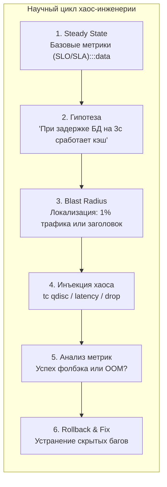
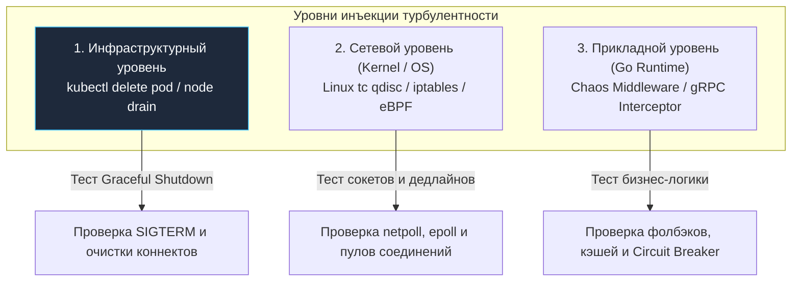

## Контролируемое разрушение: Зачем ломать то, что работает

Мы последовательно посвятили семь предыдущих глав созданию несокрушимой брони для распределенного приложения. Мы внедрили аварийные предохранители [[1. Circuit breaker]], настроили эшелонированные таймауты сокетов в [[3. Timeout]], изолировали пулы ресурсов герметичными переборками [[4. Bulkhead]], защитили сервер от захлебывания сбросом балласта [[5. Load shedding]] и научились падать с непревзойденным достоинством в [[7. Graceful degradation]]. 

На бумаге архитектурных диаграмм и в тепличных юнит-тестах с десятью мок-запросами в секунду система кажется абсолютно неуязвимой.

Однако реальная распределенная среда живет по суровым физическим законам: экскаваторы рвут магистральные оптоволоконные кабели в траншеях дата-центров, коммутаторы Top-of-Rack ловят аномалии прошивок, а ядра серверов уходят в троттлинг от перегрева. Если вы проверяете поведение отказоустойчивых механизмов только во время реальных полуночных катастроф — вы играете в русскую рулетку с бизнесом.

**Chaos Engineering (Хаос-инженерия)** — это строгая инженерная дисциплина проведения контролируемых экспериментов над распределенной системой, направленная на выявление скрытых архитектурных дефектов, ложных конфигураций и каскадных деградаций задолго до того, как они обернутся аварией на проде.

В этой заключительной статье подраздела мы разберем научную методологию инъекции хаоса, выясним, как сетевые аномалии Linux влияют на рантайм Go, и реализуем идиоматичный, абсолютно безопасный механизм управляемого хаоса с нулевым оверхедом для продакшена.



---

## Научный метод, а не вандализм

Широко распространено заблуждение, будто хаос-инженерия — это хаотичный запуск скрипта, убивающего случайные серверы в облаке (наследие ранних утилит Chaos Monkey эпохи 2011 года). 

В промышленной разработке хаос — это строгий научный эксперимент:

1. **Формулирование базовой нормы (Steady State):** Непрерывный замер ключевых бизнес-метрик системы при штатной работе (например: 99.9% заказов оформляются быстрее 150 мс при 0.01% пятисотых ошибок).
2. **Формирование проверяемой гипотезы:** «Если сервис платежей начнет отвечать с пятисекундной задержкой, сработает таймаут 500 мс, Circuit Breaker разорвет цепь, а клиенты увидят предупреждение без зависания горутин».
3. **Ограничение радиуса поражения (Blast Radius):** Эксперимент никогда не раскатывается на 100% пользователей вслепую. Мы тестируем гипотезу на канареечной группе (Canary), внутреннем теневом трафике (Shadow Traffic) или синтетических синтез-аккаунтах.
4. **Инъекция турбулентности:** Подача дозированной аномалии (задержка, потеря пакетов, паника).
5. **Верификация и откат:** Если гипотеза опровергнута (например, потребление памяти подскочило на 4 ГБ), эксперимент немедленно сворачивается аварийной кнопкой (Rollback), а инженеры приступают к закрытию архитектурной бреши.

> [!IMPORTANT]
> Если в вашей системе отсутствует глубокая наблюдаемость (Observability: распределенная трассировка OpenTelemetry, метрики Prometheus, структурированные логи) — хаос-инженерия категорически противопоказана. Вы просто разрушите продакшен и не сможете диагностировать причину крушения. Сначала метрики — затем хаос.

---

## Уровни инъекции хаоса

Искусственную турбулентность можно внедрять на различных уровнях абстракции. Инженеру на Go жизненно необходимо понимать (Mechanical Sympathy), как каждый уровень отзывается в рантайме языка.



### 1. Инфраструктурный уровень (Убийство подов/узлов)
Самый распространенный сценарий в Kubernetes. Облачные операторы хаоса (Chaos Mesh, LitmusChaos) выполняют принудительный демонтаж: `kubectl delete pod`.

**Что происходит в Go:** Процесс получает системный сигнал `SIGTERM`. В этот момент проверяется дисциплина Graceful Shutdown:
- Успевает ли приложение за отведенный K8s `terminationGracePeriodSeconds` (обычно 30 секунд) корректно завершить in-flight горутины, сбросить буферы в базу данных и разрегистрироваться в Service Discovery?
- Или клиенты получают пачки системных разрывов `Connection Reset by Peer`?

### 2. Сетевой уровень (Network Partition & Latency)
Утилиты воздействуют на ядро Linux, используя планировщик трафика (`tc qdisc`) или цепочки правил фильтрации `iptables`.

> [!info] Под капотом: Go и Linux tc
> Что происходит внутри приложения на Go, если с помощью правила `tc qdisc add dev eth0 root netem delay 5000ms` добавить искусственную задержку в 5 секунд на порт СУБД?
> 
> 1. Горутина инициирует выполнение запроса к базе: `sql.Query()`.
> 2. Под капотом рантайм формирует пакет протокола PostgreSQL и выполняет системный вызов `syscall.Write` в TCP-сокет.
> 3. Данные успешно переходят в буфер ядра Linux, однако сетевой планировщик ядра `tc qdisc` (Queueing Discipline) искусственно замораживает пакет на 5 секунд.
> 4. Горутина ожидает ответа, обращаясь к системному мультиплексору `epoll`. Рантайм Go вызывает `gopark`, паркует горутину и освобождает системный поток `M` для других задач.
> 5. Входящий поток новых запросов продолжает поступать: число запаркованных горутин начинает стремительно расти в геометрической прогрессии.
> 
> Этот эксперимент наглядно демонстрирует, насколько точно вы настроили верхнюю планку пула соединений СУБД (`SetMaxOpenConns`) и сработает ли изолирующая переборка [[4. Bulkhead]]. Если лимит соединений был оставлен дефолтным (без ограничений), рантайм Go аллоцирует десятки тысяч сокетов и горутин, и операционная система прикончит сервис через OOM Killer.

### 3. Уровень приложения (Application Fault Injection)
Самый тонкий, микрохирургический метод. Мы не трогаем сетевой стек ОС, а заставляем сам код на Go симулировать аномалии: возвращать сетевые ошибки, выбрасывать паники или зависать на вызовах.

---

## Реализация Chaos Middleware в Go (Idiomatic Approach)

Как интегрировать механизм внедрения хаоса в кодовую базу микросервиса так, чтобы он гарантированно не создал накладных расходов в продакшене и не сработал случайно для реальных клиентов?

Идиоматичный подход в экосистеме Go строится на **тегах сборки (Build Tags)** и селективной фильтрации входящих HTTP-заголовков.

### Шаг 1: Изоляция через Build Tags

Мы создаем два раздельных исходных файла в пакете `internal/chaos`.

Файл `chaos_noop.go` (компилируется в релизные боевые сборки по умолчанию):
```go
//go:build !chaos

package chaos

import "net/http"

// Injector в стандартном продакшен-бинарнике представляет собой пустую заглушку.
// Компилятор Go полностью заинлайнит этот вызов с нулевым оверхедом по CPU и памяти!
func Injector(next http.Handler) http.Handler {
	return next
}
```

Файл `chaos_active.go` (включается в компиляцию строго при передаче флага сборки `-tags chaos`):
```go
//go:build chaos

package chaos

import (
	"log/slog"
	"net/http"
	"time"
)

// Injector перехватывает запросы и симулирует системные сбои
func Injector(next http.Handler) http.Handler {
	return http.HandlerFunc(func(w http.ResponseWriter, r *http.Request) {
		// Жестко локализуем радиус поражения (Blast Radius):
		// Хаос активируется ТОЛЬКО при наличии специального секретного заголовка
		if r.Header.Get("X-Chaos-Experiment") != "true" {
			next.ServeHTTP(w, r)
			return
		}

		action := r.Header.Get("X-Chaos-Action")
		switch action {
		case "delay":
			slog.Warn("ХАОС: Искусственная инъекция задержки 3 секунды")
			time.Sleep(3 * time.Second) // Тестируем Timeout и Load Shedding

		case "error":
			slog.Warn("ХАОС: Искусственная инъекция 500 Internal Server Error")
			http.Error(w, "Chaos Injection: Downstream Fault", http.StatusInternalServerError)
			return // Тестируем Circuit Breaker вызывающей стороны

		case "panic":
			slog.Warn("ХАОС: Искусственная инъекция неперехваченной паники")
			panic("Chaos Injection: Unexpected memory corruption") // Тестируем Recovery Middleware
		}

		next.ServeHTTP(w, r)
	})
}
```

### Шаг 2: Использование в основном приложении

В файле `main.go` вы просто оборачиваете ваш роутер в созданный middleware:

```go
package main

import (
	"log"
	"net/http"
	"myapp/internal/chaos"
)

func main() {
	mux := http.NewServeMux()
	mux.HandleFunc("/api/v1/orders", func(w http.ResponseWriter, r *http.Request) {
		w.Write([]byte(`{"status":"created"}`))
	})

	// В боевой сборке (go build .) это абсолютно пустая функция no-op.
	// В тестовом бинарнике (go build -tags chaos .) это активный генератор сбоев.
	handler := chaos.Injector(mux)

	log.Println("Сервер слушает на :8080")
	http.ListenAndServe(":8080", handler)
}
```

> [!tip] Собеседование
> **Вопрос:** Как верифицировать корректность работы механизма Retry, если зависимый удаленный сервис работает исключительно по gRPC, а сеть в дата-центре абсолютно стабильна?
> **Ответ:** Использовать клиентские перехватчики gRPC (Unary Client Interceptors). Через вызов `grpc.WithUnaryInterceptor` мы подключаем интерцептор, который с вероятностью 30% подменяет успешный ответ статус-кодом `codes.Unavailable`. 
> Запустив тестовый сценарий, мы смотрим в спаны распределенной трассировки (OpenTelemetry) и верифицируем, что клиентский код выполнил ровно 3 повторные попытки с экспоненциальным шагом и джиттером, не уронив пользовательскую сессию.

---

## Архитектурные ловушки (Gotchas)

### 1. Тестирование "Сферического коня в вакууме"
Большинство команд проводят хаос-тесты исключительно в тихой тестовой среде (Staging), где нет параллельного боевого трафика.

**Скрытая опасность:** В пустом кластере таймаут в 2 секунды отработает идеально. Но на боевом сервере, где ядра CPU загружены на 85%, а сборщик мусора Go борется с аллокациями, таймеры рантайма могут сработать с микроскопическим дрейфом (Timer Drift), а блокировка мьютекса займет дополнительные миллисекунды.  
Настоящая надежность проверяется в Production на реальной боевой нагрузке с жесткой фильтрацией по синтетическим тестовым клиентам.

### 2. Забытый Fallback
При симуляции отказа основной базы данных разработчики часто надеются на Redis. Но что произойдет, если под высокой нагрузкой упадет и база данных, и кэш одновременно? Этот сценарий называется **составным отказом (Compound Failure)**. 
Хаос-тесты обязаны проверять предельные глубины деградации: вплоть до отдачи статических ответов из оперативной памяти без единого сетевого вызова.

### 3. Исчерпание энтропии (Entropy Exhaustion)
Уникальный кейс на стыке ядра Linux и криптографии. Если ваш стресс-тест хаоса симулирует миллионы оборванных TLS-сессий в секунду, ядро операционной системы может исчерпать доступный пул энтропии (`/dev/urandom` или блокирующего `/dev/random`), необходимой для генерации случайных чисел при TLS Handshake. Процессы начнут зависать на системных вызовах криптографии, создавая ложную иллюзию багов в рантайме Go.

---

## Итог

1. **Хаос — это подтверждение надежности:** Цель дисциплины — экспериментально доказать, что внедренные предохранители, таймауты и сбросы нагрузки гарантируют выживание системы при любых катастрофах.
2. **Механическое сочувствие:** Понимание того, как планировщик сетевого поллера Go (`netpoll`, `epoll`, `gopark`) реагирует на заморозку трафика ядром Linux (`tc qdisc`), позволяет безошибочно рассчитывать лимиты пулов и семафоров.
3. **Идиоматичная изоляция через Build Tags:** Использование флагов сборки компилятора Go (`//go:build chaos`) гарантирует нулевые накладные расходы и абсолютную чистоту бинарного файла в production.
4. **Контролируемый радиус:** Начинайте инъекции с минимальной изоляции (заголовки, тестовые маркеры), неукоснительно соблюдая примат Observability.

Мы завершили фундаментальное исследование архитектурных паттернов надежности микросервисных систем на языке Go. Но в современной облачной парадигме бремя управления сетевыми таймаутами, повторными попытками, взаимным шифрованием mTLS и сквозной трассировкой всё чаще делегируют специализированной инфраструктурной прослойке. О том, как устроен этот уровень и как сервисы связываются в единую интеллектуальную сеть, мы поговорим в следующем разделе: [[1. Service mesh]].