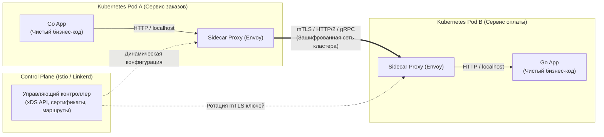
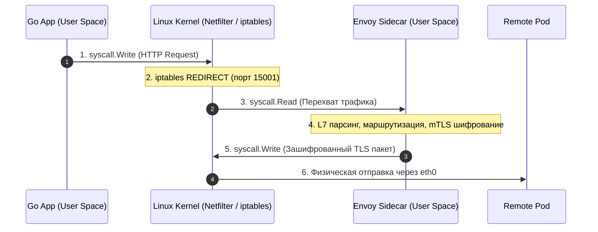

## Умная сеть для глупых клиентов: Эволюция архитектуры

В предыдущем разделе мы проделали колоссальную инженерную работу по укреплению кода: оборачивали клиентские вызовы в [[1. Circuit breaker]], рассчитывали экспоненциальные задержки и случайный джиттер в [[2. Retry и backoff]], устанавливали дедлайны сокетов в [[3. Timeout]] и защищали рантайм Go переборками [[4. Bulkhead]]. В рамках одного монолита или небольшого моноязычного стека на Go этот подход («толстые клиентские библиотеки» / Fat Libraries) работает безупречно.

Но представьте, что технологическая компания выросла: в продакшене крутятся уже 200 микросервисов. Часть бэкенда написана на Go, легаси-биллинг остался на Java, микросервисы машинного обучения крутятся на Python, а низкоуровневые модули криптографии собраны на Rust.

Внезапно отдел безопасности требует внедрить обязательное сквозное взаимное TLS-шифрование (mTLS) между всеми сервисами с ротацией сертификатов каждые 24 часа, а SRE-команда просит скорректировать пороги Circuit Breaker для ответов 503. В парадигме толстых библиотек вам придется:
1. Написать или обновить библиотеки для четырех языков программирования с учетом специфики их рантаймов.
2. Провести ревью кода и кросс-языковое тестирование в десятках продуктовых команд.
3. Месяцами уговаривать разработчиков обновить версии зависимостей, перекомпилировать бинарники и перевыкатить сотни сервисов в прод.

Ровно в этой точке классическая архитектура распределенных систем совершает тектонический сдвиг: от парадигмы *«Умные клиенты и глупая сеть»* мы переходим к парадигме **«Глупые клиенты и умная сеть»**. Это и есть концепция **Service Mesh (Сервисная сетка)**.

В этой статье мы разберем анатомию сервисной сетки, выясним, как она освобождает Go-разработчиков от рутинного инфраструктурного кода, и оценим суровую физическую цену (в тактах процессора, системных вызовах и копированиях памяти), которую мы платим за эту абстракцию.

---

## Анатомия Service Mesh

**Service Mesh** — это специализированный инфраструктурный слой абстракции, предназначенный для управления сквозным, безопасным и наблюдаемым сетевым взаимодействием между микросервисами.

Архитектура Service Mesh строго разделена на две фундаментальные плоскости:

### 1. Data Plane (Плоскость данных)
Это массив высокоскоростных легковесных прокси-серверов (стандартом де-факто является Envoy или Linkerd-proxy), которые развертываются рядом с каждым экземпляром прикладного сервиса. 

В среде Kubernetes прокси инжектируется через классический паттерн **Sidecar (Мотоциклетная коляска)**: прокси-процесс запускается в отдельном изолированном контейнере, но внутри того же самого Pod-а, разделяя с контейнером приложения общее сетевое пространство имен (Network Namespace) и петлевой интерфейс `localhost`. 

Data Plane прозрачно перехватывает **100% входящего и исходящего трафика** пода.

### 2. Control Plane (Плоскость управления)
Это центральный управляющий координатор системы (например, демон `istiod` в Istio). 

Control Plane принципиально **не пропускает через себя пользовательские пакеты** бизнес-данных (иначе он превратился бы в узкое горлышко и единую точку отказа). Его задача — предоставить администраторам декларативный API (через Kubernetes CRD), хранить топологию кластера, генерировать TLS-сертификаты и динамически рассылать обновленные правила маршрутизации всем Sidecar-прокси через специализированный протокол xDS API по стримам gRPC.

---

## Что Service Mesh забирает на себя?

После внедрения сервисной сетки код на Go очищается от инфраструктурного шума. Приложение больше не должно знать адреса серверов, алгоритмы балансировки или логику шифрования:

1. **Service Discovery и умная балансировка:** Приложению больше не нужны внешние клиенты к Consul или etcd. Go-клиент выполняет тривиальный сетевой вызов `http.Get("http://accounts-service")`. Локальный Sidecar-прокси перехватывает этот запрос, обращается к динамической карте эндпоинтов, оценивает текущую задержку целевых подов и выполняет балансировку (например, Least Request или Round Robin).
2. **Отказоустойчивость (Resilience):** Политики повторов (Retry), дедлайны (Timeout) и предохранители (Circuit Breaker) настраиваются декларативно в YAML-манифестах платформы. Envoy на стороне клиента сам повторит упавший запрос, сам прервет подвисшее соединение и сам временно исключит деградирующий под из пула (Outlier Detection).
3. **Наблюдаемость (Observability «из коробки»):** Прокси автоматически генерирует и экспортирует метрики по стандарту RED (Rate, Errors, Duration) в Prometheus, а также пробрасывает заголовки W3C Trace Context (`traceparent`) для построения сквозных распределенных графов в Jaeger/OpenTelemetry.
4. **Zero-Trust безопасность и mTLS:** Приложение на Go общается по чистому, незашифрованному HTTP на локальном сокете `localhost`. Sidecar перехватывает трафик, упаковывает его в зашифрованный TLS-туннель с взаимной проверкой криптографических сертификатов (mTLS) и отправляет в сеть. Принимающий Sidecar расшифровывает поток и отдает его локальному Go-сервису.

---

## Mechanical Sympathy: Налог на Service Mesh

> [!warning] Ловушка / Gotcha
> В инженерном мире бесплатных абстракций не существует. Добавление Service Mesh вставляет минимум два промежуточных сетевых узла (хопа) на **каждый** межсервисный вызов. 
> Для разработчика высоконагруженных систем на Go критически важно понимать физическую цену каждого байта на уровне ядра Linux и процессора.

Проследим пошаговый путь пакета данных при исходящем запросе из приложения Go в кластере с классическим Service Mesh (на базе `iptables` и Envoy):

1. **Go Runtime (User Space):** Приложение вызывает функцию записи, выполняя системный вызов `syscall.Write` для отправки байтов HTTP-запроса в сокет.
2. **Ядро Linux (Kernel Space):** Сетевой стек ядра встречает пакет в подсистеме `netfilter`. При инициализации пода служебный контейнер (istio-init) сконфигурировал правила `iptables`. Правило перехватывает исходящие пакеты и выполняет операцию `REDIRECT`, принудительно перенаправляя их на локальный порт Sidecar-прокси (обычно `15001`).
3. **Sidecar Proxy (User Space):** Прокси Envoy читает байты из сокета через `syscall.Read`. Для этого процессор переключает контекст (Context Switch) из ядра обратно в пространство пользователя. Envoy разбирает HTTP-заголовки, применяет правила маршрутизации и заворачивает полезную нагрузку в шифрованный TLS-пакет.
4. **Отправка в сеть:** Envoy вызывает `syscall.Write` (еще одно переключение контекста в ядро), и ядро наконец-то отправляет TCP-сегмент через виртуальный интерфейс `veth` в физическую сеть дата-центра.
5. **Принимающая сторона:** В целевом поде разворачивается зеркальный процесс: ядро перехватывает пакет через `iptables`, отдает его в Envoy для расшифровки через `syscall.Read`, и лишь затем Envoy пересылает расшифрованные байты в целевое Go-приложение на `localhost`.

### Цена вопроса
* **Множественное копирование памяти:** Данные полезной нагрузки многократно копируются между буферами пользовательского пространства (User Space) и кольцевыми буферами ядра (Kernel Space `sk_buff`).
* **Рост системных вызовов и смены контекстов:** Вместо одной пары `read/write` мы совершаем минимум четыре системных вызова, что сбрасывает аппаратные конвейеры процессора и инвалидирует процессорный кэш инструкций L1i.
* **Сетевая задержка (Latency):** В зависимости от нагрузки и железа Sidecar-проксирование добавляет от **1 до 3 миллисекунд** к каждому сетевому вызову. В распределенной транзакции с цепочкой из 5 последовательных микросервисов суммарная задержка возрастает на 15–25 мс исключительно за счет работы сетевого слоя!
* **Расход памяти и CPU:** Каждый экземпляр Sidecar требует от 40 до 100 МБ оперативной памяти под таблицы маршрутизации и буферы. В кластере на 1000 подов только на работу прокси уйдет от 40 до 100 ГБ RAM.

> [!info] Под капотом: eBPF спешит на помощь
> Современные решения нового поколения (такие как Cilium Service Mesh, а также архитектура Istio Ambient Mesh) объявляют войну архаичному и медленному `iptables`. 
> 
> Используя технологию **eBPF (Extended Berkeley Packet Filter)**, ядро Linux способно перенаправлять сетевые сокеты напрямую на уровне сокетного уровня (`sockops`), минуя обход тяжелых сетевых таблиц `netfilter`. В режиме Ambient Mesh тяжелые Sidecar-контейнеры вообще удаляются из пользовательских подов, уступая место легковесному узловому демону (ztunnel), что сокращает накладные расходы по памяти в разы.

---

## Service Mesh vs API Gateway

На архитектурных собеседованиях этот вопрос задается с завидной регулярностью.

> [!tip] Собеседование
> **Вопрос:** Зачем внедрять Service Mesh, если у нас на входе в кластер уже развернут мощный API Gateway (Kong, Traefik, KrakenD)? Разве они не дублируют функционал друг друга?
> **Ответ:** Принципиальное различие заключается в **векторе движения трафика** и границах доверия:
> 
> * **API Gateway** управляет **North-South трафиком** (Север-Юг). Это точка входа внешних клиентов (браузеры, мобильные приложения, внешние B2B-партнеры) внутрь дата-центра. Задачи Gateway: аутентификация пользователей (проверка JWT/OAuth2 токенов), защита от внешних DDoS-атак, биллинг API-вызовов, сжатие контента и трансформация форматов (например, трансляция REST в gRPC).
> * **Service Mesh** управляет исключительно **East-West трафиком** (Восток-Запад). Это приватное общение микросервисов друг с другом ВНУТРИ защищенного периметра инфраструктуры. Service Mesh ничего не знает о конкретных пользователях — он оперирует абстракциями сетевых сервисов, обеспечивая mTLS-шифрование каналов, локальную балансировку и трассировку вызовов.
> 
> В зрелой облачной архитектуре они дополняют друг друга: входящий запрос из интернета принимает API Gateway (North-South), авторизует пользователя и пересылает запрос во внутренний микросервис, где управление подхватывает Service Mesh (East-West).

---

## Итог

1. **Разделение ответственности:** Service Mesh снимает с плеч Go-разработчиков бремя реализации повторов, таймаутов, mTLS и балансировки, перенося эту логику в декларативную конфигурацию платформы.
2. **Sidecar-паттерн:** Data Plane состоит из локальных прокси-серверов, разделяющих сетевой стек пода с целевым приложением на петлевом интерфейсе `localhost`.
3. **Инженерная цена удобства:** Традиционный перехват пакетов через `netfilter` и `iptables` увеличивает накладные расходы по CPU, памяти и добавляет налог на задержку (1–3 мс на вызов) из-за череды системных вызовов `syscall.Read` и `syscall.Write`.
4. **Эволюция в сторону eBPF:** Современный тренд сервисных сеток направлен на избавление от накладных расходов `iptables` с помощью прямого проброса пакетов через сокетные хуки eBPF в ядре Linux.

В этом материале мы говорили о Data Plane концептуально. Но в 90% реальных продакшен-систем роль Sidecar-прокси выполняет один конкретный, феноменально оптимизированный инструмент на C++, ставший промышленным стандартом облачной индустрии. В следующей статье мы заглянем под капот этой технологии: [[2. Envoy и sidecar]].