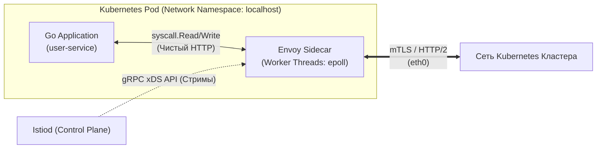
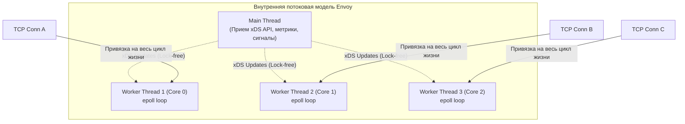
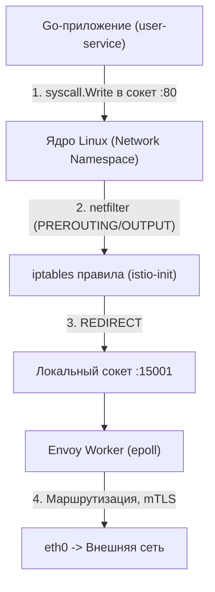
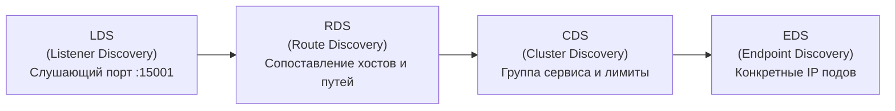

## Envoy: Титановый прокси в коляске

В предыдущей статье [[1. Service mesh]] мы подробно разобрали концептуальные предпосылки сервисных сеток: зачем архитекторы выносят логику повторов, таймаутов, распределенной трассировки и балансировки из бизнес-кода на уровень инфраструктурных прокси.

В подавляющем большинстве современных инсталляций Kubernetes (будь то Istio, AWS App Mesh, HashiCorp Consul Connect или Kuma) роль этой рабочей лошадки Data Plane выполняет один конкретный инструмент — **Envoy Proxy**.

Envoy — это высокопроизводительный распределенный L3/L4 и L7 прокси-сервер, изначально спроектированный инженерами компании Lyft, а ныне являющийся флагманским выпускным проектом фонда Cloud Native Computing Foundation (CNCF). Для опытного Go-разработчика Envoy — это не просто загадочный черный ящик, который «девопсы настраивают через Helm-чарты», а непосредственный сосед по поду, разделяющий с рантаймом Go ядро операционной системы, сетевой стек и процессорные ресурсы.

В этой статье мы заглянем под титановый капот Envoy, исследуем его потоковую модель без блокировок, детально разберем механизм перехвата пакетов и ответим на главный мировоззренческий вопрос: почему сам прокси написан на C++, а не на Go?

---

## Mechanical Sympathy: Почему C++, а не Go?

Это один из самых увлекательных вопросов современной системной архитектуры. Язык Go по праву считается официальным языком облачной инфраструктуры: само ядро Docker, оркестратор Kubernetes, система мониторинга Prometheus, шлюзы Traefik и Terraform написаны на Go. Почему же абсолютным королем Data Plane стал Envoy, написанный на современном диалекте C++14?

**Фундаментальный ответ: Борьба за предсказуемость хвостовых задержек (Tail Latency) и отсутствие сборщика мусора (Garbage Collector).**

В рантайме Go сборщик мусора работает конкурентно (Concurrent Mark and Sweep). Несмотря на то, что паузы полной остановки мира (Stop-The-World) в современных версиях Go исчисляются микросекундами, фоновое сканирование кучи неизбежно расходует такты CPU (до 25% ресурсов ядер при интенсивных аллокациях), а при нехватке памяти рантайм принудительно активирует механизм *Mark Assist*.

Сетевой L7-прокси, перемалывающий сотни тысяч запросов в секунду (RPS) на узел:
* Непрерывно выделяет, нарезает и освобождает миллионы буферов под заголовки HTTP, фреймы HTTP/2 и фрагменты полезной нагрузки.
* В Go такой профиль нагрузки породил бы колоссальное давление на кучу и привел к неизбежным всплескам хвостовых задержек (Spikes) на критических перцентилях **p99** и **p99.9** (когда один запрос из тысячи зависает на 50–100 мс из-за чистки мусора).
* В C++ управление памятью является строго детерминированным. Envoy применяет кастомные арены памяти (Arena Allocators) и циклические кольцевые буферы, переиспользуя непрерывные области памяти без возврата операционной системе. Это обеспечивает плоский, абсолютно ровный график задержек с разбросом менее 1 мс даже при предельных пиковых нагрузках.

---

## Потоковая модель Envoy (Threading Model)

Чтобы проксировать миллионы пакетов и не превратиться в узкое горлышко, Envoy выжимает максимум из архитектуры многоядерных процессоров. В его основе лежит событийно-ориентированная неблокирующая модель **Event-Driven Non-Blocking I/O**.

Внутри процесса Envoy функционируют два типа системных потоков операционной системы:

1. **Main Thread (Главный управляющий поток):** Отвечает за начальный старт, чтение первичных конфигураций, координацию жизненного цикла, прием gRPC-стримов динамической конфигурации (xDS API) и экспорт метрик. Главный поток **никогда не касается сокетов пользовательского трафика**.
2. **Worker Threads (Рабочие потоки):** Занимаются исключительно пересылкой и обработкой сетевых пакетов. По умолчанию Envoy запускает ровно столько потоков-воркеров, сколько физических ядер CPU выделено контейнеру.

> [!info] Под капотом
> Каждый рабочий поток крутит свой собственный независимый цикл обработки событий на базе системного вызова ядра Linux `epoll`.
> 
> **Железное правило Envoy:** Каждое входящее клиентское TCP-соединение в момент рукопожатия жестко закрепляется за **одним конкретным воркером** на все время своей жизни.
> 
> Это означает, что при вычитывании байтов, парсинге HTTP-заголовков, маршрутизации и TLS-шифровании внутри Envoy **вообще не используются мьютексы (Locks)!** Воркеру не нужно синхронизировать доступ к структурам сессии с соседними потоками. Это полностью исключает Lock Contention и проблему инвалидации процессорных кэш-линий (Cache Line Bouncing) протокола когерентности MESI.

---

## Как Sidecar перехватывает трафик вашего Go-приложения?

Вы написали лаконичный HTTP-клиент на Go: `http.Get("http://user-service/api/users")`. Ваш код вообще ничего не знает об Envoy. Каким образом исходящий TCP-пакет волшебным образом оказывается в лапах прокси?

В кластере Kubernetes эта магия разворачивается в три этапа при участии механизма **Mutating Admission Webhook** и служебных контейнеров:

1. **Инъекция манифеста:** Когда контроллер разворачивает под, мутирующий вебхук платформы на лету дописывает в спецификацию пода два контейнера: инициализирующий `istio-init` и долгоживущий `istio-proxy` (бинарник Envoy).
2. **Низкоуровневая настройка iptables:** Контейнер `istio-init` запускается первым в статусе `InitContainer`. Он наделен специальной Linux-привилегией `NET_ADMIN`. Контейнер исполняет набор низкоуровневых команд, которые переписывают таблицы маршрутизации ядра Linux (`iptables`) **исключительно внутри изолированного сетевого пространства имен (Network Namespace) данного конкретного пода**.
3. **Захват трафика:** Правила `iptables` предписывают: любой исходящий TCP-трафик (кроме пакетов, сгенерированных самим служебным пользователем envoy UID 1337) перенаправлять через действие `REDIRECT` на локальный порт `15001`.
4. **Проксирование:** Сетевой стек ядра заворачивает пакет на порт `15001`, где его мгновенно вычитывает воркер Envoy.

> [!warning] Ловушка / Gotcha
> Ваш компактный микросервис на Go (потребляющий условные 25 МБ оперативной памяти) теперь делит лимиты пода с C++ процессом Envoy, который может аллоцировать от 60 до 150 МБ под кэши маршрутов и TLS-сессий. 
> 
> Более того, заворачивание каждого сетевого пакета через `iptables` и двойное прохождение сквозь границу ядра с переключением контекста в User Space добавляет накладные расходы по CPU. В сверхнагруженных кластерах этот налог минимизируют с помощью технологии eBPF, заменяющей `iptables` прямым пробросом сокетов в ядре.

---

## Динамическая конфигурация: Магия xDS

> [!tip] Собеседование
> **Вопрос:** Почему Nginx исторически не прижился в качестве Sidecar-прокси для динамических микросервисов, уступив пальму первенства Envoy?
> **Ответ:** Ключевое различие кроется в парадигме управления конфигурацией. Nginx традиционно опирается на статические текстовые файлы. Чтобы обновить список живых бэкендов, необходимо перезаписать файл на диске и отправить системный сигнал `reload` процессу. Это приводит к спавну новых воркеров и медленному дожиданию завершения старых (Drain). В облаке Kubernetes, где поды рождаются и умирают ежесекундно, непрерывный `reload` быстро парализовал бы производительность узла.
> 
> Envoy изначально проектировался для **динамического обновления состояния на лету по потоковым gRPC API** без единого рестарта или сброса сетевых соединений.

Семейство этих динамических управляющих протоколов носит общее название **xDS API (Any Discovery Service)**:

Конвейер обработки входящего пакета внутри Envoy поэтапно проходит сквозь эту иерархию:
1. **LDS (Listener Discovery Service):** Листенер слушает входящий сокет `15001` и принимает TCP-соединение.
2. **RDS (Route Discovery Service):** L7-фильтр парсит заголовки HTTP/gRPC. Видя заголовок `Host: user-service`, роутер сопоставляет его с нужным виртуальным маршрутом.
3. **CDS (Cluster Discovery Service):** Кластер определяет целевой бэкенд, его таймауты, параметры Circuit Breaker и протокол (HTTP/2 или gRPC).
4. **EDS (Endpoint Discovery Service):** Envoy выбирает конкретный физический IP-адрес пода из актуального пула эндпоинтов и направляет туда байты.

---

## Архитектурные ловушки для Go-разработчика

### 1. Двойные таймауты и ретраи
Распространенный антипаттерн — дублирование логики отказоустойчивости. 
Если разработчик настроил в HTTP-клиенте Go политику [[2. Retry и backoff]] на 3 попытки с экспоненциальным шагом, а DevOps-инженеры включили в Istio VirtualService еще 3 попытки, то при кратковременном сетевом сбое один исходящий вызов превратится в $3 \times 3 = 9$ сетевых ударов по зависимому сервису!

**Правило:** При работе под крылом Service Mesh удаляйте сложную логику ретраев и Circuit Breakers из прикладного Go-кода. Оставляйте только жесткий общий дедлайн через `context.Context` (как последний рубеж обороны приложения).

### 2. Потеря истинного IP клиента
Когда внешний клиент обращается к системе, сетевой путь выглядит так:  
`Клиент -> Ingress Gateway -> Envoy Sidecar A -> Go App A -> Envoy Sidecar B -> Go App B`.

На уровне транспортного TCP-сокета входящее соединение в Go App всегда открывается с локального адреса `127.0.0.1` (или IP Sidecar-контейнера). Чтение поля `r.RemoteAddr` в Go вернет `127.0.0.1`!

**Решение:** Для аудита безопасности и геолокации извлекайте реальный IP клиента исключительно из HTTP-заголовков `X-Forwarded-For` или `X-Real-IP`, которые Envoy формирует и передает по цепочке.

### 3. Graceful Shutdown и Race Conditions
Когда Kubernetes принимает решение о выводе пода из эксплуатации (например, при Rolling Update), системный сигнал `SIGTERM` отправляется **одновременно** во все контейнеры пода — и в ваше Go-приложение, и в контейнер Envoy.

Если Envoy завершит свой процесс на 100 миллисекунд раньше, чем Go-приложение успеет завершить текущие запросы и зафиксировать транзакцию в базе данных (выполнив исходящий RPC-вызов), ваше приложение мгновенно получит ошибку `Connection Refused`! Ведь правила `iptables` всё еще активны, а слушающий порт `15001` уже мертв.

**Решение:** В манифестах Kubernetes настраивают хук задержки остановки (`preStop` hook) для контейнера Envoy (`sleep 5`), гарантируя, что Sidecar продолжит обслуживать исходящий трафик до тех пор, пока Go-сервер не закроет все соединения.

---

## Итог

1. **Envoy как эталон Data Plane:** Событийный прокси на C++, исключающий накладные расходы на сборку мусора и обеспечивающий стабильные хвостовые задержки (Tail Latency).
2. **Lock-Free потоковая модель:** Закрепление сокета за одним Worker Thread с собственным циклом `epoll` гарантирует отсутствие межпоточных блокировок памяти.
3. **Прозрачность перехвата:** Контейнер `istio-init` перенаправляет трафик через `iptables` без необходимости менять код Go-клиентов.
4. **Динамика xDS API:** Конфигурация маршрутов, эндпоинтов и сертификатов стримится по gRPC в память без перезагрузки процессов.
5. **Инженерная гигиена:** Не дублируйте логику ретраев в Go-коде, извлекайте реальные IP из `X-Forwarded-For` и настраивайте хуки координации при остановке контейнеров.

Одной из самых востребованных и критичных функций связки Envoy и Service Mesh является автоматическая криптографическая защита межсервисных каналов без вмешательства в прикладной код. Как устроена аутентификация микросервисов по стандарту SPIFFE и шифрование трафика в облаке, мы разберем в следующей статье: [[3. mTLS]].