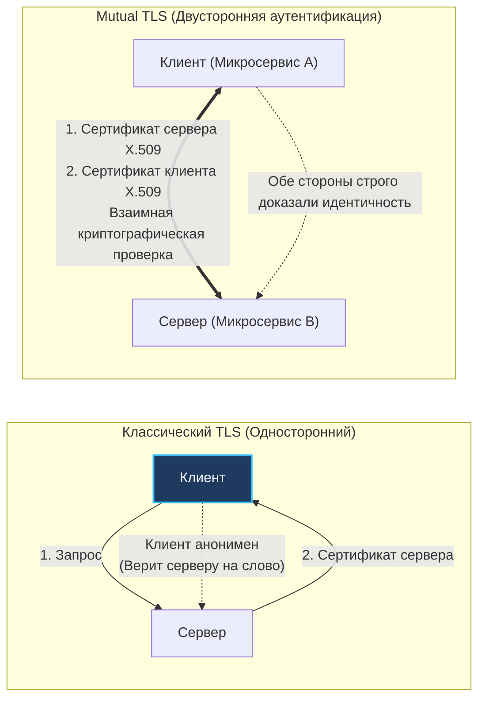
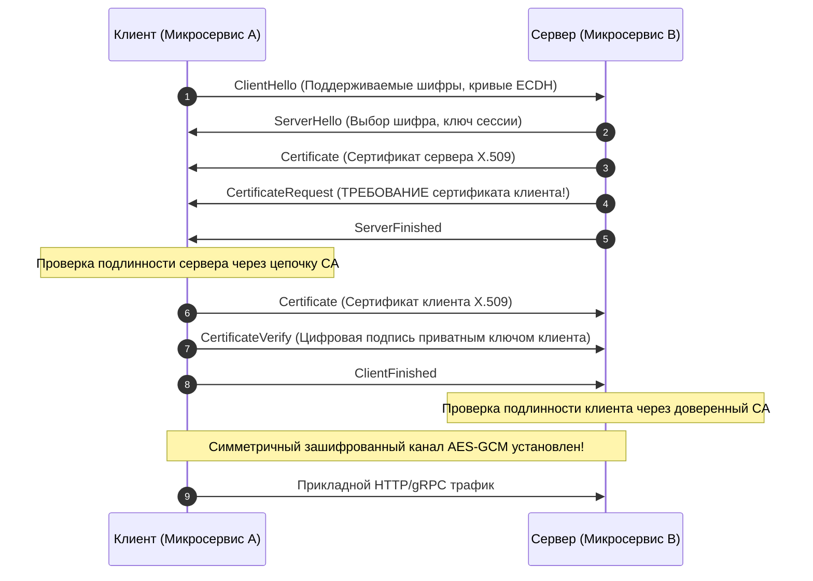
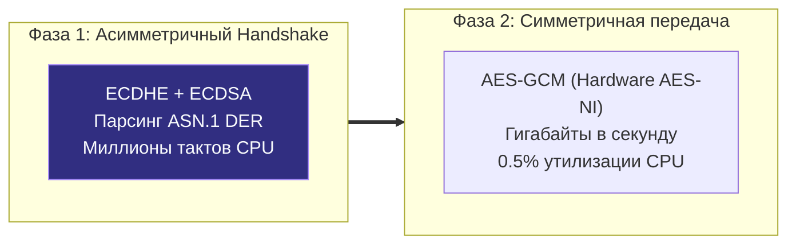

## Паранойя как стандарт: Zero Trust и взаимная аутентификация

Исторически безопасность корпоративных дата-центров строилась по классической средневековой модели «замка с глубоким рвом» (Castle-and-Moat). Периметр сети окружали тяжелые аппаратные межсетевые экраны и шлюзы API Gateway. Если пакет успешно миновал внешний кордон и оказался во внутренней локальной сети, ему автоматически и безоговорочно доверяли. Внутри кластера микросервис `A` мог отправлять любые HTTP-запросы к сервису `B` открытым текстом без шифрования и подтверждения полномочий.

Однако бурное развитие облачных платформ, контейнеризации и динамических мультитенантных кластеров похоронило эту модель. Современная парадигма безопасности формулируется бескомпромиссно: **Zero Trust (Абсолютное нулевое доверие)**.

Мы больше не доверяем никому — даже процессам, запущенным на соседнем процессорном ядре того же физического сервера. Сеть по умолчанию считается скомпрометированной и враждебной. Злоумышленник, получивший доступ к уязвимому контейнеру через RCE, не должен иметь возможности пассивно перехватывать трафик через `tcpdump` (Man-in-the-Middle) или отправлять поддельные запросы от лица доверенного биллинга (Impersonation).

**mTLS (Mutual Transport Layer Security / Взаимный TLS)** — это протокол строгой двусторонней криптографической аутентификации. Если стандартный односторонний TLS (привычный по HTTPS в веб-браузерах) гарантирует клиенту подлинность сервера, то mTLS принуждает **обе стороны** доказать свою цифровую идентичность, предъявив криптографические сертификаты X.509.



---

## Под капотом: Рукопожатие mTLS (Handshake)

В основе mTLS лежит инфраструктура открытых ключей (Public Key Infrastructure, PKI). И клиентский, и серверный узел обладают собственной парой ключей (приватный ключ и публичный сертификат), подписанной доверенным Центром Сертификации (Certificate Authority, CA).

Проследим последовательность установки криптографической сессии в протоколе TLS 1.3:



Ключевым отличием от обычного HTTPS выступает директива `CertificateRequest` со стороны сервера и встречные сообщения `Certificate` и `CertificateVerify` со стороны клиента. 

Если клиент не предоставит валидный сертификат, подписанный утвержденным корневым центром `ClientCAs`, сервер моментально обрывает TCP-рукопожатие (TLS Alert), даже не вычитывая ни единого байта из сокета.

---

## Реализация mTLS на Go (Standard Library)

Язык Go великолепен тем, что полноценная поддержка mTLS с аппаратным ускорением встроена прямо в стандартный пакет `crypto/tls`. Вам не понадобятся тяжелые сторонние фреймворки.

### Серверная часть (Защищенный API)

Чтобы обязать входящие подключения предъявлять клиентский сертификат, мы настраиваем свойство `ClientAuth` в структуре `tls.Config`.

```go
package main

import (
	"crypto/tls"
	"crypto/x509"
	"log"
	"net/http"
	"os"
)

func main() {
	// 1. Загружаем сертификат доверенного Центра Сертификации (CA)
	caCert, err := os.ReadFile("certs/ca.crt")
	if err != nil {
		log.Fatalf("Ошибка чтения CA сертификата: %v", err)
	}

	caCertPool := x509.NewCertPool()
	if !caCertPool.AppendCertsFromPEM(caCert) {
		log.Fatal("Не удалось добавить CA сертификат в пул доверия")
	}

	// 2. Формируем конфигурацию TLS
	tlsConfig := &tls.Config{
		// RequireAndVerifyClientCert — квинтэссенция mTLS!
		// Сервер принудительно требует клиентский сертификат и верифицирует его по CA
		ClientAuth: tls.RequireAndVerifyClientCert,
		ClientCAs:  caCertPool,

		// Отсекаем устаревшие уязвимые версии протоколов
		MinVersion: tls.VersionTLS13,
	}

	server := &http.Server{
		Addr:      ":8443",
		TLSConfig: tlsConfig,
		Handler: http.HandlerFunc(func(w http.ResponseWriter, r *http.Request) {
			// Извлекаем подтвержденную личность клиента прямо из TLS-сессии
			if len(r.TLS.PeerCertificates) > 0 {
				clientCert := r.TLS.PeerCertificates[0]
				clientIdentity := clientCert.Subject.CommonName
				w.Write([]byte("Успешная mTLS авторизация: " + clientIdentity))
				return
			}
			http.Error(w, "Сертификат отсутствует", http.StatusUnauthorized)
		}),
	}

	log.Println("Запуск защищенного mTLS сервера на порту :8443")
	// Передаем серверный сертификат и его приватный ключ
	if err := server.ListenAndServeTLS("certs/server.crt", "certs/server.key"); err != nil {
		log.Fatalf("Ошибка работы сервера: %v", err)
	}
}
```

---

### Клиентская часть

Стандартный `http.Client` по умолчанию ничего не знает о клиентских ключах. Мы должны явно проинициализировать его через `http.Transport`.

```go
package main

import (
	"crypto/tls"
	"crypto/x509"
	"io"
	"log"
	"net/http"
	"os"
)

func main() {
	// 1. Загружаем собственный клиентский сертификат и приватный ключ
	clientCert, err := tls.LoadX509KeyPair("certs/client.crt", "certs/client.key")
	if err != nil {
		log.Fatalf("Ошибка загрузки клиентской пары ключей: %v", err)
	}

	// 2. Загружаем CA для верификации подлинности удаленного сервера
	caCert, err := os.ReadFile("certs/ca.crt")
	if err != nil {
		log.Fatalf("Ошибка чтения CA: %v", err)
	}
	caCertPool := x509.NewCertPool()
	caCertPool.AppendCertsFromPEM(caCert)

	// 3. Собираем TLS конфигурацию клиента
	tlsConfig := &tls.Config{
		Certificates: []tls.Certificate{clientCert},
		RootCAs:      caCertPool,
		MinVersion:   tls.VersionTLS13,
	}

	// 4. Подменяем Transport с настроенным пулом соединений
	client := &http.Client{
		Transport: &http.Transport{
			TLSClientConfig: tlsConfig,
			// Критически важно: держим постоянные соединения!
			MaxIdleConns:        100,
			MaxIdleConnsPerHost: 20,
			IdleConnTimeout:     90 * time.Second,
		},
	}

	// Выполняем безопасный сетевой вызов
	resp, err := client.Get("https://localhost:8443")
	if err != nil {
		log.Fatalf("Ошибка mTLS вызова: %v", err)
	}
	defer resp.Body.Close()

	body, _ := io.ReadAll(resp.Body)
	log.Printf("Ответ сервера: %s", body)
}
```

---

## Mechanical Sympathy: Налог на криптографию

Криптография никогда не бывает бесплатной. Чтобы архитектурные решения не привели к просадке пропускной способности, инженер обязан понимать стоимость mTLS на уровне кремния и процессорных инструкций.

Жизненный цикл защищенного соединения состоит из двух принципиально разных фаз:

1. **Асимметричная фаза (Handshake):** Обмен ключами по протоколу Диффи-Хеллмана на эллиптических кривых (ECDHE) и валидация цифровых подписей (RSA или ECDSA). Математика асимметричного шифрования оперирует огромными числами и требует миллионов процессорных тактов. В mTLS эта нагрузка **удваивается**, так как процессор вынужден валидировать цепочки сертификатов с обеих сторон.
2. **Симметричная фаза (Data Transfer):** После завершения рукопожатия поток данных шифруется быстрым симметричным шифром (AES-128-GCM или ChaCha20-Poly1305). На современных процессорах архитектур x86-64 и ARM64 шифрование AES аппаратно ускорено специальными инструкциями процессора (**AES-NI**). Симметричное шифрование прокачивает гигабайты в секунду практически с нулевым влиянием на CPU.



> [!warning] Ловушка / Gotcha
> Если в вашем Go-коде не настроен пул долгоживущих TCP-соединений (Connection Pooling), каждый HTTP-запрос будет закрывать сокет и инициировать новое рукопожатие mTLS с нуля.
> 
> Процессор окажется на 90% утилизирован разбором структур ASN.1 DER и проверкой цифровых подписей сертификатов, а не бизнес-логикой. Всплеск аллокаций памяти в куче под парсинг сертификатов обрушит производительность GC.
> 
> **Решение:** Тонкая настройка параметров `MaxIdleConns`, `MaxIdleConnsPerHost` и `IdleConnTimeout` в структуре `http.Transport` клиента.

---

## Архитектурные ловушки и паттерны (Senior Level)

### 1. Ротация сертификатов без даунтайма

В архитектуре Zero Trust сертификаты выпускаются краткосрочными: срок их действия часто составляет от 24 часов до нескольких дней.

Если приложение единожды загружает пару ключей через `tls.LoadX509KeyPair` в функции `main()`, то при обновлении сертификата на диске вам придется перезапускать весь процесс Go, сбрасывая активные клиентские соединения.

> [!tip] Собеседование
> **Вопрос:** Как реализовать бесшовную ротацию сертификатов в Go-сервере на лету, не перезапуская процесс `http.Server` и не обрывая входящие сокеты?
> **Ответ:** Использовать динамический коллбэк `GetCertificate` в структуре `tls.Config`.

Вместо статического поля `Certificates` в конфигурацию передается функция: рантайм Go вызывает её **на лету при каждом новом входящем TLS-рукопожатии**. Фоновая горутина следит за файлами на диске (или забирает новые сертификаты из HashiCorp Vault) и атомарно подменяет структуру в памяти:

```go
type CertManager struct {
    currentCert atomic.Pointer[tls.Certificate]
}

// GetCertificate вызывается рантаймом Go динамически при каждом handshake
func (cm *CertManager) GetCertificate(hello *tls.ClientHelloInfo) (*tls.Certificate, error) {
    return cm.currentCert.Load(), nil
}
```

### 2. Time и Clock Drift

Криптографическая валидация сертификата X.509 жестко опирается на временные рамки полей `NotBefore` и `NotAfter`.

Если на одном из физических узлов кластера рассинхронизировались системные часы операционной системы (проблема Clock Drift, подробно рассмотренная в статье [[5. Time и clock drift]]), сервер начнет массово отвергать абсолютно легитимные сертификаты клиентов, считая их либо еще не вступившими в силу, либо уже просроченными. Корректная работа системного демона синхронизации времени (Chrony/NTP) на хостах является обязательным условием для mTLS.

### 3. Service Mesh: Возвращение к истокам

Самостоятельно поддерживать код `crypto/tls`, пулы корневых сертификатов CA, списки отзыва (CRL) и алгоритмы ротации в каждом микросервисе — тяжелейший операционный долг. В разных командах неизбежно возникнут расхождения версий и инциденты с забытыми сертификатами.

Именно поэтому в современных распределенных системах **mTLS целиком делегируют Service Mesh** (см. [[1. Service mesh]] и [[2. Envoy и sidecar]]).

Приложение на Go пишет чистый, незашифрованный HTTP/gRPC на локальный петлевой интерфейс `localhost`. Локальный Sidecar-прокси Envoy автоматически получает динамические краткосрочные сертификаты от Control Plane (по стандарту криптографической идентификации SPIFFE/SPIRE), прозрачно упаковывает трафик в mTLS-сессию и ротирует ключи каждые несколько часов без единой строчки кода в Go!

---

## Итог

1. **Zero Trust в действии:** mTLS устраняет иллюзию безопасности внутреннего периметра, требуя криптографического подтверждения личности от каждого сетевого узла.
2. **Штатные средства Go:** Стандартный пакет `crypto/tls` предоставляет полный спектр инструментов для взаимного TLS через директиву `ClientAuth: tls.RequireAndVerifyClientCert`.
3. **Борьба за ресурсы:** Из-за высокой стоимости асимметричного рукопожатия переиспользование постоянных соединений (Connection Pooling) в `http.Transport` обязательно для сохранения пропускной способности CPU.
4. **Горячая ротация:** Функция-коллбэк `GetCertificate` позволяет обновлять краткосрочные сертификаты на лету без перезапуска процесса.
5. **Делегирование сетке:** В промышленных кластерах генерация, валидация и ротация mTLS делегируются связке Envoy и Service Mesh, оставляя прикладной код чистым.

Шифрование mTLS дает стопроцентную гарантию того, *кто именно* обратился к сервису. Однако сам факт подтверждения личности не отвечает на следующий критический вопрос: *имеет ли клиент право* обращаться к этому ресурсу? Тот факт, что условный «Сервис баннеров» предъявил подлинный сертификат, вовсе не означает, что ему разрешено читать базу данных биллинга. О том, как реализовать жесткую сегментацию трафика на уровне ядра, мы поговорим в следующей статье: [[4. Network policies]].