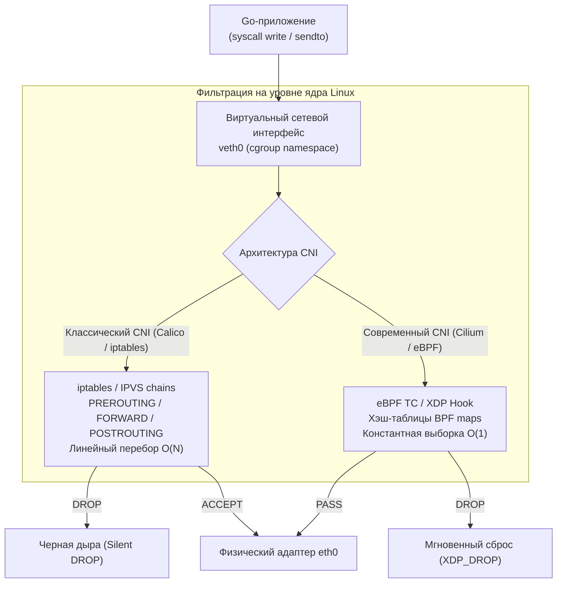
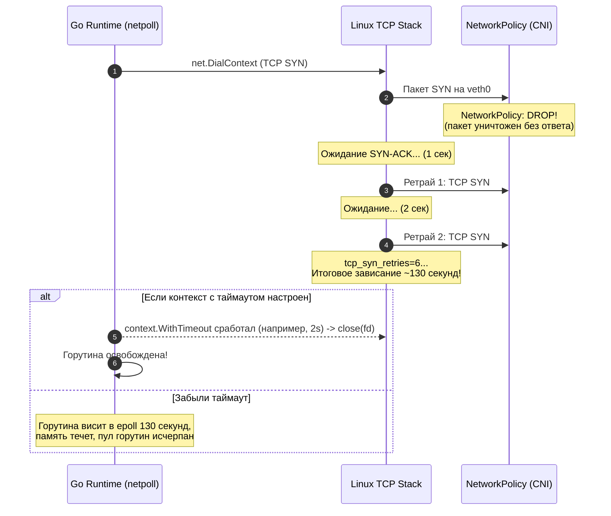

## Фаервол для микросервисов: Изоляция на уровне пакетов

В прошлой статье [[3. mTLS]] мы перешли к парадигме Zero Trust: научили наши сервисы предъявлять криптографические паспорта при каждом рукопожатии. Казалось бы, периметр надёжен: даже если злоумышленник прослушивает коммутаторы дата-центра, он не сможет прочитать зашифрованный трафик или сымитировать легитимный сервис без приватного ключа.

Но криптография отвечает исключительно на вопрос *«Кто ты?»*. Она работает на прикладном уровне (L7) или на верхнем транспортном слое (TLS). Что произойдет, если скомпрометированный контейнер в демилитаризованной зоне решит просканировать внутренние порты базы данных? Или начнет заливать соседа терабайтами мусорных пакетов, вызывая классический отказ в обслуживании (DDoS)?

Доводить дело до TLS-рукопожатия (которое, как мы убедились, сжигает драгоценные миллисекунды и такты CPU на вычисления асимметричных шифров) в таких ситуациях — непозволительная расточительность. Вражеский или аномальный трафик должен уничтожаться мгновенно, ещё «на подлёте», на уровне сырых сетевых пакетов (L3/L4).

В оркестраторах вроде Kubernetes первой линией обороны служат **Network Policies (Сетевые политики)**. В этой лекции мы разберём, как они устроены на уровне ядра Linux, почему небрежно настроенный фаервол способен парализовать планировщик Go-рантайма, и как выстроить глубокоэшелонированную изоляцию микросервисов.

---

## Иллюзия плоской сети

Исторически Kubernetes строился вокруг концепции радикального упрощения сетевой топологии — так называемой **плоской сети (Flat Network)**:

> **Базовый постулат плоской сети:**  
> Каждый под получает уникальный IP-адрес внутри кластера. **Любой под может свободно установить соединение с любым другим подом**, даже если они находятся на разных физических серверах или в совершенно разных пространствах имён (`namespace`).

В лаборатории или стартапе на пять микросервисов это выглядит настоящим инженерным чудом: никакой ручной настройки маршрутизаторов, никакого NAT между подами, единое адресное пространство. Но в продакшене корпоративного уровня плоская сеть превращается в пороховую бочку.

```mermaid
flowchart LR
    subgraph Flat["Плоская сеть (Flat Network по умолчанию)"]
        direction TB
        F1["frontend pod"] -->|"Прямой доступ к порту 5432!| DB1["finance-db pod"]
        F1 -->|"Свободный TCP SYN| AUTH1["auth-service"]
    end
    
    subgraph Segmented["Сегментированная сеть (Network Policies)"]
        direction TB
        F2["frontend pod"] -.->|"BLOCKED (DROP)| DB2["finance-db pod"]
        F2 -->|"Разрешено (HTTP 8080)| GW["api-gateway"]
        GW -->|"Разрешено| AUTH2["auth-service"]
    end
```

Представьте, что у вас есть общедоступный namespace `frontend` и изолированный namespace `finance-db`. По умолчанию взломанный pod фронтенда (например, через RCE в уязвимой сторонней JS/Go-библиотеке) может напрямую открыть обычный TCP-сокет к реплике базы данных с платёжными транзакциями. Если в СУБД найдена уязвимость нулевого дня или пароль случайно утек в логи, весь кластер оказывается мгновенно скомпрометирован.

В кораблестроении трюм судна всегда разделяют на водонепроницаемые отсеки: пробоина в одном отсеке не должна топить весь корабль. **Сетевые политики (Network Policies)** — это переборки в кластере. Это декларативные спецификации, предписывающие инфраструктуре: *«Разреши этому поду общаться только с вот этим списком подов на строго определённых портах, а весь остальной трафик — уничтожь на корню»*.

---

## Mechanical Sympathy: CNI, iptables и eBPF

Сами по себе манифесты `NetworkPolicy` в Kubernetes — это лишь абстрактные документы в формате YAML. Компонент Kubernetes API просто валидирует их синтаксис и сохраняет запись в распределённое хранилище `etcd`. Контроллер Kubernetes не накладывает правила фильтрации на сетевую карту. 

Всю физическую работу по перехвату и фильтрации трафика выполняет **CNI (Container Network Interface)** — сетевой плагин кластера (например, Calico, Cilium, Weave Net или Flannel). 

Как именно CNI физически отсекает запрещённый трафик на уровне операционной системы?



### 1. Классический подход: цепочки iptables и IPVS
В классических CNI (таких как Calico в режиме iptables) локальный демон-агент, запущенный на каждом узле кластера, непрерывно транслирует объекты `NetworkPolicy` в тысячи низкоуровневых правил утилиты `iptables` ядра Linux.

Каждый сетевой пакет, покидающий виртуальный интерфейс пода (`veth`) или поступающий в него, вынужден последовательно преодолевать длинные цепочки проверок ядра:
- `PREROUTING`: трансляция адресов и первичный учет;
- `FORWARD`: маршрутизация пакетов между виртуальными интерфейсами подов;
- `POSTROUTING`: финальная обработка перед отправкой в физический адаптер.

При масштабировании кластера до тысяч подов и сервисов количество правил в цепочках `iptables` исчисляется десятками тысяч. Поскольку стандартный движок `iptables` выполняет линейный перебор правил ($O(N)$), задержка (Latency) обработки каждого TCP-пакета начинает ощутимо деградировать, а процессор узла сжигает драгоценные такты на холостую работу в ядре. Применение технологии `IPVS` частично спасает ситуацию за счёт хэш-таблиц IP-адресов, но глобальная архитектурная сложность остаётся высокой.

### 2. Современный подход: eBPF (Cilium)
Современные сетевые плагины нового поколения, такие как Cilium, полностью отказываются от неповоротливого стека `iptables`. Они опираются на **eBPF (Extended Berkeley Packet Filter)**.

Вместо обхода статических цепочек правил Cilium компилирует компактные программы на языке C прямо в байт-код ядра Linux. Эти микропрограммы монтируются в самые ранние точки сетевого тракта:
- **TC (Traffic Control):** перехват пакетов на уровне виртуального интерфейса `veth`;
- **XDP (eXpress Data Path):** обработка на уровне кольцевых буферов драйвера сетевой карты (NIC Ring Buffer), ещё до того, как ядро выделит структуру `sk_buff`!

Политики безопасности хранятся в эффективных хэш-таблицах (eBPF Maps). Проверка прав доступа выполняется со скоростью $O(1)$ за доли наносекунд. Если пакет запрещён, eBPF-программа возвращает инструкцию `XDP_DROP` — пакет стирается из памяти сетевого адаптера без малейшей нагрузки на сетевой стек ядра.

---

## Взгляд из Go: DROP против REJECT

Для Go-разработчика понимание механики блокировки сетевого пакета критически важно. От того, *как именно* фаервол обрывает нежелательную коммуникацию, зависит жизнеспособность рантайма Go под нагрузкой.

В сетевых экранах существует два принципиально разных способа обработки запрещённого пакета:

1. **REJECT (Явный отказ):**  
   Фаервол перехватывает запрещённый пакет и тут же отправляет отправителю служебный ответ. Для протокола TCP это пакет с флагом `RST` (Reset), а для UDP — контрольное сообщение `ICMP Port Unreachable`.
2. **DROP (Скрытое отбрасывание):**  
   Фаервол бесследно стирает пакет. В обратную сторону не летит абсолютно ничего — пакет проваливается в «чёрную дыру».

> [!warning] Ловушка / Gotcha: Анатомия зависания горутины при DROP
> Kubernetes Network Policies **всегда работают в режиме DROP**, а не REJECT.  
> 
> Что происходит внутри Go-приложения, если сетевая политика блокирует запрос?
> 1. Ваша горутина вызывает `net.Dial` или `net.DialContext` (например, неявно внутри `http.Get` или `sql.Open`).
> 2. Сетевой стек Linux формирует стартовый пакет `TCP SYN` и выбрасывает его в виртуальный кабель `veth`.
> 3. CNI молча уничтожает пакет. Ответа нет.
> 4. Go-рантайм регистрирует файловый дескриптор сокета в системном мультиплексоре `epoll` и переводит горутину в спящее состояние (`_Gwaiting`), отдавая поток ОС `M` другим задачам.
> 5. Сетевой стек ядра Linux добросовестно ожидает ответа `SYN-ACK`. Не дождавшись, ядро повторяет попытку отправки `SYN` с экспоненциальной задержкой (1s, 2s, 4s, 8s, 16s, 32s...).
> 6. Системный параметр ядра Linux `tcp_syn_retries` по умолчанию равен **6**. Это означает, что операционная система признает неудачу и вернёт ошибку `connection refused` только через **127–130 секунд!**
> 
> Если ваш Go-сервис обрабатывает входящие запросы и на каждый запрос пытается постучаться в закрытый фаерволом сервис без контекста с таймаутом, за 2 минуты в памяти зависнут десятки тысяч горутин. Каждая горутина удерживает свои стековые фреймы и ассоциированные структуры `epoll`, что неминуемо ведёт к исчерпанию дескрипторов и аварийному падению по OOM (Out of Memory).



Именно поэтому мы столь настойчиво изучали управление задержками в статье [[3. Timeout]]. В микросервисной среде Kubernetes вызов функции `context.WithTimeout` — это не просто признак аккуратности, а единственный механизм выживания при любых инцидентах в сетевой топологии.

---

## Паттерн: Default Deny (Запретить всё)

Канонический принцип информационной безопасности гласит: **«Всё, что явно не разрешено — запрещено»**. 

Если в кластере создаётся новый namespace без сетевых политик, он распахивает двери для любых соединений. Корректная стратегия настройки изоляции всегда начинается с развёртывания правила **Default Deny**:

```yaml
apiVersion: networking.k8s.io/v1
kind: NetworkPolicy
metadata:
  name: default-deny-all
  namespace: my-services
spec:
  podSelector: {} # Пустой селектор означает "выбрать ВСЕ поды в namespace"
  policyTypes:
  - Ingress # Блокируем весь входящий трафик
  - Egress  # Блокируем весь исходящий трафик
```

Как только системный администратор применяет этот манифест, **все Go-сервисы в пространстве имён `my-services` мгновенно теряют способность к любой сетевой коммуникации**. Они не могут связаться с базой данных, не могут ответить на входящий HTTP-запрос и не могут опросить соседей.

Теперь мы начинаем точечно прорезать строго контролируемые «окна». Допустим, у нас есть сервис авторизации `auth-service`, который должен принимать входящий трафик исключительно от шлюза `api-gateway` на порт 8080:

```yaml
apiVersion: networking.k8s.io/v1
kind: NetworkPolicy
metadata:
  name: allow-gateway-to-auth
  namespace: my-services
spec:
  podSelector:
    matchLabels:
      app: auth-service # Политика применяется к auth-service
  policyTypes:
  - Ingress
  ingress:
  - from:
    - podSelector:
        matchLabels:
          app: api-gateway # Разрешаем входящие пакеты ТОЛЬКО от api-gateway
    ports:
    - protocol: TCP
      port: 8080
```

Теперь никакой другой под (включая скомпрометированный контейнер из `frontend`) физически не сможет отправить ни одного TCP-сегмента на порт сервиса `auth-service`.

---

## Скрытая угроза: DNS Resolution

Внедрение политики Default Deny для исходящего трафика (`Egress`) таит в себе классическую инженерную ловушку, на которую регулярно наступают даже опытные разработчики.

Запрещая исходящий трафик, вы блокируете не только запросы к сторонним API и базам данных. Вы отрезаете под от сердца внутренней инфраструктуры кластера — сервиса **CoreDNS** (или `kube-dns`), расположенного в служебном пространстве имён `kube-system`.

> [!tip] Собеседование
> **Вопрос:** Вы применили Network Policy, разрешающую сервису исходящий доступ к поду базы данных `database-pod`. Но в логах вашего Go-микросервиса при вызове `sql.Open` или `net.Dial` сыплются ошибки:  
> `dial tcp: lookup database-svc on 10.96.0.10:53: no such host`  
> либо вызовы аварийно завершаются по таймауту. База данных доступна и исправна. В чём кроется первопричина сбоя?  
> 
> **Ответ:** Go-приложение не обращается к базе данных по сырому IP-адресу — оно использует доменное имя Kubernetes-сервиса (`database-svc`). Для этого стандартный пакет `net` отправляет UDP-дейтаграмму на 53 порт кластерного DNS-резолвера (`kube-dns` с адресом `10.96.0.10`).  
> Поскольку политика Default Deny `Egress` заблокировала абсолютно весь исходящий трафик из пода, DNS-запрос отбрасывается на уровне интерфейса `veth`. Go-резолвер не получает ответа и рапортует об ошибке `no such host`.  
> 
> **Решение:** Вместе с правилом Default Deny всегда создаётся глобальная разрешающая политика для CoreDNS.

Чтобы сетевой стек Go мог превращать DNS-имена микросервисов в сетевые координаты, мы **обязаны** явно разрешить исходящие UDP-пакеты на 53 порт системного пространства имён `kube-system`:

```yaml
apiVersion: networking.k8s.io/v1
kind: NetworkPolicy
metadata:
  name: allow-dns-egress
  namespace: my-services
spec:
  podSelector: {} # Применяется ко всем подам namespace
  policyTypes:
  - Egress
  egress:
  - to:
    - namespaceSelector:
        matchLabels:
          kubernetes.io/metadata.name: kube-system
    ports:
    - protocol: UDP
      port: 53
```

---

## Network Policies vs Service Mesh (Istio)

В предыдущих лекциях [[1. Service mesh]] и [[2. Envoy и sidecar]] мы подробно разбирали проксирование трафика через Service Mesh, где безопасность контролируется правилами `AuthorizationPolicy`. Возникает резонный вопрос: если у нас уже развёрнут Istio, зачем тратить усилия на поддержку Kubernetes Network Policies?

Ответ заключается в фундаментальном принципе **Defense in Depth (Глубокоэшелонированная защита)**. Разные уровни сетевой модели OSI защищают от принципиально разных классов угроз:

| Характеристика | Istio AuthorizationPolicy (L7) | Kubernetes NetworkPolicy (L3/L4) |
|---|---|---|
| **Уровень абстракции** | Прикладной уровень (HTTP, gRPC, URL, Headers) | Сетевой и транспортный уровни (IP, TCP, UDP, Ports) |
| **Точка исполнения** | User-space прокси (Envoy Sidecar) | Kernel-space (ядро Linux: eBPF / iptables) |
| **Гранулярность** | Тонкая (HTTP-метод, путь `/api/v1/users`, токены JWT) | Грубая (IP-подсеть, селектор подов, номер порта) |
| **Устойчивость к RCE** | Уязвимость в коде Envoy компрометирует правила L7 | Изоляция ядра ОС не зависит от состояния пользовательских процессов |

Рассмотрим практический сценарий:
1. Вы настроили в Istio правило: *«Разрешить сервису `api-gateway` выполнять HTTP GET по маршруту `/api/v1/users`, но запретить HTTP POST»*. Это элегантное L7-регулирование.
2. В кодовой базе Envoy (написанной на C++) обнаруживается уязвимость переполнения буфера или Remote Code Execution (RCE).
3. Злоумышленник захватывает процесс Envoy внутри пода и получает сырой Linux-сокет. Он может попытаться открыть прямое соединение с финансовой базой данных `finance-db` в обход всей прикладной логики.
4. На этом этапе в игру вступает **Kubernetes NetworkPolicy**: на уровне ядра Linux eBPF-фильтр видит исходящий TCP-пакет на закрытый порт базы данных и молниеносно уничтожает его, блокируя горизонтальное распространение атаки (lateral movement).

---

## Итог

1. **Разрушение иллюзии:** Плоская сеть кластера по умолчанию удобна для экспериментов, но фатальна в продакшене. Сетевые политики превращают монолитную сеть в систему изолированных отсеков.
2. **Аппаратное сочувствие к ядру:** CNI-плагины транслируют правила либо в неповоротливые линейные цепочки `iptables`, либо в высокоскоростные eBPF-хуки (`XDP`), проверяющие пакеты за константное время $O(1)$.
3. **DROP молчит и убивает:** Сетевые экраны Kubernetes используют отбрасывание пакетов (`DROP`), а не явный отказ (`REJECT`). Неотвеченный `TCP SYN` удерживает горутину в пуле `epoll` до 130 секунд по вине `tcp_syn_retries`. Жёсткие таймауты (`context.WithTimeout`) — обязательное условие стабильности Go-кода.
4. **Не забывайте про DNS:** Политика Default Deny отрезает под от CoreDNS (`kube-system`, UDP порт 53). Без явного разрешения DNS-резолвер Go вернёт ошибку разрешения имён.
5. **Эшелонированная оборона:** Network Policies (L3/L4) и Service Mesh (L7) дополняют друг друга, защищая кластер как от прикладных атак, так и от прямого захвата сетевых сокетов.

Мы возвели непреодолимую стену сетевых политик. Несанкционированный трафик уничтожается ядром Linux. Но что делать, если легитимные пользователи начинают скачивать тяжёлые файлы и вызывают затор в пропускной способности канала? Как обуздать burst-всплески сетевого трафика? Об этом — в следующей лекции: [[5. Traffic shaping]].