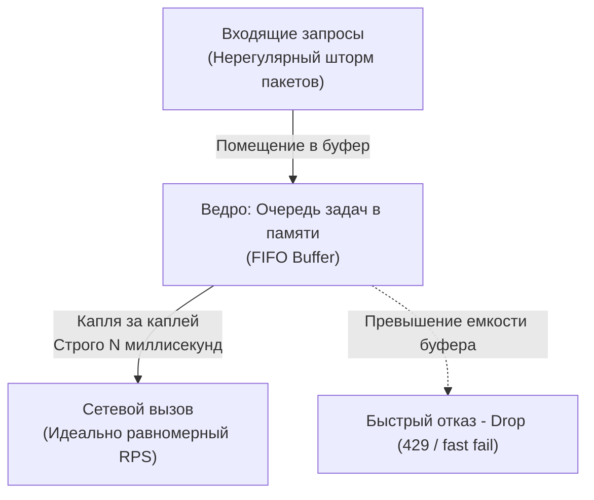
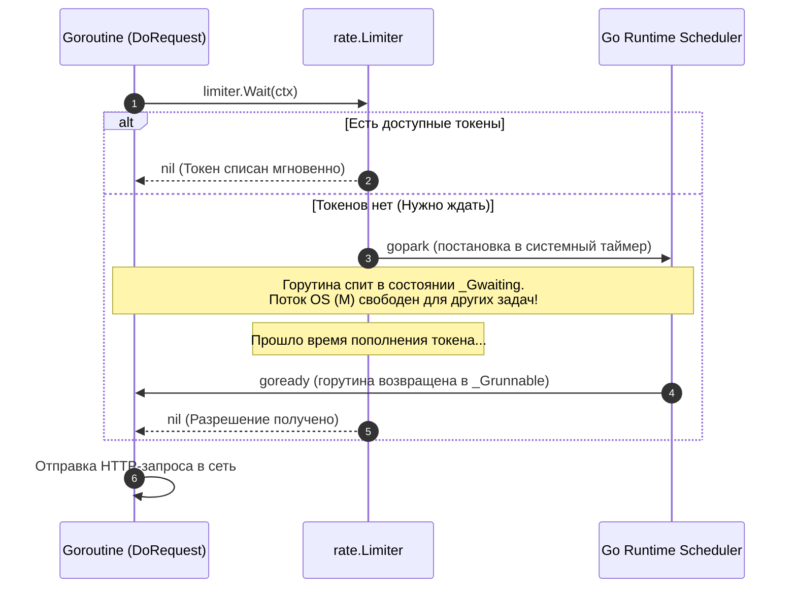
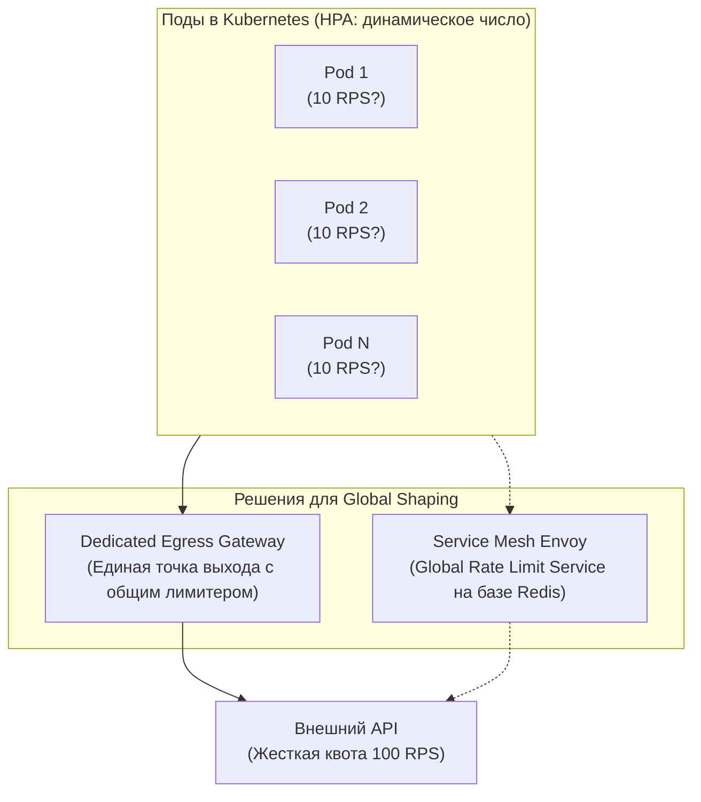

## Укрощение шторма: Плавное формирование трафика

В распределённых системах сетевой трафик почти никогда не течёт ровной и спокойной рекой. Пользователи одновременно просыпаются по утрам, планировщики запускают ночные cron-задачи, а упавшие сервисы дружно оживают и бросаются повторять неуспешные запросы (инициируя лавину повторов, которую мы исследовали в статье [[2. Retry и backoff]]). Всё это порождает резкие и разрушительные **всплески (bursts)**.

Когда мы изучали паттерн [[5. Load shedding]], наша цель была оборонительной: спасти *собственный* сервер от захлёбывания путём безжалостного отсечения избыточных запросов. Это хирургический инструмент защиты принимающей стороны.

Но что, если мы находимся по другую сторону баррикад — на стороне *клиента*? Представьте: вашему бэкенду необходимо отправить 100 000 транзакционных push-уведомлений через сторонний шлюз (например, платёжный сервис или Telegram Bot API), провайдер которого установил железный лимит: не более 500 вызовов в секунду. Если вы выстрелите этим пакетом из сотни тысяч горутин одновременно, удалённый шлюз моментально захлебнётся, вернёт каскад ошибок `429 Too Many Requests`, а в худшем случае — заблокирует ваш IP-адрес за DDoS-атаку.

Чтобы выжить в таких условиях, пики необходимо сглаживать. Эту задачу решает **Traffic Shaping (Формирование трафика)**. В отличие от жесткого отсечения (Policing / Rate Limiting, которое просто выбрасывает «лишние» запросы в корзину), формирование трафика аккуратно задерживает и буферизирует вызовы, превращая рваный шторм в размеренный, предсказуемый и плавный поток.

В этой лекции мы заглянем в физику микро-всплесков на уровне сетевых коммутаторов, напишем надёжный шейпер на Go и разберём коварную системную ловушку — Bufferbloat.

---

## Mechanical Sympathy: Анатомия микро-всплесков

В сетевой инженерии есть популярная иллюзия: полагаться на средние значения мониторинга.

> [!info] Под капотом
> Представьте сетевой интерфейс с пропускной способностью 1 Гбит/с. График Prometheus демонстрирует абсолютно спокойную картину: средняя загрузка канала за минуту составляет комфортные 100 Мбит/с. Кажется, что сетевой стек загружен всего на 10%, и у нас колоссальный запас прочности.
> 
> Однако усреднённые метрики коварно лгут. На масштабе единиц миллисекунд трафик передаётся короткими и концентрированными **микро-всплесками (micro-bursts)**. Серверный процесс может попытаться «выплюнуть» пачку данных размером в 10 мегабайт за крошечный интервал в 1 миллисекунду. В это мгновение мгновенная скорость передачи взлетает до физического потолка линии, а буферы аппаратных сетевых коммутаторов (Hardware Switches) переполняются за микросекунды. 
> 
> Коммутатор не успевает прокачать пакеты в выходной порт и начинает аварийно сбрасывать хвост очереди (хрестоматийный сброс **Tail Drop**).
> 
> В дело вступает транспортный протокол TCP: потеря пакета провоцирует тайм-аут повторной передачи — **Retransmission TimeOut (RTO)**. Окно перегрузки TCP (Congestion Window, CWND) мгновенно схлопывается до минимального значения. Задержка (Latency) микросервиса скачкообразно вырастает с 1 мс до 200 мс! Вы задействовали меньше десятой части номинальной полосы канала, но уже дестабилизировали кластерную сеть из-за неуправляемых микро-всплесков.

```mermaid
flowchart TD
    subgraph Burst["Неуправляемый трафик (Micro-burst)"]
        direction TB
        B_In["Всплеск: 10 МБ за 1 мс"] --> B_SW["Буфер коммутатора (Switch Buffer)"]
        B_SW -->|Переполнение буфера!| B_Drop["Tail Drop: сброс пакетов"]
        B_Drop --> B_TCP["TCP RTO: схлопывание окна CWND, Latency 200ms"]
    end

    subgraph Shaped["Сформированный трафик (Paced / Shaped)"]
        direction TB
        S_In["Тот же объем данных"] --> S_Pace["Шейпер приложения (Pacing)"]
        S_Pace -->|"Равномерные интервалы (микро-паузы)| S_SW["Буфер коммутатора"]
        S_SW -->|Плавная передача| S_Net["Сеть без потерь, Latency 1ms"]
    end
```

**Traffic Shaping (или Pacing)** на уровне приложения или сетевого стека операционной системы устраняет эту проблему: он принудительно расставляет микроскопические интервалы между отправкой порций данных, защищая промежуточное сетевое оборудование.

---

## Паттерн Leaky Bucket (Дырявое ведро)

Фундаментальным алгоритмом классического формирования трафика выступает концепция **Leaky Bucket (Дырявое ведро)**.

Аналогия из реального мира предельно наглядна: представьте ведро с калиброванным отверстием строго определённого диаметра в самом дне.
- **Входящий поток:** Вода (поступающие запросы или сетевые пакеты) может заливаться в ведро совершенно хаотично — то тонкой струйкой, то опрокинутым ведром.
- **Очередь (ёмкость):** Само ведро выполняет роль буфера в оперативной памяти.
- **Исходящий поток:** Из отверстия на дне вода вытекает строго с постоянной, неизменной скоростью — ровно по капле в такт таймера, ни каплей больше, ни каплей меньше.
- **Переполнение:** Если ведро переполняется (буфер очереди исчерпан), новые входящие порции воды переливаются через край и немедленно отбрасываются.



Главное отличие Leaky Bucket от конкурирующих подходов: он **принципиально не допускает всплесков на выходе**. Даже если в течение получаса система бездействовала, внезапно поступившая пачка запросов всё равно будет выпускаться в сеть строго монотонно.

---

## Реализация Traffic Shaping на Go

В экосистеме Go существуют два канонических подхода к реализации шейпинга:
1. Низкоуровневый — на базе встроенных каналов и таймера `time.Ticker` (классический Leaky Bucket с постоянным темпом).
2. Высокоуровневый — с помощью стандартного полуавтоматического пакета `golang.org/x/time/rate` (Token Bucket с поддержкой контролируемого всплеска).

Рассмотрим оба варианта с точки зрения внутреннего устройства среды выполнения Go.

### Подход 1: Канал и time.Ticker (Классический Pacing)

Когда нам требуется железобетонная гарантия того, что запросы покидают сервис не чаще, чем раз в `N` миллисекунд, идеальным решением становится связка буферизированного канала задач и системного тикера:

```go
package shaping

import (
	"context"
	"errors"
	"time"
)

// PacedSender отправляет задачи с жестко заданным интервалом
type PacedSender struct {
	tasks  chan func()
	ticker *time.Ticker
}

// NewPacedSender создает шейпер.
// rps - сколько запросов в секунду мы хотим отправлять.
// bufferSize - размер "ведра" (очереди).
func NewPacedSender(rps int, bufferSize int) *PacedSender {
	interval := time.Second / time.Duration(rps)
	return &PacedSender{
		tasks:  make(chan func(), bufferSize),
		ticker: time.NewTicker(interval),
	}
}

// Start запускает фоновый воркер, "выливающий" запросы
func (s *PacedSender) Start(ctx context.Context) {
	go func() {
		defer s.ticker.Stop()
		for {
			select {
			case <-ctx.Done():
				return
			case task := <-s.tasks:
				// Ждем тика перед отправкой задачи
				select {
				case <-s.ticker.C:
					task()
				case <-ctx.Done():
					return
				}
			}
		}
	}()
}

// Submit кладет задачу в "ведро"
func (s *PacedSender) Submit(task func()) error {
	select {
	case s.tasks <- task:
		return nil
	default:
		// Ведро переполнено. Возвращаем ошибку (Fast Fail)
		return errors.New("bucket is full")
	}
}
```

**Достоинства:** Код опирается на идиоматичные примитивы Go, не требует внешних зависимостей и обеспечивает образцовое математическое сглаживание трафика.  
**Недостатки:** Вызов `Submit` не блокирует вызывающую сторону, но сами замыкания `task` оседают в куче (heap) внутри канала. При переполнении буфера задачи аварийно сбрасываются.

---

### Подход 2: golang.org/x/time/rate

Инженеры Google предоставили сообществу эталонную библиотеку `x/time/rate`, реализующую алгоритм **Token Bucket (Корзина токенов)**.

Принципиальная разница между Token Bucket и Leaky Bucket:
- В Token Bucket в корзину с постоянной скоростью падают «разрешающие жетоны» (токены).
- Если запросов нет, корзина заполняется до максимального объёма (параметр `Burst`).
- Когда на сервис обрушивается внезапный наплыв клиентов, накопившиеся токены позволяют **мгновенно обслужить стартовую пачку запросов (Burst)**, после чего скорость нормализуется до базового лимита.

Ключевой метод пакета для задач шейпинга — метод `Wait` (а точнее, `Wait(ctx)`). Он переводит вызывающую горутину в спящий режим до тех пор, пока в корзине не сгенерируется необходимый токен.

```go
package shaping

import (
	"context"
	"fmt"
	"golang.org/x/time/rate"
)

type ApiClient struct {
	// Лимит: 50 RPS, максимальный разрешенный всплеск (Burst): 5
	limiter *rate.Limiter
}

func NewApiClient() *ApiClient {
	return &ApiClient{
		// rate.Limit(50) - генерирует 50 токенов в секунду
		limiter: rate.NewLimiter(rate.Limit(50), 5),
	}
}

func (c *ApiClient) DoRequest(ctx context.Context, payload string) error {
	// Wait заблокирует горутину (`gopark`), пока не появится свободный токен.
	// Это И ЕСТЬ шейпинг: мы искусственно задерживаем запрос,
	// чтобы вписаться в пропускную способность.
	if err := c.limiter.Wait(ctx); err != nil {
		return fmt.Errorf("request aborted: %w", err)
	}

	// Выполнение реального сетевого вызова
	// ...
	return nil
}
```



> [!tip] Собеседование
> **Вопрос:** В чём заключается фундаментальная разница между вызовами `limiter.Allow()` и `limiter.Wait()` в библиотеке `x/time/rate`?
> 
> **Ответ:**
> * `Allow()` — это примитив **Rate Limiting (Policing)**. Он выполняется неблокирующе и мгновенно возвращает булево значение: `true`, если токен был в наличии и списан, либо `false`, если лимит исчерпан. При получении `false` приложение не ждёт, а мгновенно отбрасывает запрос (возвращает статус `429 Too Many Requests` или запускает аварийную деградацию).
> * `Wait()` (или `limiter.Wait(ctx)`) — это примитив **Traffic Shaping (Формирование трафика)**. Он не сбрасывает запрос, а усыпляет текущую горутину через вызов рантайма `gopark`. Горутина мирно ждёт в очереди таймеров, пока токен не восстановится, тем самым идеально «причёсывая» исходящий поток запросов во времени.

---

## Архитектурные ловушки (Gotchas)

Формирование сетевого трафика — мощное, но опасное оружие. Непонимание его физических последствий способно обрушить клиентскую сторону ничуть не хуже серверной перегрузки.

### 1. Bufferbloat (Раздувание буфера)
Это одна из наиболее коварных болезней современных распределённых систем. Когда вы используете `Wait(ctx)` или буферизированные каналы с большой глубиной очереди, вы превращаете избыточный трафик в **растущую очередь задержки**.

Представьте практическую ситуацию:
- Провайдер разрешает нам отправлять ровно 50 RPS.
- Внутренний сервис единовременно порождает шквал из 500 запросов.
- Шейпер добросовестно раскладывает их по временной шкале: последние запросы в сформированной очереди физически доберутся до сетевого адаптера лишь через **10 секунд!**

Если на этих операциях был установлен клиентский контекст с разумным таймаутом `context.WithTimeout(ctx, 5*time.Second)` (как мы требовали в лекции [[3. Timeout]]), то ровно половина ваших запросов умрёт прямо внутри шейпера с ошибкой `context.DeadlineExceeded`, даже не попытавшись открыть сокет! Но что самое неприятное — они успеют заблокировать и израсходовать лимиты токенов лимитера.

> **Золотое правило:** Шейпинг допустим исключительно для фоновых, асинхронных конвейеров (отправка писем, аналитических событий, синхронизация реплик в фоне), где метрика Latency не является критической. Для синхронных интерактивных HTTP/gRPC запросов пользователя задержка в очереди почти всегда хуже немедленного отказа: используйте `Allow()` или механизмы [[5. Load shedding]].

### 2. Утечка горутин (Goroutine Leaks)
При бездумном вызове `limiter.Wait(ctx)` в синхронных обработчиках шквал из 10 000 входящих запросов породит 10 000 параллельных горутин. Каждая из них уснёт в ожидании токена.

Если система не защищена паттерном [[4. Bulkhead]] (жёстким пулом рабочих воркеров или семафором на конкурентность), сервер моментально раздует кучу (heap), удерживая стеки спящих потоков, и отправится в перезагрузку по нехватке памяти (OOM), несмотря на то, что исходящая линия связи оставалась кристально чистой.

### 3. Глобальный vs Локальный Shaping
Как и структуры Circuit Breaker, встроенный `rate.Limiter` функционирует строго локально — в оперативной памяти изолированного экземпляра пода.

Если сторонний API выделяет вашей компании строгую квоту в `100 RPS`, а в кластере Kubernetes развёрнуто 10 подов, вы вынуждены сконфигурировать локальный лимитер каждого пода ровно на `10 RPS` ($100 / 10$). 

Но реальный мир динамичен:
- Если включён механизм Horizontal Pod Autoscaling (HPA), и кластер масштабируется до 20 подов, суммарный исходящий трафик достигнет 200 RPS — и вы получите бан.
- Если же нагрузка спала, и осталось 2 пода, ваш кластер сможет утилизировать максимум 20 RPS из 100 оплаченных.



В распределённых архитектурах задача глобального шейпинга выносится на инфраструктурный уровень: трафик к капризным внешним провайдерам маршрутизируется через выделенный **Egress Gateway** либо регулируется централизованным демоном Rate Limiting в Service Mesh (как мы обсуждали в [[1. Service mesh]]).

---

## Итог

1. **Сущность шейпинга:** Traffic Shaping управляет *временем задержки* и плавностью потока данных, сглаживая микро-всплески, в то время как Policing бескомпромиссно отбрасывает лишние пакеты.
2. **Арсенал языка Go:** Метод `Wait(ctx)` из библиотеки `golang.org/x/time/rate` усыпляет горутины через механизм `gopark`, элегантно решая задачу выравнивания исходящих HTTP-вызовов без паразитной нагрузки на CPU.
3. **Ловушка Bufferbloat:** Буферизация всплесков порождает искусственные задержки. Синхронные клиентские запросы с короткими таймаутами неизбежно погибнут в очереди, сделав шейпинг бессмысленным.
4. **Контекст применения:** Плавное формирование трафика создано для фоновых воркеров, очередей сообщений (Kafka, RabbitMQ) и интеграций с лимитированными внешними API.

Мы научились дисциплинировать собственный исходящий трафик, оберегая внешние системы от микро-всплесков. Но что предпринять, когда внешние клиенты — злонамеренно или по ошибке — обрушивают цунами запросов на *наши собственные* публичные шлюзы? Пора перейти от вежливого сглаживания к бескомпромиссному контролю входящей нагрузки. В следующей лекции мы детально разберём: [[6. Rate limiting]].